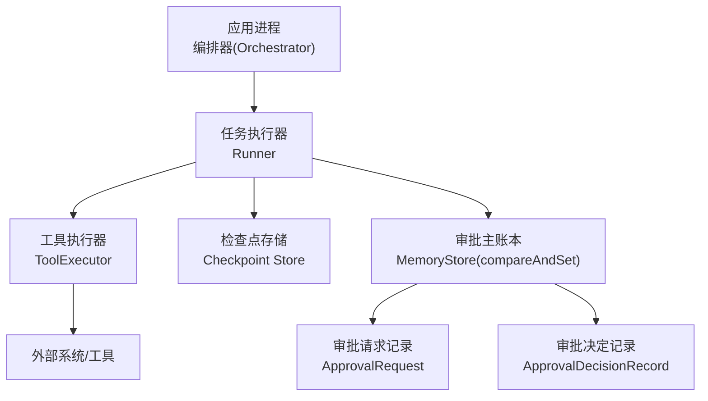
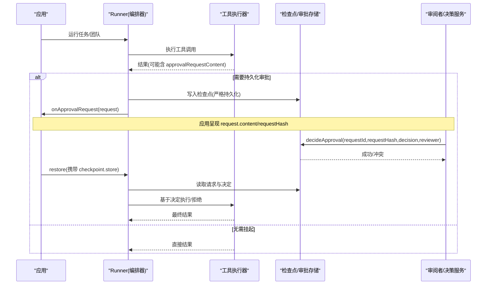
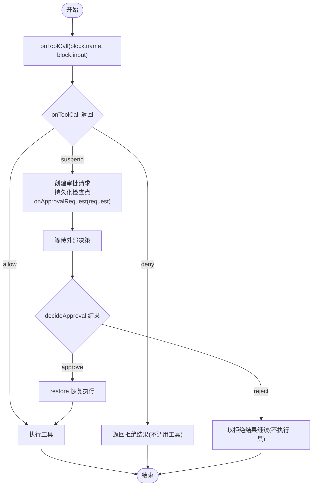
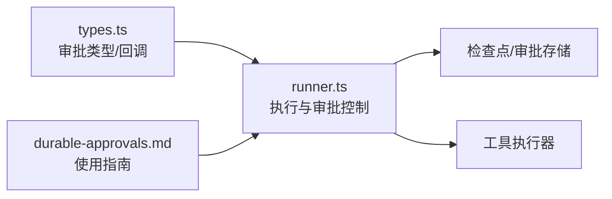

# 审批工作流

<cite>
**本文引用的文件**
- [durable-approvals.md](file://docs/durable-approvals.md)
- [runner.ts](file://packages/core/src/agent/runner.ts)
- [types.ts](file://packages/core/src/types.ts)
</cite>

## 目录
1. [简介](#简介)
2. [项目结构](#项目结构)
3. [核心组件](#核心组件)
4. [架构总览](#架构总览)
5. [详细组件分析](#详细组件分析)
6. [依赖关系分析](#依赖关系分析)
7. [性能考虑](#性能考虑)
8. [故障排查指南](#故障排查指南)
9. [结论](#结论)
10. [附录](#附录)

## 简介
本文件系统性说明 Open Multi-Agent（OMA）的工具调用审批工作流机制，重点包括：
- ExecutionReceipt 与审批决策的关系、以及同步与异步（可恢复）审批模式。
- ToolCallApprovalContent 的结构与含义。
- 如何通过 onToolCall 钩子实现自定义审批逻辑（权限验证、参数检查、业务规则审核）。
- 审批状态管理（待审批、已批准、已拒绝）及状态转换。
- 配置示例与最佳实践，确保敏感操作得到适当的人工或自动审批。
- 错误处理与回滚机制的实现指导。

## 项目结构
与审批工作流直接相关的代码与文档集中在以下位置：
- 类型定义与数据模型：packages/core/src/types.ts
- 执行器与审批控制流：packages/core/src/agent/runner.ts
- 持久化审批文档与使用方式：docs/durable-approvals.md

图表来源
- [runner.ts:990-1069](file://packages/core/src/agent/runner.ts#L990-L1069)
- [runner.ts:1364-1545](file://packages/core/src/agent/runner.ts#L1364-L1545)
- [types.ts:372-410](file://packages/core/src/types.ts#L372-L410)
- [durable-approvals.md:30-87](file://docs/durable-approvals.md#L30-L87)

章节来源
- [runner.ts:990-1069](file://packages/core/src/agent/runner.ts#L990-L1069)
- [runner.ts:1364-1545](file://packages/core/src/agent/runner.ts#L1364-L1545)
- [types.ts:372-410](file://packages/core/src/types.ts#L372-L410)
- [durable-approvals.md:30-87](file://docs/durable-approvals.md#L30-L87)

## 核心组件
- 审批边界与范围
  - 支持 plan、task_round、task_dispatch、tool_call 四类边界。
- 工具调用审批内容
  - ToolCallApprovalContent 包含工具名、原始输入、校验后的输入、代理名、任务ID、工具调用ID、是否“后果性”等字段，用于向审阅者展示并绑定到精确的调用上下文。
- 审批请求与决定
  - ApprovalRequest：不可变请求，包含 scope、boundary、requestHash、content 等。
  - ApprovalDecisionRecord：记录谁在何时对哪个请求做出了 approve/reject 的决定。
  - ApprovalRecord：将请求与可选决定组合为一条持久化记录。
- 运行期回调
  - onToolCall：同步钩子，可用于快速拦截或触发挂起；返回 allow/deny/suspend。
  - onApprovalPrepare/onApprovalRequest/onApprovalConsumed：用于持久化审批请求、通知上层、消费已使用的审批。
  - onCheckpoint：用于保存检查点，使挂起点可恢复。

章节来源
- [types.ts:327-410](file://packages/core/src/types.ts#L327-L410)
- [runner.ts:216-226](file://packages/core/src/agent/runner.ts#L216-L226)
- [runner.ts:990-1069](file://packages/core/src/agent/runner.ts#L990-L1069)
- [runner.ts:1364-1545](file://packages/core/src/agent/runner.ts#L1364-L1545)

## 架构总览
下图展示了工具调用从发起、可能触发审批挂起、到恢复执行的完整流程。

图表来源
- [runner.ts:990-1069](file://packages/core/src/agent/runner.ts#L990-L1069)
- [runner.ts:1364-1545](file://packages/core/src/agent/runner.ts#L1364-L1545)
- [durable-approvals.md:30-87](file://docs/durable-approvals.md#L30-L87)

## 详细组件分析

### 工具调用审批内容：ToolCallApprovalContent
- 关键字段
  - kind: 'tool_call'
  - toolName: 被调用的工具名称
  - rawInput: 模型发出的原始输入（用于恢复时检测请求是否变化）
  - input: Zod 校验后的输入（工具实际接收的参数）
  - agentName/taskId/toolCallId: 关联代理、任务与工具调用标识
  - consequential: 是否为“后果性”调用（影响外部状态）
- 用途
  - 作为审批界面展示的最小必要信息集，同时保证恢复时能重新校验输入一致性。

章节来源
- [types.ts:351-363](file://packages/core/src/types.ts#L351-L363)

### 审批请求与决定：ApprovalRequest / ApprovalDecisionRecord / ApprovalRecord
- ApprovalRequest
  - 不可变，包含 id、runId、scope、boundary、requestHash、requestedAt、reason、content。
  - requestHash 由规范化的 scope/boundary/content 计算得出，确保“精确内容绑定”。
- ApprovalDecisionRecord
  - 记录 requestId、runId、scope、requestHash、decision(approve/reject)、reviewer、decidedAt。
- ApprovalRecord
  - 将请求与可选决定组合成一条持久化记录，供审计与恢复比对。

章节来源
- [types.ts:372-410](file://packages/core/src/types.ts#L372-L410)

### 同步与异步（可恢复）审批模式
- 同步模式
  - 通过 onToolCall 返回布尔值或 { action:'allow'|'deny' }，立即决定是否执行工具。
  - 适合低风险、可在线判断的场景。
- 异步（可恢复）模式
  - onToolCall 返回 { action:'suspend', reason? }，Runner 会：
    - 创建 ApprovalRequest 并持久化检查点（严格持久化，失败则关闭）。
    - 通过 onApprovalRequest 将请求交给应用/审阅者。
    - 应用调用 decideApproval 提交决定（需传入 requestId 与 requestHash）。
    - 后续 restore 时，Runner 独立校验请求与决定的一致性后继续执行。
  - 适合高风险、需要人工或外部系统介入的场景。

章节来源
- [durable-approvals.md:3-8](file://docs/durable-approvals.md#L3-L8)
- [durable-approvals.md:30-87](file://docs/durable-approvals.md#L30-L87)
- [runner.ts:990-1069](file://packages/core/src/agent/runner.ts#L990-L1069)
- [runner.ts:1364-1545](file://packages/core/src/agent/runner.ts#L1364-L1545)

### 执行流程与状态机

图表来源
- [runner.ts:990-1069](file://packages/core/src/agent/runner.ts#L990-L1069)
- [runner.ts:1364-1545](file://packages/core/src/agent/runner.ts#L1364-L1545)
- [durable-approvals.md:30-87](file://docs/durable-approvals.md#L30-L87)

### 配置 onToolCall 钩子实现自定义审批逻辑
- 权限验证
  - 在 onToolCall 中根据 agentName、toolName、consequential 等字段进行角色/权限判定。
- 参数检查
  - 结合 ToolCallApprovalContent 中的 rawInput/input 做白名单、阈值、格式校验。
- 业务规则审核
  - 对高价值/高风险操作设置 requireConsequentialConfirmation，强制走审批流程。
- 返回值约定
  - true/{action:'allow'}：允许执行
  - false/{action:'deny'}：拒绝执行
  - {action:'suspend', reason?}：进入可恢复审批流程

章节来源
- [types.ts:2259-2274](file://packages/core/src/types.ts#L2259-L2274)
- [runner.ts:1364-1374](file://packages/core/src/agent/runner.ts#L1364-L1374)
- [durable-approvals.md:16-28](file://docs/durable-approvals.md#L16-L28)

### 审批状态管理与转换
- 待审批（suspended）
  - 当 onToolCall 返回 suspend 且检查点与请求已持久化后，Runner 报告 pendingApprovals。
- 已批准（approved）
  - decideApproval 以 approve 写入决定；restore 后按已批准路径执行工具。
- 已拒绝（rejected）
  - decideApproval 以 reject 写入决定；Runner 返回拒绝的 ToolResult，不执行工具。
- 一致性保障
  - 恢复时比较 requestHash 与校验后的 input，不一致则拒绝执行，避免旧决定被误用。

章节来源
- [durable-approvals.md:94-118](file://docs/durable-approvals.md#L94-L118)
- [runner.ts:1026-1043](file://packages/core/src/agent/runner.ts#L1026-L1043)
- [runner.ts:1436-1458](file://packages/core/src/agent/runner.ts#L1436-L1458)

### 配置示例与最佳实践
- 最小可用配置
  - 提供 checkpoint.store（支持 compareAndSet），并在 onToolCall 中对关键工具返回 suspend。
- 审阅者工作流
  - 应用收到 onApprovalRequest 后，展示 request.content 与 requestHash，调用 decideApproval 提交决定。
- 恢复执行
  - 新进程构造相同编排器并调用 restore，Runner 会校验并继续执行。
- 安全建议
  - 保护存储访问与加密；避免使用 RedactingStore（会改变内容哈希）。
  - 对变更部署边界（适配器、提示词、工具实现、Schema）进行版本化管理。

章节来源
- [durable-approvals.md:30-87](file://docs/durable-approvals.md#L30-L87)
- [durable-approvals.md:149-162](file://docs/durable-approvals.md#L149-L162)
- [durable-approvals.md:164-187](file://docs/durable-approvals.md#L164-L187)

### 错误处理与回滚机制
- 默认拒绝
  - 若工具未被授予，Runner 返回错误结果；在可恢复模式下标记 approvalError，阻止执行。
- 无法挂起的保护
  - 若工具请求 suspend 但缺少必要的检查点/回调配置，Runner 返回错误并阻止执行。
- 过期或不一致决定
  - 若检测到 approvalError 或 requestHash 不一致，抛出明确错误，阻止执行。
- 幂等性与外部副作用
  - 工具应实现幂等；外部副作用的“中间态”遵循检查点的恢复语义。
- 存储要求
  - 使用支持原子 compareAndSet 的存储；FileStore 适用于单实例并发场景，跨进程建议使用数据库级 CAS。

章节来源
- [runner.ts:1391-1403](file://packages/core/src/agent/runner.ts#L1391-L1403)
- [runner.ts:1436-1458](file://packages/core/src/agent/runner.ts#L1436-L1458)
- [durable-approvals.md:125-162](file://docs/durable-approvals.md#L125-L162)

## 依赖关系分析
- Runner 依赖 types 中定义的审批数据结构与回调接口。
- Runner 在执行工具前调用 onToolCall，并根据返回决定是否挂起。
- 可恢复审批依赖检查点存储与 MemoryStore 的 compareAndSet 能力。
- 文档 durable-approvals.md 描述了端到端的使用流程与约束。

图表来源
- [types.ts:327-410](file://packages/core/src/types.ts#L327-L410)
- [runner.ts:990-1069](file://packages/core/src/agent/runner.ts#L990-L1069)
- [runner.ts:1364-1545](file://packages/core/src/agent/runner.ts#L1364-L1545)
- [durable-approvals.md:30-87](file://docs/durable-approvals.md#L30-L87)

章节来源
- [types.ts:327-410](file://packages/core/src/types.ts#L327-L410)
- [runner.ts:990-1069](file://packages/core/src/agent/runner.ts#L990-L1069)
- [runner.ts:1364-1545](file://packages/core/src/agent/runner.ts#L1364-L1545)
- [durable-approvals.md:30-87](file://docs/durable-approvals.md#L30-L87)

## 性能考虑
- 审批挂起仅在必要时触发（高风险/后果性调用），以减少额外 I/O。
- 检查点与审批请求的持久化是严格写入，确保可恢复性；应避免频繁小粒度写。
- 使用 compareAndSet 的存储时，注意并发写入的性能与锁竞争。
- 对高频工具调用，优先采用同步 allow/deny 策略，降低网络与存储开销。

[本节为通用指导，不直接分析具体文件]

## 故障排查指南
- 现象：工具请求 suspend 但无法挂起
  - 原因：缺少检查点或必要的回调配置。
  - 处理：确保配置 checkpoint.store 与 onApprovalPrepare/onApprovalRequest，并确保 taskId/runId 存在。
- 现象：恢复时报“过期决定”
  - 原因：requestHash 不匹配或工具不再被授予。
  - 处理：重新审视请求内容与决定，确保审阅的是同一份内容；修复工具授权后再恢复。
- 现象：并发决策冲突
  - 原因：compareAndSet 已被其他写入抢先。
  - 处理：重试或协调审阅者顺序，避免重复决策。
- 现象：外部副作用未幂等导致重复执行
  - 原因：工具未实现幂等。
  - 处理：改造工具为幂等，或在外部系统中加入去重键。

章节来源
- [runner.ts:1436-1458](file://packages/core/src/agent/runner.ts#L1436-L1458)
- [durable-approvals.md:125-162](file://docs/durable-approvals.md#L125-L162)

## 结论
Open Multi-Agent 的工具调用审批工作流通过“精确内容绑定 + 可恢复检查点 + 原子决定写入”的组合，提供了强一致性的审批保障。借助 onToolCall 钩子，开发者可以在权限、参数与业务规则层面灵活定制审批策略；通过同步与异步两种模式，既能满足高性能场景，也能覆盖高风险操作的合规需求。配合严格的错误处理与恢复语义，可确保敏感操作在正确时机得到恰当的人工或自动审批。

[本节为总结性内容，不直接分析具体文件]

## 附录
- 术语
  - 后果性调用：可能对外部系统产生不可逆影响的工具调用。
  - 精确内容绑定：通过规范化 JSON 与 SHA-256 哈希确保审阅内容与执行内容一致。
  - 可恢复审批：通过检查点与原子决定，支持进程重启后继续执行。
- 参考
  - 持久化审批文档提供了完整的“挂起-决策-恢复”示例与约束说明。

[本节为补充说明，不直接分析具体文件]