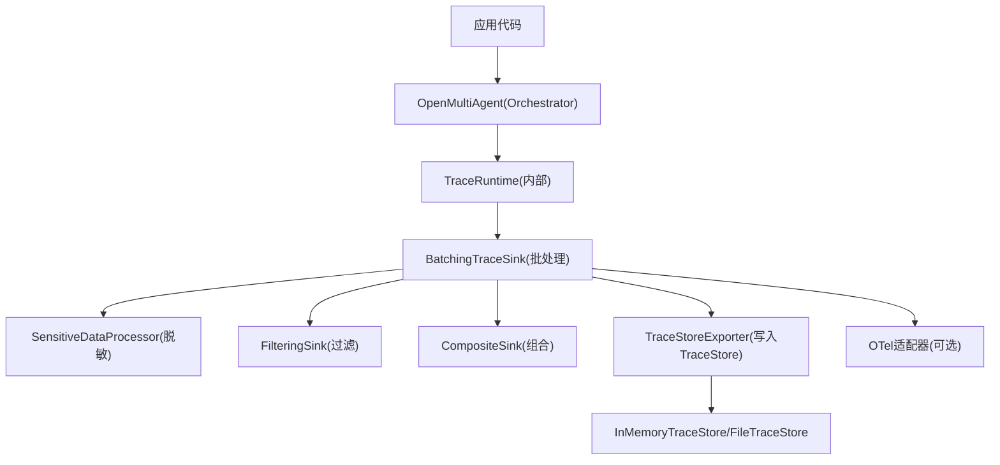
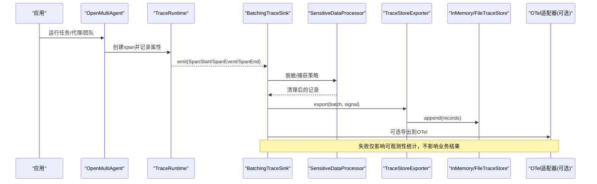
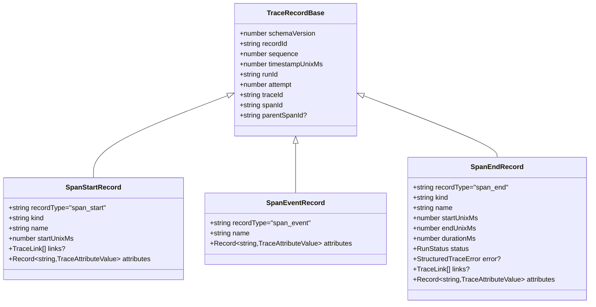
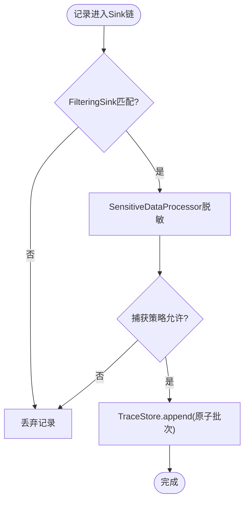
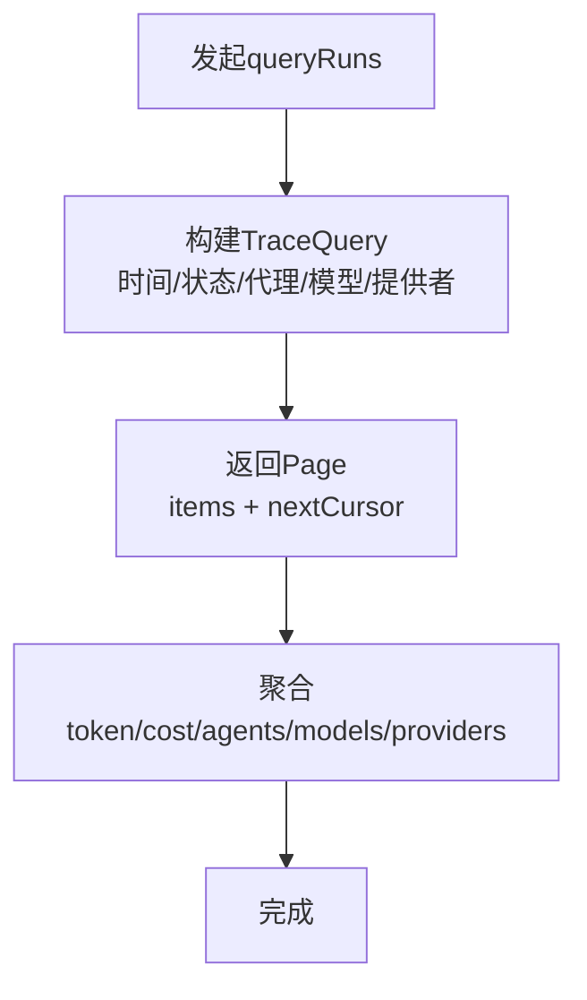
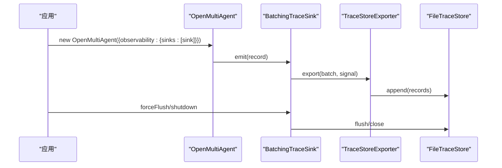
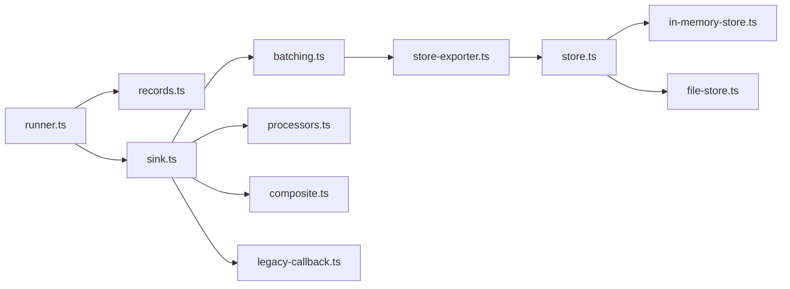

# 审计日志记录

<cite>
**本文引用的文件**
- [observability.md](file://docs/observability.md)
- [observability-performance.md](file://docs/observability-performance.md)
- [records.ts](file://packages/core/src/observability/records.ts)
- [sink.ts](file://packages/core/src/observability/sink.ts)
- [processors.ts](file://packages/core/src/observability/processors.ts)
- [store.ts](file://packages/core/src/observability/store.ts)
- [in-memory-store.ts](file://packages/core/src/observability/in-memory-store.ts)
- [file-store.ts](file://packages/core/src/observability/file-store.ts)
- [batching.ts](file://packages/core/src/observability/batching.ts)
- [composite.ts](file://packages/core/src/observability/composite.ts)
- [legacy-callback.ts](file://packages/core/src/observability/legacy-callback.ts)
- [store-exporter.ts](file://packages/core/src/observability/store-exporter.ts)
- [types.ts](file://packages/core/src/types.ts)
- [runner.ts](file://packages/core/src/agent/runner.ts)
</cite>

## 目录
1. [简介](#简介)
2. [项目结构](#项目结构)
3. [核心组件](#核心组件)
4. [架构总览](#架构总览)
5. [详细组件分析](#详细组件分析)
6. [依赖关系分析](#依赖关系分析)
7. [性能考量](#性能考量)
8. [故障排查指南](#故障排查指南)
9. [结论](#结论)
10. [附录：配置与集成示例](#附录配置与集成示例)

## 简介
本章节面向 Open Multi-Agent 的审计日志（可观测性）能力，聚焦以下目标：
- 解释 TraceRecord 与 SpanEventRecord 的数据结构，以及工具调用的完整上下文信息。
- 说明如何配置日志级别、过滤规则与存储策略。
- 介绍敏感数据处理：数据脱敏、隐私保护与合规性检查。
- 详细说明日志查询与分析功能：时间范围筛选、工具类型过滤、执行结果统计。
- 提供审计日志的配置示例与集成方案，包括与外部日志系统对接。
- 给出性能优化建议与存储容量规划指导。

Open Multi-Agent 的可观测性体系包含三层：实时进度事件、结构化追踪跨度（TraceRecord v2），以及离线单运行 DAG/Waterfall 查看器。v2 运行时通过 TraceSink/TraceExporter 将 TraceRecord 批量导出到存储或外部系统；默认不采集提示词、补全、工具输入输出等敏感内容，确保隐私与合规。

**章节来源**
- [observability.md:1-10](file://docs/observability.md#L1-L10)
- [observability.md:151-183](file://docs/observability.md#L151-L183)

## 项目结构
Open Multi-Agent 的可观测性实现集中在 core 包的 observability 子模块中，并通过文档进行使用指引与性能基线说明。关键目录与职责如下：
- docs/observability*.md：使用指南、迁移路径、性能基线与发布就绪说明。
- packages/core/src/observability：
  - records.ts：定义 TraceRecord v2 数据结构（SpanStart/SpanEvent/SpanEnd）。
  - sink.ts：定义 TraceSink、TraceExporter、批处理与诊断接口。
  - processors.ts：敏感数据处理与过滤（SensitiveDataProcessor、FilteringSink）。
  - store.ts：TraceStore 抽象（追加、查询、删除、保留策略）。
  - in-memory-store.ts / file-store.ts：内存与文件实现的参考实现。
  - batching.ts：批处理队列、重试与丢弃策略。
  - composite.ts：组合多个 Sink。
  - legacy-callback.ts：兼容旧版 onTrace 回调。
  - store-exporter.ts：将 TraceStore 作为 Exporter 接入批处理。
- agent/runner.ts：在 Agent/Task/LLM/Tool 调用处生成 TraceRecord 并注入属性（如模型、提供者、阶段、任务 ID 等）。

**图表来源**
- [observability.md:185-223](file://docs/observability.md#L185-L223)
- [sink.ts:76-108](file://packages/core/src/observability/sink.ts#L76-L108)
- [processors.ts:13-33](file://packages/core/src/observability/processors.ts#L13-L33)
- [store.ts:148-157](file://packages/core/src/observability/store.ts#L148-L157)

**章节来源**
- [observability.md:185-223](file://docs/observability.md#L185-L223)
- [sink.ts:76-108](file://packages/core/src/observability/sink.ts#L76-L108)
- [store.ts:148-157](file://packages/core/src/observability/store.ts#L148-L157)

## 核心组件
- TraceRecord v2：由 SpanStartRecord、SpanEventRecord、SpanEndRecord 组成，携带 schemaVersion=2、recordId、sequence、runId、attempt、traceId、spanId、parentSpanId、时间戳、状态、安全属性与链接。
- TraceSink/TraceExporter：同步热路径 emit(record) 与异步批量 export(records, signal)。失败不影响业务结果。
- SensitiveDataProcessor：按 allowlist、凭据模式、推理内容模式进行脱敏与截断，支持捕获策略控制 prompt/completion/toolInput/toolOutput/streamEvents 等。
- FilteringSink：基于谓词的同步过滤器，丢弃不匹配记录，隔离用户自定义逻辑异常。
- TraceStore：介质无关的追加/查询/删除/保留策略接口；InMemoryTraceStore 用于测试与本地调试；FileTraceStore 为 Node 端持久化参考实现。
- BatchingTraceSink：带容量上限、退避重试、丢弃优先级与诊断的批处理队列。
- CompositeSink：组合多个 Sink，便于多目的地导出。
- LegacyCallbackTraceSink：将 v2 记录映射回旧版 onTrace 事件，保持向后兼容。

**章节来源**
- [records.ts:8-77](file://packages/core/src/observability/records.ts#L8-L77)
- [sink.ts:15-108](file://packages/core/src/observability/sink.ts#L15-L108)
- [processors.ts:13-132](file://packages/core/src/observability/processors.ts#L13-L132)
- [store.ts:6-157](file://packages/core/src/observability/store.ts#L6-L157)
- [observability.md:185-223](file://docs/observability.md#L185-L223)

## 架构总览
下图展示了从运行时产生 TraceRecord，经批处理、脱敏、过滤后，写入 TraceStore 或转发至 OTel 的端到端流程。

**图表来源**
- [observability.md:185-223](file://docs/observability.md#L185-L223)
- [sink.ts:76-108](file://packages/core/src/observability/sink.ts#L76-L108)
- [store.ts:148-157](file://packages/core/src/observability/store.ts#L148-L157)

## 详细组件分析

### TraceRecord 与 SpanEventRecord 数据结构
- 基础字段：schemaVersion=2、recordId、sequence（同一 traceId 严格递增）、timestampUnixMs、runId、attempt、traceId、spanId、parentSpanId。
- SpanStartRecord：记录 kind（run/routing/agent/task/llm/tool/plan/consensus/checkpoint/callback）、name、startUnixMs、links、attributes。
- SpanEventRecord：记录 name（如 retry_scheduled、budget_exhausted、first_chunk、approval_decision、checkpoint_failed、telemetry_diagnostic、loop_detected、stream_chunk、consensus_verdict、recovery_decision、plan_revision_applied）与 attributes。
- SpanEndRecord：自包含的最终快照，含 start/end/duration/status/error/links/attributes，即使缺失 start/event 也可独立使用。

工具调用上下文：
- 在 runner 中，工具调用前后会触发 onToolCall/onToolResult 回调，并在 v2 中通过 span 属性记录 agent、task、phase、turn、model/provider 等低基数维度；错误与超时会被分类为 RunStatus。
- 工具输入/输出默认不采集，除非显式开启 capture 策略；结构化凭据字段会被移除。

**图表来源**
- [records.ts:35-77](file://packages/core/src/observability/records.ts#L35-L77)
- [types.ts:2668-2705](file://packages/core/src/types.ts#L2668-L2705)

**章节来源**
- [records.ts:8-77](file://packages/core/src/observability/records.ts#L8-L77)
- [runner.ts:597-628](file://packages/core/src/agent/runner.ts#L597-L628)
- [runner.ts:1460-1486](file://packages/core/src/agent/runner.ts#L1460-L1486)

### 日志级别、过滤规则与存储策略
- 日志级别：v2 未暴露“日志级别”开关，而是通过 Sink 链与捕获策略控制采集粒度。
- 过滤规则：
  - FilteringSink：以谓函数对 TraceRecord 进行过滤，丢弃不匹配记录；异常被隔离，不影响业务。
  - SensitiveDataProcessor：按 attributeAllowlist 白名单、凭据字段正则、推理内容正则进行脱敏；支持捕获策略控制 prompt/completion/toolInput/toolOutput/streamEvents 等。
- 存储策略：
  - TraceStore：append/query/delete/applyRetention；InMemoryTraceStore 用于测试与本地；FileTraceStore 为 Node 端持久化参考实现，具备原子提交、恢复、压缩与权限控制。
  - RetentionPolicy：maxAgeMs、maxRuns、statuses 组合策略，按开始时间与稳定排序删除。

**图表来源**
- [processors.ts:13-33](file://packages/core/src/observability/processors.ts#L13-L33)
- [processors.ts:35-132](file://packages/core/src/observability/processors.ts#L35-L132)
- [store.ts:78-83](file://packages/core/src/observability/store.ts#L78-L83)

**章节来源**
- [processors.ts:13-132](file://packages/core/src/observability/processors.ts#L13-L132)
- [store.ts:78-83](file://packages/core/src/observability/store.ts#L78-L83)
- [observability.md:224-296](file://docs/observability.md#L224-L296)

### 敏感数据处理：脱敏、隐私保护与合规性检查
- 默认不采集提示词、补全、工具输入/输出；结构化凭据字段（如 authorization、api_key、password、secret 等）会被移除；推理内容（reasoning/thinking/chain-of-thought/signed-reasoning）始终移除。
- 捕获策略（capture）：
  - prompt/completion/toolInput/toolOutput：'none' | 'redacted'
  - errorMessage：'code-only' | 'redacted'
  - stack：boolean
  - streamEvents：'none' | 'first' | 'all'
  - maxContentChars：最大字符数限制
- 白名单（attributeAllowlist）：仅允许指定属性键通过；其余属性将被忽略。
- 合规性：诊断与错误消息不包含 TraceRecord 或原始负载；只报告无负载的诊断码与计数。

**章节来源**
- [observability.md:743-768](file://docs/observability.md#L743-L768)
- [processors.ts:35-132](file://packages/core/src/observability/processors.ts#L35-L132)
- [sink.ts:92-108](file://packages/core/src/observability/sink.ts#L92-L108)

### 日志查询与分析：时间范围、工具类型过滤与执行结果统计
- 查询接口 TraceQuery：
  - 时间范围：startedAfter（包含）、startedBefore（不包含）ISO-8601。
  - 工具类型过滤：通过 kind='tool' 的 span 属性与名称进行筛选（在下游查询层实现）。
  - 其他过滤：status、agent、taskId、model、provider、limit、order、cursor。
- 执行结果统计：
  - RunSummary 包含 attempts、tokens、costs、agents、models、providers、duration、status、metadata 等。
  - LLM 结束记录贡献 token/cost 总计，避免重复统计。
- 分页与一致性：
  - cursor 为不透明且绑定于创建时的过滤/排序；删除操作立即一致地使游标失效。
  - 首次页捕获追加修订，防止重复或缺失。

**图表来源**
- [store.ts:60-74](file://packages/core/src/observability/store.ts#L60-L74)
- [store.ts:107-125](file://packages/core/src/observability/store.ts#L107-L125)
- [observability.md:413-445](file://docs/observability.md#L413-L445)

**章节来源**
- [store.ts:60-74](file://packages/core/src/observability/store.ts#L60-L74)
- [store.ts:107-125](file://packages/core/src/observability/store.ts#L107-L125)
- [observability.md:413-445](file://docs/observability.md#L413-L445)

### 配置示例与集成方案
- 基本配置（启用 sinks）：
  - 通过 OpenMultiAgent 的 observability.sinks 注入一个或多个 TraceSink（如 BatchingTraceSink）。
  - 可选 ObservabilityResource（serviceName/serviceVersion/deploymentEnvironment/release）。
  - 可选 capture 策略控制内容采集。
- 存储集成：
  - InMemoryTraceStore：适用于单元测试与本地调试。
  - FileTraceStore：Node 端持久化，需从 Node-only 子路径导入；具备 flush/close/compact 生命周期。
  - TraceStoreExporter：将 TraceStore 作为 Exporter 接入批处理。
- 外部系统对接：
  - @open-multi-agent/otel：将 TraceRecord 转换为 OpenTelemetry spans/events/links；不读取/替换全局 provider；不导出提示词/工具参数/结果等敏感内容。
  - 应用自行选择 OTLP/exporter 实现，避免隐式全局配置。

**图表来源**
- [observability.md:194-223](file://docs/observability.md#L194-L223)
- [observability.md:255-296](file://docs/observability.md#L255-L296)
- [store-exporter.ts](file://packages/core/src/observability/store-exporter.ts)

**章节来源**
- [observability.md:194-223](file://docs/observability.md#L194-L223)
- [observability.md:255-296](file://docs/observability.md#L255-L296)
- [sink.ts:103-108](file://packages/core/src/observability/sink.ts#L103-L108)

### 性能优化建议与存储容量规划
- 批处理与队列：
  - 默认队列大小与字节上限、单次记录上限、批次大小、调度延迟、导出超时、重试次数与指数退避均有明确上限，避免无限增长。
  - 丢弃优先级：stream_chunk > other events > span_start > span_end（自包含）。
- 性能基线：
  - 无 sink 时额外开销极低；批处理入队 p95 微秒级；OTel 转换+处理器 p95 微秒级。
  - 文件存储 append/fsync/reopen/query/compaction 有基准数据，可作为容量与吞吐规划参考。
- 容量规划：
  - 根据运行规模估算每条 TraceRecord 的字节大小与批次大小，结合队列上限与导出频率评估内存占用。
  - 文件存储建议使用定期 compact 减少文件大小；注意 fsync 边界与幂等关闭。
- 监控与诊断：
  - getStats() 提供 accepted/exported/retried/failed/dropped/queued 计数与最后错误码；诊断默认每分钟限流一次 console.warn，可通过 diagnostics:'silent' 或 onDiagnostic 定制。

**章节来源**
- [observability.md:572-600](file://docs/observability.md#L572-L600)
- [observability-performance.md:8-20](file://docs/observability-performance.md#L8-L20)
- [observability-performance.md:64-118](file://docs/observability-performance.md#L64-L118)

## 依赖关系分析
- 运行时依赖：
  - runner.ts 在 LLM/Tool/Task/Agent 调用点生成 TraceRecord 并设置属性（模型、提供者、阶段、轮次、任务ID等）。
  - 可观测性子系统通过 sink 链解耦业务与存储/传输。
- 组件耦合：
  - BatchingTraceSink 依赖 TraceExporter 与 DiagnosticReporter。
  - SensitiveDataProcessor 与 FilteringSink 作为中间件装饰 Sink。
  - TraceStoreExporter 桥接 TraceStore 与 Sink。
- 外部依赖：
  - @open-multi-agent/otel 为可选包，core 不引入 OTel 运行时；应用负责 OTLP/exporter 选择。

**图表来源**
- [runner.ts:597-628](file://packages/core/src/agent/runner.ts#L597-L628)
- [sink.ts:76-108](file://packages/core/src/observability/sink.ts#L76-L108)
- [store.ts:148-157](file://packages/core/src/observability/store.ts#L148-L157)

**章节来源**
- [runner.ts:597-628](file://packages/core/src/agent/runner.ts#L597-L628)
- [sink.ts:76-108](file://packages/core/src/observability/sink.ts#L76-L108)
- [store.ts:148-157](file://packages/core/src/observability/store.ts#L148-L157)

## 性能考量
- 热路径最小化：emit 为同步非阻塞，业务执行不被等待；I/O 在 exporter 中进行。
- 队列压力管理：当队列满时按优先级丢弃，保证内存可控；oversize 记录在接纳前拒绝。
- 导出可靠性：export 支持 success/retryable/failure 与 exported 前缀；超时与拒绝被 sink 隔离。
- 文件持久化：append 为 write-complete，flush/close 为 fsync 边界；compaction 原子重命名，幂等安全。
- 基准参考：见 observability-performance.md 中的矩阵与当前发布快照，可用于回归检测与容量规划。

**章节来源**
- [observability.md:527-600](file://docs/observability.md#L527-L600)
- [observability-performance.md:8-20](file://docs/observability-performance.md#L8-L20)
- [observability-performance.md:64-118](file://docs/observability-performance.md#L64-L118)

## 故障排查指南
- 常见问题定位：
  - 记录丢失：检查队列是否溢出（getStats().dropped/queuedRecords），确认丢弃优先级与批次大小。
  - 导出失败：关注 lastError/code，区分 retryable 与 permanent failure；调整超时与重试策略。
  - 文件损坏：FileTraceStore.open 遇到不支持格式或损坏会抛出结构化错误；检查 batch commit 完整性与 SHA-256。
  - 游标无效：delete/retention 会使游标失效，需重新查询。
- 诊断输出：
  - 内置诊断默认每分钟限流一次 console.warn；可通过 diagnostics:'silent' 或 onDiagnostic 接收结构化诊断。
  - 诊断消息不含 TraceRecord 或原始错误负载，确保安全。

**章节来源**
- [observability.md:572-600](file://docs/observability.md#L572-L600)
- [observability.md:297-375](file://docs/observability.md#L297-L375)
- [sink.ts:48-74](file://packages/core/src/observability/sink.ts#L48-L74)

## 结论
Open Multi-Agent 的审计日志体系以 TraceRecord v2 为核心，通过 Sink/Exporter 解耦业务与存储/传输，默认遵循最小采集原则，保障隐私与合规。借助 FilteringSink 与 SensitiveDataProcessor 可实现灵活的过滤与脱敏；TraceStore 提供统一的查询与保留策略；批处理与诊断机制确保高吞吐与稳定性。生产环境建议结合 FileTraceStore 与 OTel 适配器，配合合理的捕获策略与容量规划，实现可观测性与性能的平衡。

## 附录：配置与集成示例
- 启用 sinks 与资源：
  - 在 OpenMultiAgent 配置 observability.sinks 与 resource。
  - 通过 capture 控制内容采集策略。
- 使用 TraceStore：
  - InMemoryTraceStore：快速验证与测试。
  - FileTraceStore：从 Node-only 子路径导入，使用 open/flush/close/compact 管理生命周期。
  - 通过 TraceStoreExporter 将 TraceStore 接入批处理。
- 对接 OTel：
  - 使用 @open-multi-agent/otel 的 createOtelTraceSink，传入应用已有的 tracerProvider。
  - 不导出敏感内容，仅映射稳定的 oma.* 属性与事件。

**章节来源**
- [observability.md:194-223](file://docs/observability.md#L194-L223)
- [observability.md:255-296](file://docs/observability.md#L255-L296)
- [observability.md:459-525](file://docs/observability.md#L459-L525)
- [sink.ts:103-108](file://packages/core/src/observability/sink.ts#L103-L108)