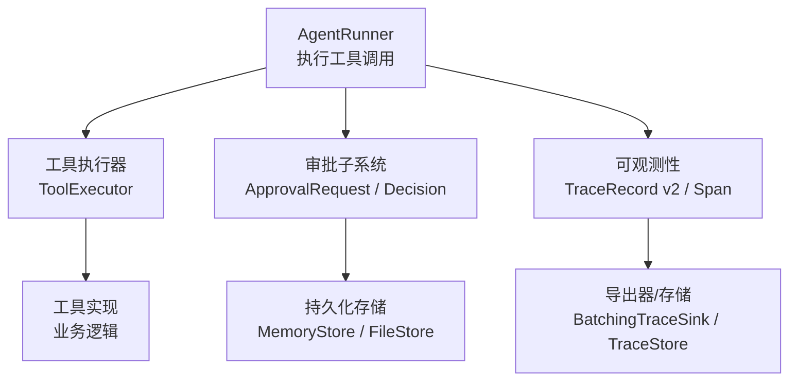
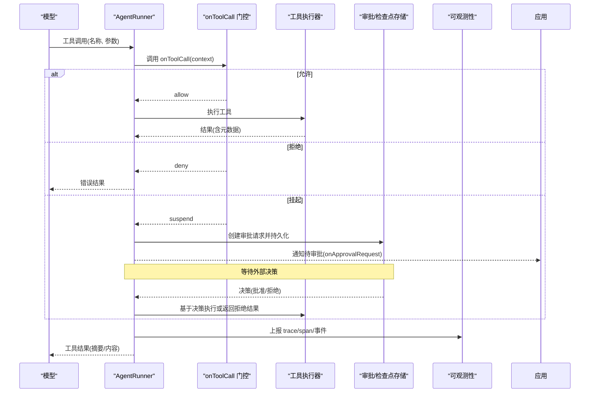
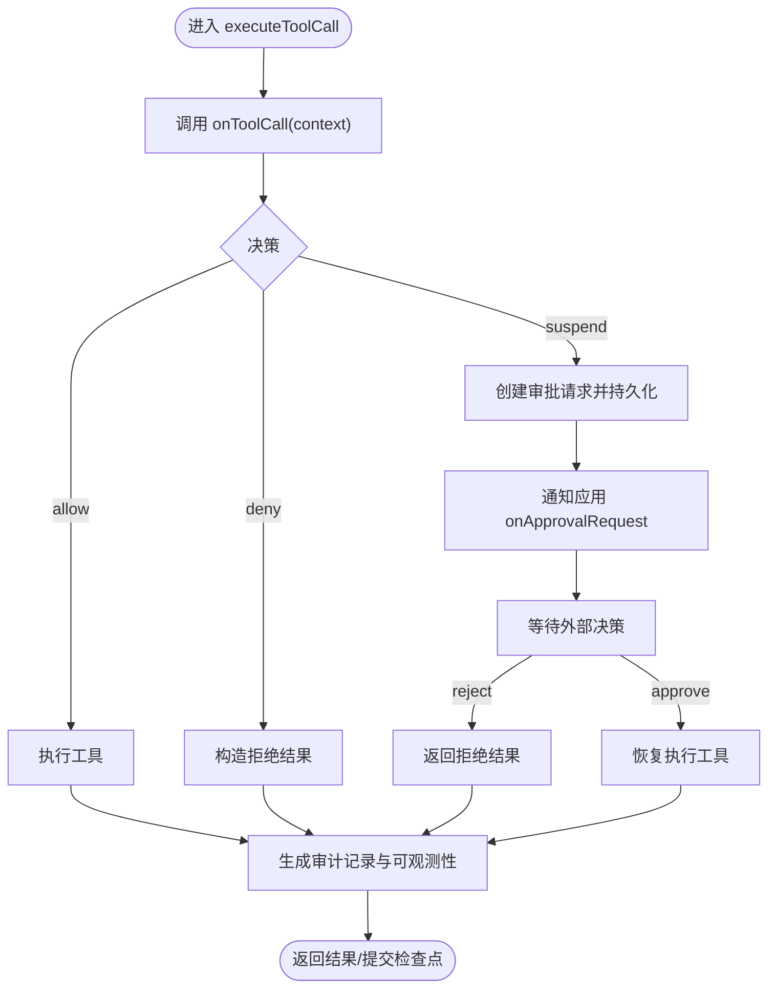
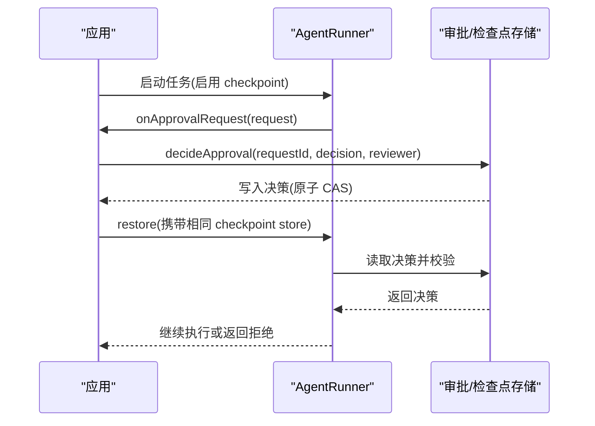
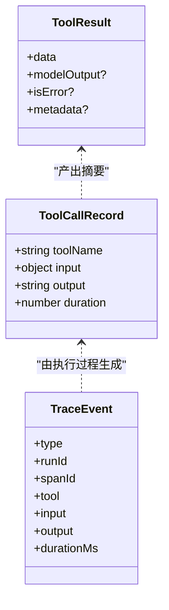
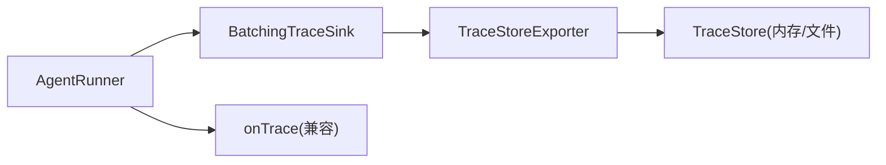
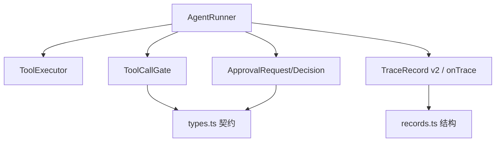

# 工具调用审计

<cite>
**本文引用的文件**
- [runner.ts](file://packages/core/src/agent/runner.ts)
- [types.ts](file://packages/core/src/types.ts)
- [records.ts](file://packages/core/src/observability/records.ts)
- [durable-approvals.md](file://docs/durable-approvals.md)
- [observability.md](file://docs/observability.md)
</cite>

## 目录
1. [简介](#简介)
2. [项目结构](#项目结构)
3. [核心组件](#核心组件)
4. [架构总览](#架构总览)
5. [详细组件分析](#详细组件分析)
6. [依赖关系分析](#依赖关系分析)
7. [性能考量](#性能考量)
8. [故障排查指南](#故障排查指南)
9. [结论](#结论)
10. [附录：配置与最佳实践](#附录：配置与最佳实践)

## 简介
本文件聚焦 Open Multi-Agent 的“工具调用审计”能力，围绕 onToolCall 钩子、可恢复审批（Durable Approval）、审计日志与可观测性集成展开。目标是帮助你在不泄露敏感信息的前提下，实现“所有工具调用都可追溯、可验证、可审计”，并支持同步与异步两种审批模式。

## 项目结构
与工具调用审计直接相关的代码集中在 core 包的 agent 运行器与类型定义中，配合文档说明可恢复审批与可观测性规范：
- 执行与审计主路径：AgentRunner 的工具调用执行、结果提交、挂起与恢复
- 类型与契约：工具调用上下文、决策、审批请求与记录、追踪事件
- 可观测性：TraceRecord v2、span 生命周期、指标与调试输出
- 文档：可恢复审批流程、可观测性迁移与使用指南

**图示来源**
- [runner.ts:990-1069](file://packages/core/src/agent/runner.ts#L990-L1069)
- [runner.ts:1364-1563](file://packages/core/src/agent/runner.ts#L1364-L1563)
- [records.ts:1-78](file://packages/core/src/observability/records.ts#L1-L78)
- [durable-approvals.md:1-192](file://docs/durable-approvals.md#L1-L192)

**章节来源**
- [runner.ts:990-1069](file://packages/core/src/agent/runner.ts#L990-L1069)
- [runner.ts:1364-1563](file://packages/core/src/agent/runner.ts#L1364-L1563)
- [records.ts:1-78](file://packages/core/src/observability/records.ts#L1-L78)
- [durable-approvals.md:1-192](file://docs/durable-approvals.md#L1-L192)

## 核心组件
- 工具调用执行器：在 AgentRunner 中统一调度工具调用、权限校验、结果封装、审计记录与可观测性上报
- 工具调用门控 onToolCall：每次工具调用前触发，返回 allow/deny/suspend，支持同步与异步审批
- 可恢复审批：当 onToolCall 返回 suspend 时，将审批请求持久化，等待外部决策后恢复执行
- 审计记录：每个工具调用生成 ToolCallRecord，包含输入摘要、输出摘要、耗时等
- 可观测性：通过 TraceRecord v2 与 legacy onTrace 双通道上报，支持 span、事件、指标与调试

**章节来源**
- [runner.ts:1364-1563](file://packages/core/src/agent/runner.ts#L1364-L1563)
- [types.ts:605-674](file://packages/core/src/types.ts#L605-L674)
- [types.ts:2257-2274](file://packages/core/src/types.ts#L2257-L2274)
- [records.ts:1-78](file://packages/core/src/observability/records.ts#L1-L78)

## 架构总览
下图展示一次工具调用的完整链路：从模型发起 tool_use，到 Runner 执行、门控审批、结果提交与审计上报。

**图示来源**
- [runner.ts:990-1069](file://packages/core/src/agent/runner.ts#L990-L1069)
- [runner.ts:1364-1563](file://packages/core/src/agent/runner.ts#L1364-L1563)
- [durable-approvals.md:30-147](file://docs/durable-approvals.md#L30-L147)

## 详细组件分析

### onToolCall 钩子：工作原理、上下文、决策与回调
- 触发时机：每次模型请求的工具调用在进入执行前触发
- 上下文：包含 agent、任务、团队、工作目录、凭据、toolCallId、runId、taskId 等
- 决策：
  - allow：继续执行
  - deny：直接返回拒绝结果，不调用工具
  - suspend：进入可恢复审批流程，持久化审批请求，等待外部决策
- 回调：
  - onToolResult：工具执行完成后回调（仅当有结果且未挂起）
  - onApprovalPrepare/onApprovalRequest/onApprovalConsumed：用于可恢复审批的生命周期

**图示来源**
- [runner.ts:1364-1563](file://packages/core/src/agent/runner.ts#L1364-L1563)
- [types.ts:605-674](file://packages/core/src/types.ts#L605-L674)

**章节来源**
- [runner.ts:1364-1563](file://packages/core/src/agent/runner.ts#L1364-L1563)
- [types.ts:605-674](file://packages/core/src/types.ts#L605-L674)

### 可恢复审批：同步与异步模式
- 同步模式：onToolCall 直接返回 allow/deny，立即决定执行或拒绝
- 异步模式：onToolCall 返回 suspend，框架将审批请求持久化，应用侧完成审批后，通过恢复流程继续执行
- 关键约束：
  - 需要启用检查点与具备 compareAndSet 能力的存储
  - 审批请求包含不可变的内容哈希，确保“所见即所批”
  - 恢复时重新校验输入与决策一致性，防止陈旧决策被复用

**图示来源**
- [durable-approvals.md:30-147](file://docs/durable-approvals.md#L30-L147)
- [runner.ts:1026-1043](file://packages/core/src/agent/runner.ts#L1026-L1043)

**章节来源**
- [durable-approvals.md:30-147](file://docs/durable-approvals.md#L30-L147)
- [runner.ts:1026-1043](file://packages/core/src/agent/runner.ts#L1026-L1043)

### 审计日志：调用参数、执行结果与合规性检查
- 审计记录：每个工具调用生成 ToolCallRecord，包含工具名、输入、输出摘要、耗时
- 结果隔离：对模型可见的输出进行复制与摘要，避免回调篡改影响检查点
- 合规标记：当 onToolCall 参与时，记录 gateAction/gateReason（脱敏），便于审计回溯
- 错误处理：工具异常转为错误结果；若已批准但后续校验失败，抛出特定错误以阻止执行

**图示来源**
- [runner.ts:1469-1514](file://packages/core/src/agent/runner.ts#L1469-L1514)
- [types.ts:1255-1262](file://packages/core/src/types.ts#L1255-L1262)

**章节来源**
- [runner.ts:1469-1514](file://packages/core/src/agent/runner.ts#L1469-L1514)
- [types.ts:1255-1262](file://packages/core/src/types.ts#L1255-L1262)

### 可观测性集成：追踪事件、指标与调试
- 双通道上报：
  - 新式 TraceRecord v2：span_start/span_event/span_end，结构化、可查询
  - 兼容 onTrace：保留 legacy 事件，便于平滑迁移
- 指标与调试：
  - 工具 span 包含 agent/tool/task 等属性，错误分类与状态码
  - 流式事件作为 span_event 而非零时长子 span，避免 TTFT 误报
- 导出与存储：
  - BatchingTraceSink + TraceStoreExporter 批量导出
  - FileTraceStore/InMemoryTraceStore 提供本地/内存存储与查询

**图示来源**
- [observability.md:151-222](file://docs/observability.md#L151-L222)
- [records.ts:1-78](file://packages/core/src/observability/records.ts#L1-L78)

**章节来源**
- [observability.md:151-222](file://docs/observability.md#L151-L222)
- [records.ts:1-78](file://packages/core/src/observability/records.ts#L1-L78)

## 依赖关系分析
- AgentRunner 依赖：
  - ToolExecutor：实际工具执行
  - 审批子系统：createApprovalRequest、decideApproval、DurableApprovalLedger
  - 可观测性：traceRuntime/startSpan、emitTrace、TraceRecord v2
- 类型契约：
  - ToolCallGate/Decision：门控接口与决策
  - ToolCallApprovalContent/ApprovalRequest：审批内容与请求
  - TraceEvent/TraceRecord：追踪事件与记录

**图示来源**
- [runner.ts:1364-1563](file://packages/core/src/agent/runner.ts#L1364-L1563)
- [types.ts:605-674](file://packages/core/src/types.ts#L605-L674)
- [records.ts:1-78](file://packages/core/src/observability/records.ts#L1-L78)

**章节来源**
- [runner.ts:1364-1563](file://packages/core/src/agent/runner.ts#L1364-L1563)
- [types.ts:605-674](file://packages/core/src/types.ts#L605-L674)
- [records.ts:1-78](file://packages/core/src/observability/records.ts#L1-L78)

## 性能考量
- 并发执行：同一轮次的多个工具调用并行执行，减少端到端延迟
- 检查点落盘：在提交结果与挂起审批前进行持久化，保证恢复一致性
- 可观测性开销：
  - 新式 sink 采用批量导出与退避重试，避免阻塞业务
  - 默认不采集敏感内容，降低 I/O 与隐私风险
- 建议：
  - 合理设置批量大小与超时，平衡吞吐与延迟
  - 在生产环境使用具备 compareAndSet 的存储，确保审批原子性

[本节为通用指导，无需具体文件引用]

## 故障排查指南
- 工具未被授权：
  - 现象：返回“工具未授予该代理”的错误结果
  - 处理：在代理配置中显式允许所需工具或使用预设
- 可恢复审批失败：
  - 现象：缺少检查点或 compareAndSet 能力导致无法挂起
  - 处理：启用 checkpoint 并提供支持 CAS 的存储
- 陈旧决策：
  - 现象：决策与当前请求内容不一致，抛出特定错误
  - 处理：重新提交审批，确保 requestHash 匹配
- 可观测性丢失：
  - 现象：部分 span/event 未到达后端
  - 处理：检查 sink/exporter 队列容量、超时与重试策略

**章节来源**
- [runner.ts:1391-1458](file://packages/core/src/agent/runner.ts#L1391-L1458)
- [durable-approvals.md:125-147](file://docs/durable-approvals.md#L125-L147)
- [observability.md:572-600](file://docs/observability.md#L572-L600)

## 结论
Open Multi-Agent 的工具调用审计通过 onToolCall 门控、可恢复审批、结构化审计记录与可观测性集成，提供了从“事前控制—事中审计—事后追溯”的完整闭环。结合严格的输入校验、内容绑定与最小化采集策略，可在保障安全与隐私的前提下，满足合规与运维需求。

[本节为总结，无需具体文件引用]

## 附录：配置与最佳实践
- 启用 onToolCall 门控：
  - 在 orchestrator 或 agent 配置中注入 onToolCall，实现细粒度控制
  - 对高风险操作优先选择 suspend 模式，走可恢复审批
- 配置可恢复审批：
  - 启用 checkpoint 并配置具备 compareAndSet 的存储
  - 使用 approve/reject 接口完成外部审批，再 restore 恢复执行
- 审计与合规：
  - 利用 ToolCallRecord 与 TraceRecord 构建审计报表
  - 对敏感字段进行脱敏，避免在日志与追踪中泄露
- 可观测性：
  - 使用 BatchingTraceSink + TraceStoreExporter 批量导出
  - 生产环境关闭敏感内容捕获，仅采集必要指标
- 参考示例与文档：
  - 可恢复审批流程与边界说明见文档
  - 可观测性迁移与使用指南见文档

**章节来源**
- [durable-approvals.md:30-147](file://docs/durable-approvals.md#L30-L147)
- [observability.md:151-222](file://docs/observability.md#L151-L222)
- [runner.ts:2257-2274](file://packages/core/src/types.ts#L2257-L2274)