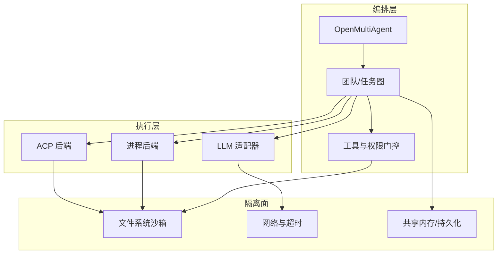
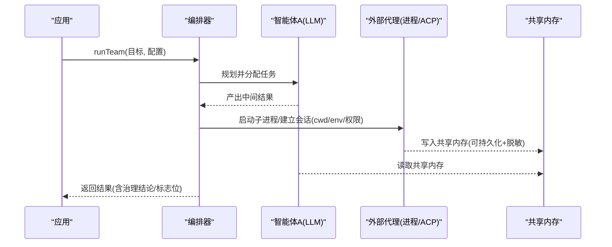
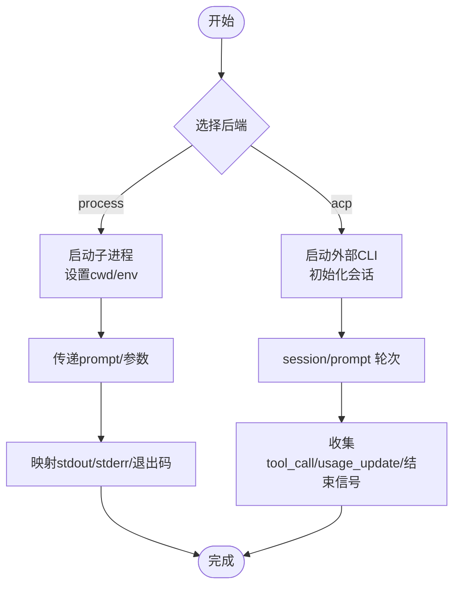
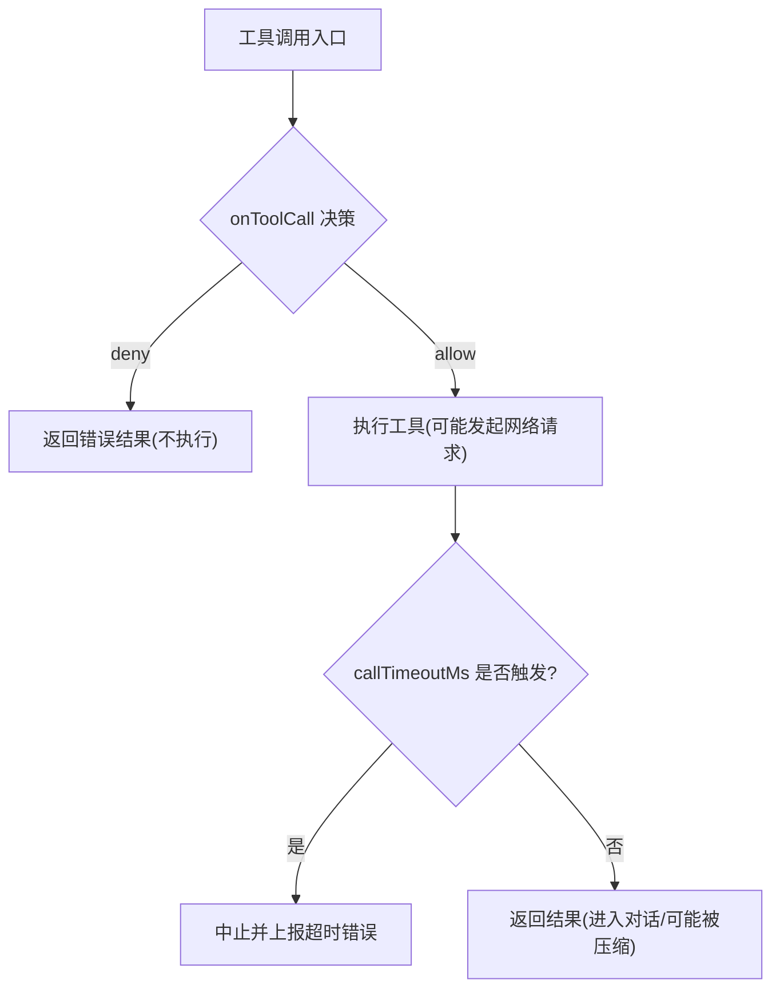
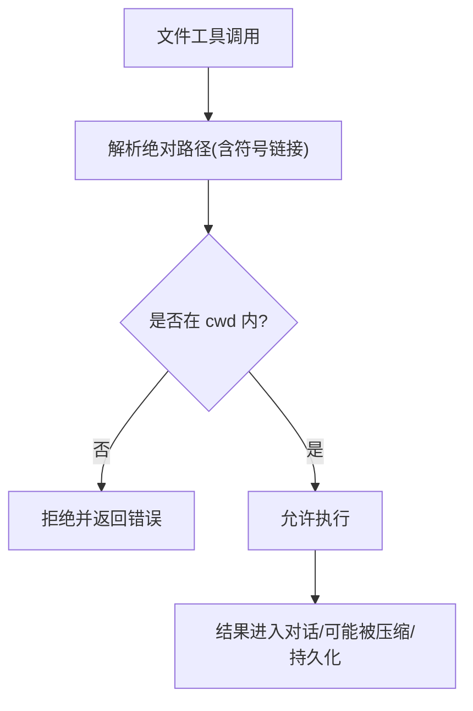
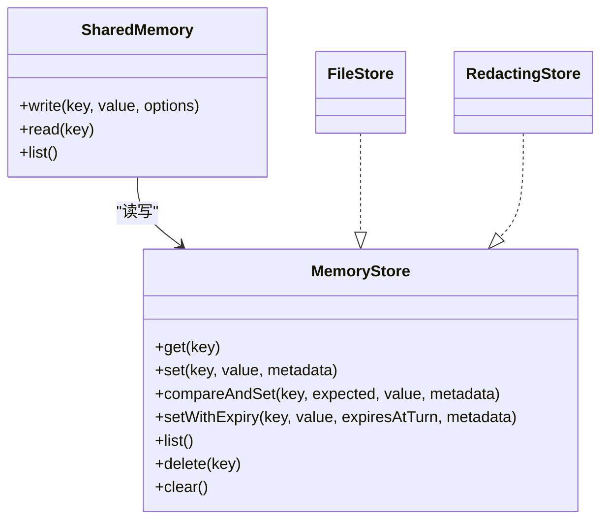
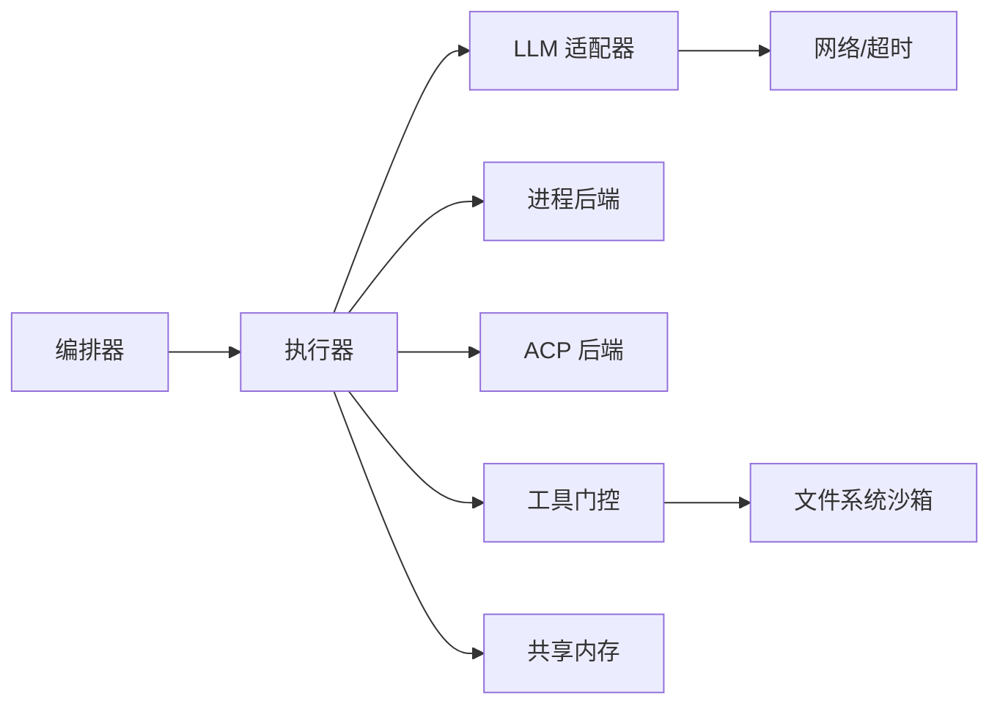

# 上下文隔离机制

<cite>
**本文引用的文件**
- [README.md](file://README.md)
- [context-management.md](file://docs/context-management.md)
- [shared-memory.md](file://docs/shared-memory.md)
- [tool-configuration.md](file://docs/tool-configuration.md)
- [external-agents.md](file://docs/external-agents.md)
- [types.ts](file://packages/core/src/types.ts)
- [process.ts](file://packages/core/src/process.ts)
- [acp.ts](file://packages/core/src/acp.ts)
- [file-store.ts](file://packages/core/src/memory/file-store.ts)
</cite>

## 目录
1. [简介](#简介)
2. [项目结构](#项目结构)
3. [核心组件](#核心组件)
4. [架构总览](#架构总览)
5. [详细组件分析](#详细组件分析)
6. [依赖关系分析](#依赖关系分析)
7. [性能考虑](#性能考虑)
8. [故障排查指南](#故障排查指南)
9. [结论](#结论)
10. [附录](#附录)

## 简介
本文件聚焦 Open Multi-Agent（OMA）的“上下文隔离”能力，围绕以下目标展开：进程隔离原理（子进程创建、资源限制与进程间通信安全）、网络访问控制（出站请求过滤、DNS 解析安全、网络超时配置）、文件系统权限限制（只读挂载、路径白名单、文件操作审计）、内存隔离策略（变量作用域隔离、共享内存保护、垃圾回收机制），并提供可操作的隔离配置示例与安全边界定义方法，确保不同任务与智能体之间的完全隔离。

## 项目结构
OMA 将“编排层”和“执行层”解耦：编排层负责计划、调度、预算与治理；执行层通过内置 LLM 适配器或外部后端（本地进程/ACP）运行具体任务。隔离能力贯穿两者：
- 工具与文件系统：默认拒绝内置工具，按工作目录沙箱限制路径访问。
- 外部代理：以独立子进程运行，具备独立的 cwd、环境变量与权限策略。
- 共享内存：跨智能体的键值存储，支持持久化与写时脱敏。
- 上下文压缩：长对话下的输入增长控制，避免上下文溢出。

图表来源
- [types.ts:1007-1118](file://packages/core/src/types.ts#L1007-L1118)
- [external-agents.md:83-145](file://docs/external-agents.md#L83-L145)
- [tool-configuration.md:391-441](file://docs/tool-configuration.md#L391-L441)
- [shared-memory.md:1-47](file://docs/shared-memory.md#L1-L47)

章节来源
- [README.md:46-108](file://README.md#L46-L108)
- [tool-configuration.md:214-237](file://docs/tool-configuration.md#L214-L237)
- [external-agents.md:1-18](file://docs/external-agents.md#L1-L18)

## 核心组件
- 工具与权限门控：默认拒绝内置工具，通过 allowlist/denylist/preset 精确授权；onToolCall 钩子在每次调用前进行参数级审查与拦截。
- 文件系统沙箱：内置文件工具受 per-agent 工作目录约束，绝对路径且不允许逃逸（含符号链接）。bash 不沙箱化，需配合 denylist 或进程级隔离。
- 外部代理后端：process 与 acp 两种后端，各自启动独立子进程，拥有独立 cwd/env，并通过标准 I/O 或 ACP 协议通信。
- 共享内存：跨智能体的命名空间键值存储，支持 FileStore 持久化与 RedactingStore 写时脱敏。
- 上下文管理：滑动窗口/摘要/压缩等策略控制对话长度，避免上下文膨胀。

章节来源
- [tool-configuration.md:214-237](file://docs/tool-configuration.md#L214-L237)
- [tool-configuration.md:326-363](file://docs/tool-configuration.md#L326-L363)
- [tool-configuration.md:391-441](file://docs/tool-configuration.md#L391-L441)
- [external-agents.md:83-145](file://docs/external-agents.md#L83-L145)
- [shared-memory.md:1-47](file://docs/shared-memory.md#L1-L47)
- [context-management.md:1-23](file://docs/context-management.md#L1-L23)

## 架构总览
下图展示一次包含外部代理的任务执行流，体现进程隔离、工具门控与共享内存交互。

图表来源
- [external-agents.md:146-203](file://docs/external-agents.md#L146-L203)
- [shared-memory.md:13-47](file://docs/shared-memory.md#L13-L47)
- [types.ts:825-850](file://packages/core/src/types.ts#L825-L850)

## 详细组件分析

### 进程隔离：子进程创建、资源限制与 IPC 安全
- 子进程创建
  - process 后端：为每次运行启动一个独立子进程，stdin/argument/none 三种输入模式，stdout/stderr/退出码映射为任务结果。
  - acp 后端：启动外部编码 CLI，维护会话，通过 JSON-RPC over stdio 发送 prompt 与接收更新。
- 资源限制
  - 工作目录：外部代理使用配置的 cwd，不受 OMA 文件工具沙箱约束；应仅指向可信目录。
  - 环境变量：env 合并到子进程环境，建议最小化注入。
  - 超时与取消：调用方可通过 AbortController/AbortSignal 取消；POSIX 上 bash 在独立进程组中运行，便于终止后台子任务。
- IPC 安全
  - 文本传输边界：外部后端仅接受字符串形式消息，拒绝结构化消息以避免静默丢弃。
  - ACP 权限策略：auto-approve/reject/函数式决策，用于审批敏感工具调用。
  - 令牌计费：ACP 上报的是上下文 token 累计值，OMA 计算增量计入预算；无 usage_update 则计为 0。

图表来源
- [external-agents.md:153-203](file://docs/external-agents.md#L153-L203)
- [types.ts:825-850](file://packages/core/src/types.ts#L825-L850)

章节来源
- [external-agents.md:1-18](file://docs/external-agents.md#L1-L18)
- [external-agents.md:83-145](file://docs/external-agents.md#L83-L145)
- [external-agents.md:146-203](file://docs/external-agents.md#L146-L203)
- [process.ts:1-23](file://packages/core/src/process.ts#L1-L23)
- [acp.ts:1-26](file://packages/core/src/acp.ts#L1-L26)

### 网络访问控制：出站请求过滤、DNS 解析安全与超时配置
- 出站请求过滤
  - 工具输出会进入模型对话并被发送到所选提供商；因此对工具（如网络抓取、HTTP 调用）必须严格授权与参数审查。
  - onToolCall 可在每次调用前基于参数做细粒度放行/拒绝/挂起，实现“出站请求白名单”。
- DNS 解析安全
  - 框架未提供系统级 DNS 拦截；建议在自定义工具中对域名进行白名单校验，或使用反向代理/防火墙策略限制外联。
- 网络超时配置
  - callTimeoutMs：为每次模型调用统一设置墙钟超时，与整体 timeoutMs 组合，先触发者生效；避免供应商 SDK 不一致导致的悬挂。
  - 外部代理：进程/ACP 子进程由调用方通过 AbortController/信号控制生命周期。

图表来源
- [tool-configuration.md:326-363](file://docs/tool-configuration.md#L326-L363)
- [types.ts:1092-1105](file://packages/core/src/types.ts#L1092-L1105)

章节来源
- [tool-configuration.md:232-237](file://docs/tool-configuration.md#L232-L237)
- [tool-configuration.md:326-363](file://docs/tool-configuration.md#L326-L363)
- [types.ts:1092-1105](file://packages/core/src/types.ts#L1092-L1105)

### 文件系统权限限制：只读挂载、路径白名单与文件操作审计
- 路径白名单（沙箱根）
  - 内置文件工具（file_read/write/edit/grep/glob）强制绝对路径，并在解析符号链接后检查是否位于 per-agent 工作目录下。
  - 默认工作目录为 `<process.cwd()>/.agent-workspace`，可全局 defaultCwd 或 per-agent cwd 覆盖；设为 null 关闭沙箱。
- 只读挂载
  - 框架未提供只读挂载语义；若需要只读，请通过部署侧的文件系统只读挂载或容器策略实现。
- 文件操作审计
  - 所有工具输出都会进入对话并可能被持久化（checkpoint/store）；结合 RedactingStore 对写时敏感信息进行脱敏。
  - 对高风险命令可使用风险分类器辅助 gate 决策。

图表来源
- [tool-configuration.md:391-441](file://docs/tool-configuration.md#L391-L441)
- [shared-memory.md:29-47](file://docs/shared-memory.md#L29-L47)

章节来源
- [tool-configuration.md:391-441](file://docs/tool-configuration.md#L391-L441)
- [shared-memory.md:29-47](file://docs/shared-memory.md#L29-L47)

### 内存隔离策略：变量作用域隔离、共享内存保护与垃圾回收
- 变量作用域隔离
  - 每个 agent 的 credentials 是独立作用域，不会合并；工具代码通过上下文读取对应密钥，避免共享模块级秘密泄露。
  - 自定义工具注册即授予，但仍受 disallowedTools 限制；工具输出进入对话，需控制大小与内容。
- 共享内存保护
  - 共享内存键按 `<agentName>/<key>` 命名空间隔离；支持 MemoryStore 接口，可替换为 Redis/Postgres 等后端。
  - 写时脱敏：RedactingStore 在写入时自动擦除凭证与自定义模式，适用于持久化场景（包括 checkpoint）。
- 垃圾回收机制
  - 框架未提供显式 GC 控制；共享内存 TTL 通过 expiresAtTurn 表达“按轮数过期”，由支持该接口的 store 实现。
  - 上下文压缩策略（滑动窗口/摘要/compact）减少历史占用，间接缓解内存压力。

图表来源
- [types.ts:2806-2872](file://packages/core/src/types.ts#L2806-L2872)
- [shared-memory.md:13-47](file://docs/shared-memory.md#L13-L47)
- [file-store.ts:1-54](file://packages/core/src/memory/file-store.ts#L1-L54)

章节来源
- [tool-configuration.md:469-505](file://docs/tool-configuration.md#L469-L505)
- [shared-memory.md:1-47](file://docs/shared-memory.md#L1-L47)
- [context-management.md:1-23](file://docs/context-management.md#L1-L23)
- [types.ts:2806-2872](file://packages/core/src/types.ts#L2806-L2872)

### 隔离配置示例与安全边界定义
- 进程隔离
  - 为外部代理限定可信 cwd、最小 env，并使用 ACP permission 策略限制敏感操作。
- 网络访问控制
  - 使用 onToolCall 对网络类工具进行参数级白名单；为模型调用设置 callTimeoutMs，防止悬挂。
- 文件系统权限
  - 使用 per-agent cwd 限制文件工具范围；必要时禁用 bash 或将其置于进程级隔离（容器/VM）。
- 内存隔离
  - 使用 credentials 隔离密钥；对持久化共享内存使用 RedactingStore；按需启用 expiresAtTurn 实现 TTL。
- 上下文管理
  - 根据任务长度选择 contextStrategy（sliding-window/summarize/compact），并结合 compressToolResults 控制历史体积。

章节来源
- [external-agents.md:83-145](file://docs/external-agents.md#L83-L145)
- [tool-configuration.md:326-363](file://docs/tool-configuration.md#L326-L363)
- [tool-configuration.md:391-441](file://docs/tool-configuration.md#L391-L441)
- [shared-memory.md:29-47](file://docs/shared-memory.md#L29-L47)
- [context-management.md:1-23](file://docs/context-management.md#L1-L23)
- [types.ts:1092-1105](file://packages/core/src/types.ts#L1092-L1105)

## 依赖关系分析
- 编排器对外暴露统一的 runTeam/runAgent/runTasks，内部根据配置选择 LLM 或外部后端执行。
- 工具与权限门控作为横切关注点，作用于所有执行路径。
- 共享内存作为横向数据通道，被多个智能体读写，并通过可选持久化与脱敏增强安全性。
- 外部后端通过标准 I/O 或 ACP 与编排器通信，形成进程级隔离边界。

图表来源
- [external-agents.md:146-203](file://docs/external-agents.md#L146-L203)
- [tool-configuration.md:326-363](file://docs/tool-configuration.md#L326-L363)
- [types.ts:1092-1105](file://packages/core/src/types.ts#L1092-L1105)

章节来源
- [external-agents.md:146-203](file://docs/external-agents.md#L146-L203)
- [tool-configuration.md:326-363](file://docs/tool-configuration.md#L326-L363)
- [types.ts:1092-1105](file://packages/core/src/types.ts#L1092-L1105)

## 性能考虑
- 上下文压缩：长对话优先使用 sliding-window 或 compact，减少输入 token 与内存占用。
- 工具输出控制：设置 maxToolOutputChars 与 compressToolResults，避免大结果反复进入对话。
- 网络超时：合理设置 callTimeoutMs，避免慢响应拖垮整体流程。
- 共享内存持久化：FileStore 适合 checkpoint 而非高频写入；高频写入建议使用内存存储并在安全边界落盘。

[本节为通用指导，无需特定文件引用]

## 故障排查指南
- 工具未被执行
  - 检查是否已授予相应工具（默认拒绝内置工具），确认 preset/allowlist/denylist 解析顺序。
  - 查看 onToolCall 是否返回 deny/suspend，以及 suspend 是否依赖可恢复的 checkpoint。
- 文件访问被拒
  - 确认路径为绝对路径且在 per-agent cwd 范围内；注意符号链接会被解析后再检查。
- 外部代理异常
  - 检查 cwd/env 是否正确；确认 ACP permission 策略是否误拒；核对 stdout/stderr/退出码映射。
- 网络悬挂
  - 检查 callTimeoutMs 是否设置；确认上游提供商是否支持超时；必要时增加重试与熔断。
- 共享内存未生效
  - 确认命名空间 key 格式；检查 store 是否实现 compareAndSet/setWithExpiry；如需持久化，确认 FileStore 路径与权限。

章节来源
- [tool-configuration.md:214-237](file://docs/tool-configuration.md#L214-L237)
- [tool-configuration.md:326-363](file://docs/tool-configuration.md#L326-L363)
- [tool-configuration.md:391-441](file://docs/tool-configuration.md#L391-L441)
- [external-agents.md:153-203](file://docs/external-agents.md#L153-L203)
- [types.ts:1092-1105](file://packages/core/src/types.ts#L1092-L1105)
- [shared-memory.md:13-47](file://docs/shared-memory.md#L13-L47)

## 结论
OMA 通过“默认拒绝”的工具授权、进程级外部后端、路径级文件沙箱、写时脱敏的共享内存与上下文压缩策略，构建了从进程、网络、文件到内存的多层隔离体系。生产环境中建议：
- 用 onToolCall 实施参数级白名单与风险分级；
- 为外部代理限定可信 cwd 与最小 env，并采用 ACP 权限策略；
- 为模型调用设置统一超时，避免悬挂；
- 对持久化共享内存启用写时脱敏，并按需设置 TTL；
- 结合上下文压缩与工具输出截断，控制成本与内存占用。

[本节为总结性内容，无需特定文件引用]

## 附录
- 关键配置项速查
  - 工作目录沙箱：OrchestratorConfig.defaultCwd / AgentConfig.cwd
  - 模型调用超时：AgentConfig.callTimeoutMs
  - 工具门控：OrchestratorConfig.onToolCall / AgentConfig.onToolCall
  - 外部代理：AgentConfig.backend (kind/command/args/env/cwd/permission)
  - 共享内存：Team.sharedMemory / sharedMemoryStore / RedactingStore
  - 上下文策略：AgentConfig.contextStrategy / compressToolResults / maxToolOutputChars

章节来源
- [types.ts:1007-1118](file://packages/core/src/types.ts#L1007-L1118)
- [types.ts:825-850](file://packages/core/src/types.ts#L825-L850)
- [shared-memory.md:1-47](file://docs/shared-memory.md#L1-L47)
- [context-management.md:1-23](file://docs/context-management.md#L1-L23)
- [tool-configuration.md:391-441](file://docs/tool-configuration.md#L391-L441)