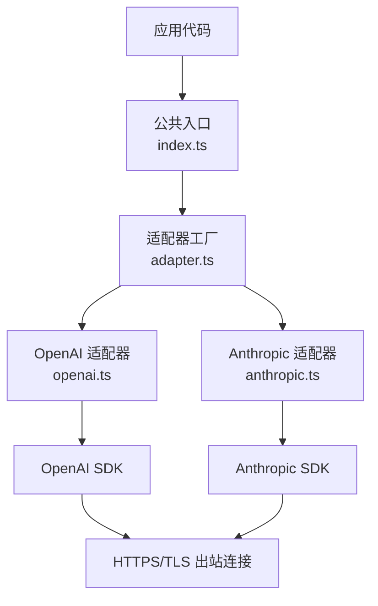
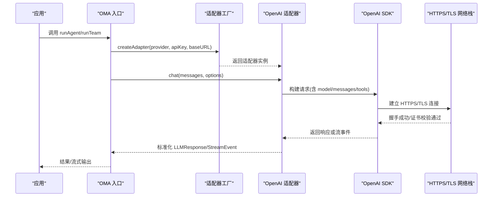
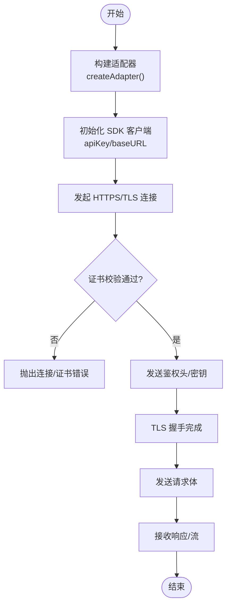
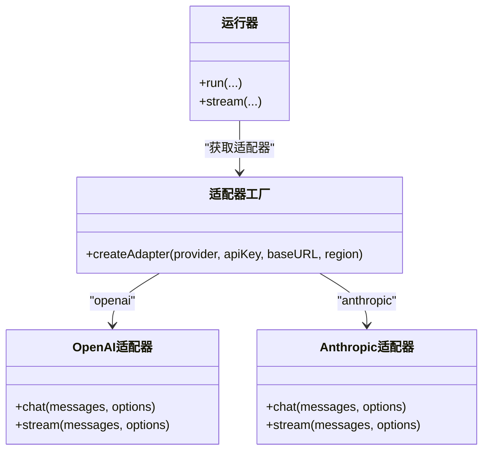

# 传输加密安全

<cite>
**本文引用的文件**
- [packages/core/src/llm/openai.ts](file://packages/core/src/llm/openai.ts)
- [packages/core/src/llm/anthropic.ts](file://packages/core/src/llm/anthropic.ts)
- [packages/core/src/llm/adapter.ts](file://packages/core/src/llm/adapter.ts)
- [packages/core/src/types.ts](file://packages/core/src/types.ts)
- [packages/core/src/index.ts](file://packages/core/src/index.ts)
- [packages/core/src/agent/runner.ts](file://packages/core/src/agent/runner.ts)
</cite>

## 目录
1. [简介](#简介)
2. [项目结构](#项目结构)
3. [核心组件](#核心组件)
4. [架构总览](#架构总览)
5. [详细组件分析](#详细组件分析)
6. [依赖关系分析](#依赖关系分析)
7. [性能与安全配置建议](#性能与安全配置建议)
8. [故障排查指南](#故障排查指南)
9. [结论](#结论)

## 简介
本文件聚焦 Open Multi-Agent（OMA）在“传输加密安全”方面的实现与使用要点。OMA 通过 LLM 适配器层与各模型提供商通信，所有网络请求由底层 SDK 负责建立 HTTPS/TLS 连接、证书校验与数据包加密；框架本身不直接处理 TLS 握手细节。本文同时说明 OMA 在数据层面的安全策略（如签名回传、重放防护思路）、网络访问控制（域名白名单、IP 过滤、代理）的落地方式，以及自定义证书、算法选择与性能优化建议，并给出连接建立过程与排障方法。

## 项目结构
OMA 的网络通信集中在 LLM 适配器层：OpenAI、Anthropic 等适配器分别封装各自官方 SDK，统一暴露 chat/stream 接口。上层编排器与 Agent Runner 仅关注业务语义，不感知具体传输协议。

图示来源
- [packages/core/src/index.ts:186-200](file://packages/core/src/index.ts#L186-L200)
- [packages/core/src/llm/adapter.ts:76-148](file://packages/core/src/llm/adapter.ts#L76-L148)
- [packages/core/src/llm/openai.ts:95-102](file://packages/core/src/llm/openai.ts#L95-L102)
- [packages/core/src/llm/anthropic.ts:394-399](file://packages/core/src/llm/anthropic.ts#L394-L399)

章节来源
- [packages/core/src/index.ts:186-200](file://packages/core/src/index.ts#L186-L200)
- [packages/core/src/llm/adapter.ts:76-148](file://packages/core/src/llm/adapter.ts#L76-L148)

## 核心组件
- 适配器工厂：根据 provider 动态加载对应适配器，支持 baseURL、region 等参数。
- OpenAI 适配器：基于 openai SDK，构造客户端时传入 apiKey/baseURL，发起 chat/stream 请求。
- Anthropic 适配器：基于 @anthropic-ai/sdk，构造客户端时传入 apiKey/baseURL，发起消息流式/非流式请求。
- 类型与选项：AgentConfig/LLMChatOptions 等定义模型路由、baseURL、apiKey、thinking 等配置项。
- 运行器：AgentRunner 将调用包装为可观测 span，透传 abortSignal，记录 token 用量与错误分类。

章节来源
- [packages/core/src/llm/adapter.ts:76-148](file://packages/core/src/llm/adapter.ts#L76-L148)
- [packages/core/src/llm/openai.ts:95-102](file://packages/core/src/llm/openai.ts#L95-L102)
- [packages/core/src/llm/anthropic.ts:394-399](file://packages/core/src/llm/anthropic.ts#L394-L399)
- [packages/core/src/types.ts:954-963](file://packages/core/src/types.ts#L954-L963)
- [packages/core/src/agent/runner.ts:597-628](file://packages/core/src/agent/runner.ts#L597-L628)

## 架构总览
下图展示一次聊天调用的端到端流程：应用通过 OMA 入口创建适配器，适配器调用底层 SDK 完成 HTTPS/TLS 握手、鉴权与数据传输。

图示来源
- [packages/core/src/index.ts:186-200](file://packages/core/src/index.ts#L186-L200)
- [packages/core/src/llm/adapter.ts:76-148](file://packages/core/src/llm/adapter.ts#L76-L148)
- [packages/core/src/llm/openai.ts:164-198](file://packages/core/src/llm/openai.ts#L164-L198)
- [packages/core/src/llm/openai.ts:214-244](file://packages/core/src/llm/openai.ts#L214-L244)

## 详细组件分析

### HTTPS/TLS 与证书验证
- 传输加密：所有出站请求均通过底层 SDK 发起，默认使用 HTTPS/TLS。OpenAI 与 Anthropic 适配器在构造客户端时接受 baseURL，便于指向自托管或兼容端点。
- 证书校验：由 Node.js 运行时与 SDK 共同完成。若需自定义 CA 或跳过校验（不推荐），应在宿主进程或 SDK 初始化处配置，而非 OMA 框架内。
- 数据包加密：TLS 层对报文进行加密，框架不二次加解密。

章节来源
- [packages/core/src/llm/openai.ts:95-102](file://packages/core/src/llm/openai.ts#L95-L102)
- [packages/core/src/llm/anthropic.ts:394-399](file://packages/core/src/llm/anthropic.ts#L394-L399)
- [packages/core/src/llm/adapter.ts:76-148](file://packages/core/src/llm/adapter.ts#L76-L148)

### 请求签名与防重放
- 思维链签名回传：对于 Anthropic 的 thinking/redacted_thinking，框架会保留 signature/redactedData 并在后续对话中按协议回传，确保服务端能校验内容未被篡改。
- 重放攻击防护：框架未内置全局请求级签名与时间戳机制；建议在网关/反向代理层结合 nonce、时间戳、签名校验来防御重放。

章节来源
- [packages/core/src/types.ts:34-51](file://packages/core/src/types.ts#L34-L51)
- [packages/core/src/llm/anthropic.ts:111-133](file://packages/core/src/llm/anthropic.ts#L111-L133)
- [packages/core/src/llm/anthropic.ts:275-299](file://packages/core/src/llm/anthropic.ts#L275-L299)

### 中间人攻击检测
- 依赖 TLS 证书链校验：确保目标域名的证书有效且受信任。
- 强制 HTTPS：对外部服务只允许 https:// 域名，避免降级到 HTTP。
- 固定公钥/证书（可选）：在高安全场景可在网关层启用证书固定，降低被伪造证书的风险。

章节来源
- [packages/core/src/llm/openai.ts:95-102](file://packages/core/src/llm/openai.ts#L95-L102)
- [packages/core/src/llm/anthropic.ts:394-399](file://packages/core/src/llm/anthropic.ts#L394-L399)

### 网络访问控制
- 域名白名单：在应用侧维护允许的 base URL 列表，仅在启动时校验配置的 baseURL 是否在白名单内。
- IP 过滤：通过操作系统防火墙或云安全组限制出站 IP 范围。
- 代理服务器：在 Node.js 环境通过环境变量配置 HTTP/HTTPS 代理（例如 http_proxy/https_proxy），使所有出站流量经代理转发。

章节来源
- [packages/core/src/types.ts:954-963](file://packages/core/src/types.ts#L954-L963)

### 加密配置指南
- 自定义证书：在宿主进程中配置 Node.js TLS 根证书或 CA 包，使 SDK 能校验私有 CA 签发的证书。
- 自定义 base URL：通过 AgentConfig.baseURL 指向 OpenAI 兼容的本地/私有服务（如 vLLM、Ollama）。注意仍需设置非空 apiKey（占位即可）。
- 算法选择：TLS 套件与版本由 Node.js 运行时决定；如需调整，应在运行时或反向代理层配置。
- 性能优化：
  - 复用适配器实例：适配器线程安全，可跨并发任务复用，减少握手开销。
  - 合理设置超时与重试：通过 runner 的 abortSignal 与调用超时控制长尾请求。
  - 流式输出：优先使用 stream，降低首字节延迟与内存占用。

章节来源
- [packages/core/src/llm/openai.ts:95-102](file://packages/core/src/llm/openai.ts#L95-L102)
- [packages/core/src/llm/anthropic.ts:394-399](file://packages/core/src/llm/anthropic.ts#L394-L399)
- [packages/core/src/agent/runner.ts:597-628](file://packages/core/src/agent/runner.ts#L597-L628)

### 安全连接建立过程

图示来源
- [packages/core/src/llm/adapter.ts:76-148](file://packages/core/src/llm/adapter.ts#L76-L148)
- [packages/core/src/llm/openai.ts:164-198](file://packages/core/src/llm/openai.ts#L164-L198)
- [packages/core/src/llm/anthropic.ts:412-451](file://packages/core/src/llm/anthropic.ts#L412-L451)

## 依赖关系分析
- 适配器工厂集中管理 provider 到实现的映射，便于扩展新提供商。
- OpenAI/Anthropic 适配器依赖各自 SDK，负责消息格式转换与流式处理。
- 运行器通过适配器抽象屏蔽底层差异，统一产出标准响应与事件。

图示来源
- [packages/core/src/llm/adapter.ts:76-148](file://packages/core/src/llm/adapter.ts#L76-L148)
- [packages/core/src/llm/openai.ts:76-102](file://packages/core/src/llm/openai.ts#L76-L102)
- [packages/core/src/llm/anthropic.ts:385-399](file://packages/core/src/llm/anthropic.ts#L385-L399)
- [packages/core/src/agent/runner.ts:597-628](file://packages/core/src/agent/runner.ts#L597-L628)

## 性能与安全配置建议
- 连接复用：保持适配器实例常驻，避免重复创建带来的握手成本。
- 超时与取消：通过 abortSignal 控制单次调用超时与取消，防止资源泄露。
- 流式优先：对大响应使用 stream，降低延迟与峰值内存。
- 最小权限：仅授予工具必要能力，结合 onToolCall 做细粒度审批。
- 审计与脱敏：敏感字段（如 credentials）在追踪中自动脱敏，避免泄露。

章节来源
- [packages/core/src/agent/runner.ts:597-628](file://packages/core/src/agent/runner.ts#L597-L628)
- [packages/core/src/types.ts:572-582](file://packages/core/src/types.ts#L572-L582)

## 故障排查指南
- 证书错误：检查目标域名证书是否有效、是否由受信任 CA 签发；必要时在宿主进程配置自定义 CA。
- 连接失败：确认 baseURL 正确、网络可达、代理环境变量已设置；查看 SDK 抛出的错误码与消息。
- 鉴权失败：核对 apiKey 是否正确注入；某些本地服务需要非空占位 apiKey。
- 超时/中断：检查 abortSignal 是否提前触发；适当增大超时或优化下游服务。
- 流式异常：捕获 stream 中的 error 事件，定位是网络层还是模型层问题。

章节来源
- [packages/core/src/llm/openai.ts:164-198](file://packages/core/src/llm/openai.ts#L164-L198)
- [packages/core/src/llm/openai.ts:214-244](file://packages/core/src/llm/openai.ts#L214-L244)
- [packages/core/src/llm/anthropic.ts:412-451](file://packages/core/src/llm/anthropic.ts#L412-L451)
- [packages/core/src/llm/anthropic.ts:469-604](file://packages/core/src/llm/anthropic.ts#L469-L604)

## 结论
OMA 将传输加密与认证交由底层 SDK 与 Node.js 运行时处理，框架层面专注于安全的消息流转、签名回传与可观测性。生产部署中，建议配合网关/反向代理实施域名白名单、IP 过滤、代理与重放防护，并通过合理的超时、重试与流式策略提升性能与稳定性。