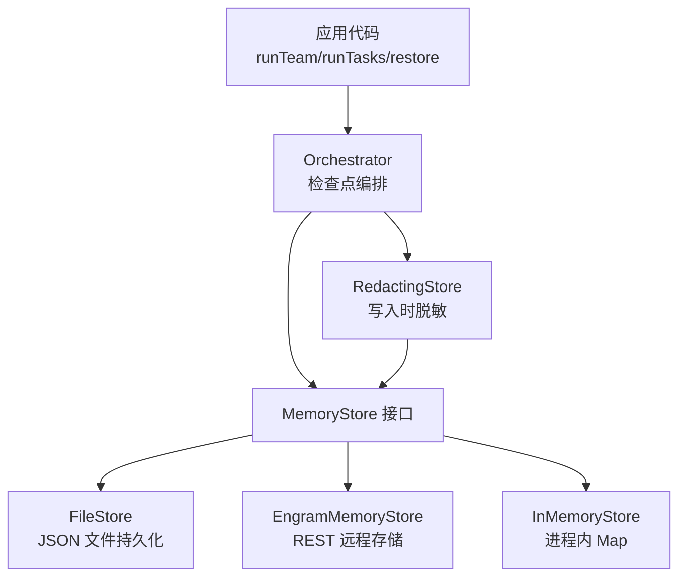
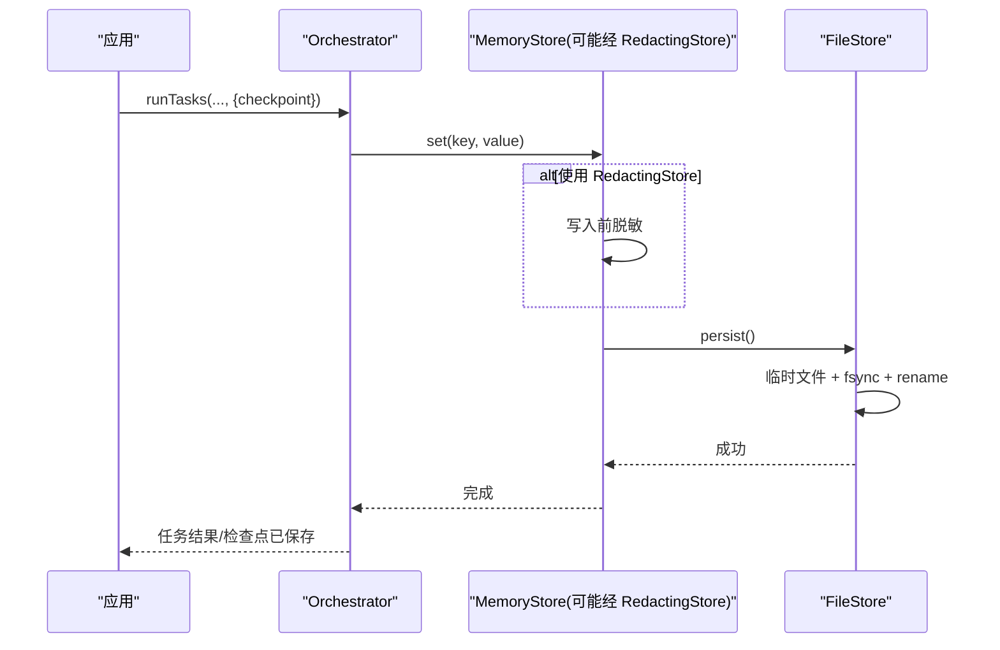
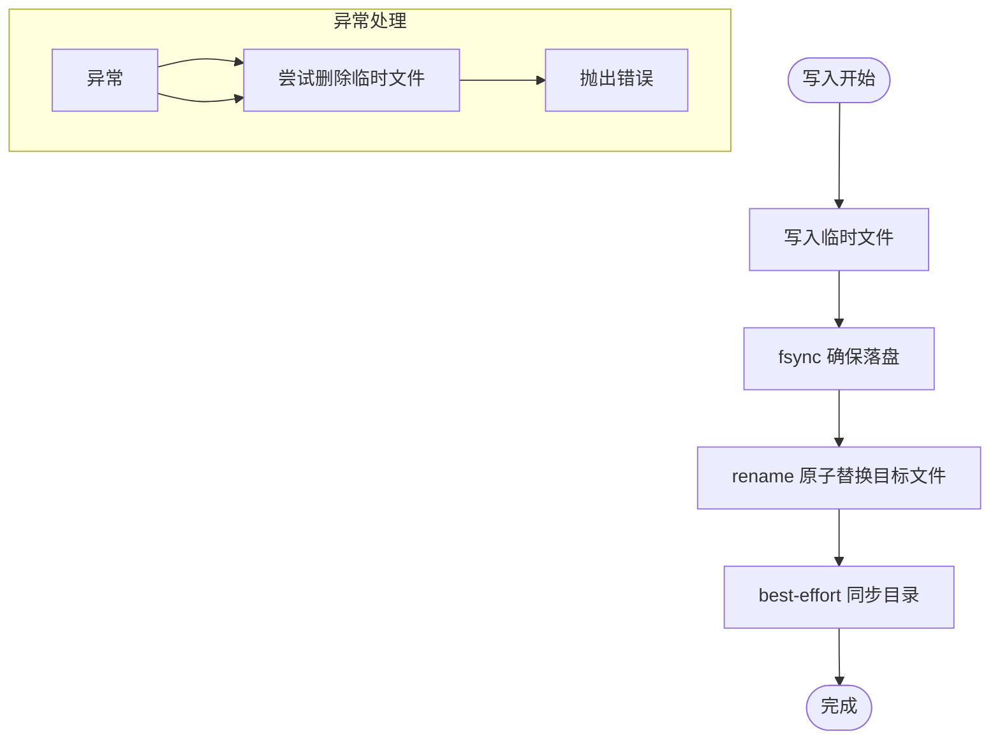
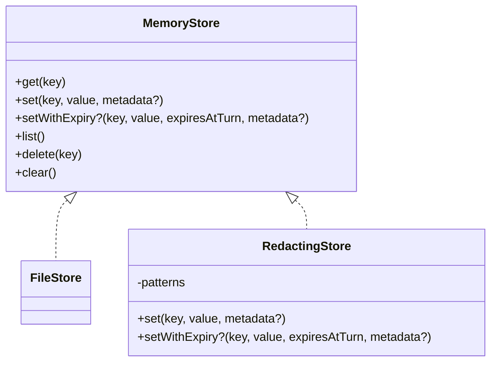
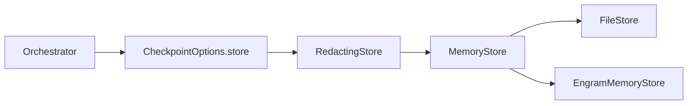

# 存储数据安全

<cite>
**本文引用的文件**
- [packages/core/src/memory/file-store.ts](file://packages/core/src/memory/file-store.ts)
- [packages/core/src/memory/redacting-store.ts](file://packages/core/src/memory/redacting-store.ts)
- [packages/core/src/types.ts](file://packages/core/src/types.ts)
- [docs/checkpoint.md](file://docs/checkpoint.md)
- [docs/shared-memory.md](file://docs/shared-memory.md)
- [packages/core/examples/integrations/with-engram/engram-store.ts](file://packages/core/examples/integrations/with-engram/engram-store.ts)
</cite>

## 目录
1. [简介](#简介)
2. [项目结构](#项目结构)
3. [核心组件](#核心组件)
4. [架构总览](#架构总览)
5. [详细组件分析](#详细组件分析)
6. [依赖关系分析](#依赖关系分析)
7. [性能考量](#性能考量)
8. [故障排查指南](#故障排查指南)
9. [结论](#结论)
10. [附录](#附录)

## 简介
本文件聚焦 Open Multi-Agent 的“存储安全”机制，围绕以下目标展开：检查点文件保护（原子持久化、完整性校验与访问控制）、内存数据清理策略（过期清理、泄漏防护、调试信息过滤）、临时文件管理（隔离、生命周期、自动清理），以及存储后端安全配置（数据库连接加密、文件系统权限、备份安全）。文档同时给出最佳实践与安全审计方法，帮助在生产环境中安全地持久化与恢复多智能体运行状态。

## 项目结构
Open Multi-Agent 将“共享内存/检查点”抽象为 MemoryStore 接口，并提供多种实现：
- 进程内内存实现（InMemoryStore）：快速但非持久。
- 基于文件的持久实现（FileStore）：单 JSON 文件 + 原子写入 + fsync，适合检查点。
- 可插拔的后端（如 EngramMemoryStore）：通过 REST API 持久化到外部系统。
- 敏感值脱敏装饰器（RedactingStore）：在写入时统一对值进行脱敏，避免密钥落盘。

图表来源
- [packages/core/src/memory/file-store.ts:1-45](file://packages/core/src/memory/file-store.ts#L1-L45)
- [packages/core/src/memory/redacting-store.ts:1-23](file://packages/core/src/memory/redacting-store.ts#L1-L23)
- [docs/checkpoint.md:1-10](file://docs/checkpoint.md#L1-L10)

章节来源
- [docs/checkpoint.md:1-10](file://docs/checkpoint.md#L1-L10)
- [docs/shared-memory.md:1-28](file://docs/shared-memory.md#L1-L28)

## 核心组件
- FileStore：单文件 JSON 存储，读路径走内存镜像，写路径采用“临时文件 + fsync + rename”的原子提交；加载时对版本和字段做严格校验，损坏即抛错，拒绝静默丢弃。
- RedactingStore：MemoryStore 装饰器，在 set/setWithExpiry 写入前对值进行结构化或文本级脱敏，支持自定义正则模式；不提供 compareAndSet，避免破坏审批哈希。
- MemoryStore 接口：定义 get/set/list/delete/clear，可选 compareAndSet 与 setWithExpiry，供不同后端统一接入。
- EngramMemoryStore：示例后端，通过 HTTP 调用远端服务，使用邀请令牌鉴权，提供事实追加与删除能力。

章节来源
- [packages/core/src/memory/file-store.ts:80-206](file://packages/core/src/memory/file-store.ts#L80-L206)
- [packages/core/src/memory/redacting-store.ts:28-110](file://packages/core/src/memory/redacting-store.ts#L28-L110)
- [packages/core/src/types.ts:2842-2872](file://packages/core/src/types.ts#L2842-L2872)
- [packages/core/examples/integrations/with-engram/engram-store.ts:48-112](file://packages/core/examples/integrations/with-engram/engram-store.ts#L48-L112)

## 架构总览
检查点与共享内存共用 MemoryStore 抽象。默认情况下，检查点复用团队的共享内存存储；也可单独指定一个持久化存储用于检查点。关键安全要点：
- 原子性与一致性：FileStore 通过 temp+fsync+rename 保证幂等与崩溃一致。
- 完整性校验：加载时校验版本与字段类型，非法内容直接报错。
- 敏感数据脱敏：通过 RedactingStore 在写入边界统一脱敏，避免密钥落盘。
- 保留命名空间隔离：检查点与审批记录使用保留键前缀，避免与业务共享内存冲突。

图表来源
- [packages/core/src/memory/file-store.ts:324-351](file://packages/core/src/memory/file-store.ts#L324-L351)
- [packages/core/src/memory/redacting-store.ts:81-83](file://packages/core/src/memory/redacting-store.ts#L81-L83)
- [docs/checkpoint.md:49-73](file://docs/checkpoint.md#L49-L73)

## 详细组件分析

### 检查点文件保护
- 原子持久化：每次变更都写入同目录临时文件，执行 fsync 后再 rename 覆盖目标文件，确保断电或进程崩溃不会留下半写文件。
- 完整性校验：加载时校验文件格式、版本号与关键字段类型；遇到损坏或不支持的版本直接抛出错误，不降级为“空存储”。
- 命名空间隔离：检查点与审批记录使用保留键前缀，避免与业务共享内存互相污染。
- 访问控制建议：操作系统层面限制检查点目录权限（仅运行用户可读/写），生产环境建议使用只读挂载或最小权限原则。

图表来源
- [packages/core/src/memory/file-store.ts:324-351](file://packages/core/src/memory/file-store.ts#L324-L351)
- [packages/core/src/memory/file-store.ts:353-369](file://packages/core/src/memory/file-store.ts#L353-L369)

章节来源
- [packages/core/src/memory/file-store.ts:220-303](file://packages/core/src/memory/file-store.ts#L220-L303)
- [docs/checkpoint.md:109-143](file://docs/checkpoint.md#L109-L143)

### 内存数据清理策略
- 过期清理（TTL）：MemoryStore 支持 setWithExpiry，以“轮次”为单位标记过期；上层 SharedMemory 负责按当前轮次过滤过期条目。
- 自动清除：clear() 清空所有条目并持久化；delete() 删除单个键，未命中则无副作用。
- 泄漏防护：结合 TTL 与定期 clear/delete 策略，避免长期驻留的中间态数据泄露。
- 调试信息过滤：通过 RedactingStore 在写入时屏蔽敏感字段；对于日志/遥测，应在各自层过滤，不依赖存储层。

图表来源
- [packages/core/src/types.ts:2842-2872](file://packages/core/src/types.ts#L2842-L2872)
- [packages/core/src/memory/file-store.ts:102-206](file://packages/core/src/memory/file-store.ts#L102-L206)
- [packages/core/src/memory/redacting-store.ts:48-110](file://packages/core/src/memory/redacting-store.ts#L48-L110)

章节来源
- [packages/core/src/types.ts:2824-2872](file://packages/core/src/types.ts#L2824-L2872)
- [packages/core/src/memory/file-store.ts:166-206](file://packages/core/src/memory/file-store.ts#L166-L206)
- [packages/core/src/memory/redacting-store.ts:28-110](file://packages/core/src/memory/redacting-store.ts#L28-L110)

### 临时文件管理
- 隔离：临时文件与目标文件位于同一目录，确保 rename 在同一文件系统上原子生效。
- 生命周期：每个写入生成唯一临时文件名（含进程号与计数器），失败时尽力删除临时文件。
- 自动清理：写入成功后不再残留临时文件；目录同步 best-effort，不影响主流程。

章节来源
- [packages/core/src/memory/file-store.ts:324-351](file://packages/core/src/memory/file-store.ts#L324-L351)

### 存储后端安全配置
- 数据库连接加密：若使用 Redis/Postgres 等后端，应启用 TLS 传输加密，并通过环境变量注入凭据，避免硬编码。
- 文件系统权限：检查点/共享内存文件应限制为运行用户读写，禁止其他用户读取；必要时使用只读挂载或最小权限原则。
- 备份安全：对包含检查点的目录进行备份时，需确保备份介质加密且访问受限；若启用了 RedactingStore，备份中仍可能包含非敏感业务数据。
- 外部后端鉴权：示例 EngramMemoryStore 使用邀请令牌作为认证头，应避免在日志中输出该令牌。

章节来源
- [packages/core/examples/integrations/with-engram/engram-store.ts:48-73](file://packages/core/examples/integrations/with-engram/engram-store.ts#L48-L73)
- [docs/shared-memory.md:13-28](file://docs/shared-memory.md#L13-L28)

### 安全最佳实践
- 始终为持久化存储启用脱敏：将 RedactingStore 包裹在 FileStore 或任何后端之前，确保写入即脱敏。
- 使用独立检查点存储：将共享内存留在 InMemoryStore，检查点指向独立的 FileStore，降低高频写入带来的 I/O 压力与暴露面。
- 严格权限与隔离：检查点目录最小权限；生产环境考虑只读挂载与集中式密钥管理。
- 保留键前缀不可滥用：__oma_checkpoint__/__oma_approval__ 为保留命名空间，勿用于业务数据。
- 谨慎使用 compareAndSet：仅在需要跨进程原子性的场景使用；RedactingStore 不提供该方法以避免破坏审批哈希。

章节来源
- [docs/checkpoint.md:172-204](file://docs/checkpoint.md#L172-L204)
- [docs/shared-memory.md:29-47](file://docs/shared-memory.md#L29-L47)
- [packages/core/src/memory/redacting-store.ts:43-47](file://packages/core/src/memory/redacting-store.ts#L43-L47)

### 安全审计方法
- 检查点内容审计：在部署后对检查点文件进行抽样审计，确认无明文密钥或敏感信息；若未启用 RedactingStore，应立即补齐。
- 访问日志审计：对文件系统与网络请求（如 Engram API）开启访问日志，监控异常读取与越权访问。
- 完整性校验：利用 FileStore 的强校验行为，确保损坏文件被拒绝而非静默降级；在 CI 中加入文件健康检查脚本。
- 权限基线核查：定期扫描检查点目录权限，确保符合最小权限原则。

章节来源
- [packages/core/src/memory/file-store.ts:220-303](file://packages/core/src/memory/file-store.ts#L220-L303)
- [docs/checkpoint.md:172-204](file://docs/checkpoint.md#L172-L204)

## 依赖关系分析
- Orchestrator 通过 CheckpointOptions 选择 store；默认复用团队 sharedMemoryStore，也可指定独立 store。
- FileStore 依赖 Node 内置 fs/promises 与 path；无第三方运行时依赖。
- RedactingStore 依赖内部 redaction 工具，对值进行结构化或文本级脱敏。
- EngramMemoryStore 依赖 HTTP 客户端与邀请令牌，提供远程事实存取。

图表来源
- [docs/checkpoint.md:38-73](file://docs/checkpoint.md#L38-L73)
- [packages/core/src/memory/redacting-store.ts:28-110](file://packages/core/src/memory/redacting-store.ts#L28-L110)
- [packages/core/src/memory/file-store.ts:80-206](file://packages/core/src/memory/file-store.ts#L80-L206)
- [packages/core/examples/integrations/with-engram/engram-store.ts:48-112](file://packages/core/examples/integrations/with-engram/engram-store.ts#L48-L112)

章节来源
- [docs/checkpoint.md:38-73](file://docs/checkpoint.md#L38-L73)

## 性能考量
- 写入频率：将 FileStore 用作检查点存储而非共享内存，可减少每次 agent 内存写入的磁盘 I/O；共享内存保持 InMemoryStore 以获得低延迟。
- 原子写入成本：temp+fsync+rename 带来一定开销，但在检查点边界（任务完成、安全边界）触发，整体可控。
- 脱敏开销：RedactingStore 在写入时对值进行解析与替换，结构化 JSON 会额外解析一次；建议在必要处启用。

章节来源
- [docs/checkpoint.md:49-73](file://docs/checkpoint.md#L49-L73)
- [packages/core/src/memory/file-store.ts:324-351](file://packages/core/src/memory/file-store.ts#L324-L351)
- [packages/core/src/memory/redacting-store.ts:97-110](file://packages/core/src/memory/redacting-store.ts#L97-L110)

## 故障排查指南
- 检查点写入失败：捕获 onProgress 中的 checkpoint_save_failed 事件，记录错误并继续运行；后续安全边界会重试。
- 文件损坏：FileStore 加载时遇到非法 JSON、不支持的版本或缺失字段会直接抛错；需人工修复或删除损坏文件。
- 临时文件残留：写入失败时会尽力删除临时文件；若仍存在，可安全删除。
- 外部后端鉴权失败：检查 Engram 邀请令牌与环境变量配置，确保网络可达与权限正确。

章节来源
- [docs/checkpoint.md:154-170](file://docs/checkpoint.md#L154-L170)
- [packages/core/src/memory/file-store.ts:220-303](file://packages/core/src/memory/file-store.ts#L220-L303)
- [packages/core/examples/integrations/with-engram/engram-store.ts:48-73](file://packages/core/examples/integrations/with-engram/engram-store.ts#L48-L73)

## 结论
Open Multi-Agent 通过统一的 MemoryStore 抽象，将检查点与共享内存的安全与可靠性建立在原子持久化、完整性校验与写入时脱敏之上。配合合理的权限控制与审计策略，可在生产环境中安全地持久化与恢复多智能体运行状态。建议优先使用 FileStore 作为检查点存储，并在其外层包裹 RedactingStore 以屏蔽敏感信息；对外部后端启用加密与最小权限，并定期进行安全审计。

## 附录
- 检查点保留键：__oma_checkpoint__/__oma_approval__ 为保留命名空间，勿用于业务数据。
- 恢复语义：restore 会重建任务队列与共享内存，跳过已完成任务；协同协调器的合成步骤需在 restore 时重新传入配置。
- 工具幂等性：toolCallId 可用于外部系统的幂等键，避免重复执行造成副作用。

章节来源
- [docs/checkpoint.md:109-143](file://docs/checkpoint.md#L109-L143)
- [docs/checkpoint.md:206-249](file://docs/checkpoint.md#L206-L249)