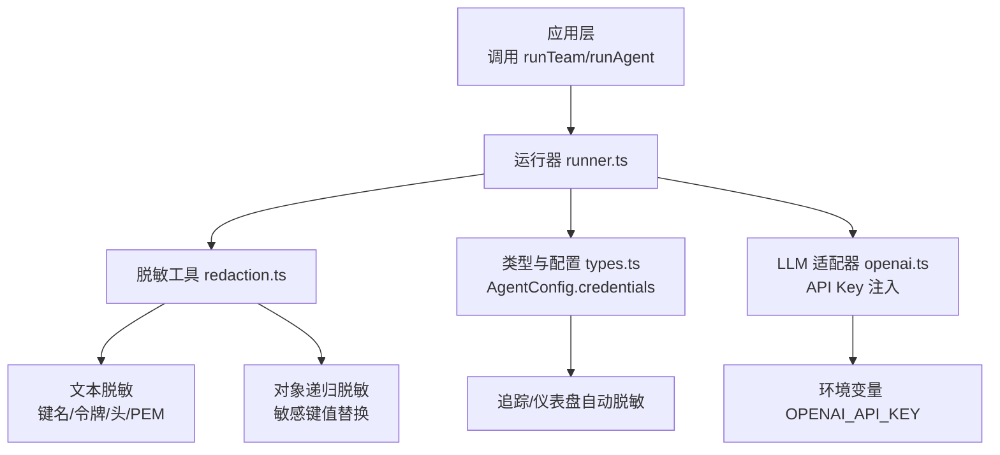
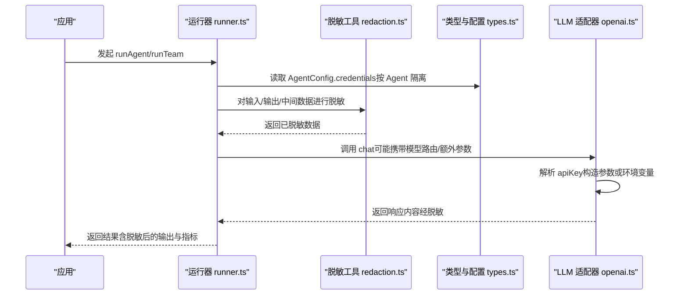
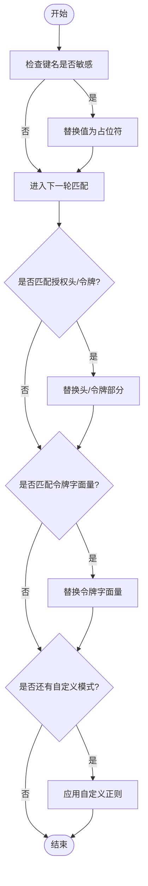
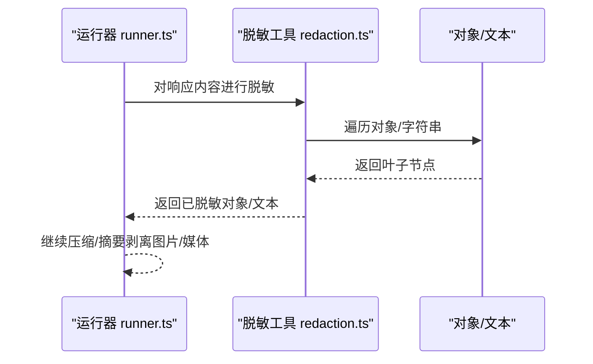
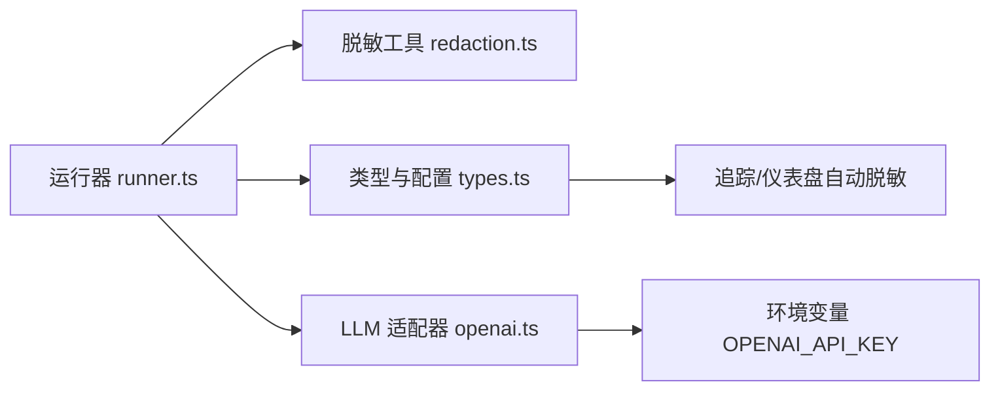

# 数据脱敏机制

<cite>
**本文引用的文件**
- [redaction.ts](file://packages/core/src/utils/redaction.ts)
- [redaction.test.ts](file://packages/core/tests/redaction.test.ts)
- [types.ts](file://packages/core/src/types.ts)
- [openai.ts](file://packages/core/src/llm/openai.ts)
- [runner.ts](file://packages/core/src/agent/runner.ts)
</cite>

## 目录
1. [简介](#简介)
2. [项目结构](#项目结构)
3. [核心组件](#核心组件)
4. [架构总览](#架构总览)
5. [详细组件分析](#详细组件分析)
6. [依赖关系分析](#依赖关系分析)
7. [性能考量](#性能考量)
8. [故障排查指南](#故障排查指南)
9. [结论](#结论)
10. [附录：配置示例与最佳实践](#附录配置示例与最佳实践)

## 简介
本章节概述 Open Multi-Agent 的数据脱敏与安全边界设计。框架在多处对敏感信息进行识别与保护，包括凭据注入、运行时上下文、日志与遥测输出等。其核心能力包括：
- 敏感信息自动识别：基于键名模式、令牌字面量、HTTP 头与密钥块等规则进行扫描与替换。
- 凭据保护策略：通过 Agent 级凭据作用域与环境变量注入，避免全局泄露；并在追踪与仪表盘中自动脱敏。
- 输出过滤系统：对自由文本、对象树、消息内容等进行递归脱敏，支持自定义正则扩展。
- 可观测性安全：默认拒绝工具调用、逐次 Gate 控制，并对遥测与持久化状态应用隐私控制。

这些能力共同确保用户输入与智能体输出中的敏感信息得到适当处理，降低凭证泄漏与合规风险。

## 项目结构
数据脱敏相关代码集中在 core 包的 utils 与类型定义中，并贯穿运行器、LLM 适配器等关键路径：
- 脱敏工具：提供文本与对象递归脱敏能力，内置多种敏感键名与令牌字面量匹配规则。
- 类型与配置：AgentConfig 的 credentials 字段用于按 Agent 隔离凭据，并在追踪与仪表盘中自动脱敏。
- LLM 适配器：OpenAI 适配器从环境变量或构造参数读取 API Key，体现凭据注入方式。
- 运行器：在消息压缩、摘要等过程中剥离图片等大附件，减少不必要的数据外泄面。



图表来源
- [runner.ts:165-194](file://packages/core/src/agent/runner.ts#L165-L194)
- [redaction.ts:1-163](file://packages/core/src/utils/redaction.ts#L1-L163)
- [types.ts:572-582](file://packages/core/src/types.ts#L572-L582)
- [openai.ts:97-101](file://packages/core/src/llm/openai.ts#L97-L101)

章节来源
- [redaction.ts:1-163](file://packages/core/src/utils/redaction.ts#L1-L163)
- [types.ts:572-582](file://packages/core/src/types.ts#L572-L582)
- [openai.ts:97-101](file://packages/core/src/llm/openai.ts#L97-L101)
- [runner.ts:165-194](file://packages/core/src/agent/runner.ts#L165-L194)

## 核心组件
- 敏感文本脱敏：对包含敏感键名的赋值、Bearer 头、PEM 私钥块、常见令牌字面量进行替换为统一占位符。
- 对象递归脱敏：遍历对象/数组，遇到敏感键名直接替换为占位符；字符串叶子节点继续执行文本脱敏。
- 凭据作用域：AgentConfig.credentials 将凭据限定在单个 Agent 的作用域内，避免跨 Agent 访问；该字段在追踪与仪表盘中自动脱敏。
- 适配器凭据注入：OpenAI 适配器优先使用构造参数传入的 apiKey，否则回退到环境变量 OPENAI_API_KEY。
- 运行期数据瘦身：在消息压缩与摘要阶段剥离图片与媒体附件，防止大体积二进制数据进入提示词造成 token 膨胀与潜在泄露。

章节来源
- [redaction.ts:1-163](file://packages/core/src/utils/redaction.ts#L1-L163)
- [types.ts:572-582](file://packages/core/src/types.ts#L572-L582)
- [openai.ts:97-101](file://packages/core/src/llm/openai.ts#L97-L101)
- [runner.ts:361-390](file://packages/core/src/agent/runner.ts#L361-L390)

## 架构总览
下图展示数据脱敏在运行时的关键路径：用户输入与 Agent 输出经过运行器与脱敏工具，凭据通过 Agent 作用域注入，LLM 适配器按需读取密钥，最终输出与追踪数据均被脱敏。



图表来源
- [runner.ts:165-194](file://packages/core/src/agent/runner.ts#L165-L194)
- [redaction.ts:1-163](file://packages/core/src/utils/redaction.ts#L1-L163)
- [types.ts:572-582](file://packages/core/src/types.ts#L572-L582)
- [openai.ts:97-101](file://packages/core/src/llm/openai.ts#L97-L101)

## 详细组件分析

### 敏感信息自动识别算法
- 敏感键名检测：匹配 api_key、secret、password、private_key、access_token、bearer、token 等常见凭据键名（大小写不敏感）。
- 赋值形式覆盖：同时支持带引号与不带引号的键值对，能正确处理含空格与分隔符的值。
- HTTP 头与令牌：对 Authorization: Bearer ... 与独立 Bearer 令牌进行替换；对 PEM 私钥块整体替换。
- 令牌字面量：内置 OpenAI、GitHub、AWS、Slack 等常见令牌前缀的正则匹配，命中即替换。
- 自定义扩展：允许调用方传入额外正则，叠加到内置规则之上，实现 PII（如邮箱）等自定义脱敏。



图表来源
- [redaction.ts:1-163](file://packages/core/src/utils/redaction.ts#L1-L163)

章节来源
- [redaction.ts:1-163](file://packages/core/src/utils/redaction.ts#L1-L163)
- [redaction.test.ts:1-129](file://packages/core/tests/redaction.test.ts#L1-L129)

### 凭据保护策略
- 环境变量注入：OpenAI 适配器优先使用构造参数传入的 apiKey，若未提供则读取 OPENAI_API_KEY。
- Agent 级凭据作用域：AgentConfig.credentials 将凭据限定在当前 Agent 的作用域内，避免子 Agent 越权访问其他凭据。
- 自动脱敏：credentials 字段被视为机密，在追踪与仪表盘中自动脱敏，避免日志泄露。
- 最小权限原则：每个 Agent 仅持有必要的凭据，降低被攻破后的横向移动风险。

```mermaid
classDiagram
class AgentConfig {
+credentials? : Record<string,string>
}
class OpenAIAdapter {
+constructor(apiKey?, baseURL?)
}
AgentConfig <.. OpenAIAdapter : "通过运行器传递上下文"
OpenAIAdapter --> "读取" ENV["OPENAI_API_KEY"]
```

图表来源
- [types.ts:572-582](file://packages/core/src/types.ts#L572-L582)
- [openai.ts:97-101](file://packages/core/src/llm/openai.ts#L97-L101)

章节来源
- [types.ts:572-582](file://packages/core/src/types.ts#L572-L582)
- [openai.ts:97-101](file://packages/core/src/llm/openai.ts#L97-L101)

### 输出过滤系统
- 响应内容扫描：对自由文本、对象树进行递归扫描，命中敏感键名或令牌字面量即替换。
- 敏感信息替换规则：统一替换为占位符，保证幂等性与一致性。
- 自定义脱敏规则配置：通过 extraPatterns 传入自定义正则，叠加到内置规则上，适用于 PII、财务数据等场景。
- 运行期数据瘦身：在消息压缩与摘要阶段剥离图片与媒体附件，避免大体积数据进入提示词与追踪。



图表来源
- [runner.ts:361-390](file://packages/core/src/agent/runner.ts#L361-L390)
- [redaction.ts:120-163](file://packages/core/src/utils/redaction.ts#L120-L163)

章节来源
- [runner.ts:361-390](file://packages/core/src/agent/runner.ts#L361-L390)
- [redaction.ts:120-163](file://packages/core/src/utils/redaction.ts#L120-L163)

### 常见敏感数据类型与效果
- API 密钥与令牌：OpenAI、GitHub、AWS、Slack 等令牌字面量会被识别并替换。
- 个人身份信息：可通过 extraPatterns 添加邮箱、身份证号等正则进行脱敏。
- 财务数据：可通过 extraPatterns 添加银行卡号、发票号等正则进行脱敏。
- 授权头与私钥：Authorization: Bearer ... 与 PEM 私钥块会被整体替换。

测试用例覆盖了多场景，包括含空格的键值对、重复赋值、幂等性、以及附加自定义模式的组合行为。

章节来源
- [redaction.test.ts:1-129](file://packages/core/tests/redaction.test.ts#L1-L129)

## 依赖关系分析
- 运行器依赖脱敏工具：在消息处理、压缩与摘要过程中调用脱敏逻辑，确保中间态与最终输出不被泄露。
- 类型定义提供凭据作用域：AgentConfig.credentials 作为凭据注入点，并在追踪与仪表盘中自动脱敏。
- LLM 适配器依赖环境变量：OpenAI 适配器从环境变量或构造参数读取密钥，体现凭据注入方式。
- 脱敏工具自包含：文本与对象脱敏逻辑集中管理，便于复用与维护。



图表来源
- [runner.ts:165-194](file://packages/core/src/agent/runner.ts#L165-L194)
- [redaction.ts:1-163](file://packages/core/src/utils/redaction.ts#L1-L163)
- [types.ts:572-582](file://packages/core/src/types.ts#L572-L582)
- [openai.ts:97-101](file://packages/core/src/llm/openai.ts#L97-L101)

章节来源
- [runner.ts:165-194](file://packages/core/src/agent/runner.ts#L165-L194)
- [redaction.ts:1-163](file://packages/core/src/utils/redaction.ts#L1-L163)
- [types.ts:572-582](file://packages/core/src/types.ts#L572-L582)
- [openai.ts:97-101](file://packages/core/src/llm/openai.ts#L97-L101)

## 性能考量
- 正则匹配开销：内置规则与自定义模式均为线性扫描，建议在 extraPatterns 中保持模式简洁，避免过度回溯。
- 递归对象脱敏：对大型对象树进行遍历时注意层级深度与分支数量，必要时在上层做裁剪。
- 消息压缩与摘要：剥离图片与媒体可减少 token 膨胀，提升吞吐并降低泄露面。
- 幂等性：脱敏过程具备幂等性，重复处理不会二次替换，适合在多个管线阶段调用。

[本节为通用指导，不直接分析具体文件]

## 故障排查指南
- 现象：日志中出现明文密钥或令牌
  - 检查是否在追踪/仪表盘中正确启用自动脱敏（credentials 字段应被标记为机密）。
  - 确认脱敏工具是否被调用于所有输出路径（包括错误信息与中间态）。
- 现象：自定义 PII 未被脱敏
  - 检查 extraPatterns 是否正确传入且为全局匹配；确保模式不包含捕获组导致替换异常。
- 现象：Authorization 头残留
  - 确认 Bearer 令牌与 Authorization 头匹配规则生效；避免在后续拼接时重新引入明文。
- 现象：图片/媒体导致 token 暴涨
  - 确认运行器在压缩/摘要阶段已剥离图片与媒体附件。

章节来源
- [types.ts:572-582](file://packages/core/src/types.ts#L572-L582)
- [redaction.ts:1-163](file://packages/core/src/utils/redaction.ts#L1-L163)
- [runner.ts:361-390](file://packages/core/src/agent/runner.ts#L361-L390)

## 结论
Open Multi-Agent 通过集中的脱敏工具、Agent 级凭据作用域、适配器凭据注入与运行期数据瘦身，构建了端到端的数据脱敏与安全边界。结合内置规则与可扩展的自定义模式，能够覆盖 API 密钥、个人身份信息、财务数据等多种敏感类型，并确保在追踪与仪表盘中自动脱敏，满足生产环境的安全与合规要求。

[本节为总结，不直接分析具体文件]

## 附录：配置示例与最佳实践
- 环境变量注入
  - 设置 OPENAI_API_KEY 供适配器读取；或通过构造参数显式传入 apiKey，避免依赖全局环境。
- 配置文件加密
  - 建议将凭据存储于受保护的密钥管理服务，并在启动时注入到 AgentConfig.credentials；避免明文写入配置文件。
- 运行时凭据管理
  - 为每个 Agent 分配最小必要凭据；在工具中通过 context.credentials 读取，而非模块级闭包。
- 输出过滤与自定义规则
  - 使用 extraPatterns 添加邮箱、身份证号、银行卡号等正则；确保模式全局匹配且不引入捕获组。
- 常见敏感数据识别与效果
  - 令牌字面量：OpenAI、GitHub、AWS、Slack 等前缀将被替换。
  - 授权头：Authorization: Bearer ... 将被替换为占位符。
  - 私钥块：PEM 私钥块整体替换。
  - 键名匹配：password、secret、api_key、token 等键名对应的值将被替换。

章节来源
- [openai.ts:97-101](file://packages/core/src/llm/openai.ts#L97-L101)
- [types.ts:572-582](file://packages/core/src/types.ts#L572-L582)
- [redaction.ts:1-163](file://packages/core/src/utils/redaction.ts#L1-L163)
- [redaction.test.ts:1-129](file://packages/core/tests/redaction.test.ts#L1-L129)