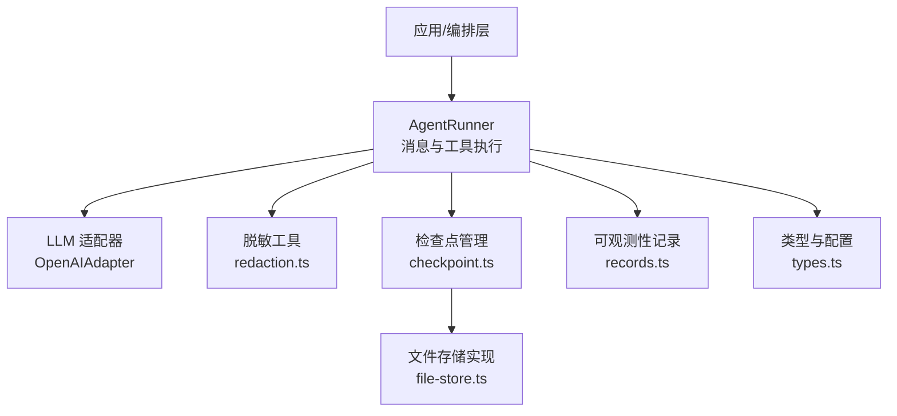
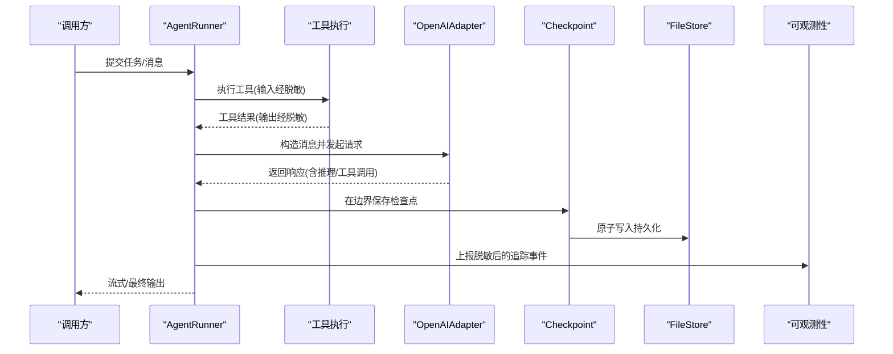
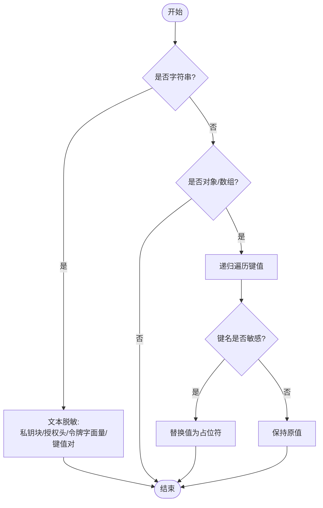
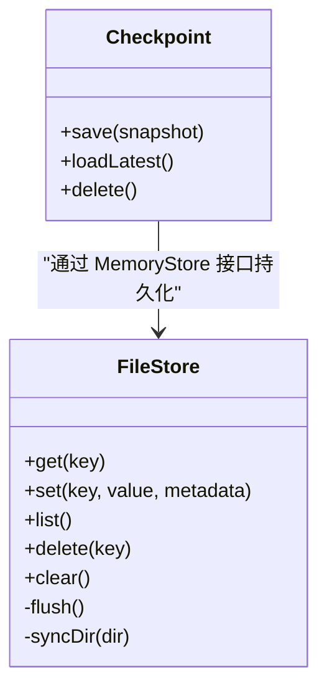
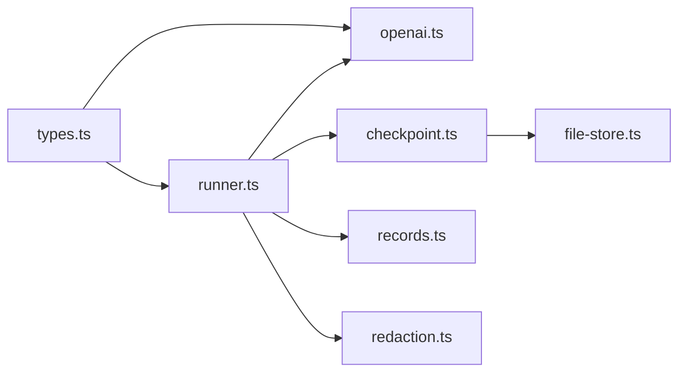

# 隐私保护措施

<cite>
**本文引用的文件**
- [redaction.ts](file://packages/core/src/utils/redaction.ts)
- [checkpoint.ts](file://packages/core/src/memory/checkpoint.ts)
- [file-store.ts](file://packages/core/src/memory/file-store.ts)
- [runner.ts](file://packages/core/src/agent/runner.ts)
- [types.ts](file://packages/core/src/types.ts)
- [openai.ts](file://packages/core/src/llm/openai.ts)
- [records.ts](file://packages/core/src/observability/records.ts)
</cite>

## 目录
1. [简介](#简介)
2. [项目结构](#项目结构)
3. [核心组件](#核心组件)
4. [架构总览](#架构总览)
5. [详细组件分析](#详细组件分析)
6. [依赖关系分析](#依赖关系分析)
7. [性能考虑](#性能考虑)
8. [故障排查指南](#故障排查指南)
9. [结论](#结论)
10. [附录：配置与最佳实践](#附录配置与最佳实践)

## 简介
本文件系统性说明 Open Multi-Agent（OMA）在数据脱敏、凭据保护、输出过滤、传输加密、本地存储安全以及上下文隔离等方面的隐私保护机制，并提供可操作的配置建议与最佳实践，帮助用户在生产环境中充分保护用户数据与敏感信息。

## 项目结构
与隐私保护直接相关的核心代码集中在 core 包中：
- 数据脱敏与敏感信息识别：utils/redaction.ts
- 检查点持久化与校验：memory/checkpoint.ts
- 文件系统型持久化存储：memory/file-store.ts
- 运行器中的消息处理、压缩与流式事件：agent/runner.ts
- 类型与配置（含沙箱工作目录、凭据作用域等）：types.ts
- LLM 适配器（OpenAI）：llm/openai.ts
- 可观测性记录类型：observability/records.ts

图表来源
- [runner.ts:1175-1204](file://packages/core/src/agent/runner.ts#L1175-L1204)
- [openai.ts:214-224](file://packages/core/src/llm/openai.ts#L214-L224)
- [redaction.ts:49-118](file://packages/core/src/utils/redaction.ts#L49-L118)
- [checkpoint.ts:57-101](file://packages/core/src/memory/checkpoint.ts#L57-L101)
- [file-store.ts:112-182](file://packages/core/src/memory/file-store.ts#L112-L182)
- [records.ts:8-55](file://packages/core/src/observability/records.ts#L8-L55)

章节来源
- [runner.ts:1175-1204](file://packages/core/src/agent/runner.ts#L1175-L1204)
- [types.ts:544-557](file://packages/core/src/types.ts#L544-L557)

## 核心组件
- 数据脱敏与输出过滤：通过内置的敏感键名匹配、令牌字面量模式、Authorization/Bearer 头清理、私钥块替换等策略，对文本与对象进行递归脱敏；支持扩展自定义正则以覆盖更多 PII。
- 凭据保护与作用域：AgentConfig.credentials 提供按 Agent 作用域的密钥注入，避免子 Agent 越权访问其他凭据；credentials 键在追踪与仪表盘中自动脱敏。
- 检查点与持久化：Checkpoint 将运行状态序列化为 JSON 并通过 MemoryStore 持久化；FileStore 使用原子写入（临时文件 + fsync + rename）确保崩溃一致性。
- 上下文隔离与权限控制：通过 cwd 沙箱限制文件系统工具访问范围；默认拒绝危险工具或受限工具集；外部进程后端支持独立工作目录与环境变量隔离。
- 传输与适配器：LLM 适配器负责与上游服务通信；请求构建与消息校验由适配器完成，结合框架侧脱敏降低敏感信息外泄风险。

章节来源
- [redaction.ts:36-118](file://packages/core/src/utils/redaction.ts#L36-L118)
- [types.ts:570-582](file://packages/core/src/types.ts#L570-L582)
- [checkpoint.ts:57-101](file://packages/core/src/memory/checkpoint.ts#L57-L101)
- [file-store.ts:112-182](file://packages/core/src/memory/file-store.ts#L112-L182)
- [types.ts:544-557](file://packages/core/src/types.ts#L544-L557)
- [openai.ts:214-224](file://packages/core/src/llm/openai.ts#L214-L224)

## 架构总览
下图展示一次典型调用链中的隐私保护点：输入消息进入 Runner，经过工具执行与结果回写，期间对工具输入/输出进行脱敏；LLM 适配器发送请求并接收响应；检查点在关键边界落盘；可观测性记录包含脱敏后的元数据。

图表来源
- [runner.ts:1175-1204](file://packages/core/src/agent/runner.ts#L1175-L1204)
- [openai.ts:214-224](file://packages/core/src/llm/openai.ts#L214-L224)
- [checkpoint.ts:57-101](file://packages/core/src/memory/checkpoint.ts#L57-L101)
- [file-store.ts:324-351](file://packages/core/src/memory/file-store.ts#L324-L351)
- [records.ts:8-55](file://packages/core/src/observability/records.ts#L8-L55)

## 详细组件分析

### 数据脱敏与输出过滤
- 敏感键名识别：对 key 名称进行模式匹配（如 api_key、secret、password、token 等），命中则将该字段值替换为占位符。
- 文本级脱敏：
  - 私钥块整体替换
  - Authorization 与 Bearer 令牌清理
  - 键值对赋值（含引号包裹与非引号值）中敏感键的值被替换
  - 常见令牌字面量（如特定前缀的 API Key、GitHub Token 等）被替换
  - 支持额外正则扩展（例如邮箱、身份证号等 PII）
- 对象级递归脱敏：保持数据结构不变，仅替换敏感值；日期等不可变类型保留。

图表来源
- [redaction.ts:36-118](file://packages/core/src/utils/redaction.ts#L36-L118)

章节来源
- [redaction.ts:36-118](file://packages/core/src/utils/redaction.ts#L36-L118)

### 凭据保护与作用域
- 每个 Agent 可通过 credentials 注入其专属密钥，工具代码通过 context 读取，避免跨 Agent 越权。
- credentials 键在追踪与仪表盘中自动脱敏，防止日志泄露。
- 建议在最小权限原则下分配凭据，并在工具中显式校验必要参数。

章节来源
- [types.ts:570-582](file://packages/core/src/types.ts#L570-L582)

### 检查点与本地存储安全
- 检查点格式校验：加载时严格校验版本、字段类型与约束，非法快照会被拒绝，避免恶意或损坏数据破坏运行时。
- 原子持久化：FileStore 采用“写临时文件 → fsync → rename”的原子更新，保证断电/崩溃后要么旧状态完整，要么新状态完整。
- 目录同步：尝试对目录做 fsync 以提升重命名本身的持久性（失败不致命）。
- 只读恢复：打开损坏文件时会诊断并拒绝启动，避免静默丢弃数据。

图表来源
- [checkpoint.ts:57-101](file://packages/core/src/memory/checkpoint.ts#L57-L101)
- [file-store.ts:112-182](file://packages/core/src/memory/file-store.ts#L112-L182)
- [file-store.ts:324-351](file://packages/core/src/memory/file-store.ts#L324-L351)

章节来源
- [checkpoint.ts:57-101](file://packages/core/src/memory/checkpoint.ts#L57-L101)
- [file-store.ts:220-303](file://packages/core/src/memory/file-store.ts#L220-L303)
- [file-store.ts:324-351](file://packages/core/src/memory/file-store.ts#L324-L351)

### 上下文隔离机制
- 文件系统沙箱：通过 cwd 限定文件系统工具的根目录，拒绝解析到该目录之外的路径（包括符号链接），防止越权读写。
- 工具白名单/预设：可通过 tools/disallowedTools 或 toolPreset 控制可用工具集，默认倾向最小权限。
- 外部进程后端：ACP/Process 后端可为子进程指定独立命令、参数、环境变量与工作目录，实现进程级隔离。
- 网络访问控制：框架未内置全局网络开关；如需限制，应在部署环境（容器/主机防火墙/代理）层面配置。

章节来源
- [types.ts:544-557](file://packages/core/src/types.ts#L544-L557)
- [types.ts:834-851](file://packages/core/src/types.ts#L834-L851)
- [types.ts:866-877](file://packages/core/src/types.ts#L866-L877)

### 传输加密与中间人攻击防护
- 适配器职责：OpenAIAdapter 负责构建消息、调用上游 SDK 并解析响应；敏感内容在框架侧已脱敏。
- 传输安全：具体 TLS/证书/代理策略由底层 HTTP 客户端与运行时决定；建议在部署层强制 HTTPS、启用证书校验与严格的网络策略。
- 建议：
  - 使用受信任的 CA 与最小权限的网络出口
  - 禁用明文协议（HTTP/FTP），统一走 HTTPS
  - 在网关/代理层实施速率限制与审计

章节来源
- [openai.ts:214-224](file://packages/core/src/llm/openai.ts#L214-L224)

### 可观测性与输出过滤
- 追踪事件：工具调用、LLM 调用、任务等事件包含脱敏后的输入/输出片段，避免敏感信息进入日志。
- 属性与指标：span 属性仅包含低基数、非敏感标识（模型、阶段、任务 ID 等）。
- 建议：关闭不必要的调试输出，集中采集并设置保留策略。

章节来源
- [records.ts:8-55](file://packages/core/src/observability/records.ts#L8-L55)
- [types.ts:2714-2728](file://packages/core/src/types.ts#L2714-L2728)

## 依赖关系分析
- runner.ts 依赖 types.ts 提供的配置与类型，驱动 openai.ts 适配器进行 LLM 调用，并在关键边界触发 checkpoint.ts 持久化，同时通过 records.ts 上报脱敏后的可观测性事件。
- file-store.ts 作为 MemoryStore 的实现之一，被 checkpoint.ts 用于持久化。
- redaction.ts 被多处消费（工具输入/输出、追踪事件等）以确保敏感信息不出境。

图表来源
- [runner.ts:1175-1204](file://packages/core/src/agent/runner.ts#L1175-L1204)
- [openai.ts:214-224](file://packages/core/src/llm/openai.ts#L214-L224)
- [checkpoint.ts:57-101](file://packages/core/src/memory/checkpoint.ts#L57-L101)
- [file-store.ts:112-182](file://packages/core/src/memory/file-store.ts#L112-L182)
- [records.ts:8-55](file://packages/core/src/observability/records.ts#L8-L55)
- [redaction.ts:49-118](file://packages/core/src/utils/redaction.ts#L49-L118)

## 性能考虑
- 脱敏开销：文本与对象递归脱敏会增加 CPU 与内存占用，建议仅在必要时对大段内容启用，或在上游先裁剪再脱敏。
- 检查点频率：频繁落盘会影响吞吐，应结合任务边界与重试策略合理设置检查点间隔。
- 原子写入：FileStore 每次 flush 会重写整个状态文件，适合较小规模状态；超大状态建议改用数据库型 MemoryStore。

## 故障排查指南
- 检查点加载失败：若状态文件损坏或版本不兼容，会抛出错误并拒绝启动；请检查文件完整性与版本兼容性。
- 文件写入失败：磁盘空间不足或权限问题会导致 flush 失败；需检查磁盘配额与目录权限。
- 沙箱路径异常：文件系统工具拒绝访问沙箱外路径；确认 cwd 配置正确且路径合法。
- 凭据未生效：确认 credentials 已按 Agent 作用域注入，并在工具中通过 context 读取。

章节来源
- [file-store.ts:220-303](file://packages/core/src/memory/file-store.ts#L220-L303)
- [file-store.ts:324-351](file://packages/core/src/memory/file-store.ts#L324-L351)
- [types.ts:544-557](file://packages/core/src/types.ts#L544-L557)
- [types.ts:570-582](file://packages/core/src/types.ts#L570-L582)

## 结论
Open Multi-Agent 通过“输入即脱敏、凭据最小化、检查点原子持久化、文件系统沙箱与工具白名单”的组合策略，构建了端到端的隐私保护体系。配合部署层的传输加密与网络策略，可在生产环境中有效降低敏感数据泄露风险。建议遵循最小权限原则，定期审查配置与日志，并结合业务场景定制脱敏规则。

## 附录：配置与最佳实践
- 数据脱敏
  - 使用内置敏感键与令牌模式；必要时通过扩展正则增加 PII 规则
  - 对大段文本先裁剪再脱敏，减少性能开销
- 凭据保护
  - 按 Agent 粒度注入 credentials，避免共享全局密钥
  - 在工具中显式校验必需参数，拒绝空值或异常值
- 输出过滤
  - 开启追踪脱敏；避免打印原始请求/响应体
  - 对工具输出进行二次裁剪后再回传给模型
- 传输加密
  - 强制 HTTPS，启用证书校验；在网关/代理层限制出站流量
  - 使用企业 CA 与最小权限网络策略
- 本地存储安全
  - 使用 FileStore 作为检查点存储；定期备份与轮换
  - 限制检查点文件的访问权限；不在仓库中提交敏感快照
- 上下文隔离
  - 设置 cwd 沙箱，仅授予必要的文件系统权限
  - 对外部进程后端使用独立工作目录与环境变量
  - 在网络层限制子进程与工具的出站连接
- 可观测性
  - 仅采集低基数、非敏感属性
  - 对日志与追踪数据设置保留期与访问控制