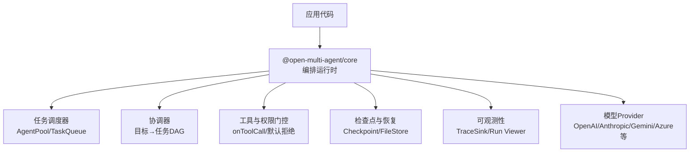
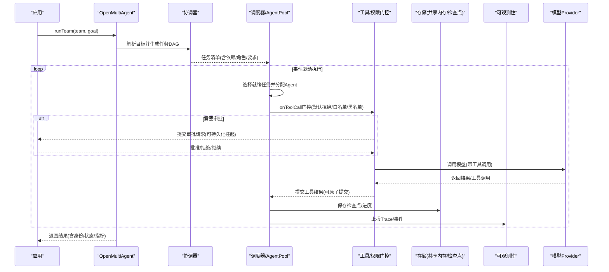
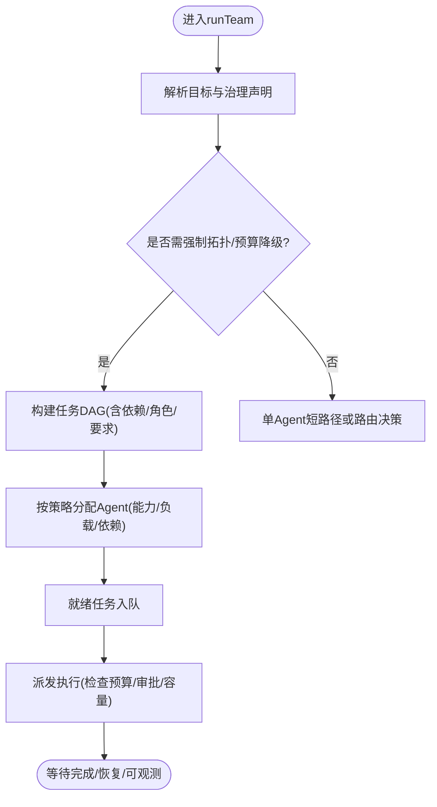
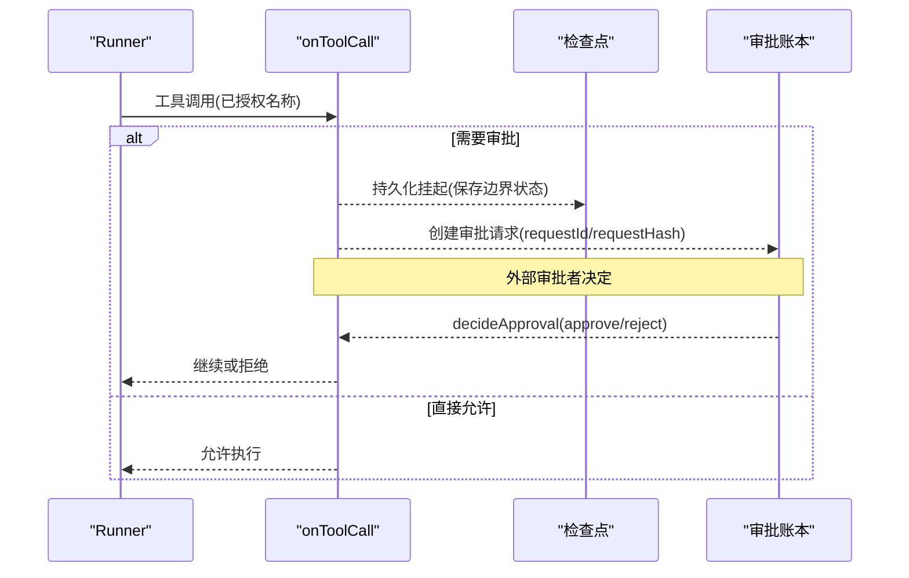
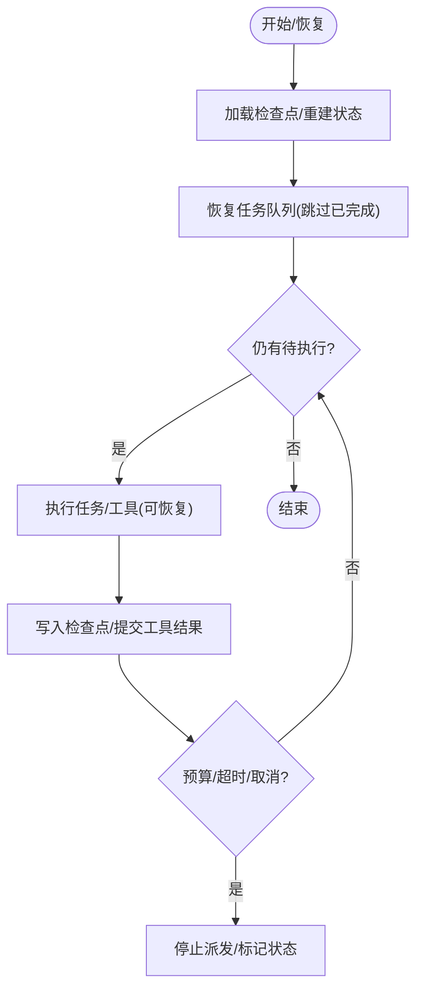
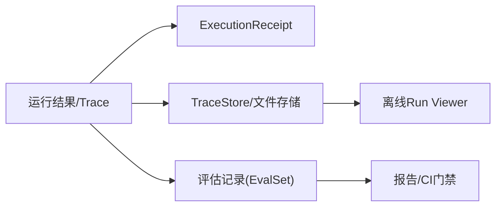
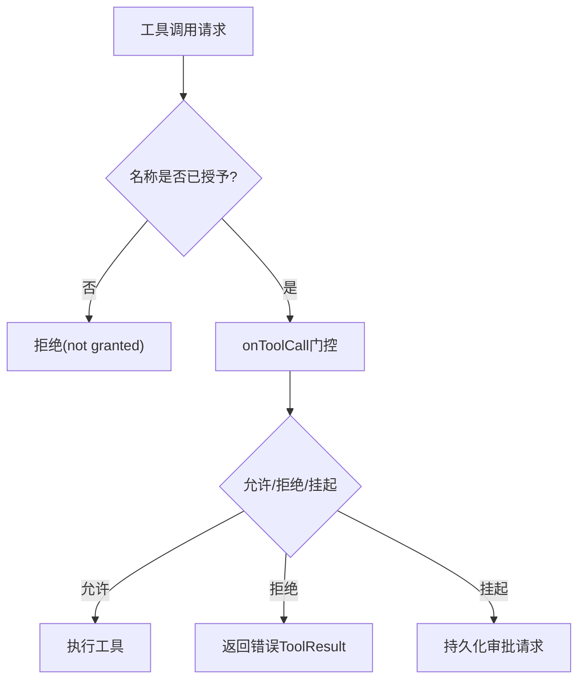
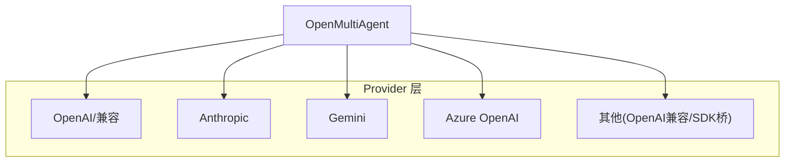
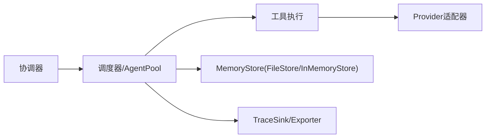

# 核心特性

<cite>
**本文引用的文件**
- [README_zh.md](file://README_zh.md)
- [providers.md](file://docs/providers.md)
- [checkpoint.md](file://docs/checkpoint.md)
- [observability.md](file://docs/observability.md)
- [tool-configuration.md](file://docs/tool-configuration.md)
- [execution-routing.md](file://docs/execution-routing.md)
- [task-scheduling.md](file://docs/task-scheduling.md)
- [durable-approvals.md](file://docs/durable-approvals.md)
- [types.ts](file://packages/core/src/types.ts)
- [runner.ts](file://packages/core/src/agent/runner.ts)
</cite>

## 目录
1. [简介](#简介)
2. [项目结构](#项目结构)
3. [核心组件](#核心组件)
4. [架构总览](#架构总览)
5. [详细组件分析](#详细组件分析)
6. [依赖关系分析](#依赖关系分析)
7. [性能考量](#性能考量)
8. [故障排查指南](#故障排查指南)
9. [结论](#结论)
10. [附录：配置与使用速查](#附录：配置与使用速查)

## 简介
Open Multi-Agent（OMA）是一个面向 TypeScript 后端的动态多智能体编排框架。它强调“只描述目标，不画任务图”：在运行时由协调器将目标解析为任务有向无环图（DAG），由确定性调度器分派给团队执行，并在整个运行过程中提供可审查、可审批、可回放的数据面。其关键能力包括动态编排、受控执行、可靠性保障、可观测性与评测、安全与隐私控制，以及广泛的模型提供商集成。

**章节来源**
- [README_zh.md:13-107](file://README_zh.md#L13-L107)

## 项目结构
仓库采用 monorepo 组织，核心编排能力位于 `packages/core`，可选的企业级可观测性适配位于 `packages/otel`，脚手架工具位于 `packages/create-oma-app`。文档集中在 `docs/`，覆盖 Provider、Checkpoint、Observability、Tool 配置、执行路由、任务调度、持久化审批等主题。根级 README 提供了快速开始、包说明与文档导航。

**图表来源**
- [task-scheduling.md:1-25](file://docs/task-scheduling.md#L1-L25)
- [execution-routing.md:1-22](file://docs/execution-routing.md#L1-L22)
- [tool-configuration.md:214-237](file://docs/tool-configuration.md#L214-L237)
- [checkpoint.md:1-13](file://docs/checkpoint.md#L1-L13)
- [observability.md:1-11](file://docs/observability.md#L1-L11)
- [providers.md:20-63](file://docs/providers.md#L20-L63)

**章节来源**
- [README_zh.md:137-143](file://README_zh.md#L137-L143)
- [package.json:1-34](file://package.json#L1-L34)

## 核心组件
- 协调器与动态编排：从自然语言目标生成任务 DAG，自动分配负责人并合成最终结果。
- 调度器与执行拓扑：事件驱动的任务队列与 AgentPool，支持多种分配策略与执行路由（Single/Team）。
- 工具与权限门控：内置工具默认拒绝，按预设/白名单/黑名单授予；per-call 的 onToolCall 门控支持允许、拒绝与持久化挂起。
- 可靠性：检查点快照、断点恢复、重试、超时、循环检测、Token/成本预算限制。
- 可观测性与评测：结构化 TraceRecord v2、离线 Run Viewer、Execution Receipt、EvalSet。
- 安全与隐私：默认拒绝的工具权限、逐次调用 gate、对遥测与持久化的隐私控制。
- 模型提供商集成：OpenAI、Anthropic、Google Gemini、Azure OpenAI、GitHub Copilot、Grok、DeepSeek、Doubao、Hunyuan、MiniMax、MiMo、Qiniu、Bedrock 等，以及 Vercel AI SDK 桥接。

**章节来源**
- [README_zh.md:98-107](file://README_zh.md#L98-L107)
- [execution-routing.md:1-22](file://docs/execution-routing.md#L1-L22)
- [task-scheduling.md:1-25](file://docs/task-scheduling.md#L1-L25)
- [tool-configuration.md:214-237](file://docs/tool-configuration.md#L214-L237)
- [checkpoint.md:1-13](file://docs/checkpoint.md#L1-L13)
- [observability.md:1-11](file://docs/observability.md#L1-L11)
- [providers.md:20-63](file://docs/providers.md#L20-L63)

## 架构总览
下图展示了从目标到任务图、再到执行与恢复、可观测性的整体数据与控制流。

**图表来源**
- [execution-routing.md:1-22](file://docs/execution-routing.md#L1-L22)
- [task-scheduling.md:1-25](file://docs/task-scheduling.md#L1-L25)
- [tool-configuration.md:326-363](file://docs/tool-configuration.md#L326-L363)
- [checkpoint.md:74-107](file://docs/checkpoint.md#L74-L107)
- [observability.md:185-223](file://docs/observability.md#L185-L223)
- [providers.md:20-63](file://docs/providers.md#L20-L63)

## 详细组件分析

### 动态编排：目标解析、运行时任务图生成与智能体自动分配
- 目标解析：协调器接收自然语言目标，结合团队角色与约束，产出任务 DAG。
- 运行时生成：无需手工维护流程图，DAG 在运行时构建，支持依赖、角色、能力匹配与并行度。
- 自动分配：调度器基于策略（轮询、最少忙碌、能力匹配、依赖优先、复合）将任务分派给合适的 Agent，同时尊重显式 assignee 与严格校验。

**图表来源**
- [execution-routing.md:5-22](file://docs/execution-routing.md#L5-L22)
- [task-scheduling.md:98-133](file://docs/task-scheduling.md#L98-L133)
- [types.ts:2132-2180](file://packages/core/src/types.ts#L2132-L2180)

**章节来源**
- [execution-routing.md:5-22](file://docs/execution-routing.md#L5-L22)
- [task-scheduling.md:98-133](file://docs/task-scheduling.md#L98-L133)
- [types.ts:2132-2180](file://packages/core/src/types.ts#L2132-L2180)

### 受控执行：预览、审批、持久化暂停
- 计划预览：可在计划就绪时进行审批，支持“仅计划”模式冻结已审批计划以供重放。
- 任务派发审批：在任务即将派发前拦截，支持允许、拒绝与挂起。
- 工具调用门控：默认拒绝，按名称授予后再进行 per-call 门控；支持 suspend 持久化挂起，配合检查点实现跨进程恢复。
- 持久化审批：通过 MemoryStore 的 compareAndSet 保证唯一决策与内容绑定，恢复时校验一致性。

**图表来源**
- [durable-approvals.md:16-34](file://docs/durable-approvals.md#L16-L34)
- [durable-approvals.md:30-78](file://docs/durable-approvals.md#L30-L78)
- [durable-approvals.md:94-123](file://docs/durable-approvals.md#L94-L123)
- [runner.ts:1020-1054](file://packages/core/src/agent/runner.ts#L1020-L1054)

**章节来源**
- [durable-approvals.md:16-34](file://docs/durable-approvals.md#L16-L34)
- [durable-approvals.md:30-78](file://docs/durable-approvals.md#L30-L78)
- [durable-approvals.md:94-123](file://docs/durable-approvals.md#L94-L123)
- [runner.ts:1020-1054](file://packages/core/src/agent/runner.ts#L1020-L1054)

### 可靠性保障：检查点恢复、重试、超时、预算限制
- 检查点与恢复：在安全边界写入快照，支持 restore 重建任务队列与共享记忆，跳过已完成任务，重放已提交工具结果。
- 中间任务工具恢复：每个工具调用独立提交结果，恢复时避免重复执行已提交结果。
- 重试与超时：任务失败与超时触发重试与退避，事件驱动执行中保持分支独立性。
- 预算限制：Token 与成本上限在 turn/task 边界检查，超限时停止新任务派发并标记状态。

**图表来源**
- [checkpoint.md:74-107](file://docs/checkpoint.md#L74-L107)
- [checkpoint.md:206-249](file://docs/checkpoint.md#L206-L249)
- [task-scheduling.md:166-184](file://docs/task-scheduling.md#L166-L184)
- [runner.ts:1119-1136](file://packages/core/src/agent/runner.ts#L1119-L1136)

**章节来源**
- [checkpoint.md:74-107](file://docs/checkpoint.md#L74-L107)
- [checkpoint.md:206-249](file://docs/checkpoint.md#L206-L249)
- [task-scheduling.md:166-184](file://docs/task-scheduling.md#L166-L184)
- [runner.ts:1119-1136](file://packages/core/src/agent/runner.ts#L1119-L1136)

### 可观测性：执行追踪、离线查看器与评估系统
- 执行回执：buildExecutionReceipt 汇总实际执行拓扑、角色、依赖边、token 用量、时长等，用于治理结论与审计。
- TraceRecord v2：结构化 span_start/span_event/span_end，支持链接、元数据、错误与预算信息。
- 离线查看器：renderRunViewer 生成静态 HTML，展示任务 DAG 与 span 瀑布，支持搜索与过滤。
- 评估系统：EvalSet 与 FileEvalStore 支持版本化评测记录、查询、保留策略与压缩。

**图表来源**
- [observability.md:84-143](file://docs/observability.md#L84-L143)
- [observability.md:151-179](file://docs/observability.md#L151-L179)
- [observability.md:670-731](file://docs/observability.md#L670-L731)
- [observability.md:224-253](file://docs/observability.md#L224-L253)

**章节来源**
- [observability.md:84-143](file://docs/observability.md#L84-L143)
- [observability.md:151-179](file://docs/observability.md#L151-L179)
- [observability.md:670-731](file://docs/observability.md#L670-L731)
- [observability.md:224-253](file://docs/observability.md#L224-L253)

### 安全性与隐私保护：默认拒绝的工具权限控制
- 默认拒绝：内置工具（bash、文件系统工具）默认不可用，必须通过 tools 或 toolPreset 明确授予。
- 分层授权：预设 → 白名单 → 黑名单 → 框架安全轨；自定义工具注册即视为授予但仍受黑名单约束。
- 每调用门控：onToolCall 在输入校验后、执行前进行允许/拒绝/挂起决策，支持风险分类与人类审批。
- 隐私控制：遥测默认不采集敏感内容；持久化可通过 RedactingStore 脱敏（不适用于持久化审批）。

**图表来源**
- [tool-configuration.md:214-237](file://docs/tool-configuration.md#L214-L237)
- [tool-configuration.md:326-363](file://docs/tool-configuration.md#L326-L363)
- [tool-configuration.md:364-389](file://docs/tool-configuration.md#L364-L389)
- [observability.md:755-768](file://docs/observability.md#L755-L768)

**章节来源**
- [tool-configuration.md:214-237](file://docs/tool-configuration.md#L214-L237)
- [tool-configuration.md:326-363](file://docs/tool-configuration.md#L326-L363)
- [tool-configuration.md:364-389](file://docs/tool-configuration.md#L364-L389)
- [observability.md:755-768](file://docs/observability.md#L755-L768)

### 模型提供商集成：OpenAI、Anthropic、Google Gemini、Azure OpenAI 等
- 内置快捷方式：Anthropic、Gemini、OpenAI、Azure OpenAI、Copilot、Grok、DeepSeek、Doubao、Hunyuan、MiniMax、MiMo、Qiniu、Bedrock。
- OpenAI 兼容端点：Ollama、vLLM、LM Studio、llama.cpp、OpenRouter、Groq、Mistral、Zhipu GLM、Qwen、Moonshot、LiteLLM 等。
- Vercel AI SDK 桥：通过 AISdkAdapter 接入任意 AI SDK provider。
- 推理与本地工具调用：thinking/reasoning 配置映射；本地模型文本工具调用自动提取；超时与采样参数可调。

**图表来源**
- [providers.md:20-63](file://docs/providers.md#L20-L63)
- [providers.md:44-63](file://docs/providers.md#L44-L63)
- [providers.md:111-134](file://docs/providers.md#L111-L134)
- [providers.md:136-179](file://docs/providers.md#L136-L179)

**章节来源**
- [providers.md:20-63](file://docs/providers.md#L20-L63)
- [providers.md:44-63](file://docs/providers.md#L44-L63)
- [providers.md:111-134](file://docs/providers.md#L111-L134)
- [providers.md:136-179](file://docs/providers.md#L136-L179)

## 依赖关系分析
- 编排与调度：协调器产出任务 DAG，调度器通过 TaskQueue 与 AgentPool 事件驱动执行，AgentPool 作为并发权威。
- 工具与提供者：工具执行依赖 Provider 适配器；工具输出可能包含富媒体（图片/文件），不同 Provider 有不同映射。
- 检查点与存储：检查点与共享内存共用 MemoryStore 接口，FileStore 提供零依赖的文件持久化；RedactingStore 可用于脱敏。
- 可观测性：TraceSink/Exporter 负责热路径与批量导出；FileTraceStore/InMemoryTraceStore 提供本地与内存存储；OTel 包可选集成。

**图表来源**
- [task-scheduling.md:1-25](file://docs/task-scheduling.md#L1-L25)
- [checkpoint.md:49-73](file://docs/checkpoint.md#L49-L73)
- [observability.md:185-223](file://docs/observability.md#L185-L223)
- [providers.md:44-63](file://docs/providers.md#L44-L63)

**章节来源**
- [task-scheduling.md:1-25](file://docs/task-scheduling.md#L1-L25)
- [checkpoint.md:49-73](file://docs/checkpoint.md#L49-L73)
- [observability.md:185-223](file://docs/observability.md#L185-L223)
- [providers.md:44-63](file://docs/providers.md#L44-L63)

## 性能考量
- 事件驱动执行：下游任务在依赖满足后立即启动，不等待同批就绪的其他无关任务，降低端到端延迟。
- 分配策略：composite 策略结合依赖关键性与当前负载，平衡吞吐与公平性；least-busy 适合时长差异大的任务。
- 预算与超时：Token/成本上限在 turn/task 边界检查，避免无限增长；超时与取消走 drain-then-skip 路径，减少资源浪费。
- 可观测性开销：BatchingTraceSink 默认队列与批次大小有限，避免阻塞业务执行；导出失败不影响业务结果。

**章节来源**
- [task-scheduling.md:9-25](file://docs/task-scheduling.md#L9-L25)
- [task-scheduling.md:122-133](file://docs/task-scheduling.md#L122-L133)
- [task-scheduling.md:166-184](file://docs/task-scheduling.md#L166-L184)
- [observability.md:572-600](file://docs/observability.md#L572-L600)

## 故障排查指南
- 工具未执行：确认工具名称已通过预设/白名单授予；若模型误调未授予工具，会返回明确的“not granted”错误。
- 审批卡住：检查 MemoryStore 是否支持 compareAndSet；确保审批请求的 requestHash 未被篡改；恢复时校验一致。
- 检查点丢失：确认 checkpoint store 可用且写入成功；FileStore 在异常时会抛出而非静默丢弃；必要时使用 RedactingStore 脱敏。
- 预算耗尽：检查 maxTokenBudget/maxCostBudget 设置；预算超限会停止新任务派发并返回相应状态码。
- 可观测性缺失：确认 sink/exporter 已正确注入并 flush；导出失败不会中断业务；必要时使用 InMemoryTraceStore 本地验证。

**章节来源**
- [tool-configuration.md:214-237](file://docs/tool-configuration.md#L214-L237)
- [durable-approvals.md:149-162](file://docs/durable-approvals.md#L149-L162)
- [checkpoint.md:154-160](file://docs/checkpoint.md#L154-L160)
- [runner.ts:1119-1136](file://packages/core/src/agent/runner.ts#L1119-L1136)
- [observability.md:527-571](file://docs/observability.md#L527-L571)

## 结论
Open Multi-Agent 以“目标驱动”的动态编排为核心，结合严格的受控执行、健壮的可靠性机制、丰富的可观测性与评测能力，以及默认拒绝的安全模型与广泛的 Provider 集成，帮助团队在多智能体系统中实现从原型到生产的落地。通过检查点恢复、持久化审批、预算与超时控制、离线查看器与执行回执，OMA 提供了生产可用的透明性与可控性。

## 附录：配置与使用速查
- 动态编排
  - 使用 runTeam 传入团队与目标，让协调器自动生成任务 DAG。
  - 通过 executionRouting 配置路由策略（deterministic/hybrid）。
- 受控执行
  - 启用 onPlanReady/onApproval/onTaskDispatch 进行计划/回合/派发审批。
  - 使用 onToolCall 实现 per-call 门控，支持 allow/deny/suspend。
- 可靠性
  - 启用 checkpoint 并使用 FileStore 持久化；通过 restore 恢复中断运行。
  - 设置 maxTurns、maxTokenBudget、maxCostBudget 与超时。
- 可观测性
  - 配置 observability.sinks 或 onTrace；使用 renderRunViewer 生成离线查看器。
  - 使用 buildExecutionReceipt 获取执行回执与治理结论。
- 安全与隐私
  - 通过 tools 或 toolPreset 显式授予内置工具；使用 disallowedTools 排除危险工具。
  - 使用 RedactingStore 脱敏持久化数据（不适用于审批）。
- 模型集成
  - 设置 provider/model 与对应环境变量；或使用 AISdkAdapter 接入任意 SDK provider。
  - 本地模型可通过 OpenAI 兼容端点或文本工具调用提取。

**章节来源**
- [execution-routing.md:23-80](file://docs/execution-routing.md#L23-L80)
- [durable-approvals.md:30-78](file://docs/durable-approvals.md#L30-L78)
- [checkpoint.md:11-73](file://docs/checkpoint.md#L11-L73)
- [observability.md:84-143](file://docs/observability.md#L84-L143)
- [tool-configuration.md:214-237](file://docs/tool-configuration.md#L214-L237)
- [providers.md:20-63](file://docs/providers.md#L20-L63)