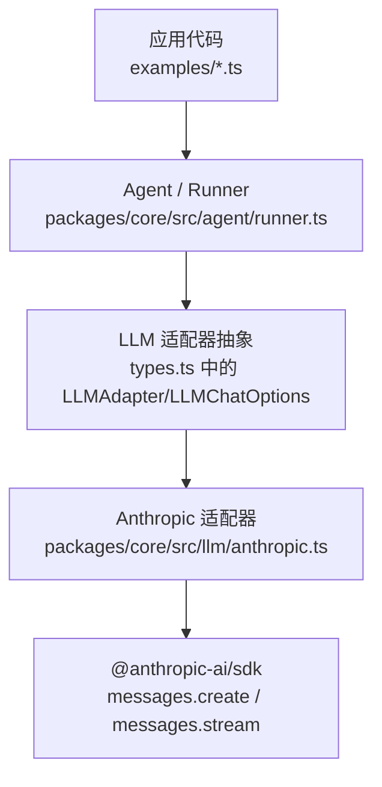
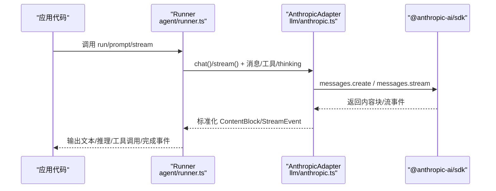
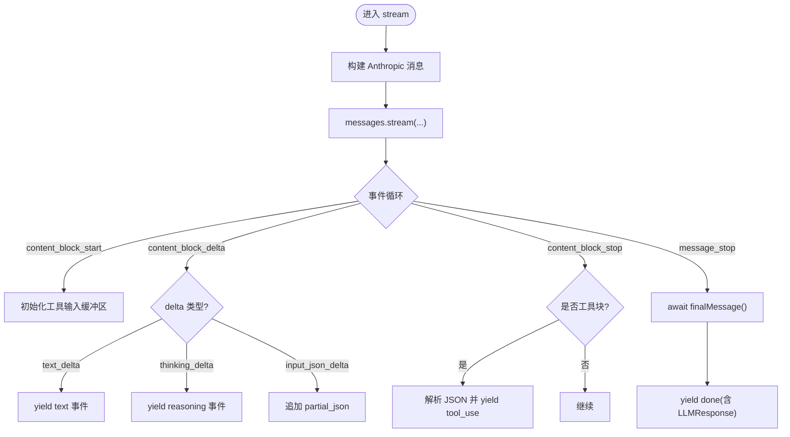
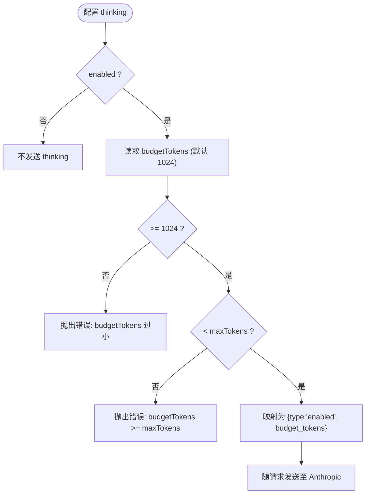
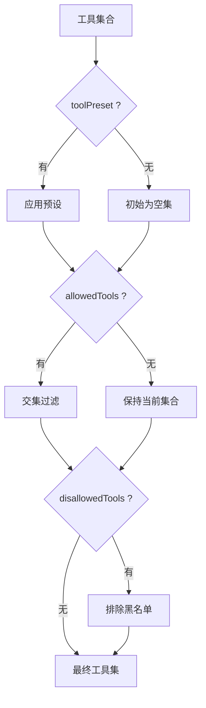
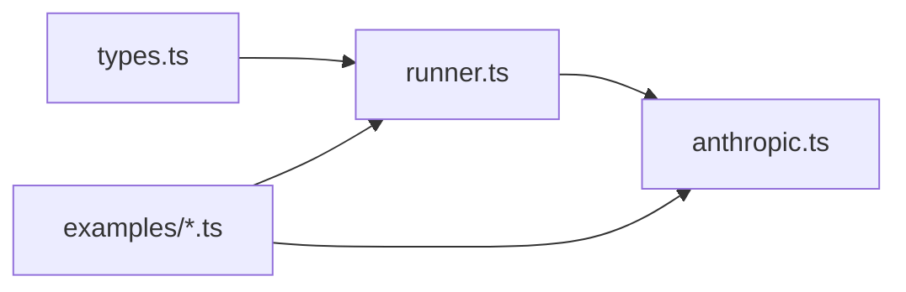

# Anthropic Claude 集成

<cite>
**本文引用的文件**
- [packages/core/src/llm/anthropic.ts](file://packages/core/src/llm/anthropic.ts)
- [packages/core/src/types.ts](file://packages/core/src/types.ts)
- [packages/core/src/agent/runner.ts](file://packages/core/src/agent/runner.ts)
- [packages/core/examples/basics/single-agent.ts](file://packages/core/examples/basics/single-agent.ts)
- [packages/core/examples/basics/multi-model-team.ts](file://packages/core/examples/basics/multi-model-team.ts)
</cite>

## 目录
1. [简介](#简介)
2. [项目结构](#项目结构)
3. [核心组件](#核心组件)
4. [架构总览](#架构总览)
5. [详细组件分析](#详细组件分析)
6. [依赖关系分析](#依赖关系分析)
7. [性能与成本考量](#性能与成本考量)
8. [故障排查指南](#故障排查指南)
9. [结论](#结论)
10. [附录：配置清单与示例路径](#附录配置清单与示例路径)

## 简介
本文件面向在 Open Multi Agent（OMA）中集成并配置 Anthropic Claude 模型的工程实践，覆盖以下主题：
- 环境变量 ANTHROPIC_API_KEY 的解析与优先级
- 支持的模型标识（如 Claude Sonnet、Claude Opus 等）
- 消息格式、工具调用机制与流式响应处理
- 扩展思维（Extended Thinking）功能：thinking.budget_tokens 配置与推理过程处理
- 系统提示词优化与工具权限管理
- 完整代码示例路径（不直接粘贴代码，提供可定位的文件行号）

## 项目结构
与 Anthropic Claude 集成相关的核心实现集中在 packages/core 下：
- LLM 适配器层：Anthropic 适配器的请求构造、流式事件映射、思考块回显
- 类型定义层：ThinkingConfig、AgentConfig、LLMChatOptions 等统一接口
- 运行器层：Runner 负责工具解析、循环检测、预算控制、事件产出
- 示例层：单智能体、多模型团队等端到端用法

图表来源
- [packages/core/src/agent/runner.ts:817-827](file://packages/core/src/agent/runner.ts#L817-L827)
- [packages/core/src/llm/anthropic.ts:385-451](file://packages/core/src/llm/anthropic.ts#L385-L451)
- [packages/core/src/types.ts:759-763](file://packages/core/src/types.ts#L759-L763)

章节来源
- [packages/core/src/llm/anthropic.ts:1-622](file://packages/core/src/llm/anthropic.ts#L1-L622)
- [packages/core/src/types.ts:759-763](file://packages/core/src/types.ts#L759-L763)
- [packages/core/src/agent/runner.ts:817-827](file://packages/core/src/agent/runner.ts#L817-L827)

## 核心组件
- Anthropic 适配器（AnthropicAdapter）
  - 负责将框架内部消息、工具定义、系统提示词、扩展思维配置转换为 Anthropic SDK 的请求参数
  - 支持同步 chat 与异步 stream 两种调用路径
  - 维护 thinking 块的签名与重放，保证多轮对话中推理上下文一致性
- 类型与配置（ThinkingConfig、AgentConfig、LLMChatOptions）
  - 统一跨提供商的“扩展思维”配置入口
  - 提供 extraBody 透传能力，便于在不修改主流程的情况下注入供应商特定字段
- 运行器（Runner）
  - 工具白名单/黑名单解析、循环检测、Token/Cost 预算控制
  - 将流式事件（文本、推理、工具调用）标准化后向上游暴露

章节来源
- [packages/core/src/llm/anthropic.ts:385-451](file://packages/core/src/llm/anthropic.ts#L385-L451)
- [packages/core/src/types.ts:759-763](file://packages/core/src/types.ts#L759-L763)
- [packages/core/src/agent/runner.ts:138-166](file://packages/core/src/agent/runner.ts#L138-L166)

## 架构总览
下图展示了从应用到 Anthropic API 的完整调用链，包括扩展思维、工具调用与流式事件。

图表来源
- [packages/core/src/agent/runner.ts:817-827](file://packages/core/src/agent/runner.ts#L817-L827)
- [packages/core/src/llm/anthropic.ts:412-451](file://packages/core/src/llm/anthropic.ts#L412-L451)
- [packages/core/src/llm/anthropic.ts:469-604](file://packages/core/src/llm/anthropic.ts#L469-L604)

## 详细组件分析

### 环境变量与密钥解析
- 密钥解析顺序：
  1) 构造函数传入的 apiKey
  2) 环境变量 ANTHROPIC_API_KEY
- 若未设置，将使用默认行为或抛出错误（由底层 SDK 决定）

章节来源
- [packages/core/src/llm/anthropic.ts:394-399](file://packages/core/src/llm/anthropic.ts#L394-L399)

### 支持的模型与 Provider
- 通过 AgentConfig.model 指定模型标识，例如：
  - claude-sonnet-4-6
  - claude-opus-4-6
- 通过 provider 指定为 anthropic；也可在 OrchestratorConfig 中设置 defaultModel/defaultProvider

章节来源
- [packages/core/examples/basics/multi-model-team.ts:140-156](file://packages/core/examples/basics/multi-model-team.ts#L140-L156)
- [packages/core/src/types.ts:2215-2224](file://packages/core/src/types.ts#L2215-L2224)

### 消息格式与工具调用
- 消息转换：
  - 框架 ContentBlock -> Anthropic MessageParam（text、image、tool_use、tool_result、reasoning/redacted_thinking）
- 工具定义：
  - 框架 LLMToolDef -> Anthropic Tool（name、description、input_schema）
- 工具结果：
  - 支持 text、image、PDF 文档附件等；非 PDF 文件仅以文本占位提示
- 工具调用流式处理：
  - 累积 input_json_delta，最终在 content_block_stop 时解析并产出 tool_use 事件

图表来源
- [packages/core/src/llm/anthropic.ts:469-604](file://packages/core/src/llm/anthropic.ts#L469-L604)

章节来源
- [packages/core/src/llm/anthropic.ts:105-228](file://packages/core/src/llm/anthropic.ts#L105-L228)
- [packages/core/src/llm/anthropic.ts:237-262](file://packages/core/src/llm/anthropic.ts#L237-L262)
- [packages/core/src/llm/anthropic.ts:469-604](file://packages/core/src/llm/anthropic.ts#L469-L604)

### 扩展思维（Extended Thinking）
- 配置入口：ThinkingConfig.enabled + budgetTokens
- 适配器校验与映射：
  - budgetTokens 最小值 1024
  - budgetTokens 必须小于 maxTokens
  - 映射为 Anthropic thinking 参数的 { type: 'enabled', budget_tokens }
- 推理块回显：
  - 对来自 Anthropic 的 thinking/redacted_thinking 进行签名/数据保留，以便后续轮次原样回发
  - 对非原生推理块，可按 preserveReasoningAsText 降级为 <thinking> 文本

图表来源
- [packages/core/src/llm/anthropic.ts:350-373](file://packages/core/src/llm/anthropic.ts#L350-L373)
- [packages/core/src/types.ts:759-763](file://packages/core/src/types.ts#L759-L763)

章节来源
- [packages/core/src/llm/anthropic.ts:350-373](file://packages/core/src/llm/anthropic.ts#L350-L373)
- [packages/core/src/types.ts:759-763](file://packages/core/src/types.ts#L759-L763)

### 流式响应处理
- 事件类型：
  - text：增量文本
  - reasoning：增量推理（扩展思维）
  - tool_use：工具调用（在 JSON 完整后发出）
  - done：最终响应（包含 usage、stop_reason 等）
  - error：异常事件
- 上游消费方式：
  - 通过 Agent.stream() 迭代事件，实时渲染或记录

章节来源
- [packages/core/src/llm/anthropic.ts:469-604](file://packages/core/src/llm/anthropic.ts#L469-L604)
- [packages/core/examples/basics/single-agent.ts:87-110](file://packages/core/examples/basics/single-agent.ts#L87-L110)

### 系统提示词优化
- 通过 AgentConfig.systemPrompt 注入角色与约束，建议：
  - 明确角色与任务边界
  - 规定输出格式（如结构化 JSON）
  - 限制工具使用范围与次数（结合 tools/toolPreset）
- 示例参考：
  - 开发者角色、简洁解释者、导师等

章节来源
- [packages/core/examples/basics/single-agent.ts:28-56](file://packages/core/examples/basics/single-agent.ts#L28-L56)
- [packages/core/examples/basics/multi-model-team.ts:140-163](file://packages/core/examples/basics/multi-model-team.ts#L140-L163)

### 工具权限管理
- 三层权限解析顺序：预设 -> 白名单 -> 黑名单
  - toolPreset：'readonly' | 'readwrite' | 'full'
  - allowedTools：允许的工具名列表
  - disallowedTools：禁止的工具名列表
- 安全沙箱：
  - cwd 控制文件系统工具的根目录，默认 .agent-workspace
- 凭据隔离：
  - credentials 按 agent 作用域注入，避免共享密钥泄露

图表来源
- [packages/core/src/agent/runner.ts:817-827](file://packages/core/src/agent/runner.ts#L817-L827)
- [packages/core/src/types.ts:975-999](file://packages/core/src/types.ts#L975-L999)
- [packages/core/src/types.ts:2233-2252](file://packages/core/src/types.ts#L2233-L2252)

章节来源
- [packages/core/src/agent/runner.ts:138-166](file://packages/core/src/agent/runner.ts#L138-L166)
- [packages/core/src/types.ts:975-999](file://packages/core/src/types.ts#L975-L999)
- [packages/core/src/types.ts:2233-2252](file://packages/core/src/types.ts#L2233-L2252)

## 依赖关系分析
- 适配器依赖 @anthropic-ai/sdk 的消息接口
- 运行器依赖类型定义与工具注册表
- 示例依赖 OpenMultiAgent/Agent/ToolRegistry/ToolExecutor 等高层 API

图表来源
- [packages/core/src/types.ts:759-763](file://packages/core/src/types.ts#L759-L763)
- [packages/core/src/agent/runner.ts:817-827](file://packages/core/src/agent/runner.ts#L817-L827)
- [packages/core/src/llm/anthropic.ts:385-451](file://packages/core/src/llm/anthropic.ts#L385-L451)

章节来源
- [packages/core/src/types.ts:759-763](file://packages/core/src/types.ts#L759-L763)
- [packages/core/src/agent/runner.ts:817-827](file://packages/core/src/agent/runner.ts#L817-L827)
- [packages/core/src/llm/anthropic.ts:385-451](file://packages/core/src/llm/anthropic.ts#L385-L451)

## 性能与成本考量
- Token 预算：
  - 可通过 maxTokenBudget 限制单次运行的累计 token 消耗
  - 当超出预算时，Runner 会产出 budget_exceeded 事件
- 每调用超时：
  - callTimeoutMs 可为每次 LLM 调用设置超时，避免卡死
- 扩展思维开销：
  - budgetTokens 越大，推理越长，token 消耗越高；需权衡质量与成本
- 并行工具调用：
  - Anthropic 适配器忽略 parallel_tool_calls 字段；如需串行，请在上层控制并发

章节来源
- [packages/core/src/agent/runner.ts:1204-1215](file://packages/core/src/agent/runner.ts#L1204-L1215)
- [packages/core/src/types.ts:1091-1105](file://packages/core/src/types.ts#L1091-L1105)
- [packages/core/src/llm/anthropic.ts:350-373](file://packages/core/src/llm/anthropic.ts#L350-L373)

## 故障排查指南
- 常见错误与原因
  - thinking.budgetTokens 过小或大于等于 maxTokens：适配器会在请求前抛出错误
  - 工具结果包含不支持的文件类型：仅支持 PDF 作为附件，其他类型会被拒绝或转为文本提示
  - 流式 JSON 解析失败：工具输入 JSON 解析失败时会降级为空对象，避免中断流
- 调试建议
  - 启用 onProgress/onTrace 观察事件
  - 检查 ANTHROPIC_API_KEY 是否正确加载
  - 逐步缩小 systemPrompt 与工具范围，定位问题来源

章节来源
- [packages/core/src/llm/anthropic.ts:350-373](file://packages/core/src/llm/anthropic.ts#L350-L373)
- [packages/core/src/llm/anthropic.ts:167-203](file://packages/core/src/llm/anthropic.ts#L167-L203)
- [packages/core/src/llm/anthropic.ts:547-570](file://packages/core/src/llm/anthropic.ts#L547-L570)

## 结论
本仓库提供了与 Anthropic Claude 的完整集成方案：
- 通过 ANTHROPIC_API_KEY 自动鉴权
- 统一的 ThinkingConfig 支持扩展思维，且具备严格的预算校验
- 完善的消息与工具调用映射，支持流式事件与推理回显
- 多层工具权限控制与安全沙箱，保障执行安全
- 丰富的示例与类型定义，便于快速落地

## 附录：配置清单与示例路径
- 环境变量
  - ANTHROPIC_API_KEY：用于鉴权（构造函数优先，其次环境变量）
- 模型与 Provider
  - model：claude-sonnet-4-6、claude-opus-4-6 等
  - provider：anthropic
- 扩展思维
  - thinking.enabled = true
  - thinking.budgetTokens >= 1024 且 < maxTokens
- 系统提示词
  - AgentConfig.systemPrompt：角色、任务、输出格式、工具使用约束
- 工具权限
  - toolPreset：'readonly' | 'readwrite' | 'full'
  - allowedTools/disallowedTools：精确控制可用工具
  - cwd：文件系统工具沙箱根目录
  - credentials：按 agent 作用域注入凭据

示例路径（不含代码内容）
- 单智能体与流式输出
  - [packages/core/examples/basics/single-agent.ts:28-56](file://packages/core/examples/basics/single-agent.ts#L28-L56)
  - [packages/core/examples/basics/single-agent.ts:87-110](file://packages/core/examples/basics/single-agent.ts#L87-L110)
- 多模型团队与自定义工具
  - [packages/core/examples/basics/multi-model-team.ts:140-163](file://packages/core/examples/basics/multi-model-team.ts#L140-L163)
  - [packages/core/examples/basics/multi-model-team.ts:116-132](file://packages/core/examples/basics/multi-model-team.ts#L116-L132)

章节来源
- [packages/core/examples/basics/single-agent.ts:28-56](file://packages/core/examples/basics/single-agent.ts#L28-L56)
- [packages/core/examples/basics/single-agent.ts:87-110](file://packages/core/examples/basics/single-agent.ts#L87-L110)
- [packages/core/examples/basics/multi-model-team.ts:116-163](file://packages/core/examples/basics/multi-model-team.ts#L116-L163)