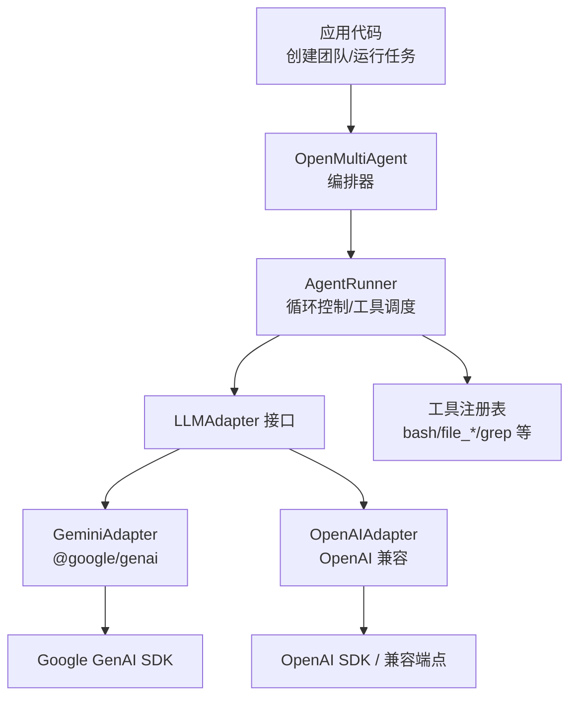
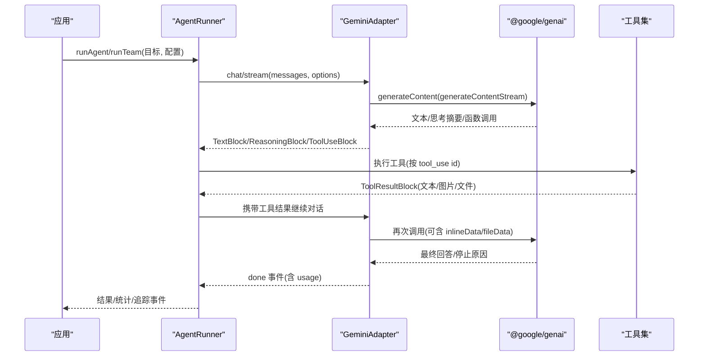
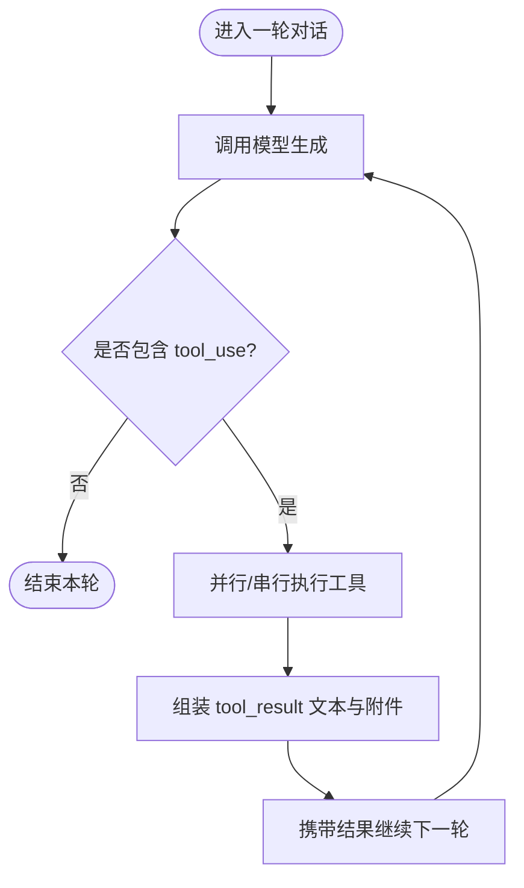
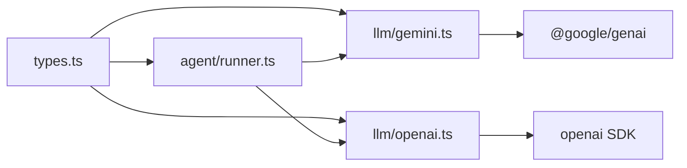

# Google Gemini 集成

<cite>
**本文引用的文件**
- [README.md](file://README.md)
- [providers.md](file://docs/providers.md)
- [gemini.ts（适配器）](file://packages/core/src/llm/gemini.ts)
- [types.ts（核心类型与配置）](file://packages/core/src/types.ts)
- [runner.ts（智能体运行器）](file://packages/core/src/agent/runner.ts)
- [openai.ts（OpenAI 适配器）](file://packages/core/src/llm/openai.ts)
- [gemini.ts（示例）](file://packages/core/examples/providers/gemini.ts)
</cite>

## 目录
1. [简介](#简介)
2. [项目结构](#项目结构)
3. [核心组件](#核心组件)
4. [架构总览](#架构总览)
5. [详细组件分析](#详细组件分析)
6. [依赖关系分析](#依赖关系分析)
7. [性能考虑](#性能考虑)
8. [故障排查指南](#故障排查指南)
9. [结论](#结论)
10. [附录：完整配置与示例路径](#附录完整配置与示例路径)

## 简介
本文件面向在 Open Multi-Agent 中集成 Google Gemini 模型的工程实践，覆盖以下内容：
- 安装 @google/genai 并配置 GEMINI_API_KEY 环境变量
- 多模态输入支持（文本、图像、文件）
- 函数调用机制与工具执行闭环
- 扩展思维功能 thinkingConfig.thinkingBudget 的配置与行为
- 完整的 Gemini 智能体团队配置示例（含多模态输入与工具调用）
- 与 OpenAI 兼容模式的差异与最佳实践

## 项目结构
本项目通过统一的 LLMAdapter 抽象屏蔽不同后端差异。Gemini 由内置适配器提供，配合框架的 AgentConfig、Orchestrator、Tool 体系实现端到端的多智能体编排。

图表来源
- [gemini.ts（适配器）:1-563](file://packages/core/src/llm/gemini.ts#L1-L563)
- [openai.ts（OpenAI 适配器）:1-109](file://packages/core/src/llm/openai.ts#L1-L109)
- [runner.ts（智能体运行器）:76-141](file://packages/core/src/agent/runner.ts#L76-L141)

章节来源
- [README.md:46-97](file://README.md#L46-L97)
- [providers.md:20-68](file://docs/providers.md#L20-L68)

## 核心组件
- GeminiAdapter：将框架内部消息与 @google/genai 的 Content/Part 互转，处理系统提示、工具定义、流式与非流式响应、思考摘要与签名透传。
- AgentConfig/LLMChatOptions：统一声明 provider、model、thinking、tools、采样参数、extraBody 等；thinking.enabled/budgetTokens 会映射到 Gemini 的 thinkingConfig.includeThoughts/thinkingBudget。
- AgentRunner：驱动“模型→工具→结果”的循环，管理并行工具调用、上下文压缩、检查点持久化与事件流。
- Tool 体系：内置文件系统、命令行、搜索等工具，支持沙箱与白名单/黑名单控制。

章节来源
- [gemini.ts（适配器）:235-290](file://packages/core/src/llm/gemini.ts#L235-L290)
- [types.ts（ThinkingConfig 与 AgentConfig 片段）:740-763](file://packages/core/src/types.ts#L740-L763)
- [runner.ts（RunnerOptions 与循环控制）:76-141](file://packages/core/src/agent/runner.ts#L76-L141)

## 架构总览
下图展示一次带工具调用的典型交互流程，包括多模态输入、思考摘要、函数调用与结果回传。

图表来源
- [gemini.ts（适配器）:449-561](file://packages/core/src/llm/gemini.ts#L449-L561)
- [runner.ts（工具执行与事件）:1294-1395](file://packages/core/src/agent/runner.ts#L1294-L1395)

## 详细组件分析

### Gemini 适配器：消息与工具转换
- 角色映射：assistant → model，user → user。
- 内容块映射：
  - text → text
  - reasoning → 当 provenance=gemini 且携带 signature 时原样回显；否则按 preserveReasoningAsText 降级为内联 <thinking> 文本或静默丢弃
  - image → inlineData（base64）
  - tool_use/functionCall → 附带 thoughtSignature（若存在）
  - tool_result → functionResponse，支持文本与附件（inlineData/fileData），并可附加 displayName
- 工具定义：将框架 LLMToolDef 转换为 Gemini 的 FunctionDeclaration 数组，并通过 toolConfig.functionCallingConfig.mode=AUTO 启用自动函数调用。
- 思考配置：enabled=true 时 includeThoughts=true；budgetTokens 映射为 thinkingBudget（未设置则不传）。

章节来源
- [gemini.ts（toGeminiContents）:98-233](file://packages/core/src/llm/gemini.ts#L98-L233)
- [gemini.ts（toGeminiTools）:235-249](file://packages/core/src/llm/gemini.ts#L235-L249)
- [gemini.ts（toGeminiThinkingConfig）:251-271](file://packages/core/src/llm/gemini.ts#L251-L271)

### 多模态支持：文本、图像、文件
- 文本：普通 text 块直接透传。
- 图像：用户侧以 ImageBlock（base64）传入，适配器转为 inlineData；工具返回的图片/文件也以 inlineData/fileData 形式回传给模型。
- 文件：工具结果中的 fileData 支持 URL 与文件名显示名，便于模型理解上下文。

章节来源
- [gemini.ts（image/tool_result 映射）:163-222](file://packages/core/src/llm/gemini.ts#L163-L222)
- [types.ts（ImageBlock/ToolResultMediaSource）:135-159](file://packages/core/src/types.ts#L135-L159)

### 函数调用机制与工具执行闭环
- 模型返回 tool_use 请求后，Runner 暴露 tool_use 事件，执行对应工具并将结果以 tool_result 回传。
- 支持单次多工具调用（parallelToolCalls），对部分本地服务需设为 false 以避免流式截断问题。
- 工具默认拒绝策略，可通过 tools/disallowedTools/onToolCall 精细控制。

图表来源
- [runner.ts（工具执行与事件）:1294-1395](file://packages/core/src/agent/runner.ts#L1294-L1395)
- [types.ts（AgentConfig.tools/parallelToolCalls）:1045-1067](file://packages/core/src/types.ts#L1045-L1067)

章节来源
- [runner.ts（RunnerOptions/循环控制）:76-141](file://packages/core/src/agent/runner.ts#L76-L141)
- [types.ts（AgentConfig 片段）:965-1067](file://packages/core/src/types.ts#L965-L1067)

### 扩展思维功能：thinkingConfig.thinkingBudget
- 在 AgentConfig.thinking 中设置 enabled=true，可选 budgetTokens。
- 对 Gemini：映射为 thinkingConfig.includeThoughts=true 与 thinkingConfig.thinkingBudget=budgetTokens。
- 思考摘要会以 reasoning 事件流式输出；当 provenance=gemini 且携带 signature 时，会在后续轮次原样回显以满足严格校验。
- 跨提供商传递推理内容需开启 preserveReasoningAsText，否则会被静默丢弃或降级为文本。

章节来源
- [providers.md（Extended Thinking 说明）:136-155](file://docs/providers.md#L136-L155)
- [types.ts（ThinkingConfig 与 AgentConfig.thinking）:740-763](file://packages/core/src/types.ts#L740-L763)
- [gemini.ts（thinkingConfig 构建）:251-271](file://packages/core/src/llm/gemini.ts#L251-L271)
- [gemini.ts（reasoning 回显规则）:116-137](file://packages/core/src/llm/gemini.ts#L116-L137)

### 与 OpenAI 兼容模式的差异与最佳实践
- 认证与端点：
  - Gemini：provider='gemini'，读取 GEMINI_API_KEY（或 GOOGLE_API_KEY），使用 @google/genai。
  - OpenAI 兼容：provider='openai' + baseURL，读取 OPENAI_API_KEY（或 apiKey 覆盖）。
- 工具调用：
  - Gemini 使用 functionDeclarations 与 functionCallingConfig.mode=AUTO。
  - OpenAI 兼容使用标准 tool_calls 协议；部分本地服务需要 parallelToolCalls=false。
- 思考/推理：
  - Gemini：thinkingConfig.includeThoughts/thinkingBudget，原生 reasoning 回显受 signature 约束。
  - OpenAI：通过 effort（reasoning_effort）表达强度；Chat Completions 不接受 reasoning 输入，需 preserveReasoningAsText 降级为文本。
- 多模态：
  - Gemini 原生支持 inlineData/fileData；OpenAI 兼容通过 image content parts 传输图片。
- 最佳实践：
  - 混合团队中优先用 thinking.enabled/budgetTokens 与 extraBody 保持跨提供商一致配置。
  - 本地模型建议显式设置 topK/minP/frequencyPenalty/presencePenalty/parallelToolCalls 等参数。
  - 对工具调用失败的本地模型，确认其具备工具能力并使用官方工具列表。

章节来源
- [providers.md（Provider 表格与注意事项）:20-68](file://docs/providers.md#L20-L68)
- [openai.ts（capabilities 与 reasoning 处理）:77-109](file://packages/core/src/llm/openai.ts#L77-L109)
- [types.ts（AgentConfig.extraBody/thinking）:1060-1083](file://packages/core/src/types.ts#L1060-L1083)

## 依赖关系分析
- GeminiAdapter 依赖 @google/genai；OpenAIAdapter 依赖 openai SDK。
- AgentRunner 依赖 LLMAdapter 抽象，解耦具体后端。
- 工具系统与 Runner 强耦合，负责执行与结果回传。
- 类型集中在 types.ts，保证跨模块一致性。

图表来源
- [types.ts（核心类型）:1-761](file://packages/core/src/types.ts#L1-L761)
- [gemini.ts（适配器）:1-563](file://packages/core/src/llm/gemini.ts#L1-L563)
- [openai.ts（适配器）:1-109](file://packages/core/src/llm/openai.ts#L1-L109)
- [runner.ts（运行器）:76-141](file://packages/core/src/agent/runner.ts#L76-L141)

章节来源
- [gemini.ts（适配器）:1-563](file://packages/core/src/llm/gemini.ts#L1-L563)
- [openai.ts（适配器）:1-109](file://packages/core/src/llm/openai.ts#L1-L109)
- [runner.ts（运行器）:76-141](file://packages/core/src/agent/runner.ts#L76-L141)
- [types.ts（核心类型）:1-761](file://packages/core/src/types.ts#L1-L761)

## 性能考虑
- 流式响应：GeminiAdapter 的 stream() 累积 token 计数并在 done 事件中返回完整 usage，适合低延迟交互。
- 并行工具调用：根据服务端能力调整 parallelToolCalls；某些本地服务需关闭以避免流式截断。
- 上下文压缩：Runner 在摘要阶段剥离图片等大附件，避免膨胀 prompt。
- 预算控制：maxTokenBudget、maxTurns、timeoutMs 等限制整体成本与时延。

章节来源
- [gemini.ts（stream 累积 usage）:484-561](file://packages/core/src/llm/gemini.ts#L484-L561)
- [runner.ts（摘要剥离图片）:361-390](file://packages/core/src/agent/runner.ts#L361-L390)
- [types.ts（AgentConfig 预算与超时）:1010-1089](file://packages/core/src/types.ts#L1010-L1089)

## 故障排查指南
- 无法调用工具：确认模型具备工具能力；本地模型需更新或使用官方工具列表；必要时设置 parallelToolCalls=false。
- 思考摘要丢失：检查 provenance 与 signature；跨提供商传递需开启 preserveReasoningAsText。
- 密钥错误：确保已设置 GEMINI_API_KEY（或 GOOGLE_API_KEY）；OpenAI 兼容模式需设置 OPENAI_API_KEY 或 apiKey。
- 流式异常：关注 stream 的 error 事件；检查网络与服务端限流。

章节来源
- [providers.md（Troubleshooting）:181-186](file://docs/providers.md#L181-L186)
- [gemini.ts（error 事件）:557-561](file://packages/core/src/llm/gemini.ts#L557-L561)
- [openai.ts（capabilities 与 reasoning）:77-109](file://packages/core/src/llm/openai.ts#L77-L109)

## 结论
通过 GeminiAdapter 与统一的 AgentConfig/Runner 抽象，Open Multi-Agent 能够以一致的方式接入 Gemini，并提供多模态、函数调用、扩展思维与流式响应等能力。结合 providers.md 的 Provider 表与示例脚本，可以快速搭建基于 Gemini 的智能体团队，并在生产环境中进行成本控制与可观测性治理。

## 附录：完整配置与示例路径
- 安装与配置
  - 安装依赖：npm install @google/genai
  - 环境变量：GEMINI_API_KEY（或 GOOGLE_API_KEY）
  - 参考：[providers.md:20-68](file://docs/providers.md#L20-L68)
- 启用扩展思维
  - AgentConfig.thinking.enabled=true，可选 budgetTokens
  - 参考：[types.ts:740-763](file://packages/core/src/types.ts#L740-L763)、[providers.md:136-155](file://docs/providers.md#L136-L155)
- 多模态输入
  - 文本：TextBlock
  - 图像：ImageBlock（base64）
  - 文件：tool_result 中的 fileData/inlineData
  - 参考：[gemini.ts:163-222](file://packages/core/src/llm/gemini.ts#L163-L222)、[types.ts:135-159](file://packages/core/src/types.ts#L135-L159)
- 函数调用
  - 工具注册与执行：Runner 与 Tool 体系
  - 参考：[runner.ts:1294-1395](file://packages/core/src/agent/runner.ts#L1294-L1395)、[types.ts:965-1067](file://packages/core/src/types.ts#L965-L1067)
- 完整示例（团队+工具+进度事件）
  - 参考：[examples/providers/gemini.ts:1-168](file://packages/core/examples/providers/gemini.ts#L1-L168)
- 与 OpenAI 兼容模式对比
  - 认证、工具、思考、多模态差异与最佳实践
  - 参考：[providers.md:20-68](file://docs/providers.md#L20-L68)、[openai.ts:77-109](file://packages/core/src/llm/openai.ts#L77-L109)