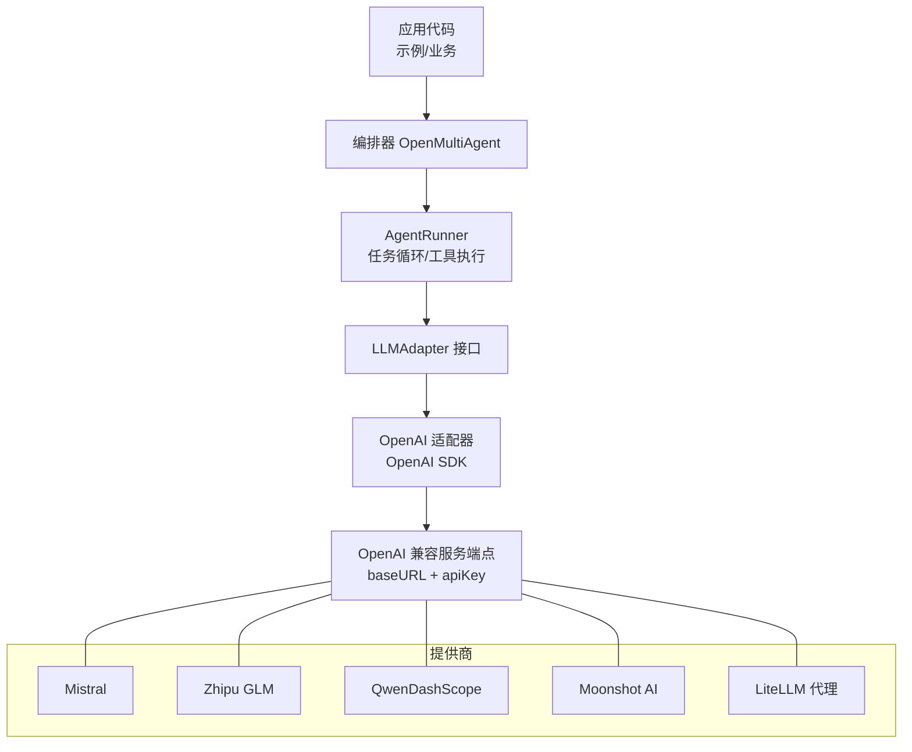
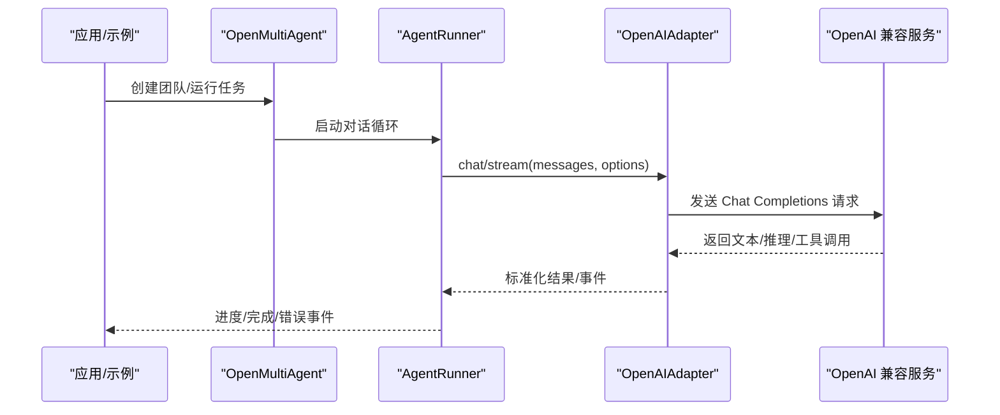
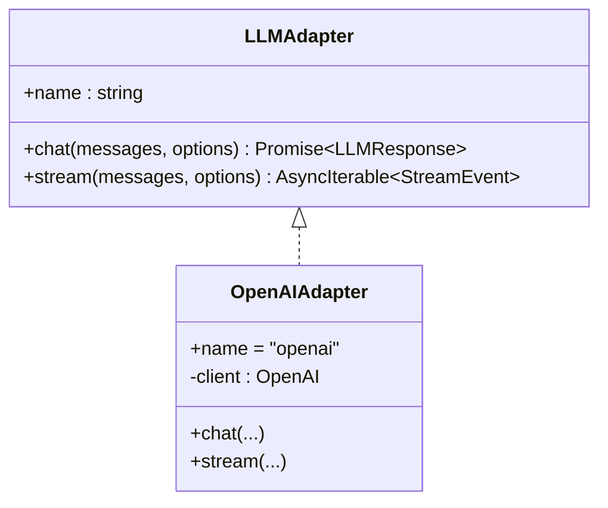
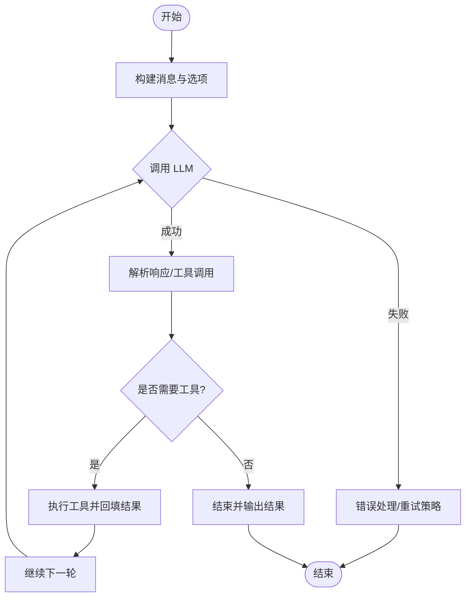

# OpenAI 兼容提供商

<cite>
**本文引用的文件**
- [README.md](file://README.md)
- [providers.md](file://docs/providers.md)
- [types.ts](file://packages/core/src/types.ts)
- [openai.ts](file://packages/core/src/llm/openai.ts)
- [runner.ts](file://packages/core/src/agent/runner.ts)
- [mistral.ts](file://packages/core/examples/providers/mistral.ts)
- [zhipu.ts](file://packages/core/examples/providers/zhipu.ts)
- [qwen.ts](file://packages/core/examples/providers/qwen.ts)
- [moonshot.ts](file://packages/core/examples/providers/moonshot.ts)
</cite>

## 目录
1. [简介](#简介)
2. [项目结构](#项目结构)
3. [核心组件](#核心组件)
4. [架构总览](#架构总览)
5. [详细组件分析](#详细组件分析)
6. [依赖关系分析](#依赖关系分析)
7. [性能与可靠性](#性能与可靠性)
8. [故障排查指南](#故障排查指南)
9. [结论](#结论)
10. [附录：各提供商配置速查](#附录各提供商配置速查)

## 简介
本文件面向需要在 Node.js 环境中接入多种“OpenAI 兼容”大模型服务的团队，系统说明如何使用 provider: 'openai' 配合自定义 baseURL 连接 OpenRouter、Groq、Mistral、Zhipu GLM、Qwen（DashScope）、Moonshot AI 以及 LiteLLM 代理。文档同时覆盖统一配置模式、环境变量管理、API 密钥与端点配置方法，并提供错误处理与重试机制的实践建议。所有示例均基于仓库内提供的示例脚本与类型定义，确保与实际实现一致。

## 项目结构
本项目采用多包结构，核心能力集中在 packages/core 中，提供统一的 LLM 适配器抽象与编排运行时；docs 提供提供商与使用指南；examples 下包含针对各提供商的完整可运行示例。

图表来源
- [openai.ts:97-102](file://packages/core/src/llm/openai.ts#L97-L102)
- [runner.ts:877-903](file://packages/core/src/agent/runner.ts#L877-L903)
- [types.ts:933-963](file://packages/core/src/types.ts#L933-L963)

章节来源
- [README.md:46-97](file://README.md#L46-L97)
- [providers.md:44-63](file://docs/providers.md#L44-L63)

## 核心组件
- LLMAdapter 抽象：所有后端必须实现的统一接口，包含 chat 与 stream 两种调用方式，屏蔽不同提供商差异。
- OpenAI 适配器：基于 openai SDK，将内部消息格式转换为 Chat Completions 协议，支持流式与非流式调用，并处理 reasoning/tool_use 等扩展字段。
- AgentRunner：驱动完整的对话循环，负责消息组装、工具调用、预算控制、超时与中止信号、事件上报等。
- 类型与配置：AgentConfig/OrchestratorConfig 等集中声明了 provider、model、apiKey、baseURL、region、thinking、extraBody、parallelToolCalls 等关键选项。

章节来源
- [types.ts:2930-2945](file://packages/core/src/types.ts#L2930-L2945)
- [openai.ts:76-102](file://packages/core/src/llm/openai.ts#L76-L102)
- [runner.ts:877-903](file://packages/core/src/agent/runner.ts#L877-L903)
- [types.ts:933-963](file://packages/core/src/types.ts#L933-L963)

## 架构总览
下图展示了从应用到具体提供商的调用链路，强调通过 provider: 'openai' + baseURL 的统一接入方式。

图表来源
- [openai.ts:164-198](file://packages/core/src/llm/openai.ts#L164-L198)
- [openai.ts:214-391](file://packages/core/src/llm/openai.ts#L214-L391)
- [runner.ts:877-903](file://packages/core/src/agent/runner.ts#L877-L903)

## 详细组件分析

### OpenAI 适配器（统一接入层）
- 职责：将框架内部消息与工具调用映射为 Chat Completions 协议；处理 reasoning 内容、工具参数拼装与修复；支持流式增量事件。
- 关键点：
  - API Key 解析优先级：构造参数 > OPENAI_API_KEY。
  - baseURL 透传至底层 SDK，用于指向任意 OpenAI 兼容端点。
  - extraBody 允许注入采样参数或厂商特定字段。
  - parallelToolCalls 控制是否并发工具调用，部分本地服务需关闭。

图表来源
- [types.ts:2930-2945](file://packages/core/src/types.ts#L2930-L2945)
- [openai.ts:76-102](file://packages/core/src/llm/openai.ts#L76-L102)

章节来源
- [openai.ts:164-198](file://packages/core/src/llm/openai.ts#L164-L198)
- [openai.ts:214-391](file://packages/core/src/llm/openai.ts#L214-L391)
- [types.ts:933-963](file://packages/core/src/types.ts#L933-L963)

### 编排与对话循环（AgentRunner）
- 职责：组织消息、调用 LLM、执行工具、统计用量、处理中止/超时、持久化检查点、发出事件。
- 关键行为：
  - 支持 resumeState 恢复中断的运行。
  - 对工具调用进行排队与结果回填，支持审批与挂起。
  - 在流式模式下聚合文本、推理与工具调用，最终产出 done 事件。

图表来源
- [runner.ts:877-903](file://packages/core/src/agent/runner.ts#L877-L903)
- [runner.ts:1294-1326](file://packages/core/src/agent/runner.ts#L1294-L1326)

章节来源
- [runner.ts:877-903](file://packages/core/src/agent/runner.ts#L877-L903)
- [runner.ts:1294-1326](file://packages/core/src/agent/runner.ts#L1294-L1326)

### 统一配置与环境变量
- 统一入口：provider: 'openai' + baseURL + apiKey（可选），即可对接任意 OpenAI 兼容服务。
- 环境变量：
  - 默认回退：OPENAI_API_KEY（当未显式传入 apiKey 时）。
  - 其他提供商专用键：如 MISTRAL_API_KEY、ZHIPU_API_KEY、DASHSCOPE_API_KEY、MOONSHOT_API_KEY、GROQ_API_KEY、OPENROUTER_API_KEY、LITELLM_API_KEY（若代理启用鉴权）。
- 高级选项：
  - thinking.effort/budgetTokens：跨提供商推理能力映射。
  - extraBody：透传额外字段（如 local server 的 topK/minP/repetition_penalty 等）。
  - parallelToolCalls：控制并发工具调用。
  - preserveReasoningAsText：将推理内容以文本形式保留并在必要时回退。

章节来源
- [providers.md:44-63](file://docs/providers.md#L44-L63)
- [providers.md:136-155](file://docs/providers.md#L136-L155)
- [types.ts:933-963](file://packages/core/src/types.ts#L933-L963)
- [types.ts:1041-1067](file://packages/core/src/types.ts#L1041-L1067)
- [types.ts:1142-1159](file://packages/core/src/types.ts#L1142-L1159)

### 各提供商接入要点与示例路径
以下提供商均可通过 provider: 'openai' + baseURL 接入，示例脚本展示了完整的团队编排与运行流程。

- Mistral
  - baseURL: https://api.mistral.ai/v1
  - 环境变量: MISTRAL_API_KEY
  - 示例路径: [mistral.ts](file://packages/core/examples/providers/mistral.ts)

- Zhipu GLM
  - baseURL: https://open.bigmodel.cn/api/paas/v4
  - 环境变量: ZHIPU_API_KEY
  - 示例路径: [zhipu.ts](file://packages/core/examples/providers/zhipu.ts)

- Qwen（DashScope）
  - baseURL: https://dashscope.aliyuncs.com/compatible-mode/v1
  - 环境变量: DASHSCOPE_API_KEY
  - 示例路径: [qwen.ts](file://packages/core/examples/providers/qwen.ts)

- Moonshot AI（Kimi）
  - baseURL: https://api.moonshot.ai/v1
  - 环境变量: MOONSHOT_API_KEY
  - 示例路径: [moonshot.ts](file://packages/core/examples/providers/moonshot.ts)

- OpenRouter / Groq / LiteLLM
  - 参考文档表中的 baseURL 与对应环境变量，按相同模式配置 provider: 'openai'。
  - 文档参考: [providers.md:44-63](file://docs/providers.md#L44-L63)

章节来源
- [providers.md:44-63](file://docs/providers.md#L44-L63)
- [mistral.ts:31-46](file://packages/core/examples/providers/mistral.ts#L31-L46)
- [zhipu.ts:27-42](file://packages/core/examples/providers/zhipu.ts#L27-L42)
- [qwen.ts:28-43](file://packages/core/examples/providers/qwen.ts#L28-L43)
- [moonshot.ts:28-43](file://packages/core/examples/providers/moonshot.ts#L28-L43)

### 错误处理与重试机制
- 适配器层：非 2xx 响应会抛出异常；流式调用会在 error 事件中返回错误。
- 编排层：
  - 支持 abortSignal 取消与超时控制（callTimeoutMs）。
  - 支持任务级 maxRetries、retryDelayMs、retryBackoff 的重试策略。
  - 支持 ModelRouteConfig.fallback 在可重试错误时切换到备用路由（含不同 provider/baseURL/apiKey/region）。
- 实践建议：
  - 对网络抖动/限流类错误开启指数退避重试。
  - 对上下文超限/模型不支持的工具调用等不可重试错误直接失败并记录。
  - 结合 onProgress/onWarning 收集诊断信息。

章节来源
- [openai.ts:164-198](file://packages/core/src/llm/openai.ts#L164-L198)
- [openai.ts:214-391](file://packages/core/src/llm/openai.ts#L214-L391)
- [types.ts:2082-2088](file://packages/core/src/types.ts#L2082-L2088)
- [types.ts:1312-1331](file://packages/core/src/types.ts#L1312-L1331)
- [runner.ts:877-903](file://packages/core/src/agent/runner.ts#L877-L903)

## 依赖关系分析
- 适配器依赖：OpenAIAdapter 依赖 openai SDK，并通过 baseURL 指向任意兼容端点。
- 编排依赖：AgentRunner 依赖 LLMAdapter 抽象，不感知具体提供商。
- 配置依赖：AgentConfig/OrchestratorConfig 集中声明 provider/model/baseUrl/apiKey 等，便于统一管理与路由。

图表来源
- [types.ts:933-963](file://packages/core/src/types.ts#L933-L963)
- [openai.ts:97-102](file://packages/core/src/llm/openai.ts#L97-L102)
- [runner.ts:877-903](file://packages/core/src/agent/runner.ts#L877-L903)

章节来源
- [types.ts:933-963](file://packages/core/src/types.ts#L933-L963)
- [openai.ts:97-102](file://packages/core/src/llm/openai.ts#L97-L102)
- [runner.ts:877-903](file://packages/core/src/agent/runner.ts#L877-L903)

## 性能与可靠性
- 流式处理：OpenAIAdapter.stream 增量推送文本、推理与工具调用，降低首字延迟。
- 并发控制：parallelToolCalls 可按服务端能力调整并发工具调用，避免本地服务截断或畸形响应。
- 采样与推理：topK/topP/minP/frequencyPenalty/presencePenality/thinking.effort 等参数可精细调优。
- 预算与治理：maxTokenBudget/maxCostBudget 与 estimateCost 配合，保障成本可控。
- 恢复与观测：checkpoint 与事件上报支持中断恢复与离线回放。

章节来源
- [openai.ts:214-391](file://packages/core/src/llm/openai.ts#L214-L391)
- [types.ts:1041-1067](file://packages/core/src/types.ts#L1041-L1067)
- [providers.md:70-109](file://docs/providers.md#L70-L109)

## 故障排查指南
- 无法调用工具：确认模型在服务端支持 tool calling；本地模型可通过 text-tool-extractor 从文本中提取工具调用。
- 代理/网络问题：设置 no_proxy 绕过本地代理；检查 baseURL 可达性。
- 认证失败：确认 apiKey 与对应环境变量已正确设置；对于非 OPENAI_API_KEY 的服务，务必显式传入 apiKey。
- 流式异常：关注 stream 的 error 事件；必要时降级为非流式调用以获取更明确的错误信息。
- 重复/死循环：利用 loop detection 与警告提示，调整 temperature/topP 或增加工具约束。

章节来源
- [providers.md:157-186](file://docs/providers.md#L157-L186)
- [openai.ts:358-369](file://packages/core/src/llm/openai.ts#L358-L369)
- [runner.ts:1294-1326](file://packages/core/src/agent/runner.ts#L1294-L1326)

## 结论
通过 provider: 'openai' 与 baseURL 的统一抽象，OMA 可将多种 OpenAI 兼容提供商无缝接入同一套编排与工具体系。借助类型化的配置、流式适配、预算治理与可恢复的执行循环，团队可以在生产环境中稳定地混合使用多家模型与服务，并以一致的接口进行开发与运维。

## 附录：各提供商配置速查
- OpenRouter
  - baseURL: https://openrouter.ai/api/v1
  - 环境变量: OPENROUTER_API_KEY
  - 参考: [providers.md:44-63](file://docs/providers.md#L44-L63)

- Groq
  - baseURL: https://api.groq.com/openai/v1
  - 环境变量: GROQ_API_KEY
  - 参考: [providers.md:44-63](file://docs/providers.md#L44-L63)

- Mistral
  - baseURL: https://api.mistral.ai/v1
  - 环境变量: MISTRAL_API_KEY
  - 示例: [mistral.ts](file://packages/core/examples/providers/mistral.ts)

- Zhipu GLM
  - baseURL: https://open.bigmodel.cn/api/paas/v4
  - 环境变量: ZHIPU_API_KEY
  - 示例: [zhipu.ts](file://packages/core/examples/providers/zhipu.ts)

- Qwen（DashScope）
  - baseURL: https://dashscope.aliyuncs.com/compatible-mode/v1
  - 环境变量: DASHSCOPE_API_KEY
  - 示例: [qwen.ts](file://packages/core/examples/providers/qwen.ts)

- Moonshot AI（Kimi）
  - baseURL: https://api.moonshot.ai/v1
  - 环境变量: MOONSHOT_API_KEY
  - 示例: [moonshot.ts](file://packages/core/examples/providers/moonshot.ts)

- LiteLLM 代理
  - baseURL: http://localhost:4000/v1（示例）
  - 环境变量: LITELLM_API_KEY（若代理启用鉴权）
  - 参考: [providers.md:44-63](file://docs/providers.md#L44-L63)

章节来源
- [providers.md:44-63](file://docs/providers.md#L44-L63)
- [mistral.ts:31-46](file://packages/core/examples/providers/mistral.ts#L31-L46)
- [zhipu.ts:27-42](file://packages/core/examples/providers/zhipu.ts#L27-L42)
- [qwen.ts:28-43](file://packages/core/examples/providers/qwen.ts#L28-L43)
- [moonshot.ts:28-43](file://packages/core/examples/providers/moonshot.ts#L28-L43)