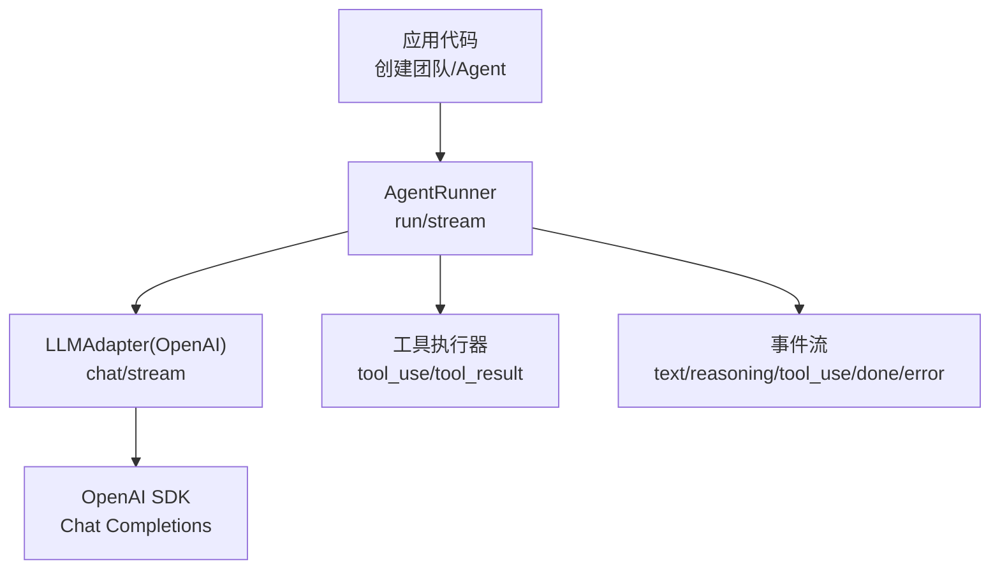
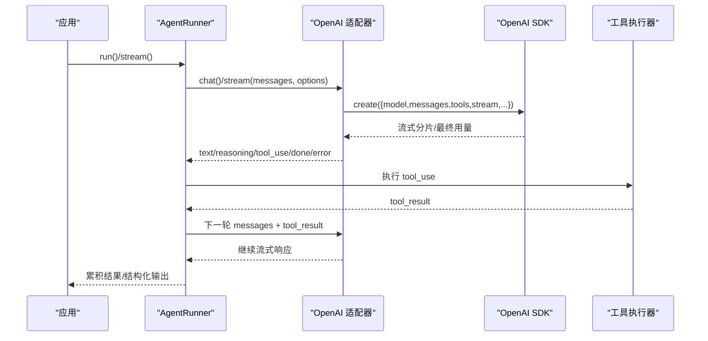
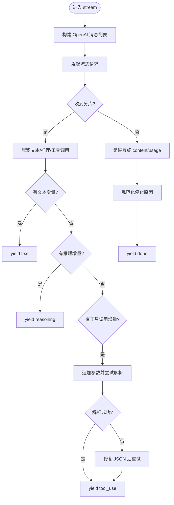
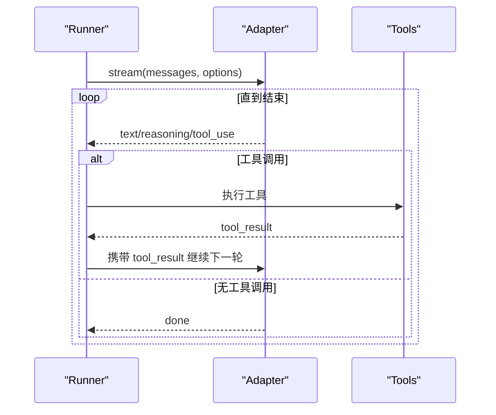
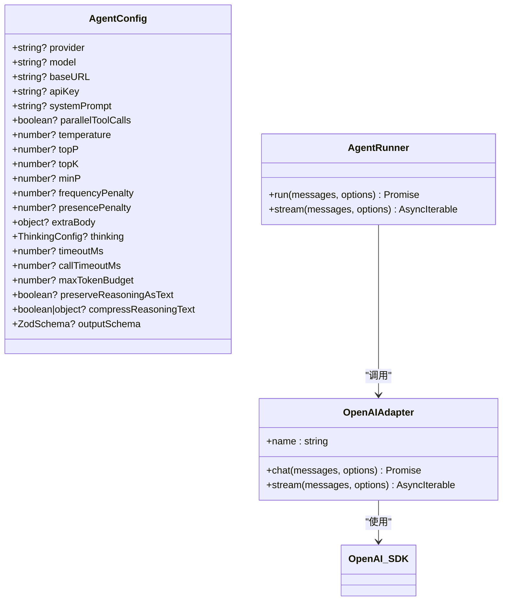

# OpenAI 集成

<cite>
**本文引用的文件**
- [README.md](file://README.md)
- [providers.md](file://docs/providers.md)
- [openai.ts](file://packages/core/src/llm/openai.ts)
- [runner.ts](file://packages/core/src/agent/runner.ts)
- [types.ts](file://packages/core/src/types.ts)
</cite>

## 目录
1. [简介](#简介)
2. [项目结构](#项目结构)
3. [核心组件](#核心组件)
4. [架构总览](#架构总览)
5. [详细组件分析](#详细组件分析)
6. [依赖关系分析](#依赖关系分析)
7. [性能与速率限制](#性能与速率限制)
8. [故障排查指南](#故障排查指南)
9. [结论](#结论)
10. [附录：配置清单与迁移要点](#附录：配置清单与迁移要点)

## 简介
本章节面向希望在 Open Multi-Agent（OMA）中集成 OpenAI 模型（如 GPT-4、GPT-3.5-turbo 等）的开发者，说明如何设置环境变量、自定义基础 URL、管理 API 版本、处理速率限制，以及在 AgentConfig 中完成系统提示词、工具调用和流式响应的完整配置。同时给出与 Azure OpenAI 的区别与迁移建议。

## 项目结构
- OMA 通过内置的 OpenAI 适配器对接 OpenAI Chat Completions 协议，支持流式与非流式调用、工具调用、推理内容透传与压缩等能力。
- 文档与类型定义集中在 core 包中，OpenAI 适配器的实现位于 llm 子模块；Agent 运行器负责编排对话轮次、工具执行与事件流。

图表来源
- [runner.ts:837-864](file://packages/core/src/agent/runner.ts#L837-L864)
- [runner.ts:877-1204](file://packages/core/src/agent/runner.ts#L877-L1204)
- [openai.ts:214-390](file://packages/core/src/llm/openai.ts#L214-L390)

章节来源
- [README.md:46-97](file://README.md#L46-L97)
- [providers.md:1-68](file://docs/providers.md#L1-L68)

## 核心组件
- OpenAI 适配器：封装 OpenAI SDK，负责消息转换、流式事件拼装、工具调用解析、用量统计与错误事件输出。
- AgentRunner：驱动多轮对话，协调工具调用、文本与推理内容流、预算控制与循环检测。
- AgentConfig：声明 provider、model、baseURL、apiKey、systemPrompt、tools、thinking、采样参数、超时与额外请求体等。

章节来源
- [openai.ts:1-102](file://packages/core/src/llm/openai.ts#L1-L102)
- [runner.ts:81-141](file://packages/core/src/agent/runner.ts#L81-L141)
- [types.ts:900-1209](file://packages/core/src/types.ts#L900-L1209)

## 架构总览
下图展示了从应用到模型的端到端流程，包括流式事件与工具调用的交互。

图表来源
- [runner.ts:837-864](file://packages/core/src/agent/runner.ts#L837-L864)
- [runner.ts:877-1204](file://packages/core/src/agent/runner.ts#L877-L1204)
- [openai.ts:214-390](file://packages/core/src/llm/openai.ts#L214-L390)

## 详细组件分析

### OpenAI 适配器（OpenAIAdapter）
- 职责
  - 将框架内部消息转换为 OpenAI Chat Completions 请求格式。
  - 支持非流式 chat 与流式 stream 两种模式。
  - 在流式中聚合文本、推理内容与工具调用，并在 done 事件中返回完整 content 与用量。
  - 当服务端未原生返回 tool_calls 时，尝试从文本中抽取工具调用。
- 关键行为
  - API Key 优先级：构造参数 > OPENAI_API_KEY 环境变量。
  - baseURL 可自定义，便于接入兼容端点或代理。
  - 流式选项 include_usage 用于在最后一个分片中获取用量。
  - 工具调用在流中按索引拼接 JSON 参数，失败时进行修复重试。
  - 停止原因规范化，若存在工具调用且 finishReason 为 stop，则标记为 tool_use。

图表来源
- [openai.ts:214-390](file://packages/core/src/llm/openai.ts#L214-L390)

章节来源
- [openai.ts:1-102](file://packages/core/src/llm/openai.ts#L1-L102)
- [openai.ts:189-390](file://packages/core/src/llm/openai.ts#L189-L390)

### AgentRunner（对话与工具编排）
- 职责
  - 维护对话历史，组织每轮 LLM 调用。
  - 解析模型返回的工具调用并执行工具，再将结果回写至消息。
  - 暴露 run（聚合）与 stream（增量事件）两种接口。
  - 支持循环检测、预算控制、上下文压缩、思考内容保留与压缩等。
- 流式事件
  - text：文本增量
  - reasoning：推理增量（如启用）
  - tool_use：模型请求工具调用
  - tool_result：工具执行结果
  - budget_exceeded：预算耗尽
  - done：最终结果
  - error：不可恢复错误

图表来源
- [runner.ts:837-864](file://packages/core/src/agent/runner.ts#L837-L864)
- [runner.ts:877-1204](file://packages/core/src/agent/runner.ts#L877-L1204)

章节来源
- [runner.ts:81-141](file://packages/core/src/agent/runner.ts#L81-L141)
- [runner.ts:837-1204](file://packages/core/src/agent/runner.ts#L837-L1204)

### AgentConfig（OpenAI 相关字段）
- 提供商与凭据
  - provider: 'openai'
  - apiKey: 可选覆盖，默认读取 OPENAI_API_KEY
  - baseURL: 自定义基础 URL（例如本地兼容服务或代理）
- 模型与提示词
  - model: 如 gpt-4o、gpt-4、gpt-3.5-turbo 等
  - systemPrompt: 系统提示词
- 工具调用
  - tools: 工具白名单
  - parallelToolCalls: 是否允许单次并行工具调用（OpenAI 云默认 true）
  - extraBody: 透传额外请求体（如 sampling 参数）
- 推理/思考
  - thinking.enabled / effort / budgetTokens（不同提供商映射不同）
  - preserveReasoningAsText / compressReasoningText（跨提供商或回放场景）
- 采样与稳定性
  - temperature、topP、topK、minP、frequencyPenalty、presencePenalty
- 超时与预算
  - timeoutMs（整轮）、callTimeoutMs（单次 LLM 调用）
  - maxTokenBudget（累计 token 上限）
- 其他
  - outputSchema（结构化输出校验）
  - beforeRun/afterRun（生命周期钩子）

章节来源
- [types.ts:900-1209](file://packages/core/src/types.ts#L900-L1209)
- [providers.md:20-68](file://docs/providers.md#L20-L68)

## 依赖关系分析
- OpenAI 适配器依赖 openai SDK，并通过构造函数注入 apiKey 与 baseURL。
- AgentRunner 依赖 LLMAdapter 抽象，统一了不同提供商的调用方式。
- AgentConfig 提供统一的配置入口，屏蔽底层差异。

图表来源
- [types.ts:900-1209](file://packages/core/src/types.ts#L900-L1209)
- [runner.ts:837-864](file://packages/core/src/agent/runner.ts#L837-L864)
- [openai.ts:95-102](file://packages/core/src/llm/openai.ts#L95-L102)

章节来源
- [types.ts:900-1209](file://packages/core/src/types.ts#L900-L1209)
- [openai.ts:95-102](file://packages/core/src/llm/openai.ts#L95-L102)

## 性能与速率限制
- 流式响应
  - 适配器在流中逐步产出 text、reasoning 与 tool_use 事件，降低首字延迟。
  - 用量统计在最后一个分片中汇总，避免重复计算。
- 并行工具调用
  - 通过 parallelToolCalls 控制是否允许一次并发多个工具调用；某些本地服务器需要关闭以避免流式分片截断问题。
- 超时与预算
  - 使用 timeoutMs 控制整轮耗时，callTimeoutMs 控制单次 LLM 调用耗时。
  - 使用 maxTokenBudget 控制累计 token 消耗，防止无限增长。
- 速率限制与重试
  - 框架层未内置通用重试策略；建议在应用层对可重试错误（如 429）实施指数退避重试。
  - 可通过 ModelRouteConfig 的 fallback 链在不同路由间切换以规避限流或故障。
- 本地模型
  - 对于本地推理较慢的场景，适当增大 callTimeoutMs 与 timeoutMs，并调整采样参数（topK/minP/frequencyPenalty/presencePenalty）以减少重复与幻觉。

章节来源
- [openai.ts:214-390](file://packages/core/src/llm/openai.ts#L214-L390)
- [types.ts:1045-1067](file://packages/core/src/types.ts#L1045-L1067)
- [providers.md:157-186](file://docs/providers.md#L157-L186)

## 故障排查指南
- 无法调用工具
  - 确认模型具备工具调用能力；本地模型需选择支持 tool-calling 的版本。
  - 检查 parallelToolCalls 设置，部分本地服务器需设为 false。
- 流式工具调用参数解析失败
  - 适配器会尝试修复 JSON；若仍失败，检查下游工具输入格式与 schema。
- 文本被误识别为工具调用
  - 确保 tools 列表与实际工具名一致；必要时关闭文本抽取逻辑（保持默认即可）。
- 预算耗尽
  - 关注 budget_exceeded 事件；调整 maxTokenBudget 或优化上下文压缩策略。
- 循环检测触发
  - 调整 loopDetection 参数，或在 onLoopDetected 中注入提示以打破死循环。

章节来源
- [runner.ts:1294-1326](file://packages/core/src/agent/runner.ts#L1294-L1326)
- [openai.ts:360-390](file://packages/core/src/llm/openai.ts#L360-L390)
- [providers.md:181-186](file://docs/providers.md#L181-L186)

## 结论
OMA 通过统一的 AgentConfig 与 LLMAdapter 抽象，使 OpenAI 模型集成简洁可靠。借助流式响应、工具调用、推理内容管理与预算控制，可在生产环境中稳定运行复杂的多智能体工作流。结合 providers 文档中的 OpenAI 兼容端点与路由机制，可灵活扩展至多种后端。

## 附录：配置清单与迁移要点

### 环境变量与基础配置
- 必需
  - OPENAI_API_KEY：OpenAI 密钥（也可通过 AgentConfig.apiKey 覆盖）
- 可选
  - baseURL：自定义基础 URL（例如代理或兼容端点）
  - model：如 gpt-4o、gpt-4、gpt-3.5-turbo 等
  - systemPrompt：系统提示词
  - tools：工具白名单
  - parallelToolCalls：是否允许并行工具调用
  - thinking：推理/思考开关与强度
  - timeoutMs / callTimeoutMs：超时控制
  - maxTokenBudget：累计 token 上限

章节来源
- [openai.ts:95-102](file://packages/core/src/llm/openai.ts#L95-L102)
- [types.ts:953-964](file://packages/core/src/types.ts#L953-L964)
- [providers.md:20-68](file://docs/providers.md#L20-L68)

### 在 AgentConfig 中配置 OpenAI 提供商（示例路径）
- 参考以下路径了解如何在 AgentConfig 中设置 provider、model、baseURL、apiKey、systemPrompt、tools、thinking、采样参数与超时等：
  - [AgentConfig 字段定义:900-1209](file://packages/core/src/types.ts#L900-L1209)
  - [OpenAI 适配器构造与流式实现:95-102](file://packages/core/src/llm/openai.ts#L95-L102)
  - [Runner 流式事件与工具执行:837-1204](file://packages/core/src/agent/runner.ts#L837-L1204)

### 流式响应处理（示例路径）
- 适配器流式事件序列与工具调用拼装：
  - [流式实现与事件产出:214-390](file://packages/core/src/llm/openai.ts#L214-L390)
- Runner 侧消费事件并执化工具：
  - [Runner 流式循环与工具执行:877-1204](file://packages/core/src/agent/runner.ts#L877-L1204)

### 与 Azure OpenAI 的区别与迁移
- 区别
  - Azure OpenAI 使用独立 provider 名称与专用环境变量（如 AZURE_OPENAI_API_KEY、AZURE_OPENAI_ENDPOINT），并可配置 AZURE_OPENAI_API_VERSION 与 AZURE_OPENAI_DEPLOYMENT。
  - OpenAI 原生使用 provider 'openai' 与 OPENAI_API_KEY。
- 迁移要点
  - 将 provider 切换为 'azure-openai'，并配置对应环境变量与部署名。
  - 若仅更换 endpoint，可使用 OpenAI 兼容模式并通过 baseURL 指向 Azure 兼容端点（注意鉴权与版本参数）。
  - 验证工具调用与流式行为在目标端点的兼容性。

章节来源
- [providers.md:20-68](file://docs/providers.md#L20-L68)