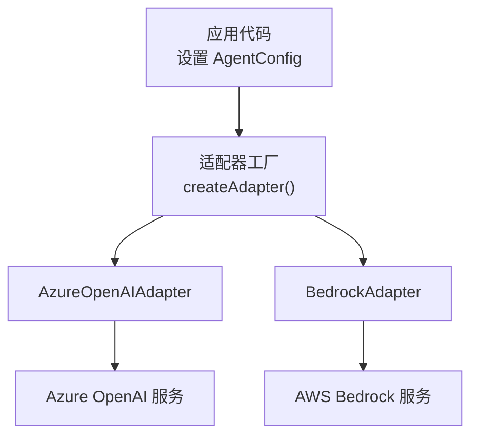
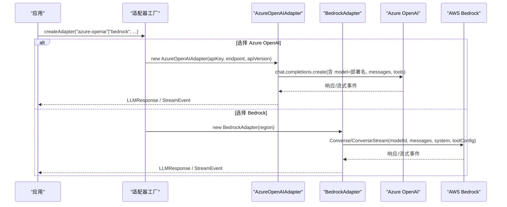
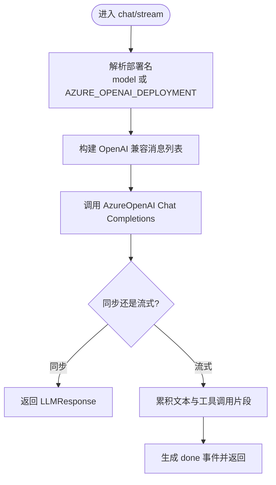
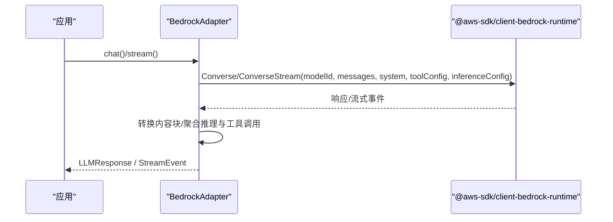
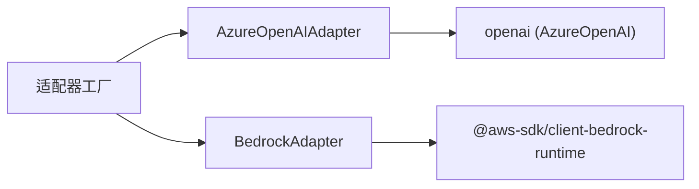

# 企业级云提供商集成

<cite>
**本文引用的文件**
- [providers.md](file://docs/providers.md)
- [adapter.ts](file://packages/core/src/llm/adapter.ts)
- [azure-openai.ts](file://packages/core/src/llm/azure-openai.ts)
- [bedrock.ts](file://packages/core/src/llm/bedrock.ts)
- [types.ts](file://packages/core/src/types.ts)
</cite>

## 目录
1. [简介](#简介)
2. [项目结构](#项目结构)
3. [核心组件](#核心组件)
4. [架构总览](#架构总览)
5. [详细组件分析](#详细组件分析)
6. [依赖关系分析](#依赖关系分析)
7. [性能与成本考量](#性能与成本考量)
8. [故障排查指南](#故障排查指南)
9. [结论](#结论)
10. [附录](#附录)

## 简介
本文件面向企业级部署，聚焦 Azure OpenAI 与 AWS Bedrock 的集成方案。内容涵盖：
- Azure OpenAI 的环境变量配置与端点、版本、部署名管理
- AWS Bedrock 的无密钥认证（基于 AWS SDK 凭证链）与区域选择
- 多模型支持（Anthropic Claude、Llama、Mistral 等）
- 企业最佳实践：区域策略、IAM 角色、预算与成本优化

## 项目结构
本项目通过统一的 LLM 适配器抽象，将不同云厂商的模型接入到一致的调用接口中。关键路径：
- 提供者工厂：根据 provider 名称动态加载具体适配器
- Azure OpenAI 适配器：封装 Azure 专属端点、API 版本与部署名
- Bedrock 适配器：基于 Converse/ConverseStream API，统一多模型族
- 类型定义：AgentConfig 暴露 region、provider、apiKey、baseURL 等字段，用于运行时配置

**图表来源**
- [adapter.ts:76-140](file://packages/core/src/llm/adapter.ts#L76-L140)
- [azure-openai.ts:93-115](file://packages/core/src/llm/azure-openai.ts#L93-L115)
- [bedrock.ts:323-335](file://packages/core/src/llm/bedrock.ts#L323-L335)

**章节来源**
- [adapter.ts:76-140](file://packages/core/src/llm/adapter.ts#L76-L140)
- [types.ts:953-963](file://packages/core/src/types.ts#L953-L963)

## 核心组件
- 提供者工厂 createAdapter：集中注册支持的 provider，并负责按需懒加载实现；对 bedrock 忽略 baseURL，使用 region 参数或环境变量
- AzureOpenAIAdapter：使用 AzureOpenAI SDK，自动读取 AZURE_OPENAI_API_KEY、AZURE_OPENAI_ENDPOINT、AZURE_OPENAI_API_VERSION，并在 model 为空时回退到 AZURE_OPENAI_DEPLOYMENT
- BedrockAdapter：使用 @aws-sdk/client-bedrock-runtime，通过 SDK 默认凭证链获取鉴权，region 优先级为构造参数 > AWS_REGION > us-east-1

**章节来源**
- [adapter.ts:76-140](file://packages/core/src/llm/adapter.ts#L76-L140)
- [azure-openai.ts:17-27](file://packages/core/src/llm/azure-openai.ts#L17-L27)
- [bedrock.ts:8-15](file://packages/core/src/llm/bedrock.ts#L8-L15)

## 架构总览
下图展示从应用配置到云服务的端到端调用流程，包括 Azure OpenAI 与 Bedrock 两条路径。

**图表来源**
- [adapter.ts:130-139](file://packages/core/src/llm/adapter.ts#L130-L139)
- [azure-openai.ts:128-159](file://packages/core/src/llm/azure-openai.ts#L128-L159)
- [bedrock.ts:341-379](file://packages/core/src/llm/bedrock.ts#L341-L379)

## 详细组件分析

### Azure OpenAI 适配器
- 环境变量解析顺序：
  - apiKey：构造参数 > AZURE_OPENAI_API_KEY
  - endpoint：构造参数 > AZURE_OPENAI_ENDPOINT
  - apiVersion：构造参数 > AZURE_OPENAI_API_VERSION > 默认值
  - deployment：agent.model 优先；若为空则回退 AZURE_OPENAI_DEPLOYMENT
- 请求构建：
  - 使用 AzureOpenAI SDK 的 chat.completions
  - 将框架消息转换为 OpenAI 兼容格式，工具定义映射为 function/tool_calls
  - 支持并行工具调用、推理努力（reasoning_effort）、extraBody 透传
- 流式处理：
  - 使用 stream_options.include_usage 在末尾获取用量
  - 累积文本与工具调用片段，最终组装为统一 LLMResponse

**图表来源**
- [azure-openai.ts:74-86](file://packages/core/src/llm/azure-openai.ts#L74-L86)
- [azure-openai.ts:128-159](file://packages/core/src/llm/azure-openai.ts#L128-L159)
- [azure-openai.ts:175-333](file://packages/core/src/llm/azure-openai.ts#L175-L333)

**章节来源**
- [azure-openai.ts:17-27](file://packages/core/src/llm/azure-openai.ts#L17-L27)
- [azure-openai.ts:93-115](file://packages/core/src/llm/azure-openai.ts#L93-L115)
- [azure-openai.ts:128-159](file://packages/core/src/llm/azure-openai.ts#L128-L159)
- [azure-openai.ts:175-333](file://packages/core/src/llm/azure-openai.ts#L175-L333)

### AWS Bedrock 适配器
- 认证与区域：
  - 不使用 API Key，依赖 AWS SDK 默认凭证链（环境变量、共享配置、IAM 角色）
  - region 优先级：构造参数 > AWS_REGION > us-east-1
- 模型与协议：
  - 使用 Converse/ConverseStream 统一多模型族（Claude、Llama、Mistral、Cohere、Titan 等）
  - 通过 toolConfig 声明工具，inferenceConfig 控制 maxTokens、temperature、topP
- 消息与内容块转换：
  - 将框架 ContentBlock 转为 Bedrock 消息与内容块
  - 支持图片、文档、工具结果、推理内容（含签名与脱敏数据）的回显与传递
- 流式处理：
  - 按 contentBlockStart/delta/stop 聚合文本、工具调用与推理内容
  - 在 messageStop 与 metadata.usage 中收集停止原因与用量

**图表来源**
- [bedrock.ts:8-15](file://packages/core/src/llm/bedrock.ts#L8-L15)
- [bedrock.ts:323-335](file://packages/core/src/llm/bedrock.ts#L323-L335)
- [bedrock.ts:341-379](file://packages/core/src/llm/bedrock.ts#L341-L379)
- [bedrock.ts:386-543](file://packages/core/src/llm/bedrock.ts#L386-L543)

**章节来源**
- [bedrock.ts:8-15](file://packages/core/src/llm/bedrock.ts#L8-L15)
- [bedrock.ts:323-335](file://packages/core/src/llm/bedrock.ts#L323-L335)
- [bedrock.ts:341-379](file://packages/core/src/llm/bedrock.ts#L341-L379)
- [bedrock.ts:386-543](file://packages/core/src/llm/bedrock.ts#L386-L543)

### 提供者工厂与路由
- 支持 provider：anthropic、azure-openai、bedrock、openai、gemini、grok、minimax、mimo、deepseek、doubao、hunyuan、qiniu、copilot
- 对于 azure-openai：baseURL 作为 Azure 端点；apiVersion 通过环境变量覆盖
- 对于 bedrock：忽略 baseURL，使用 region 参数或 AWS_REGION；凭证来自 SDK 默认链

**章节来源**
- [adapter.ts:36-74](file://packages/core/src/llm/adapter.ts#L36-L74)
- [adapter.ts:76-140](file://packages/core/src/llm/adapter.ts#L76-L140)

## 依赖关系分析
- 适配器工厂与具体适配器之间为松耦合：通过字符串 provider 动态导入，避免未用依赖被加载
- Azure 适配器依赖 openai 的 AzureOpenAI 客户端；Bedrock 适配器依赖 @aws-sdk/client-bedrock-runtime
- AgentConfig 提供 region/provider/baseUrl/apiKey 等运行时开关，便于在不同环境切换

**图表来源**
- [adapter.ts:76-140](file://packages/core/src/llm/adapter.ts#L76-L140)
- [azure-openai.ts:41-65](file://packages/core/src/llm/azure-openai.ts#L41-L65)
- [bedrock.ts:28-40](file://packages/core/src/llm/bedrock.ts#L28-L40)

**章节来源**
- [adapter.ts:76-140](file://packages/core/src/llm/adapter.ts#L76-L140)

## 性能与成本考量
- 预算上限与治理：
  - 可在编排器或团队运行级别设置最大令牌数与估算成本上限；当达到有效上限时，治理结论会披露“预算不足”
  - estimateCost 在每次供应商响应后计算，检查发生在轮次/任务边界，允许一次超调
- 流式与用量：
  - Azure：通过 stream_options.include_usage 在流结束时获取用量
  - Bedrock：在 metadata.usage 中累计输入/输出令牌
- 并发与超时：
  - 可通过 callTimeoutMs 限制单次模型调用耗时，避免慢调用阻塞
  - 合理设置 topK/topP/minP 等采样参数以平衡质量与延迟

**章节来源**
- [providers.md:70-109](file://docs/providers.md#L70-L109)
- [azure-openai.ts:183-205](file://packages/core/src/llm/azure-openai.ts#L183-L205)
- [bedrock.ts:507-510](file://packages/core/src/llm/bedrock.ts#L507-L510)

## 故障排查指南
- Azure OpenAI
  - 未设置部署名：当 agent.model 为空且未设置 AZURE_OPENAI_DEPLOYMENT 时会抛出错误
  - 端点/版本不匹配：确认 AZURE_OPENAI_ENDPOINT 与 AZURE_OPENAI_API_VERSION 指向正确的资源与版本
  - 非 2xx 响应：适配器会抛出 AzureOpenAI.APIError，需捕获并处理限流、上下文过长、部署不存在等场景
- Bedrock
  - 凭证问题：确保运行环境具备有效的 AWS 凭证（环境变量、共享配置或 IAM 角色）
  - 区域问题：如模型需要跨区推理前缀（例如某些新版 Claude），需在模型 ID 中添加相应前缀
  - 工具结果媒体类型：仅支持 JPEG/PNG/GIF/WebP 图片与部分文档类型，其他类型会抛出不支持的错误
- 通用
  - 工具调用异常：若本地模型以文本形式返回工具调用，框架会自动提取；否则需检查模型能力与服务端配置
  - 代理干扰：本地模型或服务可能被代理影响，必要时设置 no_proxy

**章节来源**
- [azure-openai.ts:74-86](file://packages/core/src/llm/azure-openai.ts#L74-L86)
- [azure-openai.ts:121-127](file://packages/core/src/llm/azure-openai.ts#L121-L127)
- [bedrock.ts:101-148](file://packages/core/src/llm/bedrock.ts#L101-L148)
- [providers.md:181-186](file://docs/providers.md#L181-L186)

## 结论
- Azure OpenAI：通过 AZURE_OPENAI_API_KEY、AZURE_OPENAI_ENDPOINT、AZURE_OPENAI_API_VERSION、AZURE_OPENAI_DEPLOYMENT 完成企业级接入；适配器封装了端点、版本与部署名的差异，保持与 OpenAI 兼容的消息与工具调用语义
- AWS Bedrock：无需 API Key，使用 SDK 默认凭证链；通过 Converse/ConverseStream 统一接入多种模型族；region 可配置，支持跨区推理前缀
- 企业最佳实践：结合预算上限、流式用量统计、超时与采样参数调优，配合 IAM 最小权限原则与区域就近部署，实现稳定、可控、低成本的生产运行

## 附录

### 环境变量与配置速查
- Azure OpenAI
  - AZURE_OPENAI_API_KEY：API 密钥
  - AZURE_OPENAI_ENDPOINT：Azure 资源端点
  - AZURE_OPENAI_API_VERSION：API 版本（默认值由适配器提供）
  - AZURE_OPENAI_DEPLOYMENT：部署名（当 agent.model 为空时回退）
- AWS Bedrock
  - 无需 API Key；凭证来自 AWS SDK 默认链
  - AWS_REGION：区域（构造参数优先）
  - 模型 ID：如 anthropic.claude-3-5-haiku-20241022-v1:0；新模型可能需要跨区前缀（例如 us.）

**章节来源**
- [azure-openai.ts:17-27](file://packages/core/src/llm/azure-openai.ts#L17-L27)
- [bedrock.ts:8-15](file://packages/core/src/llm/bedrock.ts#L8-L15)
- [providers.md:26-43](file://docs/providers.md#L26-L43)