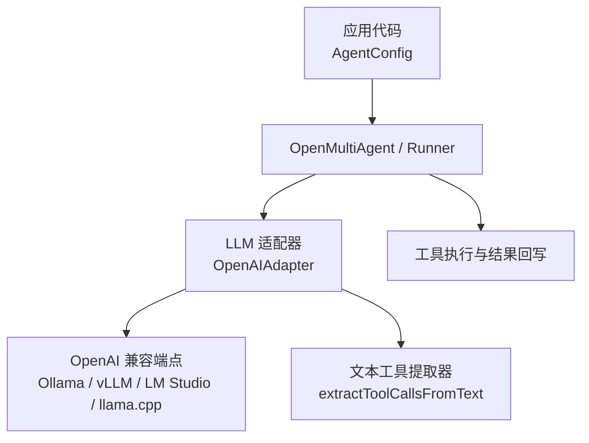

</think>

<docs>
# 本地模型集成

<cite>
**本文引用的文件**
- [README_zh.md](file://README_zh.md)
- [providers.md](file://docs/providers.md)
- [types.ts](file://packages/core/src/types.ts)
- [openai.ts](file://packages/core/src/llm/openai.ts)
- [runner.ts](file://packages/core/src/agent/runner.ts)
- [text-tool-extractor.ts](file://packages/core/src/tool/text-tool-extractor.ts)
- [local-quantized.ts](file://packages/core/examples/providers/local-quantized.ts)
- [ollama.ts](file://packages/core/examples/providers/ollama.ts)
- [gemma4-local.ts](file://packages/core/examples/providers/gemma4-local.ts)
</cite>

## 目录
1. [简介](#简介)
2. [项目结构](#项目结构)
3. [核心组件](#核心组件)
4. [架构总览](#架构总览)
5. [详细组件分析](#详细组件分析)
6. [依赖关系分析](#依赖关系分析)
7. [性能与量化优化](#性能与量化优化)
8. [故障排查指南](#故障排查指南)
9. [结论](#结论)
10. [附录：已验证本地模型清单](#附录已验证本地模型清单)

## 简介
本文件聚焦于在 Open Multi-Agent（OMA）中集成本地推理服务器，包括 Ollama、vLLM、LM Studio 和 llama.cpp。通过 OpenAI 兼容接口统一接入，配置 baseURL 与 apiKey；说明工具调用的本地实现方式，包括当本地模型以文本形式返回工具调用时的自动提取机制，以及针对慢推理场景的超时配置。同时给出量化模型的采样参数调优建议，并列出已验证的本地模型。

## 项目结构
- 文档层：providers.md 提供 Provider 与本地服务接入说明，包含 OpenAI 兼容端点表格与本地模型工具调用注意事项。
- 类型与配置层：types.ts 定义了 AgentConfig、RunnerOptions 等关键配置项，涵盖 baseURL、apiKey、topK、minP、frequencyPenalty、parallelToolCalls、timeoutMs、callTimeoutMs 等。
- LLM 适配层：openai.ts 基于 OpenAI SDK 实现适配器，支持 OpenAI 兼容端点，并在响应中处理工具调用与文本回退提取。
- 执行层：runner.ts 负责 Agent 运行循环，将采样参数、工具定义、超时等传递给适配器，并管理轮次、循环检测与上下文压缩。
- 工具回退：text-tool-extractor.ts 提供从文本输出中提取工具调用的安全网，用于本地模型未使用标准 tool_calls 格式的场景。
- 示例：local-quantized.ts、ollama.ts、gemma4-local.ts 展示了本地量化模型、Ollama 混合团队、Gemma 4 全本地运行的完整用法。



图表来源
- [types.ts:933-960](file://packages/core/src/types.ts#L933-L960)
- [openai.ts:34-79](file://packages/core/src/llm/openai.ts#L34-L79)
- [text-tool-extractor.ts:1-227](file://packages/core/src/tool/text-tool-extractor.ts#L1-L227)

章节来源
- [providers.md:44-63](file://docs/providers.md#L44-L63)
- [types.ts:933-960](file://packages/core/src/types.ts#L933-L960)
- [types.ts:1007-1118](file://packages/core/src/types.ts#L1007-L1118)
- [openai.ts:34-79](file://packages/core/src/llm/openai.ts#L34-L79)
- [text-tool-extractor.ts:1-227](file://packages/core/src/tool/text-tool-extractor.ts#L1-L227)

## 核心组件
- AgentConfig 与 RunnerOptions：集中声明模型、Provider、baseURL、apiKey、采样参数（temperature、topP、topK、minP）、惩罚（frequencyPenalty、presencePenalty）、并行工具调用（parallelToolCalls）、额外请求体（extraBody）、思考/推理配置、超时（timeoutMs、callTimeoutMs）、循环检测、工具输出长度限制、上下文压缩等。
- OpenAIAdapter：基于 OpenAI SDK 的 Chat Completions 适配器，支持 OpenAI 兼容端点，并在流式或非流式响应中处理工具调用；当服务端返回文本形式的工具调用时，会触发文本提取逻辑。
- 文本工具提取器：当本地模型未使用标准 tool_calls 格式，而是以 JSON 或特定标签（如 Hermes 的  标签
  - 代码围栏中的 JSON 对象
  - 裸 JSON 对象（name + arguments/parameters/input）
- 白名单校验：仅当 name 匹配已注册的工具名时才视为有效工具调用，避免误判任意 JSON。

```mermaid
flowchart TD
  Start(["收到模型响应"]) --> CheckTC{"是否包含 tool_calls?"}
  CheckTC -->|是| UseNative["直接使用 tool_calls"]
  CheckTC -->|否| TryExtract["调用文本工具提取器"]
  TryExtract --> ParseHermes{"是否检测到 