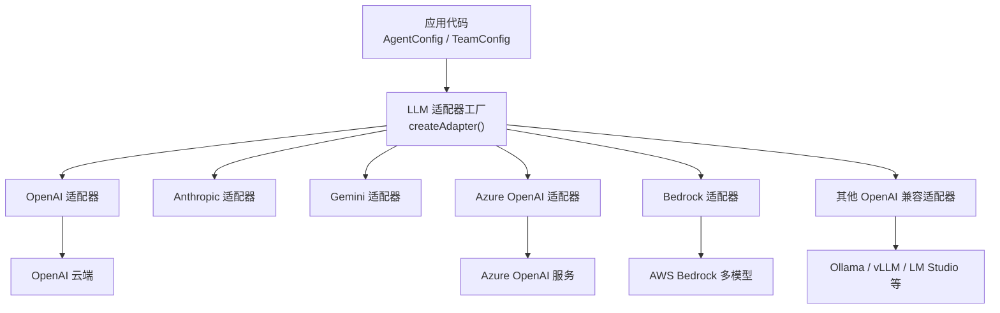
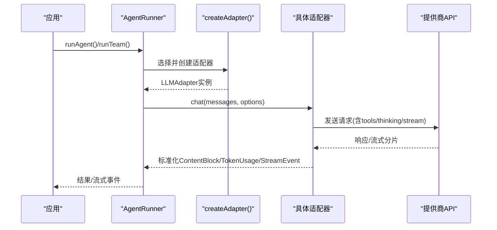
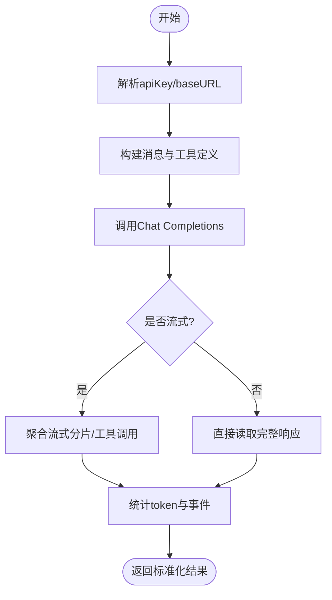
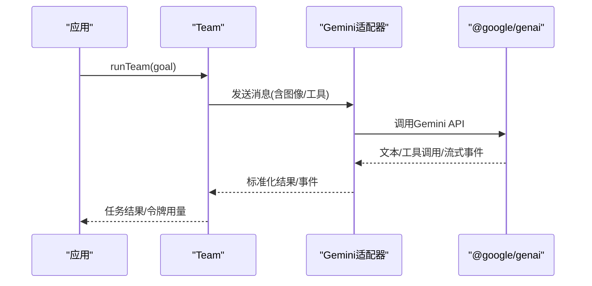
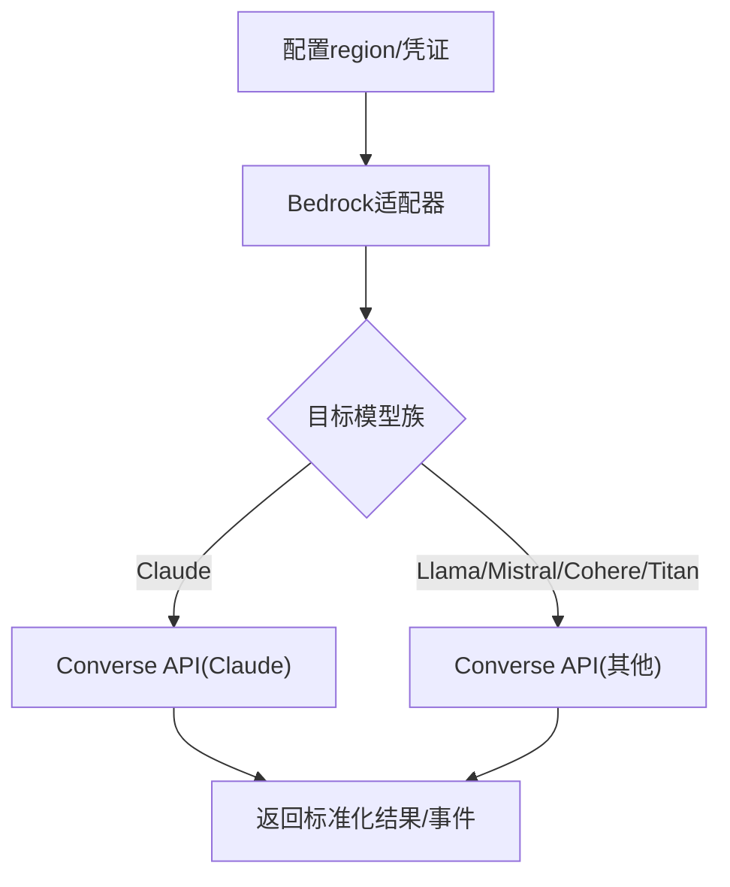
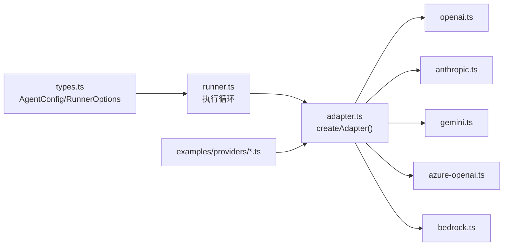

# 模型提供商集成

<cite>
**本文引用的文件**
- [README.md](file://README.md)
- [providers.md](file://docs/providers.md)
- [adapter.ts](file://packages/core/src/llm/adapter.ts)
- [openai.ts](file://packages/core/src/llm/openai.ts)
- [types.ts](file://packages/core/src/types.ts)
- [index.ts](file://packages/core/src/index.ts)
- [runner.ts](file://packages/core/src/agent/runner.ts)
- [gemini.ts](file://packages/core/examples/providers/gemini.ts)
- [bedrock.ts](file://packages/core/examples/providers/bedrock.ts)
</cite>

## 目录
1. [简介](#简介)
2. [项目结构](#项目结构)
3. [核心组件](#核心组件)
4. [架构总览](#架构总览)
5. [详细组件分析](#详细组件分析)
6. [依赖关系分析](#依赖关系分析)
7. [性能与限制](#性能与限制)
8. [故障排查指南](#故障排查指南)
9. [结论](#结论)
10. [附录：统一适配器与自定义实现指南](#附录：统一适配器与自定义实现指南)

## 简介
本文件系统性说明 Open Multi-Agent（OMA）对主流模型提供商的集成方式，覆盖 OpenAI、Anthropic Claude、Google Gemini、Azure OpenAI、AWS Bedrock，以及本地模型（Ollama、LM Studio、量化模型等）。文档同时给出统一的适配器接口与扩展新提供商的实现路径，帮助开发者在保持团队配置稳定的前提下，灵活切换或组合不同后端。

## 项目结构
- 运行时入口与类型定义集中在 core 包中，对外暴露统一的编排 API 与 LLM 适配器工厂。
- 提供商适配层位于 llm 子目录，通过 createAdapter 按 provider 名称动态加载具体实现。
- 示例位于 examples/providers，提供各提供商的可运行样例与最佳实践。
- 文档 docs/providers.md 汇总了内置快捷方式、OpenAI 兼容服务、预算与治理、推理/思考模式、本地工具调用等主题。

图表来源
- [adapter.ts:76-148](file://packages/core/src/llm/adapter.ts#L76-L148)
- [openai.ts:1-37](file://packages/core/src/llm/openai.ts#L1-L37)

章节来源
- [README.md:46-97](file://README.md#L46-L97)
- [providers.md:20-68](file://docs/providers.md#L20-L68)

## 核心组件
- 适配器工厂 createAdapter：根据 provider 字符串动态加载对应适配器；支持 openai、anthropic、gemini、azure-openai、bedrock 等。
- AgentConfig：声明 model、provider、baseURL、apiKey、region、thinking、采样参数、并行工具调用、extraBody 等。
- RunnerOptions：每轮调用的采样与超时控制、工具访问策略、AbortSignal 等。
- 统一消息与内容块：TextBlock、ImageBlock、ToolUseBlock、ToolResultBlock、ReasoningBlock 等，屏蔽底层差异。

章节来源
- [adapter.ts:36-75](file://packages/core/src/llm/adapter.ts#L36-L75)
- [types.ts:933-1160](file://packages/core/src/types.ts#L933-L1160)
- [runner.ts:85-141](file://packages/core/src/agent/runner.ts#L85-L141)

## 架构总览
下图展示了从应用到具体提供商的调用链路，包括消息转换、工具调用映射、流式事件与令牌用量统计。

图表来源
- [adapter.ts:76-148](file://packages/core/src/llm/adapter.ts#L76-L148)
- [openai.ts:1-37](file://packages/core/src/llm/openai.ts#L1-L37)
- [types.ts:19-35](file://packages/core/src/types.ts#L19-L35)

## 详细组件分析

### OpenAI 集成
- 密钥与端点
  - apiKey 优先使用构造参数，否则回退至环境变量 OPENAI_API_KEY。
  - baseURL 用于指向 OpenAI 兼容服务端点（如 Ollama、vLLM、LM Studio、第三方网关）。
- 模型选择
  - 通过 AgentConfig.model 指定模型名；可结合 ModelRouteConfig 进行路由与回退。
- 速率限制与超时
  - 通过 callTimeoutMs、timeoutMs 控制单次调用与整体超时；配合重试与预算上限进行治理。
- 工具调用与流式
  - 将框架 tool_use/tool_result 映射为 Chat Completions 的 tool_calls 与 tool 角色消息。
  - 支持 stream 分片与 reasoning 事件透传。

图表来源
- [openai.ts:1-37](file://packages/core/src/llm/openai.ts#L1-L37)
- [types.ts:1041-1160](file://packages/core/src/types.ts#L1041-L1160)

章节来源
- [openai.ts:1-37](file://packages/core/src/llm/openai.ts#L1-L37)
- [providers.md:44-68](file://docs/providers.md#L44-L68)
- [types.ts:1041-1160](file://packages/core/src/types.ts#L1041-L1160)

### Anthropic Claude 支持
- 原生 SDK 集成：通过 anthropic provider 使用官方 SDK。
- 消息格式：框架内部 ContentBlock 与 Anthropic 消息结构相互转换，工具调用以 user/assistant 消息序列承载。
- 工具调用：tool_use 与 tool_result 在 Anthropic 协议下以用户侧内容数组形式传递。
- 流式响应：支持流式事件与 reasoning 事件透传。
- 推理/思考：thinking.enabled/budgetTokens 映射到 Anthropic thinking.budget_tokens。

章节来源
- [adapter.ts:47-68](file://packages/core/src/llm/adapter.ts#L47-L68)
- [providers.md:20-43](file://docs/providers.md#L20-L43)
- [providers.md:136-156](file://docs/providers.md#L136-L156)
- [types.ts:1041-1160](file://packages/core/src/types.ts#L1041-L1160)

### Google Gemini 集成
- 原生 SDK：gemini provider 使用 @google/genai。
- 多模态：支持图片等多模态输入块，统一为 ImageBlock 等标准结构。
- 函数调用：通过 tools 定义与响应中的 function_call/function_response 映射。
- 示例：examples/providers/gemini.ts 展示三角色团队协作生成 REST API。

图表来源
- [gemini.ts:1-168](file://packages/core/examples/providers/gemini.ts#L1-L168)
- [adapter.ts:94-97](file://packages/core/src/llm/adapter.ts#L94-L97)

章节来源
- [providers.md:20-43](file://docs/providers.md#L20-L43)
- [gemini.ts:1-168](file://packages/core/examples/providers/gemini.ts#L1-L168)

### Azure OpenAI 企业级部署
- 快捷方式：provider 设为 azure-openai。
- 凭据与环境变量：AZURE_OPENAI_API_KEY、AZURE_OPENAI_ENDPOINT、可选 AZURE_OPENAI_API_VERSION、AZURE_OPENAI_DEPLOYMENT。
- 端点：baseURL 作为 Azure 端点 URL；API 版本可通过环境变量覆盖。
- 适用场景：企业内网、合规与网络边界要求严格的部署。

章节来源
- [adapter.ts:130-135](file://packages/core/src/llm/adapter.ts#L130-L135)
- [providers.md:20-43](file://docs/providers.md#L20-L43)

### AWS Bedrock 企业级部署
- 元提供商：通过 Converse API 统一调用 Claude、Llama、Mistral、Cohere、Titan 等模型族。
- 认证：无需显式 API Key，使用 AWS SDK 默认凭证链（环境变量、共享配置、IAM 角色）。
- 区域：通过 region 参数或 AWS_REGION 环境变量设置；部分新模型需跨区推理 profile ID（如 us.anthropic...）。
- 示例：examples/providers/bedrock.ts 演示研究→写作→编辑流水线。

图表来源
- [bedrock.ts:1-176](file://packages/core/examples/providers/bedrock.ts#L1-L176)
- [adapter.ts:136-140](file://packages/core/src/llm/adapter.ts#L136-L140)

章节来源
- [adapter.ts:47-68](file://packages/core/src/llm/adapter.ts#L47-L68)
- [bedrock.ts:1-176](file://packages/core/examples/providers/bedrock.ts#L1-L176)

### 本地模型支持（Ollama、LM Studio、量化模型）
- OpenAI 兼容接入：provider 设为 openai，baseURL 指向本地服务（如 http://localhost:11434/v1）。
- 工具调用：若服务端未返回 tool_calls 结构化字段，框架会从文本输出中自动提取工具调用。
- 采样与稳定性：topK、minP、frequencyPenalty、presencePenalty、parallelToolCalls、extraBody 可调；必要时关闭 parallelToolCalls 避免并发工具调用导致的流式截断。
- 超时：对慢推理设置 timeoutMs/callTimeoutMs。

章节来源
- [providers.md:157-180](file://docs/providers.md#L157-L180)
- [types.ts:1041-1160](file://packages/core/src/types.ts#L1041-L1160)

## 依赖关系分析
- 适配器工厂集中管理 provider 到实现的映射，按需懒加载，降低无关依赖体积。
- AgentConfig 与 RunnerOptions 共同决定请求载荷与执行约束。
- 示例提供端到端用法，验证各提供商的消息、工具与流式行为。

图表来源
- [adapter.ts:76-148](file://packages/core/src/llm/adapter.ts#L76-L148)
- [types.ts:933-1160](file://packages/core/src/types.ts#L933-L1160)
- [runner.ts:85-141](file://packages/core/src/agent/runner.ts#L85-L141)

章节来源
- [index.ts:182-200](file://packages/core/src/index.ts#L182-L200)
- [adapter.ts:76-148](file://packages/core/src/llm/adapter.ts#L76-L148)

## 性能与限制
- 预算与治理
  - Token 预算：maxTokenBudget 在 turn/task 边界检查，可能超出一轮。
  - 成本预算：maxCostBudget + estimateCost 由应用维护价格表，同样在边界检查。
  - 治理意图：required/preferred 与 budget 冲突时，会披露 unsatisfied/overridden。
- 流式与推理
  - 推理/思考事件以 reasoning 事件流式返回；跨提供商保留需显式开启 preserveReasoningAsText。
- 并发与工具调用
  - parallelToolCalls 在部分本地服务器需关闭以避免流式截断或畸形响应。
- 超时与重试
  - callTimeoutMs/timeoutMs 控制单次与整体超时；结合重试策略提升鲁棒性。

章节来源
- [providers.md:70-110](file://docs/providers.md#L70-L110)
- [providers.md:136-156](file://docs/providers.md#L136-L156)
- [types.ts:1041-1160](file://packages/core/src/types.ts#L1041-L1160)

## 故障排查指南
- 模型不调用工具
  - 确认本地模型属于支持工具的类别；更新 Ollama 至最新版本；必要时关闭 parallelToolCalls。
- 代理干扰本地服务
  - 设置 no_proxy=localhost 绕过代理。
- 不支持的工具调用变体
  - OpenAI 兼容响应中出现 custom 工具调用变体会抛出 UnsupportedToolCallError，需调整服务端或改用标准 tool_calls。
- 凭据与端点
  - 检查 provider 对应的环境变量与 baseURL/region 是否正确；Azure/Bedrock 有特定配置项。

章节来源
- [providers.md:181-186](file://docs/providers.md#L181-L186)
- [providers.md:65-68](file://docs/providers.md#L65-L68)
- [adapter.ts:47-75](file://packages/core/src/llm/adapter.ts#L47-L75)

## 结论
OMA 通过统一的适配器抽象与标准化的消息/工具/事件模型，屏蔽了不同提供商的差异，使团队配置保持稳定，同时支持云、企业私有化与本地推理的多场景组合。借助预算治理、流式推理、工具调用与丰富的示例，开发者可以快速落地生产级多智能体系统。

## 附录：统一适配器与自定义实现指南
- 统一接口
  - LLMAdapter：chat、stream、工具定义与消息转换契约。
  - SupportedProvider：内置 provider 集合；新增 provider 可直接实现 LLMAdapter 或通过 AISdkAdapter 桥接 AI SDK。
- 扩展步骤
  - 实现 LLMAdapter 的 chat/stream，完成 ContentBlock 与提供商协议的互转。
  - 在 createAdapter 中注册新的 provider 分支（或在应用层直接使用自定义 adapter）。
  - 在 AgentConfig 中声明 model/provider/baseURL/apiKey/region，并在需要时配置 thinking、采样与 extraBody。
- 最佳实践
  - 使用 ModelRouteConfig 做路由与回退；结合 maxTokenBudget/maxCostBudget 控制开销。
  - 对慢推理设置合理超时；对本地量化模型调整 topK/minP/penalty 与 parallelToolCalls。
  - 利用示例（gemini.ts、bedrock.ts 等）快速验证端到端流程。

章节来源
- [adapter.ts:36-75](file://packages/core/src/llm/adapter.ts#L36-L75)
- [types.ts:933-1160](file://packages/core/src/types.ts#L933-L1160)
- [gemini.ts:1-168](file://packages/core/examples/providers/gemini.ts#L1-L168)
- [bedrock.ts:1-176](file://packages/core/examples/providers/bedrock.ts#L1-L176)