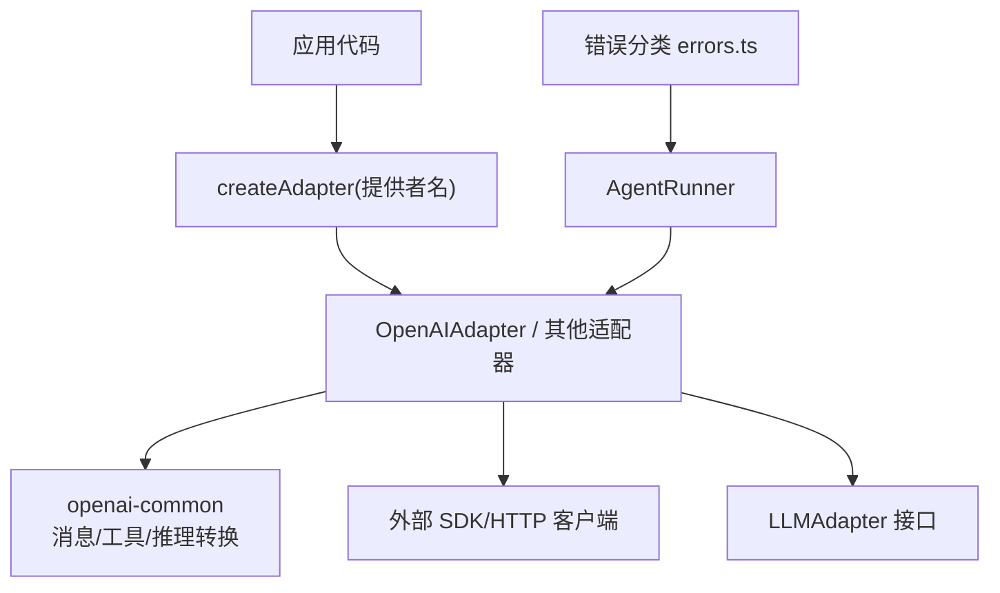
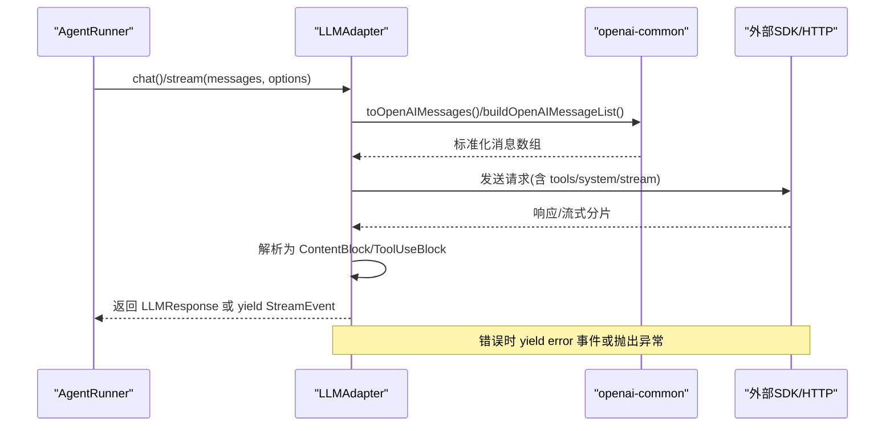
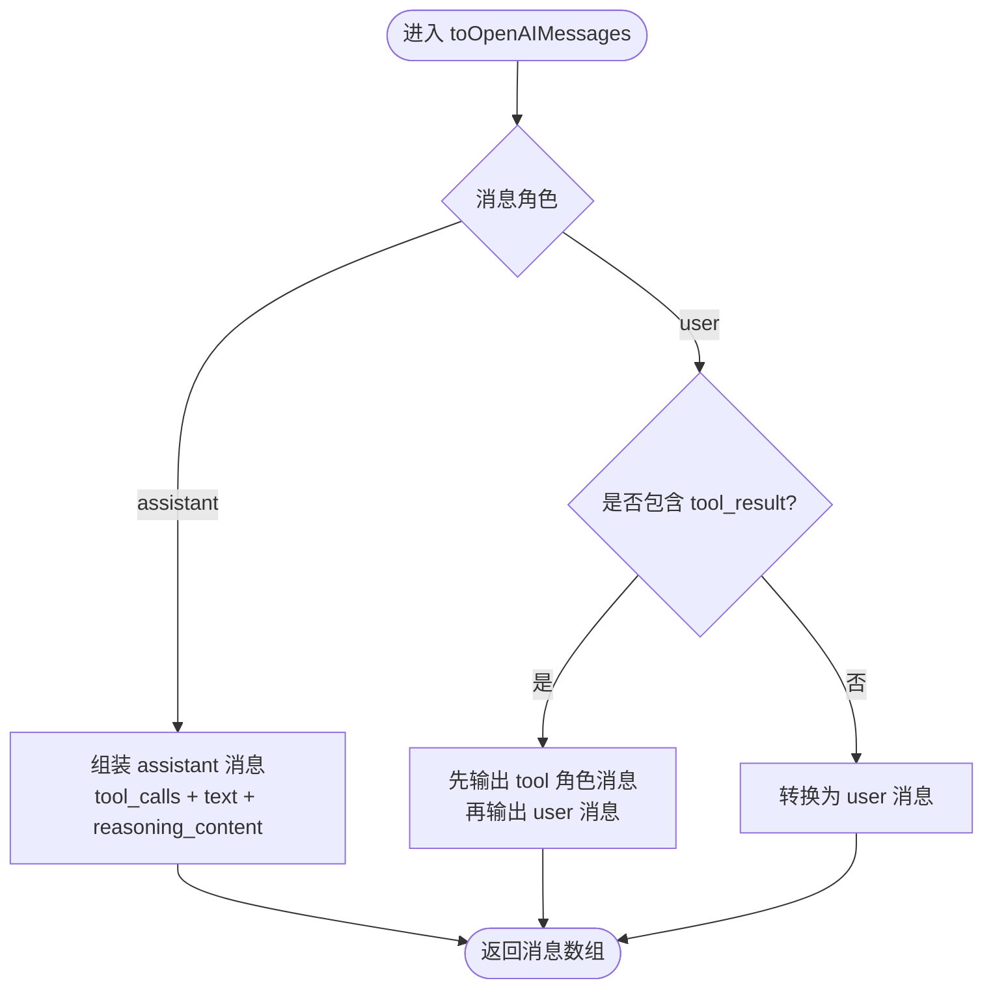
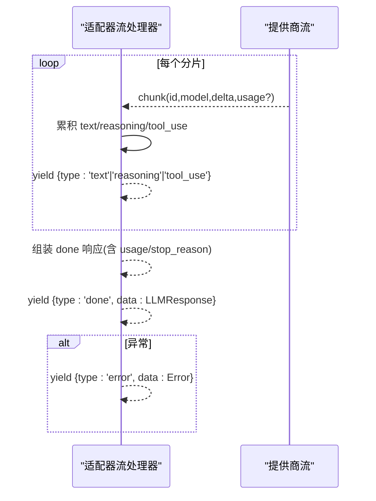
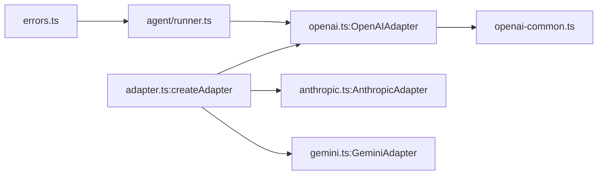

# 自定义提供商适配器

<cite>
**本文引用的文件**
- [packages/core/src/types.ts](file://packages/core/src/types.ts)
- [packages/core/src/llm/adapter.ts](file://packages/core/src/llm/adapter.ts)
- [packages/core/src/llm/openai.ts](file://packages/core/src/llm/openai.ts)
- [packages/core/src/llm/openai-common.ts](file://packages/core/src/llm/openai-common.ts)
- [packages/core/src/errors.ts](file://packages/core/src/errors.ts)
- [packages/core/src/agent/runner.ts](file://packages/core/src/agent/runner.ts)
- [docs/providers.md](file://docs/providers.md)
</cite>

## 目录
1. [简介](#简介)
2. [项目结构](#项目结构)
3. [核心组件](#核心组件)
4. [架构总览](#架构总览)
5. [详细组件分析](#详细组件分析)
6. [依赖关系分析](#依赖关系分析)
7. [性能考虑](#性能考虑)
8. [故障排查指南](#故障排查指南)
9. [结论](#结论)
10. [附录：完整开发示例与测试建议](#附录完整开发示例与测试建议)

## 简介
本指南面向需要扩展 Open Multi-Agent（OMA）模型提供商支持的开发者，系统讲解如何实现 LLMAdapter 接口、完成消息格式转换、流式响应处理与错误处理机制；说明适配器的注册流程与配置选项；提供完整的自定义适配器开发示例（请求拦截、响应解析、工具调用处理）；并给出调试与测试方法以及性能优化建议。

## 项目结构
- 类型与契约定义位于 core 包的 types.ts，统一描述 LLMAdapter、LLMMessage、LLMResponse、StreamEvent 等核心类型。
- 内置适配器工厂位于 llm/adapter.ts，集中管理 SupportedProvider 枚举与 createAdapter 动态加载逻辑。
- OpenAI 系列实现位于 llm/openai.ts 与 llm/openai-common.ts，展示消息序列化、流式事件生成、工具调用提取与推理内容回显策略。
- 错误分类与可重试判定位于 errors.ts。
- 运行器 runner.ts 负责编排 agent 循环、工具执行、超时与断点恢复，并与适配器交互。
- 文档 providers.md 汇总了各提供商的配置方式与环境变量约定。

图表来源
- [packages/core/src/llm/adapter.ts:76-147](file://packages/core/src/llm/adapter.ts#L76-L147)
- [packages/core/src/llm/openai.ts:76-392](file://packages/core/src/llm/openai.ts#L76-L392)
- [packages/core/src/llm/openai-common.ts:147-220](file://packages/core/src/llm/openai-common.ts#L147-L220)
- [packages/core/src/errors.ts:208-238](file://packages/core/src/errors.ts#L208-L238)

章节来源
- [packages/core/src/llm/adapter.ts:36-147](file://packages/core/src/llm/adapter.ts#L36-L147)
- [packages/core/src/types.ts:2921-2978](file://packages/core/src/types.ts#L2921-L2978)
- [docs/providers.md:20-63](file://docs/providers.md#L20-L63)

## 核心组件
- LLMAdapter 接口：要求实现 chat() 同步返回完整响应、stream() 增量产出 StreamEvent，并提供 name 与可选 capabilities 声明推理回显能力。
- 消息与响应类型：LLMMessage、ContentBlock（text/reasoning/tool_use/tool_result/image）、LLMResponse、TokenUsage。
- 流式事件：text、reasoning、tool_use、done、error。
- 推理回显能力：capabilities.echoesReasoning 支持 never / own-issued / tool-use-only，用于跨提供商推理内容的原生回显或文本降级。
- 适配器工厂：createAdapter 根据 provider 动态导入具体适配器类，支持环境变量自动注入密钥与 baseURL。

章节来源
- [packages/core/src/types.ts:471-478](file://packages/core/src/types.ts#L471-L478)
- [packages/core/src/types.ts:2921-2978](file://packages/core/src/types.ts#L2921-L2978)
- [packages/core/src/llm/adapter.ts:36-147](file://packages/core/src/llm/adapter.ts#L36-L147)

## 架构总览
下图展示了从 AgentRunner 到适配器的调用链，以及适配器内部的消息转换、流式事件与工具调用处理。

图表来源
- [packages/core/src/agent/runner.ts:1364-1486](file://packages/core/src/agent/runner.ts#L1364-L1486)
- [packages/core/src/llm/openai.ts:260-392](file://packages/core/src/llm/openai.ts#L260-L392)
- [packages/core/src/llm/openai-common.ts:521-536](file://packages/core/src/llm/openai-common.ts#L521-L536)

## 详细组件分析

### LLMAdapter 接口与能力声明
- name：人类可读的提供商名称，用于推理回显 provenance 标记。
- chat(messages, options)：一次性返回 LLMResponse，包含 content、model、stop_reason、usage。
- stream(messages, options)：异步迭代产出 StreamEvent，最终必须产出 done 或 error。
- capabilities.echoesReasoning：
  - never：不接收推理输入，出站需降级为文本。
  - own-issued：仅当 provenance 匹配时尝试原生回显。
  - tool-use-only：在包含 tool_use 的对话中，对所有 assistant 消息回显推理（包括无 tool_calls 的最终合成消息）。

章节来源
- [packages/core/src/types.ts:2921-2978](file://packages/core/src/types.ts#L2921-L2978)

### 消息格式转换（框架 ↔ 提供商）
- 将框架的 tool_use/tool_result 映射到提供商的 tool_calls 与 tool 角色消息。
- 对 user 消息中的 image 块转换为图像 URL 或 base64 数据部分。
- 对 reasoning 块进行“原生回显”或“文本降级”处理，遵循 outboundOptions 与 conversationHasToolUse 规则。
- 构建 system 消息与消息列表，确保顺序满足提供商约束（如 tool 结果必须在 assistant tool_calls 之后）。

图表来源
- [packages/core/src/llm/openai-common.ts:147-220](file://packages/core/src/llm/openai-common.ts#L147-L220)
- [packages/core/src/llm/openai-common.ts:254-357](file://packages/core/src/llm/openai-common.ts#L254-L357)

章节来源
- [packages/core/src/llm/openai-common.ts:147-220](file://packages/core/src/llm/openai-common.ts#L147-L220)
- [packages/core/src/llm/openai-common.ts:254-357](file://packages/core/src/llm/openai-common.ts#L254-L357)
- [packages/core/src/llm/openai-common.ts:521-536](file://packages/core/src/llm/openai-common.ts#L521-L536)

### 流式响应处理
- 遍历流式分片，累积 fullText/fullReasoning，按增量产出 text/reasoning/tool_use 事件。
- 维护 tool_call 缓冲区，逐步拼接参数 JSON，必要时进行修复。
- 结束时组装 finalContent（reasoning + text + tool_use），计算 stop_reason，产出 done 事件；异常时产出 error 事件。

图表来源
- [packages/core/src/llm/openai.ts:260-392](file://packages/core/src/llm/openai.ts#L260-L392)

章节来源
- [packages/core/src/llm/openai.ts:260-392](file://packages/core/src/llm/openai.ts#L260-L392)

### 工具调用处理
- 入站：将 tool_use 块转为提供商 tool_calls；若提供商未返回 tool_calls，但文本中包含 JSON，则使用文本提取器进行回退解析。
- 出站：将 tool_result 块拆分为独立的 tool 角色消息，保证顺序正确。
- 本地模型兼容：对单参工具的非法 JSON 进行修复，提升鲁棒性。

章节来源
- [packages/core/src/llm/openai-common.ts:363-495](file://packages/core/src/llm/openai-common.ts#L363-L495)
- [packages/core/src/llm/openai-common.ts:147-220](file://packages/core/src/llm/openai-common.ts#L147-L220)

### 错误处理机制
- 适配器层：流式处理捕获异常并产出 error 事件；非流式调用抛出异常。
- 错误分类：isRetryableError 区分可重试与不可重试错误；isCancellationError 识别用户取消。
- 运行器层：工具执行异常转化为错误结果，继续循环；支持超时、预算限制与断点恢复。

章节来源
- [packages/core/src/errors.ts:208-238](file://packages/core/src/errors.ts#L208-L238)
- [packages/core/src/agent/runner.ts:1426-1486](file://packages/core/src/agent/runner.ts#L1426-L1486)

### 推理内容与思考模式
- 通过 buildMessageOptions 决定 nativeReasoningEchoProvider、preserveReasoningAsText、compressReasoningText。
- 在 assistant 消息中，若 conversationHasToolUse 且存在 eligible reasoning，附加 reasoning_content 字段以满足特定提供商要求（如 DeepSeek V4 thinking mode）。

章节来源
- [packages/core/src/llm/openai.ts:108-132](file://packages/core/src/llm/openai.ts#L108-L132)
- [packages/core/src/llm/openai-common.ts:254-357](file://packages/core/src/llm/openai-common.ts#L254-L357)

## 依赖关系分析
- 适配器工厂依赖 SupportedProvider 枚举，按需懒加载具体适配器模块，避免未使用的 SDK 引入。
- OpenAI 适配器依赖 openai-common 提供的消息/工具/推理转换函数。
- AgentRunner 依赖适配器接口，不关心具体实现；错误分类由 errors.ts 提供。
- 文档 providers.md 提供各提供商的环境变量与 baseURL 约定，便于配置。

图表来源
- [packages/core/src/llm/adapter.ts:76-147](file://packages/core/src/llm/adapter.ts#L76-L147)
- [packages/core/src/llm/openai.ts:76-392](file://packages/core/src/llm/openai.ts#L76-L392)
- [packages/core/src/agent/runner.ts:1364-1486](file://packages/core/src/agent/runner.ts#L1364-L1486)
- [packages/core/src/errors.ts:208-238](file://packages/core/src/errors.ts#L208-L238)

章节来源
- [packages/core/src/llm/adapter.ts:36-147](file://packages/core/src/llm/adapter.ts#L36-L147)
- [docs/providers.md:20-63](file://docs/providers.md#L20-L63)

## 性能考虑
- 流式优先：尽量使用 stream() 以尽早渲染文本与工具调用，降低首字节延迟。
- 工具调用缓冲：合并增量 tool_call 参数，减少重复解析与字符串拼接开销。
- 推理内容压缩：通过 compressReasoningText 控制推理文本长度，避免上下文膨胀。
- 并行工具调用：根据提供商能力设置 parallelToolCalls，注意某些本地服务器可能截断并发 tool_call 流。
- 超时与预算：合理设置 callTimeoutMs、maxTokens、topK/minP/frequencyPenalty/presencePenalty，防止长尾与无限循环。

[本节为通用指导，无需引用具体文件]

## 故障排查指南
- 模型不调用工具：确认工具定义已传入，检查提供商是否支持 function 工具；本地模型可使用文本回退提取。
- 代理干扰：设置 no_proxy 或使用直连地址。
- 错误分类：使用 isRetryableError 判断是否重试；使用 isCancellationError 识别取消。
- 工具结果内容不支持：UnsupportedToolResultContentError 表示当前提供商无法表达该媒体类型，需降级或替换。
- 运行器侧：工具执行异常会记录为错误结果，不会中断整体循环；检查 onToolResult 回调与 checkpoint 持久化。

章节来源
- [docs/providers.md:181-186](file://docs/providers.md#L181-L186)
- [packages/core/src/errors.ts:143-180](file://packages/core/src/errors.ts#L143-L180)
- [packages/core/src/errors.ts:208-238](file://packages/core/src/errors.ts#L208-L238)
- [packages/core/src/agent/runner.ts:1426-1486](file://packages/core/src/agent/runner.ts#L1426-L1486)

## 结论
通过实现 LLMAdapter 接口并遵循 OMA 的消息与流式事件契约，你可以快速接入新的模型提供商。借助 openai-common 的转换能力、错误分类与 AgentRunner 的编排机制，可以稳定地支持工具调用、推理回显与流式响应。结合 providers.md 的配置约定与性能优化建议，能够高效扩展并生产部署自定义适配器。

[本节为总结，无需引用具体文件]

## 附录：完整开发示例与测试建议

### 自定义适配器开发步骤
- 定义适配器类实现 LLMAdapter：
  - 实现 name、chat、stream。
  - 可选实现 capabilities.echoesReasoning 以声明推理回显策略。
- 消息转换：
  - 将 LLMMessage 转换为提供商消息格式（参考 toOpenAIMessages/buildOpenAIMessageList）。
  - 处理 tool_use/tool_result、image、reasoning 等块。
- 流式处理：
  - 迭代提供商流，产出 text/reasoning/tool_use 事件。
  - 结束时产出 done 事件（包含 LLMResponse）；异常产出 error 事件。
- 工具调用：
  - 入站：解析 tool_calls，必要时使用文本回退提取。
  - 出站：将 tool_result 转为 tool 角色消息，保持顺序。
- 错误处理：
  - 捕获异常并分类；区分可重试与不可重试；识别取消。
- 注册与配置：
  - 若走 createAdapter 工厂，需在 SupportedProvider 中添加新值并在 switch 分支中实例化。
  - 或直接通过 AgentConfig.adapter 注入自定义适配器，绕过工厂。

章节来源
- [packages/core/src/types.ts:2921-2978](file://packages/core/src/types.ts#L2921-L2978)
- [packages/core/src/llm/adapter.ts:36-147](file://packages/core/src/llm/adapter.ts#L36-L147)
- [packages/core/src/llm/openai-common.ts:147-220](file://packages/core/src/llm/openai-common.ts#L147-L220)
- [packages/core/src/llm/openai.ts:260-392](file://packages/core/src/llm/openai.ts#L260-L392)

### 请求拦截与响应解析
- 请求拦截：可在适配器构造或 chat/stream 入口合并 extraBody，注入提供商特有参数（如 reasoning_effort、thinking 配置）。
- 响应解析：将提供商响应转换为 LLMResponse，填充 content、model、stop_reason、usage；对 tool_calls 进行解析与修复。

章节来源
- [packages/core/src/llm/openai-common.ts:363-495](file://packages/core/src/llm/openai-common.ts#L363-L495)
- [packages/core/src/types.ts:471-478](file://packages/core/src/types.ts#L471-L478)

### 工具调用处理最佳实践
- 严格顺序：tool_result 对应的 tool 角色消息必须紧跟在 assistant 的 tool_calls 之后。
- 本地模型兼容：对单参工具 JSON 进行修复，提升鲁棒性。
- 文本回退：当提供商未返回 tool_calls 时，使用 extractToolCallsFromText 从文本中提取。

章节来源
- [packages/core/src/llm/openai-common.ts:147-220](file://packages/core/src/llm/openai-common.ts#L147-L220)
- [packages/core/src/llm/openai-common.ts:363-495](file://packages/core/src/llm/openai-common.ts#L363-L495)

### 调试与测试方法
- 单元测试：针对消息转换、工具调用提取、推理回显逻辑编写用例。
- 集成测试：使用 mock 提供商或本地服务（Ollama/vLLM）验证端到端流程。
- 流式测试：验证 text/reasoning/tool_use/done/error 事件序列与最终 LLMResponse。
- 错误场景：覆盖网络错误、超时、取消、预算超限、不支持的工具类型等。

章节来源
- [packages/core/src/errors.ts:208-238](file://packages/core/src/errors.ts#L208-L238)
- [docs/providers.md:157-186](file://docs/providers.md#L157-L186)

### 性能优化建议
- 启用流式响应，减少首字节延迟。
- 合理设置 sampling 参数（temperature/topP/topK/minP）与 penalty，抑制重复与幻觉。
- 控制推理文本长度，避免上下文膨胀。
- 根据提供商能力开启/关闭 parallelToolCalls。
- 使用 callTimeoutMs 与 maxTokens 控制单次调用成本与时延。

[本节为通用指导，无需引用具体文件]