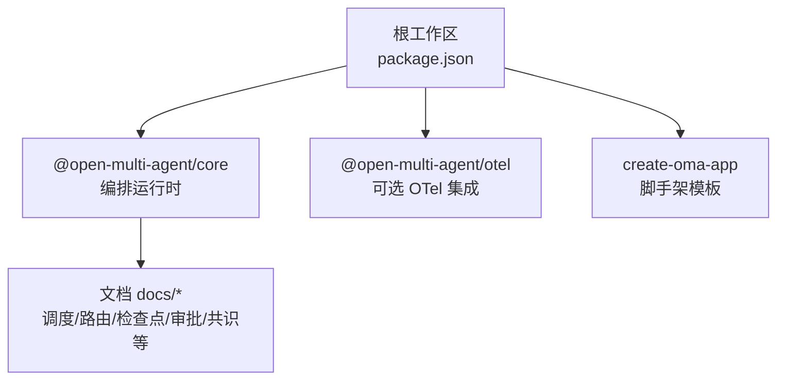
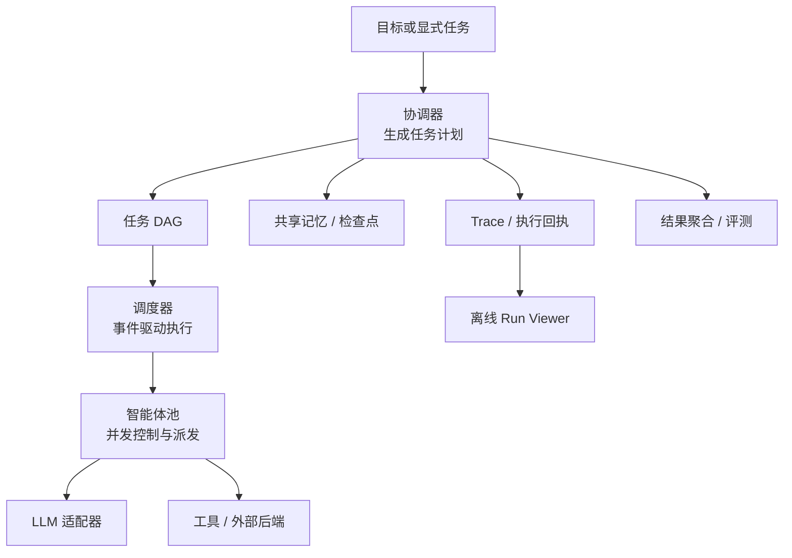
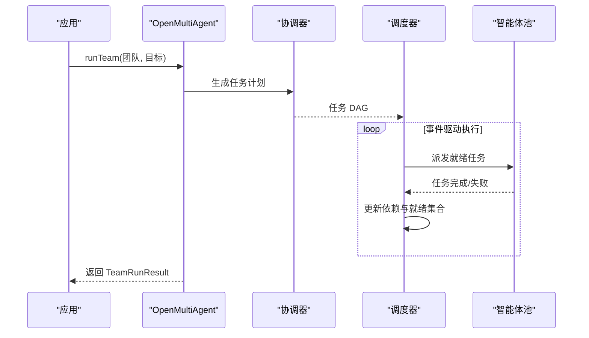
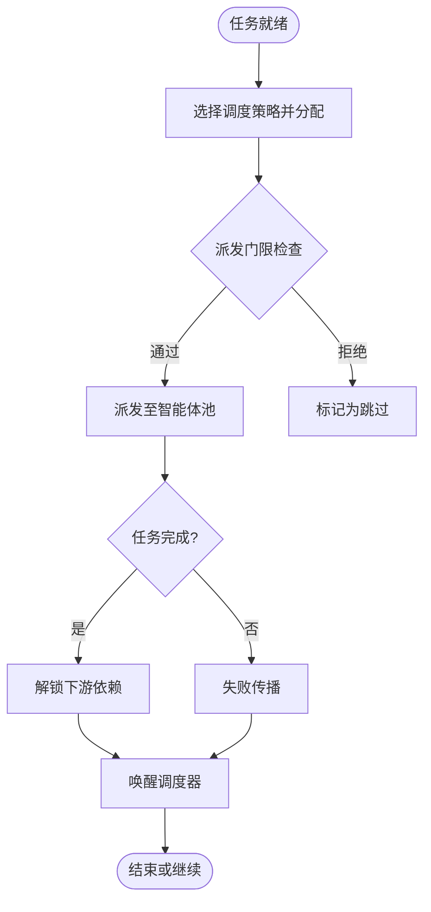
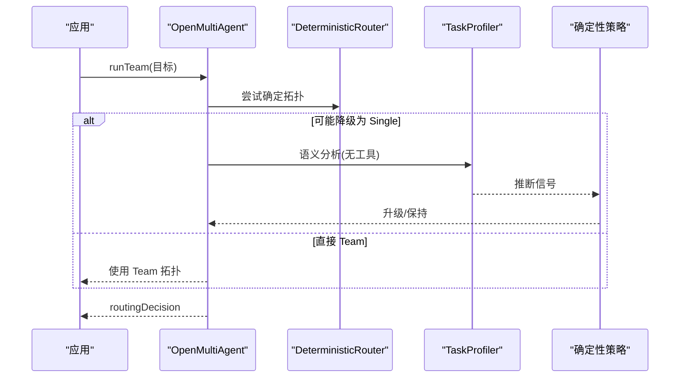
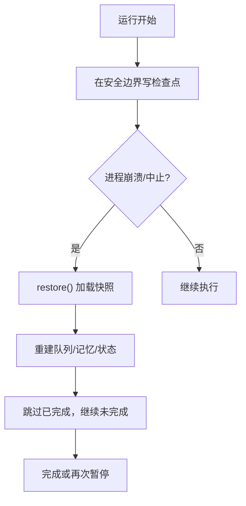
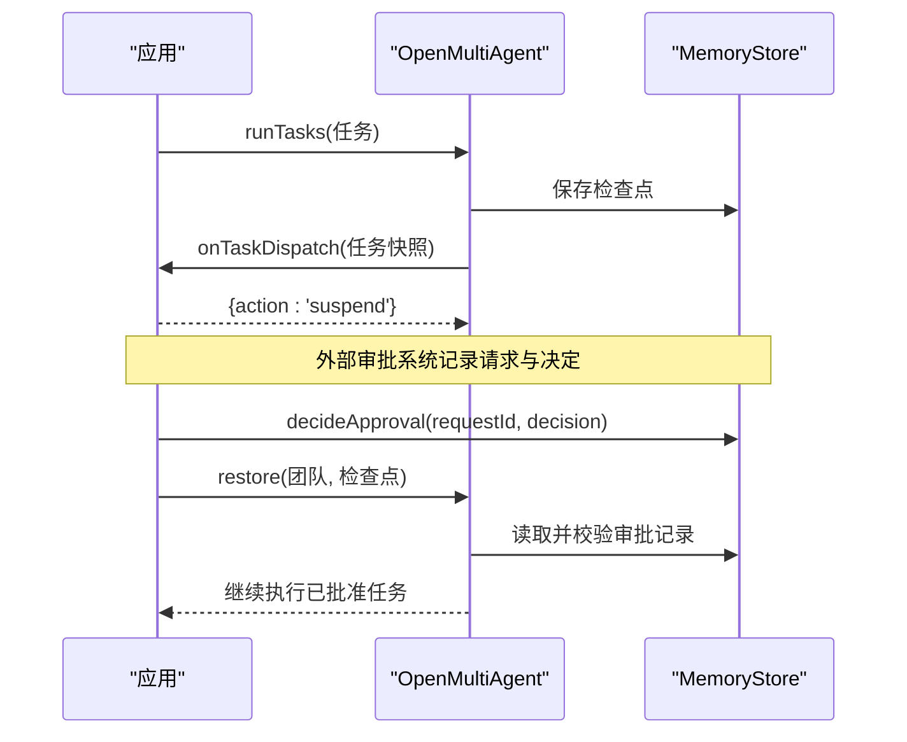
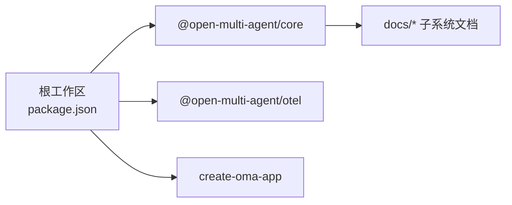

# 框架介绍

<cite>
**本文引用的文件**
- [README_zh.md](file://README_zh.md)
- [README.md](file://README.md)
- [package.json](file://package.json)
- [packages/core/README_zh.md](file://packages/core/README_zh.md)
- [packages/core/README.md](file://packages/core/README.md)
- [docs/task-scheduling.md](file://docs/task-scheduling.md)
- [docs/execution-routing.md](file://docs/execution-routing.md)
- [docs/checkpoint.md](file://docs/checkpoint.md)
- [docs/durable-approvals.md](file://docs/durable-approvals.md)
- [docs/consensus.md](file://docs/consensus.md)
</cite>

## 目录
1. [简介](#简介)
2. [项目结构](#项目结构)
3. [核心组件](#核心组件)
4. [架构总览](#架构总览)
5. [详细组件分析](#详细组件分析)
6. [依赖关系分析](#依赖关系分析)
7. [性能考量](#性能考量)
8. [故障排查指南](#故障排查指南)
9. [结论](#结论)
10. [附录](#附录)

## 简介
Open Multi-Agent（OMA）是一个面向 TypeScript 后端的“多智能体编排”框架，强调“只描述目标，不画任务图”。它把动态工作流、运行时任务依赖图生成、确定性调度器与生产级控制、证据和恢复能力整合在一起，帮助团队从原型快速过渡到生产环境。

核心价值主张
- 描述目标而非图：通过 Coordinator 在运行时将目标分解为任务 DAG，无需手工维护固定流程图。
- 动态编排：自动规划、依赖感知调度、并行分支、可配置分配、任务级结果与交接、最终合成。
- 受控执行：计划预览与审批、任务派发审批、工具调用审批；固化已审批计划以供回放。
- 可靠性：Checkpoint 断点续跑、自适应恢复、重试/超时/循环检测、token 与成本预算。
- 可观测与评测：稳定运行标识、Trace、执行回执、离线 Run Viewer、可选 OpenTelemetry 集成；版本化 EvalSet 与 CI gate。
- 安全与隐私：内置工具默认拒绝、逐次调用 gate、显式隐私控制。
- 开放运行时：Process/ACP 后端让外部 CLI 与 LLM Agent 同处一个 DAG，共享记忆与预算；混用云端、本地、国产模型与 AI SDK provider。

适合场景
- 需要多个 Agent、任务依赖、审批或恢复机制协同的编排层问题。
- 希望任务图随目标动态生成的 TypeScript 团队。
- 对可观测性、可审计、可回放的运行数据有强需求的工程团队。

与其他框架的区别与优势（基于仓库文档）
- 与 LangGraph、Mastra、CrewAI、Vercel AI SDK 等的逐项对比见官方对比页；OMA 的优势集中在“动态编排 + 生产级控制/证据/恢复”的一体化能力，以及离线 Run Viewer、结构化治理声明、混合语义路由等特性。

章节来源
- [README_zh.md:13-108](file://README_zh.md#L13-L108)
- [README.md:13-109](file://README.md#L13-L109)

## 项目结构
仓库采用 monorepo 组织，核心编排运行时位于 packages/core，配套企业集成与脚手架分别位于 packages/otel 与 packages/create-oma-app。根 package.json 定义工作区与脚本，统一构建、测试与示例验证。

图表来源
- [package.json:1-34](file://package.json#L1-L34)

章节来源
- [package.json:1-34](file://package.json#L1-L34)

## 核心组件
- 协调器（Coordinator）：从目标生成一次性的任务计划（DAG），并负责最终合成。
- 调度器（Scheduler）：事件驱动的任务执行引擎，维护就绪集合与进行中的任务映射，按依赖满足即时推进下游任务。
- 智能体池（AgentPool）：并发控制与任务派发，对接 LLM adapter、工具与外部后端。
- 共享记忆（SharedMemory）：跨 Agent 的结果与上下文共享，支持可插拔存储。
- 检查点（Checkpoint）：持久化运行状态，支持断点续跑与恢复。
- 可观测性（Observability）：Trace、执行回执、离线 Run Viewer、可选 OTel 导出。
- 评测（Evaluation）：版本化 EvalSet、参考评分、离线报告与 CI gate。
- 外部 Agent：Process/ACP 后端接入 Claude Code、Gemini CLI、Codex 等。

章节来源
- [packages/core/README_zh.md:165-193](file://packages/core/README_zh.md#L165-L193)
- [packages/core/README.md:224-252](file://packages/core/README.md#L224-L252)

## 架构总览
下图展示了 OMA 的核心数据流与控制流：目标进入 Coordinator 生成任务 DAG，由 Scheduler 事件驱动执行，AgentPool 负责并发与派发，共享记忆与检查点提供状态持久化，Trace 与执行回执支撑可观测性与回放。

图表来源
- [packages/core/README_zh.md:178-193](file://packages/core/README_zh.md#L178-L193)
- [packages/core/README.md:237-252](file://packages/core/README.md#L237-L252)

## 详细组件分析

### 动态工作流与运行时任务依赖图生成
- 自动编排模式：调用 runTeam() 时，Coordinator 根据目标生成任务计划，随后由调度器执行。
- 显式流水线：runTasks() 允许直接定义任务图与分配。
- 计划回放：planOnly 先审查计划，再通过 createPlanArtifact() 与 runFromPlan() 回放。
- 治理意图：required/preferred 可强制角色与顺序，确保拓扑不漂移。

图表来源
- [packages/core/README_zh.md:103-113](file://packages/core/README_zh.md#L103-L113)
- [docs/task-scheduling.md:1-26](file://docs/task-scheduling.md#L1-L26)

章节来源
- [packages/core/README_zh.md:103-133](file://packages/core/README_zh.md#L103-L133)
- [docs/task-scheduling.md:1-26](file://docs/task-scheduling.md#L1-L26)

### 确定性调度器与事件驱动执行
- 事件驱动：下游任务在依赖满足时立即启动，不等待同一就绪集合中无关任务。
- 调度策略：dependency-first（默认）、round-robin、least-busy、capability-match、composite。
- 约束校验：任务 requires 与 Agent capabilities/costTier/latencyClass 在派发前严格校验，不满足则提前失败。
- 中断与预算：Abort、预算耗尽、审批拒绝走“排空后跳过”路径，避免悬挂任务。

图表来源
- [docs/task-scheduling.md:8-26](file://docs/task-scheduling.md#L8-L26)
- [docs/task-scheduling.md:98-133](file://docs/task-scheduling.md#L98-L133)
- [docs/task-scheduling.md:166-178](file://docs/task-scheduling.md#L166-L178)

章节来源
- [docs/task-scheduling.md:8-26](file://docs/task-scheduling.md#L8-L26)
- [docs/task-scheduling.md:98-133](file://docs/task-scheduling.md#L98-L133)
- [docs/task-scheduling.md:166-178](file://docs/task-scheduling.md#L166-L178)

### 执行路由与混合语义路由
- 拓扑决策：Single 或 Team；优先级为显式 mode > 治理拓扑 > 自定义 Router > 内置 DeterministicRouter > Hybrid Profiler。
- 混合路由：仅在可能降级为 Single 时进行一次无工具调用的 TaskProfiler，结合确定性策略决定是否升级为 Team。
- 治理边界：路由不替代治理声明；后果性工具仍需治理确认。

图表来源
- [docs/execution-routing.md:5-22](file://docs/execution-routing.md#L5-L22)
- [docs/execution-routing.md:23-80](file://docs/execution-routing.md#L23-L80)
- [docs/execution-routing.md:162-181](file://docs/execution-routing.md#L162-L181)

章节来源
- [docs/execution-routing.md:5-22](file://docs/execution-routing.md#L5-L22)
- [docs/execution-routing.md:23-80](file://docs/execution-routing.md#L23-L80)
- [docs/execution-routing.md:162-181](file://docs/execution-routing.md#L162-L181)

### 检查点与恢复路径
- 启用方式：per-call 或 orchestrator 级别 checkpoint；支持 InMemoryStore/FileStore 等 MemoryStore 实现。
- 恢复流程：restore() 加载最新快照，重建任务队列与共享记忆，跳过已完成任务，必要时重放工具结果。
- 保存内容：执行身份、任务队列、共享记忆、已完成任务结果、进行中 runner 状态、审批延续状态、任务交接/元数据。
- 安全：RedactingStore 可在写入时脱敏；审批记录需不可变 CAS 存储。

图表来源
- [docs/checkpoint.md:11-36](file://docs/checkpoint.md#L11-L36)
- [docs/checkpoint.md:74-107](file://docs/checkpoint.md#L74-L107)
- [docs/checkpoint.md:109-153](file://docs/checkpoint.md#L109-L153)
- [docs/checkpoint.md:154-199](file://docs/checkpoint.md#L154-L199)

章节来源
- [docs/checkpoint.md:11-36](file://docs/checkpoint.md#L11-L36)
- [docs/checkpoint.md:74-107](file://docs/checkpoint.md#L74-L107)
- [docs/checkpoint.md:109-153](file://docs/checkpoint.md#L109-L153)
- [docs/checkpoint.md:154-199](file://docs/checkpoint.md#L154-L199)

### 可控执行：审批与恢复路径
- 审批门：onPlanReady、onApproval、onTaskDispatch、onToolCall；支持 suspend/allow/deny。
- 持久化审批：请求与决定以独立主记录存储，恢复时比对内容与哈希，保证一致性。
- 恢复语义：拒绝产生 top-level rejected 并跳过剩余工作；批准的工具调用仅执行一次，后续从检查点重放结果。

图表来源
- [docs/durable-approvals.md:1-28](file://docs/durable-approvals.md#L1-L28)
- [docs/durable-approvals.md:30-87](file://docs/durable-approvals.md#L30-L87)
- [docs/durable-approvals.md:94-147](file://docs/durable-approvals.md#L94-L147)

章节来源
- [docs/durable-approvals.md:1-28](file://docs/durable-approvals.md#L1-L28)
- [docs/durable-approvals.md:30-87](file://docs/durable-approvals.md#L30-L87)
- [docs/durable-approvals.md:94-147](file://docs/durable-approvals.md#L94-L147)

### 共识与质量保障
- runConsensus：proposer→judge 验证循环，支持 refute/lens 模式、quorum、maxRounds、onDissent 策略。
- 任务级 verify：单个任务可启用共识验证，结果被下游消费。
- 预算不变量：共识 token/成本计入父预算，达到上限停止进一步 judge 调用。

章节来源
- [docs/consensus.md:1-64](file://docs/consensus.md#L1-L64)

## 依赖关系分析
- 包与工作区：根 package.json 管理 workspaces，scripts 统一构建与测试入口。
- 核心包：@open-multi-agent/core 提供编排运行时、工具、记忆、检查点、trace、CLI 与离线 Run Viewer。
- 可选集成：@open-multi-agent/otel 用于企业级 OTel 集成；create-oma-app 提供脚手架与 starter。

图表来源
- [package.json:1-34](file://package.json#L1-L34)

章节来源
- [package.json:1-34](file://package.json#L1-L34)

## 性能考量
- 调度效率：事件驱动执行减少不必要等待；调度策略可按关键度、能力匹配与负载综合优化。
- 预算控制：turn 与任务边界检查 token/成本预算，避免无限扩展。
- 观察开销：Trace 与 Run Viewer 支持离线分析；OTel 集成按需启用，避免不必要的远程上报。
- 资源限制：maxTurns、timeoutMs、callTimeoutMs、contextStrategy、loopDetection 等参数控制执行边界。

章节来源
- [packages/core/README_zh.md:227-248](file://packages/core/README_zh.md#L227-L248)
- [docs/task-scheduling.md:166-178](file://docs/task-scheduling.md#L166-L178)

## 故障排查指南
- 调度失败：当任务要求无法满足时，会提前失败并返回 NO_ELIGIBLE_AGENT/ASSIGNEE_REQUIREMENTS_MISMATCH；检查 Agent capabilities 与任务 requires。
- 路由失败：自定义 Router/Profiler 超时或异常时，默认 fallback 到 DeterministicRouter；可通过 failurePolicy 改为 fail 以终止。
- 检查点写入失败：普通写入为 best-effort，通过 onProgress 上报错误；恢复时若缺少 CAS 或记录损坏，会关闭执行。
- 审批冲突：并发或重复决策会触发 APPROVAL_CONFLICT；恢复时会比对 requestHash 与校验结果，防止旧审批继承。
- 工具幂等：外部副作用需在工具中使用 toolCallId 作为幂等键，避免恢复时的重复执行风险。

章节来源
- [docs/task-scheduling.md:98-133](file://docs/task-scheduling.md#L98-L133)
- [docs/execution-routing.md:120-133](file://docs/execution-routing.md#L120-L133)
- [docs/checkpoint.md:154-199](file://docs/checkpoint.md#L154-L199)
- [docs/durable-approvals.md:80-147](file://docs/durable-approvals.md#L80-L147)

## 结论
OMA 以“描述目标而非图”的理念，将动态编排、确定性调度、生产级控制与恢复、可观测与评测融为一体，帮助团队从原型快速走向生产。其差异化优势体现在：
- 运行时任务依赖图生成与事件驱动执行，降低维护成本。
- 混合语义路由与治理声明，兼顾灵活性与合规性。
- 检查点与持久化审批，提供可靠的恢复路径。
- 离线 Run Viewer 与可选 OTel，满足调试、审计与企业监控需求。
- 开放运行时与 Provider 生态，适配多云、本地与国产模型。

## 附录
- 快速开始与示例：参见核心包 README 与示例索引，覆盖基础、cookbook、模式、Provider 与集成。
- 生产清单：限定工作量、控制成本、限制工具、恢复策略、人工把关、统一观测。
- 文档导航：安装与运行、配置模型与工具、稳定运行、控制编排、生产运维。

章节来源
- [packages/core/README_zh.md:57-113](file://packages/core/README_zh.md#L57-L113)
- [packages/core/README_zh.md:227-257](file://packages/core/README_zh.md#L227-L257)
- [README_zh.md:153-160](file://README_zh.md#L153-L160)