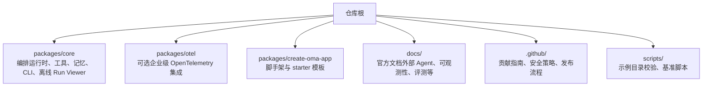
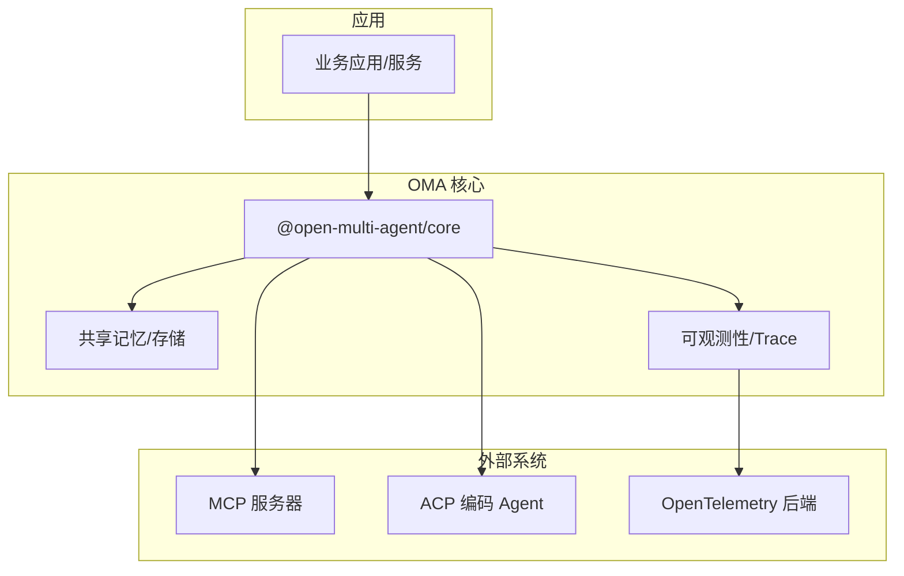
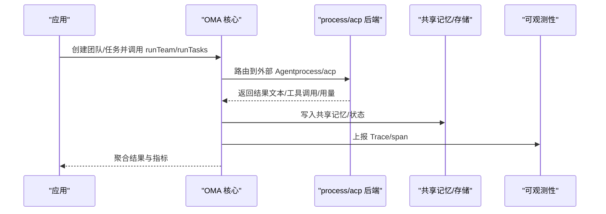
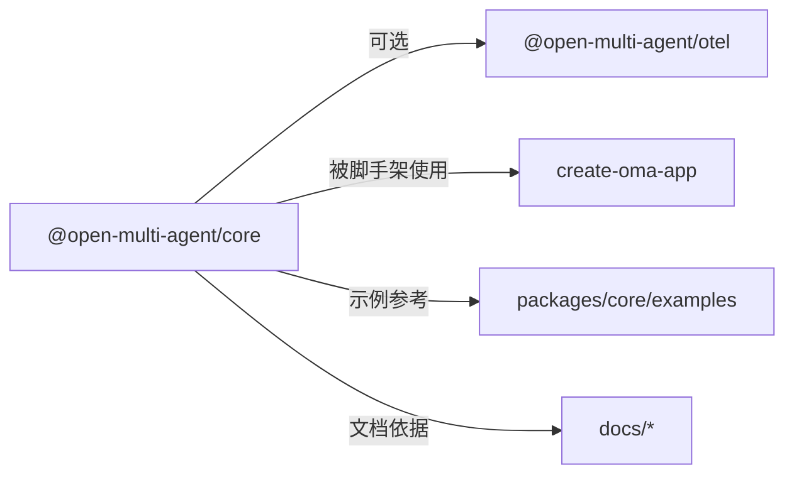

# 生态系统

<cite>
**本文引用的文件**
- [README.md](file://README.md)
- [README_zh.md](file://README_zh.md)
- [docs/featured-partner.md](file://docs/featured-partner.md)
- [docs/external-agents.md](file://docs/external-agents.md)
- [.github/CONTRIBUTING.md](file://.github/CONTRIBUTING.md)
- [packages/core/examples/integrations/README.md](file://packages/core/examples/integrations/README.md)
- [packages/core/examples/README.md](file://packages/core/examples/README.md)
- [AGENTS.md](file://AGENTS.md)
</cite>

## 目录
1. [简介](#简介)
2. [项目结构](#项目结构)
3. [核心组件](#核心组件)
4. [架构总览](#架构总览)
5. [详细组件分析](#详细组件分析)
6. [依赖关系分析](#依赖关系分析)
7. [性能与生产考量](#性能与生产考量)
8. [故障排查指南](#故障排查指南)
9. [结论](#结论)
10. [附录](#附录)

## 简介
本章节面向希望了解 Open Multi-Agent（OMA）生态系统的读者，聚焦以下目标：
- 梳理已知的生产使用案例与第三方集成项目。
- 说明 Featured Partner Program（特色合作伙伴计划）的参与方式与权益。
- 介绍社区贡献渠道（问题报告、功能请求、Pull Request）。
- 提供基于 OMA 的扩展与插件开发指南。
- 汇总商业支持与企业级服务选项。

OMA 是一个面向 TypeScript 后端的多智能体编排框架，强调“只描述目标，不画任务图”，在运行时动态生成任务 DAG，并通过确定性调度器执行、可观测回放与恢复能力，帮助多智能体系统从原型走向生产。

**Section sources**
- [README.md:13-46](file://README.md#L13-L46)
- [README_zh.md:13-46](file://README_zh.md#L13-L46)

## 项目结构
仓库采用 npm workspaces 组织，核心包、可选 OTel 适配器与脚手架模板分属不同工作区；文档位于 docs/，示例位于 packages/core/examples/，贡献规范位于 .github/。

**Diagram sources**
- [AGENTS.md:9-15](file://AGENTS.md#L9-L15)
- [packages/core/examples/README.md:1-12](file://packages/core/examples/README.md#L1-L12)

**Section sources**
- [AGENTS.md:9-15](file://AGENTS.md#L9-L15)
- [packages/core/examples/README.md:1-12](file://packages/core/examples/README.md#L1-L12)

## 核心组件
- 编排运行时：OpenMultiAgent 暴露 runAgent/runTeam/runTasks 三种模式，协调器在运行时生成任务 DAG，调度器按依赖执行，结果可回放与审计。
- 外部 Agent 后端：内置 process 与 acp 两种后端，将本地进程或遵循 ACP 协议的编码 Agent 作为团队一员纳入同一 DAG。
- 可观测性与评测：Trace、Run Viewer、EvalSet、采样与离线报告，支撑 CI gate 与生产抽样。
- 包体系：core（核心）、otel（可选 OTel 适配）、create-oma-app（脚手架）。

这些能力共同构成 OMA 的生态基座，使第三方产品与平台可以围绕其进行集成与扩展。

**Section sources**
- [README.md:46-108](file://README.md#L46-L108)
- [docs/external-agents.md:1-18](file://docs/external-agents.md#L1-L18)
- [AGENTS.md:64-70](file://AGENTS.md#L64-L70)

## 架构总览
下图展示了 OMA 在典型集成中的角色：应用通过 core 编排多 Agent（含 LLM Agent 与外部 Agent），共享内存与预算控制贯穿执行，可观测数据导出至 Trace/OTel，评测与回放用于质量保障。

[此图为概念性架构图，不直接映射具体源码文件]

## 详细组件分析

### 已知生产使用案例
- temodar-agent：WordPress 安全分析平台，在 Docker runtime 中直接使用 OMA 内置工具（bash、file_*、grep），已确认生产使用。
- PR-Copilot：AI Pull Request 审查助手，运行 OMA 审查团队，结合 defineTool 与自定义 ContextStrategy 做 token-aware diff 压缩。
- StuFlow：终端 AI 编码助手，以 OMA 为编排内核，驱动 runAgent/runTasks/runTeam，搭配 DeepSeek。
- Reports to Charts Studio：五角色提取评审组，结构化输出与确定性校验，将文档与表格转为幻灯片图表。

以上案例体现了 OMA 在生产环境中的多种用法：安全扫描、代码审查、终端交互、结构化数据处理等。

**Section sources**
- [README.md:110-128](file://README.md#L110-L128)
- [README_zh.md:109-127](file://README_zh.md#L109-L127)

### 第三方集成项目
- Engram 记忆同步：“AI 记忆的 Git”，跨 Agent 即时同步知识并标记冲突。
- agentsonar 监控：Sidecar 检测跨运行的委派环、重复与速率突增。
- CodingScaffold 脚手架：agentic-coding 脚手架，将 OMA 列为可选编排后端，附带 runTeam 工作流模板。
- Bilig WorkPaper：公式工作簿 MCP 服务，双向收录 OMA 集成，编辑输入、重新计算、校验回读并持久化 JSON。
- baize-oma：HTTP 适配层，将 runAgent()/runTeam() 暴露为 Baize slot 能力。

这些集成覆盖了记忆、监控、脚手架、MCP、HTTP 适配等多个方向，体现 OMA 的开放性与可扩展性。

**Section sources**
- [README.md:120-128](file://README.md#L120-L128)
- [README_zh.md:119-127](file://README_zh.md#L119-L127)
- [packages/core/examples/integrations/README.md:30-38](file://packages/core/examples/integrations/README.md#L30-L38)

### 合作伙伴计划（Featured Partner Program）
- 权益：在 README 的 Built with OMA 区域保留显著位置展示 12 个月；包含 Logo、100 字描述与维护者背书引用；中英 README 交叉链接。
- 资格：已与 OMA 集成的产品或平台，处于生产或公开可测试 Beta；与 OMA 定位一致（TypeScript 多智能体编排、Agent 基础设施、可观测性、记忆后端及相邻工具）。
- 费用：每个合作伙伴每 12 个月 $3,000 USD，单槽位限一个合作伙伴，到期可按相同条款续期。
- 申请方式：提交 Issue（标题固定标签），附产品简述、集成代码或部署链接、联系人；维护者审核确认后安排排期。

该计划适合希望在官方 README 获得长期曝光的集成方。

**Section sources**
- [docs/featured-partner.md:1-29](file://docs/featured-partner.md#L1-L29)

### 社区贡献渠道
- 问题报告与功能请求：通过 GitHub Issues 提交，优先查看 good first issue 与 help wanted 标签。
- Pull Request：遵循贡献指南，确保类型检查、单元测试、构建与示例验证通过；必要时补充用户文档与示例。
- 示例与集成：新增示例需遵循分类与命名约定，并在 catalog.json 登记；参考 integrations/ 下的参考与厂商集成提交流程。

贡献流程强调最小必要验证、保持核心可独立导入、按需懒加载可选依赖。

**Section sources**
- [.github/CONTRIBUTING.md:52-76](file://.github/CONTRIBUTING.md#L52-L76)
- [packages/core/examples/integrations/README.md:39-64](file://packages/core/examples/integrations/README.md#L39-L64)
- [packages/core/examples/README.md:120-138](file://packages/core/examples/README.md#L120-L138)

### 集成开发指南（扩展与插件）
- 外部 Agent 集成：
  - process 后端：启动本地命令，stdin/参数传递提示，stdout/stderr/退出码映射为 Agent 结果。
  - acp 后端：通过 Agent Client Protocol 驱动编码 Agent（如 Claude Code、Gemini CLI、Codex），会话内权限审批与 token 用量记录。
- 工具与沙箱：内置工具默认拒绝，需显式授权；onToolCall 逐次门控；文件系统工具沙箱限制路径范围。
- 可观测与评测：使用 onTrace/TraceStore 收集 span，结合 EvalSet 与评分器进行回归与采样。
- 示例参考：integrations/ 下提供 MCP、Observability v2、Express/Next.js 应用等可运行起点。

**Diagram sources**
- [docs/external-agents.md:1-18](file://docs/external-agents.md#L1-L18)
- [docs/external-agents.md:83-117](file://docs/external-agents.md#L83-L117)
- [docs/external-agents.md:146-203](file://docs/external-agents.md#L146-L203)

**Section sources**
- [docs/external-agents.md:1-18](file://docs/external-agents.md#L1-L18)
- [docs/external-agents.md:83-117](file://docs/external-agents.md#L83-L117)
- [docs/external-agents.md:146-203](file://docs/external-agents.md#L146-L203)
- [packages/core/examples/integrations/README.md:8-28](file://packages/core/examples/integrations/README.md#L8-L28)

### 商业支持与企服
- 嵌入式场景：协助团队梳理 AI 用例、嵌入 Agent 能力、交付落地。
- 联系方式：邮件 jack@yuanasi.com（英文 README）或中文 README 提供的扫码联系渠道。
- 适用对象：已有产品或业务系统，需要专业支持与交付保障的团队。

**Section sources**
- [README.md:146-148](file://README.md#L146-L148)
- [README_zh.md:145-151](file://README_zh.md#L145-L151)

## 依赖关系分析
- 包间依赖：core 为核心运行时；otel 为可选适配器；create-oma-app 为脚手架。三者版本独立管理，core 保持无可选依赖即可运行。
- 外部依赖：Provider SDKs 作为 peer 依赖并按需懒加载；ACP 支持需安装 @agentclientprotocol/sdk。
- 示例与文档：examples/ 与 docs/ 作为权威来源，变更需同步更新。

**Diagram sources**
- [AGENTS.md:9-15](file://AGENTS.md#L9-L15)
- [docs/external-agents.md:59-82](file://docs/external-agents.md#L59-L82)

**Section sources**
- [AGENTS.md:9-15](file://AGENTS.md#L9-L15)
- [docs/external-agents.md:59-82](file://docs/external-agents.md#L59-L82)

## 性能与生产考量
- 动态编排与受控执行：运行时生成 DAG，支持预览/审批/固化计划，避免手工维护图带来的漂移风险。
- 可靠性：Checkpoint 断点恢复、仅追加式计划修复、重试/超时/循环检测、token 与成本预算边界。
- 可观测与评测：稳定标识、执行回执、Trace 与离线 Run Viewer；EvalSet 与评分器支撑 CI gate 与线上采样。
- 安全与隐私：工具默认拒绝、逐次门控、遥测与持久化状态的隐私控制。
- 开放运行时：Process/ACP 后端混用云端与本地模型、国产模型、OpenAI 兼容端点与 AI SDK provider，支持自有基础设施与气隙部署。

**Section sources**
- [README.md:99-108](file://README.md#L99-L108)
- [README_zh.md:98-107](file://README_zh.md#L98-L107)

## 故障排查指南
- 外部 Agent 权限与生命周期：
  - ACP 权限默认 auto-approve，可按需收紧为 reject 或回调函数；注意 subprocess 生命周期与 dispose 时机。
  - process 后端每次运行新建子进程，stdout/stderr/退出码映射为结果或失败。
- 工具与沙箱：
  - 内置工具默认拒绝，需显式授权；onToolCall 门控失败会关闭执行。
  - 文件系统工具沙箱限制路径范围；shell 执行无等价边界。
- 可观测与评测：
  - 丢失遥测不应回滚运行；删除 trace 不应删除 checkpoint/共享记忆。
  - 在线采样/评分失败应隔离为 scorer_error，不影响业务响应。

**Section sources**
- [docs/external-agents.md:118-145](file://docs/external-agents.md#L118-L145)
- [docs/external-agents.md:153-203](file://docs/external-agents.md#L153-L203)
- [AGENTS.md:72-86](file://AGENTS.md#L72-L86)

## 结论
OMA 的生态系统围绕“动态编排 + 可控执行 + 可观测与恢复”展开，已有多款产品在真实场景中落地，第三方集成覆盖记忆、监控、脚手架、MCP、HTTP 适配等方向。对于希望获得官方显著曝光的集成方，Featured Partner Program 提供了明确的权益与申请流程。社区贡献渠道完善，示例与文档完备，便于开发者快速上手并构建扩展。商业支持为企业级交付提供保障。

[本节为总结性内容，不直接分析具体文件]

## 附录
- 快速开始与示例索引：参见 examples/README.md 与各分类说明。
- 外部 Agent 接入：参见 docs/external-agents.md。
- 贡献指南：参见 .github/CONTRIBUTING.md。
- 合作伙伴计划：参见 docs/featured-partner.md。

**Section sources**
- [packages/core/examples/README.md:1-12](file://packages/core/examples/README.md#L1-L12)
- [docs/external-agents.md:1-18](file://docs/external-agents.md#L1-L18)
- [.github/CONTRIBUTING.md:52-76](file://.github/CONTRIBUTING.md#L52-L76)
- [docs/featured-partner.md:1-29](file://docs/featured-partner.md#L1-L29)