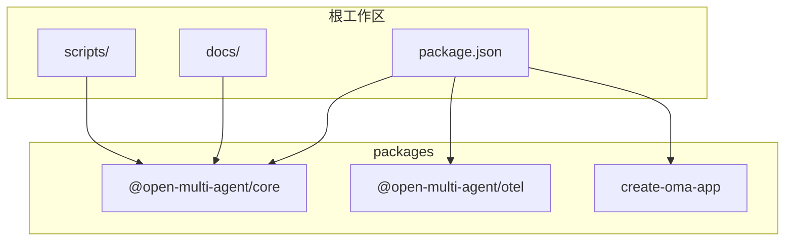
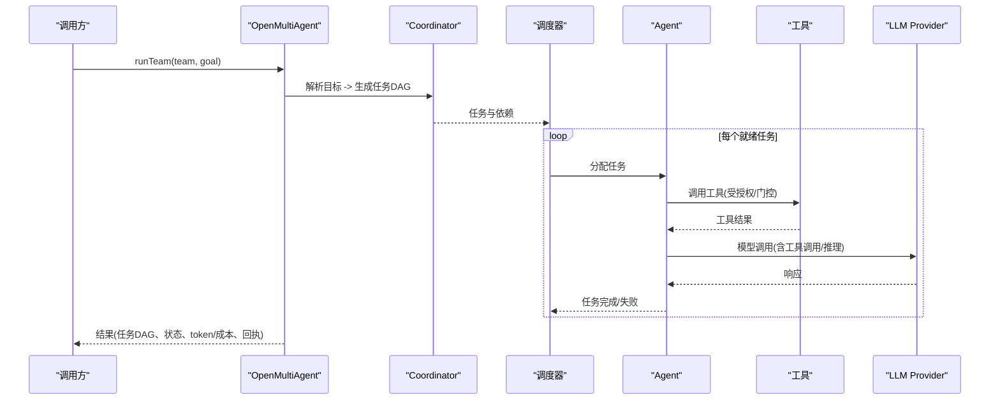
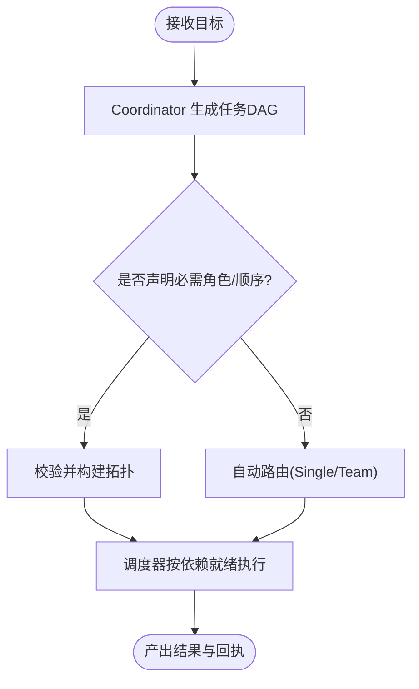
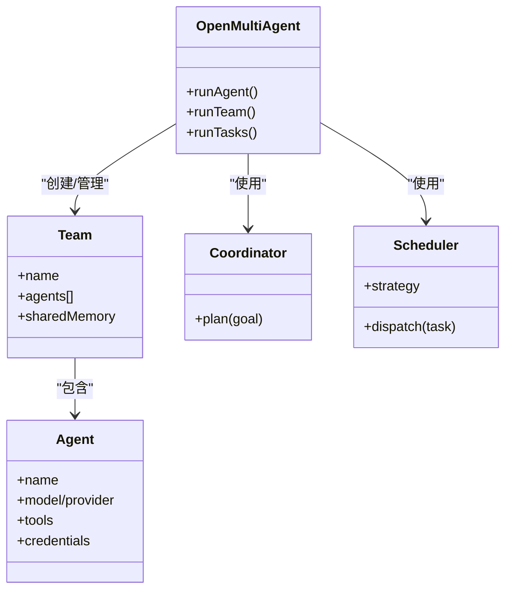
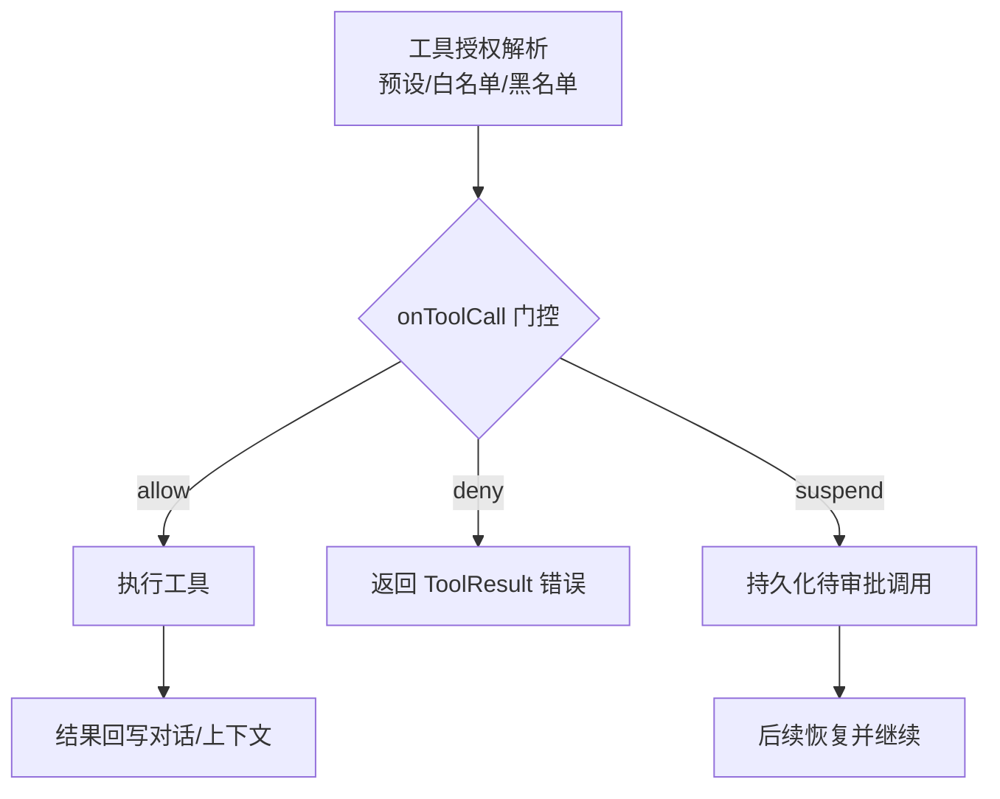
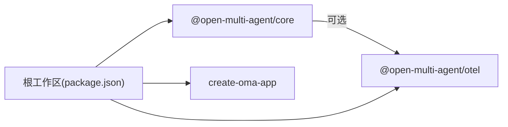

# 项目概述

<cite>
**本文引用的文件**
- [README.md](file://README.md)
- [README_zh.md](file://README_zh.md)
- [package.json](file://package.json)
- [AGENTS.md](file://AGENTS.md)
- [providers.md](file://docs/providers.md)
- [tool-configuration.md](file://docs/tool-configuration.md)
- [core README](file://packages/core/README.md)
</cite>

## 目录
1. [简介](#简介)
2. [项目结构](#项目结构)
3. [核心组件](#核心组件)
4. [架构总览](#架构总览)
5. [详细组件分析](#详细组件分析)
6. [依赖关系分析](#依赖关系分析)
7. [性能与可靠性](#性能与可靠性)
8. [故障排查指南](#故障排查指南)
9. [结论](#结论)
10. [附录：快速开始与对比](#附录快速开始与对比)

## 简介
Open Multi-Agent（OMA）是一个面向 TypeScript 后端的“多智能体编排框架”，可嵌入任意 Node.js 应用。其核心价值主张是“只描述目标，不画任务图”：通过 Coordinator 在运行时将目标动态分解为任务 DAG，由确定性调度器分派给团队执行，并以结构化数据贯穿全程，便于审查、审批、回放与评测。它强调可控执行、可靠恢复、可观测与评测、安全隐私以及开放运行时，使多智能体系统从原型走向生产。

- 设计理念
  - 动态工作流：以目标驱动生成任务图，避免手工维护固定流程。
  - 受控执行：支持计划预览与审批、固化计划重放、拓扑不可漂移时的必需角色与顺序约束。
  - 可靠性：断点续跑、仅追加式计划修复、重试/超时/环路检测、Token 与成本预算上限。
  - 可观测与评测：稳定运行标识、执行回执、Trace、离线 Run Viewer、可选 OpenTelemetry 集成；同一记录支撑 EvalSet、报告与 CI gate。
  - 安全与隐私：工具默认拒绝、逐次调用门控、隐私控制。
  - 开放运行时：进程与 ACP 后端让 CLI/Agent 与 LLM Agent 同处一个 DAG，共享记忆与预算；混用云端、本地、国产模型与 AI SDK provider。

- 适用场景
  - 需要多个智能体协作、存在任务依赖、审批或恢复机制的编排层问题。
  - 希望任务图随目标动态生成的 TypeScript 团队。

**章节来源**
- [README.md:15-108](file://README.md#L15-L108)
- [README_zh.md:15-108](file://README_zh.md#L15-L108)

## 项目结构
仓库采用 npm workspaces 的多包结构，核心能力集中在 `@open-multi-agent/core`，配套提供企业级可观测性适配器与脚手架模板。

- 根工作区
  - 脚本与文档：scripts/、docs/、.github/
  - 包定义：package.json（声明 workspaces 与统一命令）

- 子包
  - packages/core：编排运行时、工具、记忆、checkpoint、trace、CLI、离线 Run Viewer
  - packages/otel：可选 OpenTelemetry 适配器
  - packages/create-oma-app：脚手架与 starter 模板

**图表来源**
- [package.json:6-23](file://package.json#L6-L23)
- [AGENTS.md:9-15](file://AGENTS.md#L9-L15)

**章节来源**
- [package.json:1-34](file://package.json#L1-L34)
- [AGENTS.md:9-15](file://AGENTS.md#L9-L15)

## 核心组件
- OpenMultiAgent 编排器
  - 暴露三种模式：runAgent（单智能体）、runTeam（协调器自动生成任务 DAG）、runTasks（显式流水线）。
  - 负责调度、并发、上下文共享、结果聚合与可观测性。
- Team 与 Agent
  - Team 由一组 Agent 组成，可开启共享记忆；Agent 配置模型、工具、凭据、路由等。
- Coordinator 与调度器
  - Coordinator 将目标解析为任务 DAG 并分配执行；调度器按策略选择 Agent 并驱动依赖就绪的任务。
- 工具与沙箱
  - 内置工具默认拒绝，需显式授权；文件系统工具路径受限，bash 不受沙箱限制。
- Provider 适配层
  - 内置多家云厂商与本地服务，支持 OpenAI 兼容端点与 AI SDK 桥接。
- 可观测性与评测
  - Trace、Run Viewer、EvalSet、离线报告、CI gate；可选 OTel 集成。

**章节来源**
- [core README:49-111](file://packages/core/README.md#L49-L111)
- [tool-configuration.md:214-238](file://docs/tool-configuration.md#L214-L238)
- [providers.md:20-68](file://docs/providers.md#L20-L68)

## 架构总览
下图展示了 OMA 的核心交互：用户通过 runTeam/runAgent/runTasks 发起请求，Coordinator 生成任务 DAG，调度器将任务分派给 Agent，Agent 调用工具与 LLM Provider，所有执行过程被记录并可回放。

**图表来源**
- [core README:49-111](file://packages/core/README.md#L49-L111)
- [tool-configuration.md:326-360](file://docs/tool-configuration.md#L326-L360)
- [providers.md:20-68](file://docs/providers.md#L20-L68)

## 详细组件分析

### 动态工作流编排与任务依赖图生成
- 目标驱动：传入自然语言目标，Coordinator 在运行时规划任务与依赖，无需手写流程图。
- 拓扑治理：可通过 governanceIntent/requiredRoles/requiredOrder 强制关键角色与顺序，确保合规与独立验证。
- 计划回放：支持 planOnly 预览、创建计划工件并 runFromPlan 重放，保证可重复与可审计。

**图表来源**
- [core README:149-185](file://packages/core/README.md#L149-L185)
- [tool-configuration.md:5-46](file://docs/tool-configuration.md#L5-L46)

**章节来源**
- [core README:149-185](file://packages/core/README.md#L149-L185)
- [tool-configuration.md:5-46](file://docs/tool-configuration.md#L5-L46)

### 智能体协作机制
- 团队与共享记忆：Team 内 Agent 可共享上下文，减少重复检索与提示膨胀。
- 能力匹配与调度策略：round-robin、least-busy、capability-match、dependency-first、composite 等策略，结合硬过滤与排名。
- 委派与边界：delegate_to_agent 仅在团队/任务模式下可用且需显式授权，防止越权与循环委派。

**图表来源**
- [core README:103-111](file://packages/core/README.md#L103-L111)
- [AGENTS.md:64-70](file://AGENTS.md#L64-L70)

**章节来源**
- [core README:103-111](file://packages/core/README.md#L103-L111)
- [AGENTS.md:64-70](file://AGENTS.md#L64-L70)

### 工具系统与权限控制
- 默认拒绝：内置工具（bash、文件读写、grep/glob）必须显式授予；未授予则返回错误而非执行。
- 预设与白/黑名单：toolPreset/tools/disallowedTools 组合实现精细控制。
- 逐次门控：onToolCall 在输入校验后、执行前进行决策，支持 allow/deny/suspend；可结合风险分类器对 bash 分级处理。
- 沙箱：文件系统工具路径限制到 cwd/.agent-workspace（可配置），bash 无沙箱。

**图表来源**
- [tool-configuration.md:214-238](file://docs/tool-configuration.md#L214-L238)
- [tool-configuration.md:326-360](file://docs/tool-configuration.md#L326-L360)
- [tool-configuration.md:391-441](file://docs/tool-configuration.md#L391-L441)

**章节来源**
- [tool-configuration.md:214-238](file://docs/tool-configuration.md#L214-L238)
- [tool-configuration.md:326-360](file://docs/tool-configuration.md#L326-L360)
- [tool-configuration.md:391-441](file://docs/tool-configuration.md#L391-L441)

### Provider 与模型路由
- 内置 Provider：Anthropic、Gemini、OpenAI、Azure OpenAI、Copilot、Grok、DeepSeek、火山引擎、腾讯混元、MiniMax、MiMo、七牛、AWS Bedrock 等。
- OpenAI 兼容：任何实现 Chat Completions 的服务均可接入（如 Ollama、vLLM、LM Studio、OpenRouter、Groq、Mistral、智谱、阿里灵积、月之暗面、LiteLLM 等）。
- AI SDK 桥接：可选 AISdkAdapter 接入 ai-sdk 生态。
- 预算与治理：Token/成本预算上限、governanceIntent 与 requiredRoles/Order 保障关键路径。

**章节来源**
- [providers.md:20-68](file://docs/providers.md#L20-L68)
- [providers.md:70-110](file://docs/providers.md#L70-L110)
- [providers.md:111-135](file://docs/providers.md#L111-L135)

### 部署方式与生态系统集成
- 运行环境：Node.js 20+（推荐 22/24），可在本地、离线或气隙环境中运行。
- 部署形态：作为库嵌入现有后端；也可通过 create-oma-app 快速生成带本地 Demo 的项目。
- 生态集成：Process/ACP 后端、MCP 工具、第三方 Sidecar、HTTP 适配器等。

**章节来源**
- [README.md:48-65](file://README.md#L48-L65)
- [providers.md:5-9](file://docs/providers.md#L5-L9)
- [tool-configuration.md:675-709](file://docs/tool-configuration.md#L675-L709)

## 依赖关系分析
- 工作区耦合
  - core 为核心运行时，otel 为可选扩展，create-oma-app 为脚手架；三者通过根 package.json 统一管理。
- 外部依赖
  - Provider SDK 按需动态加载，保持 core 轻量；OpenAI 兼容协议降低接入成本。
- 发布与版本
  - 三个包独立版本，发布顺序与模板锁定见发布说明。

**图表来源**
- [package.json:6-23](file://package.json#L6-L23)
- [AGENTS.md:9-15](file://AGENTS.md#L9-L15)

**章节来源**
- [package.json:1-34](file://package.json#L1-L34)
- [AGENTS.md:9-15](file://AGENTS.md#L9-L15)

## 性能与可靠性
- 调度与并发
  - 事件驱动的任务 DAG 执行，依赖满足即启动；多种调度策略平衡负载与关键路径。
- 预算与边界
  - Token/成本预算上限，超限即停止；超时、重试、环路检测保障执行有界。
- 恢复与重放
  - Checkpoint 断点续跑；仅追加式计划修复；计划工件重放保证可重复。
- 可观测性
  - 稳定运行标识、执行回执、Trace、离线 Run Viewer；可选 OTel 接入统一监控。

**章节来源**
- [core README:187-200](file://packages/core/README.md#L187-L200)
- [providers.md:70-110](file://docs/providers.md#L70-L110)
- [AGENTS.md:72-86](file://AGENTS.md#L72-L86)

## 故障排查指南
- 工具未执行
  - 检查是否已授予内置工具；确认 onToolCall 未误拒；查看工具输出压缩与 rich result 映射。
- 模型未调用工具
  - 确认模型/Provider 支持 tool_calls；本地模型可使用文本提取兜底；必要时调整采样参数。
- 预算耗尽
  - 检查 maxTokenBudget/maxCostBudget 设置；注意一次模型轮次可能超出的边界。
- 治理未满足
  - 若声明 requiredRoles/Order，需检查执行回执中的 governanceConclusion；必要时调整 mode 或拓扑。
- 可观测性问题
  - 确认 Trace/Eval 存储与导出；区分遥测失败与业务失败。

**章节来源**
- [tool-configuration.md:326-360](file://docs/tool-configuration.md#L326-L360)
- [providers.md:157-186](file://docs/providers.md#L157-L186)
- [providers.md:70-110](file://docs/providers.md#L70-L110)
- [tool-configuration.md:5-46](file://docs/tool-configuration.md#L5-L46)
- [AGENTS.md:72-86](file://AGENTS.md#L72-L86)

## 结论
OMA 通过“目标驱动的动态编排”将多智能体协作从手工建模中解放出来，同时提供生产所需的控制、证据与恢复能力。它以开放的运行时、丰富的 Provider 支持与完善的可观测/评测体系，帮助团队在复杂场景中构建可靠、可审计、可扩展的多智能体系统。

[本节为总结性内容，不直接分析具体文件]

## 附录：快速开始与对比

### 快速开始
- 安装与初始化
  - 要求 Node.js 20+；使用脚手架一键创建示例项目，无需 API Key 即可运行本地 Demo。
  - 或在现有后端引入 @open-multi-agent/core。
- 最小示例
  - 创建 Team，定义若干 Agent，调用 runTeam 传入目标，框架会在运行时生成任务 DAG 并执行。
  - 结果包含任务列表、状态、负责人、依赖、token 用量与协调器输出。
- 运行与调试
  - 使用离线 Run Viewer 回放真实运行的任务 DAG 与 span 瀑布；或通过 OTel 接入统一监控。

**章节来源**
- [README.md:48-97](file://README.md#L48-L97)
- [README_zh.md:48-97](file://README_zh.md#L48-L97)
- [core README:57-101](file://packages/core/README.md#L57-L101)

### 与其他多智能体框架的对比要点
- 与 LangGraph/Mastra/CrewAI/Vercel AI SDK 等的逐项对比见官方对比页。
- OMA 的独特优势
  - 动态工作流：目标驱动生成任务图，避免手工维护固定流程。
  - 受控执行：计划预览/审批、固化重放、必需角色与顺序约束。
  - 可靠性：Checkpoint、仅追加修复、重试/超时/环路检测、Token/成本预算。
  - 可观测与评测：稳定标识、执行回执、Trace、离线 Run Viewer、EvalSet、CI gate。
  - 安全与隐私：工具默认拒绝、逐次门控、隐私控制。
  - 开放运行时：进程/ACP 后端、混用云端/本地/国产模型与 AI SDK。

**章节来源**
- [README.md:99-136](file://README.md#L99-L136)
- [README_zh.md:98-135](file://README_zh.md#L98-L135)