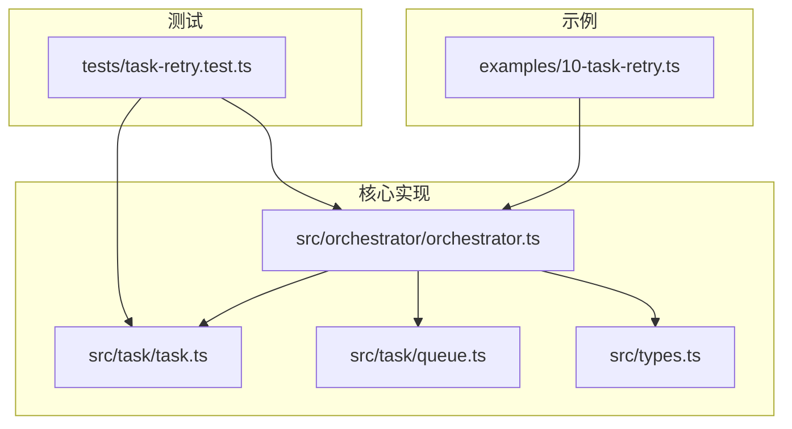
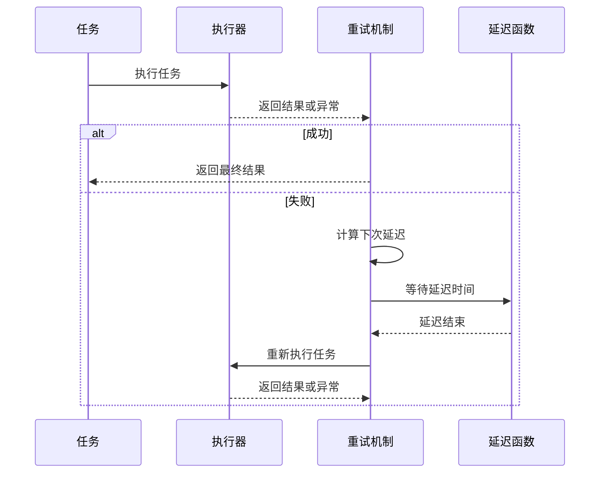
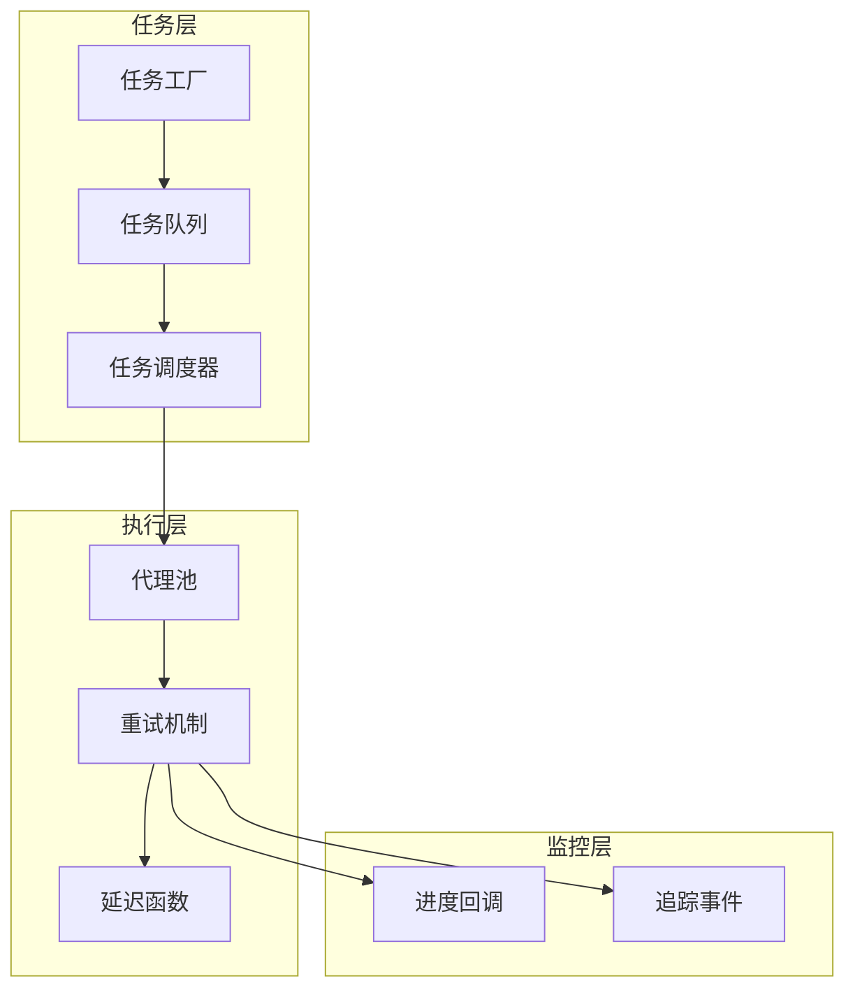
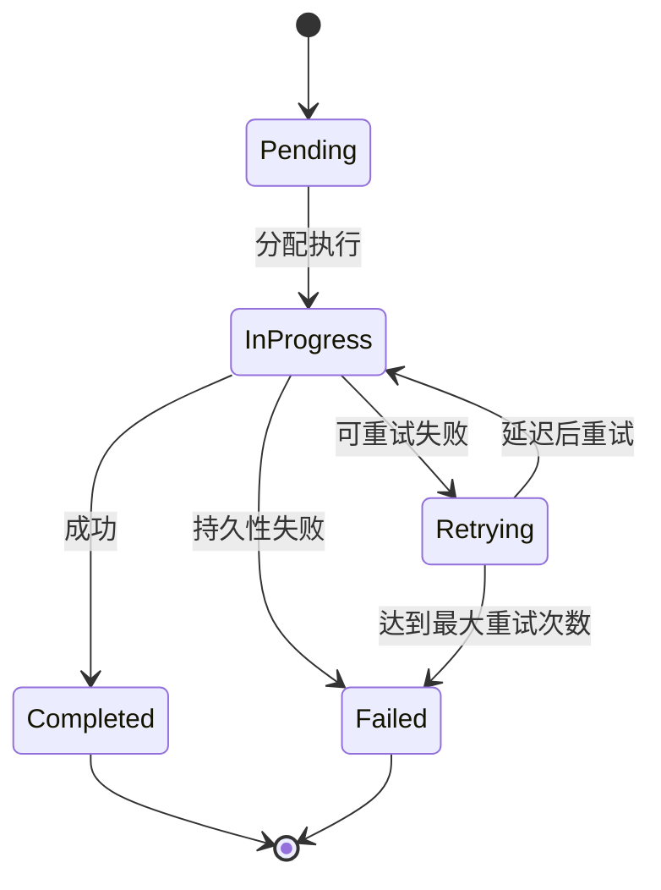
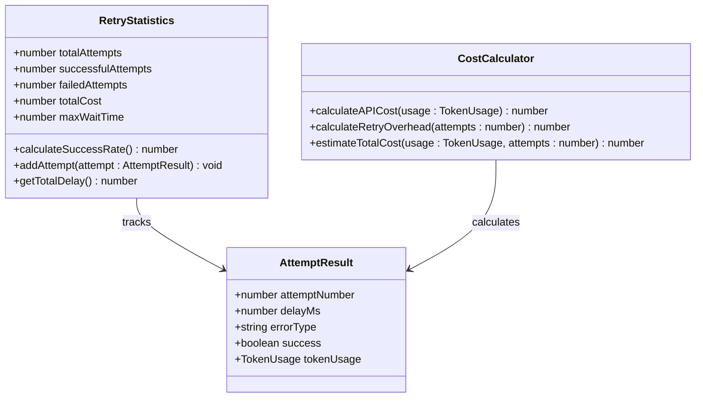
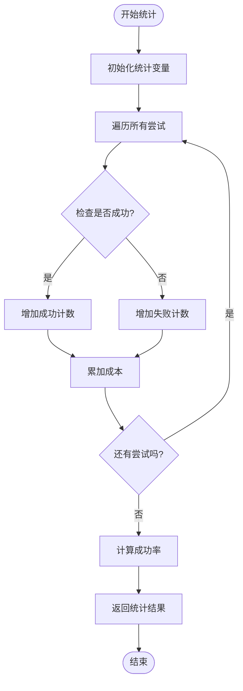
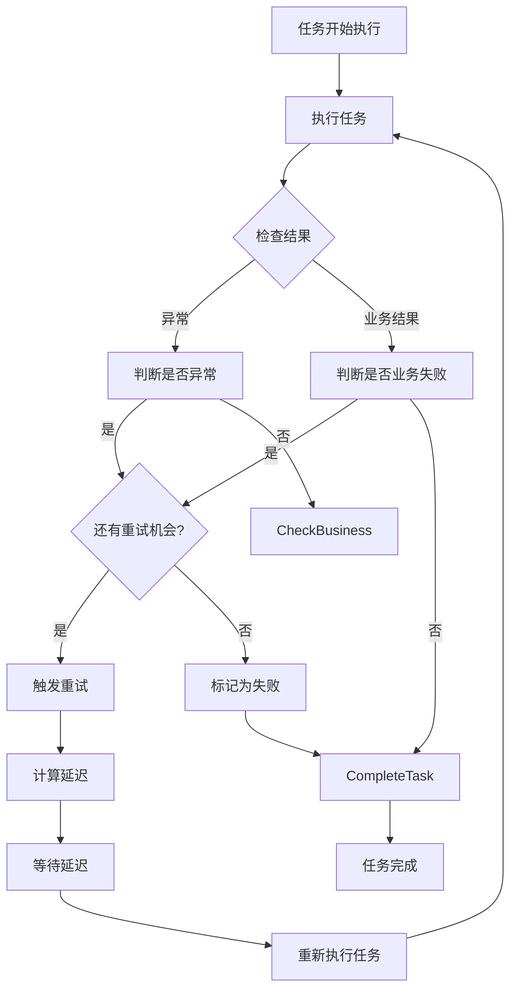
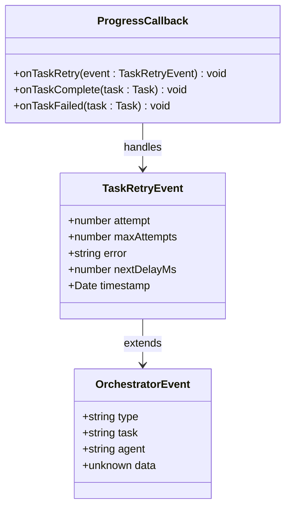
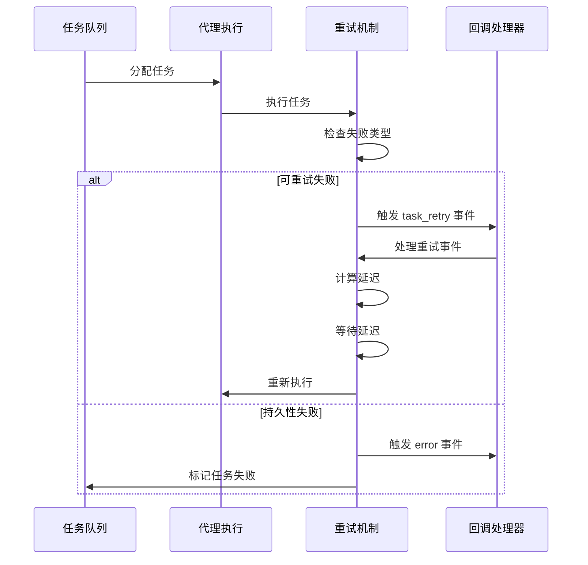
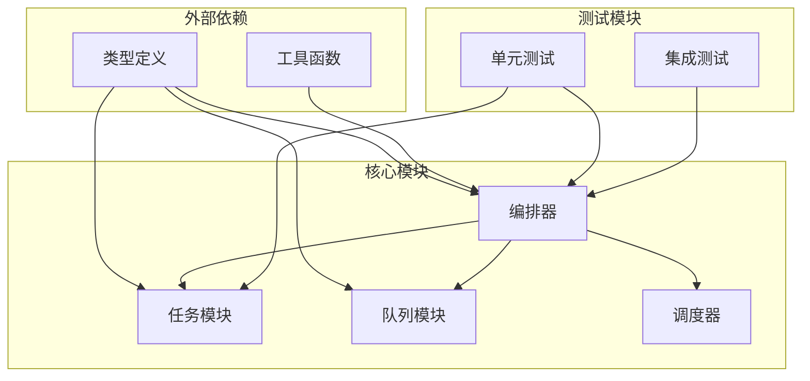

# 任务重试机制

<cite>
**本文档引用的文件**
- [examples/10-task-retry.ts](file://examples/10-task-retry.ts)
- [src/orchestrator/orchestrator.ts](file://src/orchestrator/orchestrator.ts)
- [src/task/task.ts](file://src/task/task.ts)
- [src/task/queue.ts](file://src/task/queue.ts)
- [src/types.ts](file://src/types.ts)
- [tests/task-retry.test.ts](file://tests/task-retry.test.ts)
</cite>

## 目录
1. [简介](#简介)
2. [项目结构](#项目结构)
3. [核心组件](#核心组件)
4. [架构概览](#架构概览)
5. [详细组件分析](#详细组件分析)
6. [依赖关系分析](#依赖关系分析)
7. [性能考虑](#性能考虑)
8. [故障排除指南](#故障排除指南)
9. [结论](#结论)
10. [附录](#附录)

## 简介

本文件详细阐述了 open-multi-agent 框架中的任务重试机制。该机制实现了基于指数退避算法的任务失败处理策略，支持可配置的重试次数、延迟时间和回退倍数。系统能够自动处理网络错误、API 限制和临时故障等不同类型的失败情况，并通过事件回调提供实时的重试进度跟踪。

重试机制的核心特点包括：
- 指数退避算法（可配置基础延迟和回退倍数）
- 最大延迟上限保护（防止无限增长）
- 失败统计和成本计算
- 细粒度的失败分类和处理
- 实时重试事件通知

## 项目结构

框架中与任务重试相关的文件组织如下：



**图表来源**
- [examples/10-task-retry.ts:1-133](file://examples/10-task-retry.ts#L1-L133)
- [src/orchestrator/orchestrator.ts:1-1072](file://src/orchestrator/orchestrator.ts#L1-L1072)
- [src/task/task.ts:1-240](file://src/task/task.ts#L1-L240)
- [src/task/queue.ts:1-465](file://src/task/queue.ts#L1-L465)
- [src/types.ts:1-543](file://src/types.ts#L1-L543)

**章节来源**
- [examples/10-task-retry.ts:1-133](file://examples/10-task-retry.ts#L1-L133)
- [src/orchestrator/orchestrator.ts:1-1072](file://src/orchestrator/orchestrator.ts#L1-L1072)

## 核心组件

### 任务重试配置

任务重试机制通过以下三个关键字段进行配置：

| 配置项 | 类型 | 默认值 | 描述 |
|--------|------|--------|------|
| maxRetries | number | 0 | 最大重试次数（默认不重试） |
| retryDelayMs | number | 1000 | 基础延迟时间（毫秒） |
| retryBackoff | number | 2 | 指数回退倍数 |

### 重试执行流程



**图表来源**
- [src/orchestrator/orchestrator.ts:127-194](file://src/orchestrator/orchestrator.ts#L127-L194)

**章节来源**
- [src/types.ts:352-358](file://src/types.ts#L352-L358)
- [src/task/task.ts:29-53](file://src/task/task.ts#L29-L53)

## 架构概览

### 整体架构设计



**图表来源**
- [src/orchestrator/orchestrator.ts:280-465](file://src/orchestrator/orchestrator.ts#L280-L465)
- [src/task/queue.ts:55-465](file://src/task/queue.ts#L55-L465)

### 重试状态管理



**图表来源**
- [src/task/queue.ts:131-158](file://src/task/queue.ts#L131-L158)
- [src/orchestrator/orchestrator.ts:369-434](file://src/orchestrator/orchestrator.ts#L369-L434)

## 详细组件分析

### 指数退避算法实现

#### 核心算法逻辑

指数退避算法通过以下公式计算每次重试的延迟时间：

```
delay = min(baseDelay × backoff^(attempt-1), maxDelay)
```

其中：
- `baseDelay`：基础延迟时间（毫秒）
- `backoff`：回退倍数（≥1）
- `attempt`：当前尝试次数（从1开始）
- `maxDelay`：最大延迟上限（30秒）

#### 参数验证和约束

```mermaid
flowchart TD
Start([开始重试]) --> ValidateParams[验证参数]
ValidateParams --> ClampRetries[钳制重试次数<br/>max(0, maxRetries)+1]
ClampRetries --> ClampDelay[钳制基础延迟<br/>max(0, retryDelayMs)]
ClampDelay --> ClampBackoff[钳制回退倍数<br/>max(1, retryBackoff)]
ClampBackoff --> CalcDelay[计算延迟时间]
CalcDelay --> CapDelay[应用最大延迟限制]
CapDelay --> ReturnDelay[返回延迟值]
ReturnDelay --> End([结束])
```

**图表来源**
- [src/orchestrator/orchestrator.ts:133-136](file://src/orchestrator/orchestrator.ts#L133-L136)
- [src/orchestrator/orchestrator.ts:108-114](file://src/orchestrator/orchestrator.ts#L108-L114)

#### 算法复杂度分析

- 时间复杂度：O(k)，其中 k 是重试次数
- 空间复杂度：O(1)
- 最大延迟：30秒（硬编码上限）

**章节来源**
- [src/orchestrator/orchestrator.ts:108-114](file://src/orchestrator/orchestrator.ts#L108-L114)
- [src/orchestrator/orchestrator.ts:133-136](file://src/orchestrator/orchestrator.ts#L133-L136)

### 失败处理策略

#### 失败类型识别

系统支持两种主要的失败处理模式：

1. **异常失败**：运行时抛出异常
2. **业务失败**：任务成功执行但返回失败状态

#### 失败统计机制



**图表来源**
- [src/orchestrator/orchestrator.ts:146-149](file://src/orchestrator/orchestrator.ts#L146-L149)
- [src/orchestrator/orchestrator.ts:176-182](file://src/orchestrator/orchestrator.ts#L176-L182)

#### 成功率计算



**图表来源**
- [tests/task-retry.test.ts:279-329](file://tests/task-retry.test.ts#L279-L329)

**章节来源**
- [src/orchestrator/orchestrator.ts:146-149](file://src/orchestrator/orchestrator.ts#L146-L149)
- [tests/task-retry.test.ts:279-329](file://tests/task-retry.test.ts#L279-L329)

### 重试触发条件

#### 触发条件分类

| 条件类型 | 触发条件 | 示例场景 |
|----------|----------|----------|
| 异常重试 | 运行时抛出异常 | 网络连接超时、API服务不可用 |
| 业务重试 | result.success=false | 业务逻辑验证失败、数据格式错误 |
| 持久性失败 | 达到最大重试次数 | 数据库连接失败、认证失败 |

#### 条件判断流程



**图表来源**
- [src/orchestrator/orchestrator.ts:143-184](file://src/orchestrator/orchestrator.ts#L143-L184)

**章节来源**
- [src/orchestrator/orchestrator.ts:143-184](file://src/orchestrator/orchestrator.ts#L143-L184)

### 事件回调系统

#### 重试事件结构



**图表来源**
- [src/orchestrator/orchestrator.ts:372-381](file://src/orchestrator/orchestrator.ts#L372-L381)
- [src/types.ts:370-383](file://src/types.ts#L370-L383)

#### 事件流处理



**图表来源**
- [src/orchestrator/orchestrator.ts:369-434](file://src/orchestrator/orchestrator.ts#L369-L434)

**章节来源**
- [src/orchestrator/orchestrator.ts:369-434](file://src/orchestrator/orchestrator.ts#L369-L434)

## 依赖关系分析

### 组件依赖图



**图表来源**
- [src/orchestrator/orchestrator.ts:44-65](file://src/orchestrator/orchestrator.ts#L44-L65)
- [src/task/task.ts:9-10](file://src/task/task.ts#L9-L10)
- [src/task/queue.ts:9](file://src/task/queue.ts#L9)

### 关键依赖关系

| 依赖方向 | 说明 | 影响范围 |
|----------|------|----------|
| Orchestrator → TaskModule | 使用任务工厂和依赖验证 | 任务创建和验证 |
| Orchestrator → QueueModule | 使用任务队列管理 | 任务生命周期管理 |
| Orchestrator → SchedulerModule | 使用调度策略 | 任务分配优化 |
| TaskModule → Types | 定义任务接口 | 类型安全保证 |
| QueueModule → TaskModule | 依赖任务状态 | 依赖关系解析 |

**章节来源**
- [src/orchestrator/orchestrator.ts:44-65](file://src/orchestrator/orchestrator.ts#L44-L65)
- [src/task/task.ts:9-10](file://src/task/task.ts#L9-L10)
- [src/task/queue.ts:9](file://src/task/queue.ts#L9)

## 性能考虑

### 时间复杂度分析

- **单任务重试**：O(k)，其中 k 是重试次数
- **批量重试**：O(n×k)，其中 n 是任务数量
- **延迟计算**：O(1) 每次重试
- **内存使用**：O(1) 额外空间（不包括任务结果）

### 性能优化建议

#### 1. 延迟函数注入

```typescript
// 自定义延迟函数以支持测试和性能监控
const customDelay = (ms: number): Promise<void> => {
  // 实现自定义延迟逻辑
  return new Promise(resolve => setTimeout(resolve, ms));
};

await executeWithRetry(run, task, onRetry, customDelay);
```

#### 2. 并行重试策略

对于独立任务，可以考虑：
- 使用 `Promise.all()` 并行执行多个任务
- 实施任务分组策略减少并发冲突
- 监控系统资源使用情况动态调整并发度

#### 3. 缓存和预热

- 预热代理池以减少首次请求延迟
- 缓存常用配置和依赖
- 实施连接池管理数据库连接

## 故障排除指南

### 常见问题诊断

#### 1. 重试未生效

**症状**：任务失败后立即标记为失败，无重试行为

**可能原因**：
- `maxRetries` 设置为 0 或未设置
- 任务配置未正确传递到执行器
- 回调函数未正确注册

**解决方案**：
```typescript
const task = createTask({
  title: '示例任务',
  description: '测试重试功能',
  maxRetries: 3,           // 确保设置重试次数
  retryDelayMs: 1000,      // 设置基础延迟
  retryBackoff: 2,         // 设置回退倍数
});
```

#### 2. 延迟时间异常

**症状**：重试间隔过长或过短

**可能原因**：
- 回退倍数设置不当
- 基础延迟过大
- 数值溢出导致延迟被截断

**解决方案**：
```typescript
// 检查参数范围
const baseDelay = Math.max(0, retryDelayMs || 1000);  // 至少1ms
const backoff = Math.max(1, retryBackoff || 2);       // 至少1
const maxAttempts = Math.max(0, maxRetries || 0) + 1; // 至少1次
```

#### 3. 成本统计不准确

**症状**：API费用统计与实际不符

**可能原因**：
- 仅统计最后一次尝试的成本
- 忽略了重试产生的额外费用

**解决方案**：
```typescript
// 确保累积所有尝试的成本
let totalUsage: TokenUsage = { input_tokens: 0, output_tokens: 0 };
for (let attempt = 1; attempt <= maxAttempts; attempt++) {
  const result = await run();
  totalUsage = {
    input_tokens: totalUsage.input_tokens + result.tokenUsage.input_tokens,
    output_tokens: totalUsage.output_tokens + result.tokenUsage.output_tokens,
  };
}
```

### 调试技巧

#### 1. 启用详细日志

```typescript
function handleProgress(event: OrchestratorEvent): void {
  switch (event.type) {
    case 'task_retry':
      const retryData = event.data as { attempt: number; maxAttempts: number; error: string; nextDelayMs: number };
      console.log(`重试事件: 尝试${retryData.attempt}/${retryData.maxAttempts}, 错误: ${retryData.error}`);
      break;
    case 'error':
      console.log(`任务失败: ${event.data}`);
      break;
  }
}
```

#### 2. 监控重试统计

```typescript
let retryCount = 0;
let totalDelay = 0;

const onRetry = (data: { attempt: number; maxAttempts: number; error: string; nextDelayMs: number }) => {
  retryCount++;
  totalDelay += data.nextDelayMs;
  console.log(`第${retryCount}次重试，总延迟: ${totalDelay}ms`);
};
```

**章节来源**
- [examples/10-task-retry.ts:47-67](file://examples/10-task-retry.ts#L47-L67)
- [tests/task-retry.test.ts:107-137](file://tests/task-retry.test.ts#L107-L137)

## 结论

open-multi-agent 框架的重试机制提供了完整而灵活的任务失败处理解决方案。通过指数退避算法、详细的配置选项和强大的事件回调系统，该机制能够有效应对各种类型的失败情况。

### 主要优势

1. **灵活性**：支持多种重试策略和配置选项
2. **可观测性**：完整的事件回调和追踪支持
3. **可靠性**：内置的最大延迟保护和参数验证
4. **性能**：高效的算法实现和内存使用

### 最佳实践建议

1. **合理配置重试参数**：根据任务特性和SLA要求设置合适的重试次数和延迟
2. **监控和告警**：建立重试统计和异常告警机制
3. **成本控制**：定期审查重试成本并优化配置
4. **测试覆盖**：确保重试逻辑在各种失败场景下都能正常工作

## 附录

### 配置示例

#### 基础重试配置

```typescript
const basicTask = {
  title: '数据获取任务',
  description: '从API获取数据',
  assignee: 'dataFetcher',
  maxRetries: 3,
  retryDelayMs: 1000,
  retryBackoff: 2,
};
```

#### 高级重试配置

```typescript
const advancedTask = {
  title: '复杂分析任务',
  description: '执行复杂的多步骤分析',
  assignee: 'analyst',
  dependsOn: ['数据获取任务'],
  maxRetries: 5,
  retryDelayMs: 500,
  retryBackoff: 1.5,
};
```

#### 无重试配置

```typescript
const noRetryTask = {
  title: '一次性任务',
  description: '不需要重试的任务',
  assignee: 'worker',
  // 不设置重试参数
};
```

### API参考

#### 重试相关函数

| 函数名 | 参数 | 返回值 | 描述 |
|--------|------|--------|------|
| `executeWithRetry` | run, task, onRetry, delayFn | AgentRunResult | 执行带重试的任务 |
| `computeRetryDelay` | baseDelay, backoff, attempt | number | 计算重试延迟 |
| `createTask` | config | Task | 创建带重试配置的任务 |

#### 事件类型

| 事件类型 | 数据结构 | 触发时机 |
|----------|----------|----------|
| `task_retry` | `{ attempt, maxAttempts, error, nextDelayMs }` | 重试前触发 |
| `task_complete` | AgentRunResult | 任务成功完成 |
| `error` | string | 任务失败 |
| `task_skipped` | Task | 任务被跳过 |

**章节来源**
- [examples/10-task-retry.ts:88-105](file://examples/10-task-retry.ts#L88-L105)
- [src/types.ts:370-383](file://src/types.ts#L370-L383)