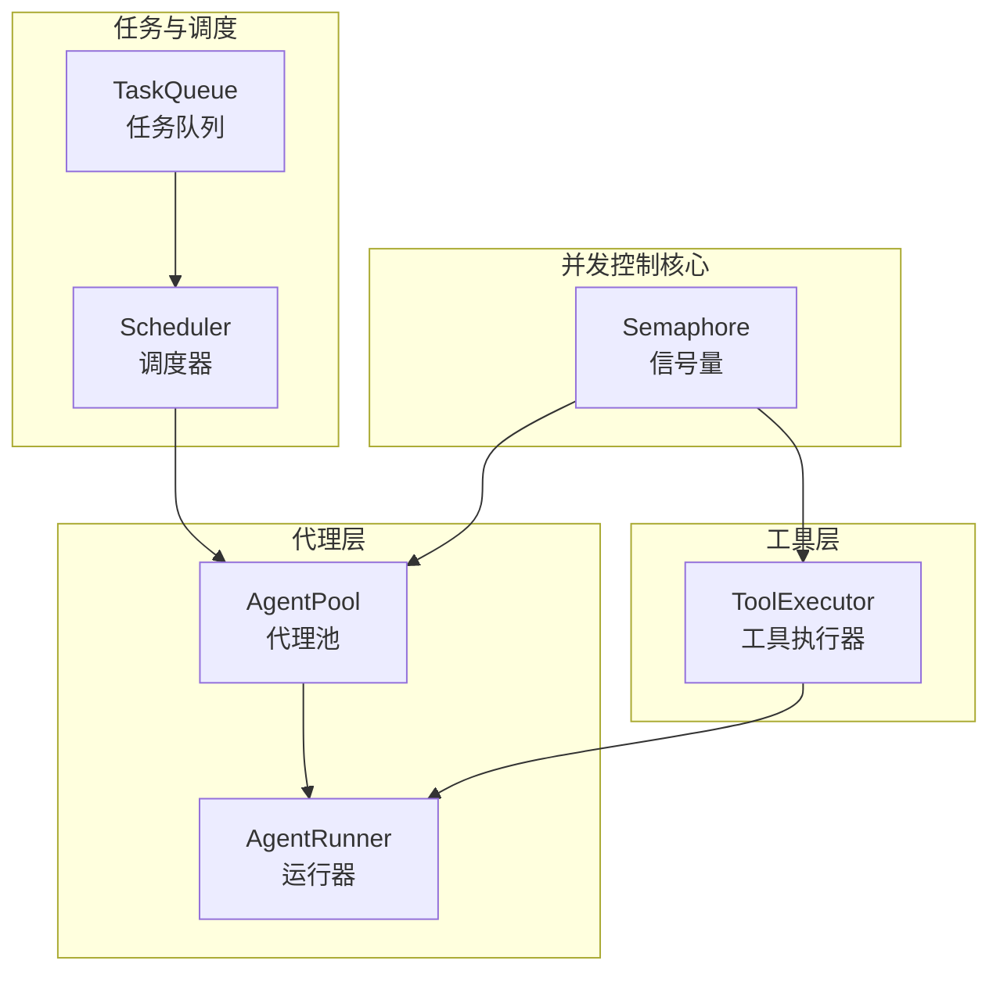
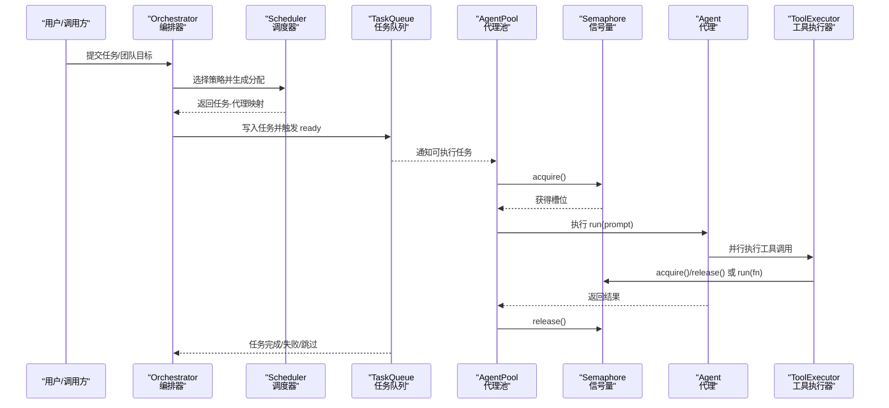
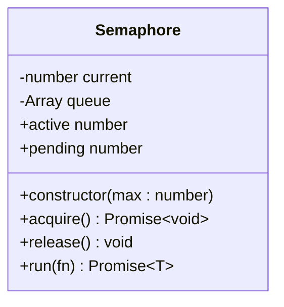
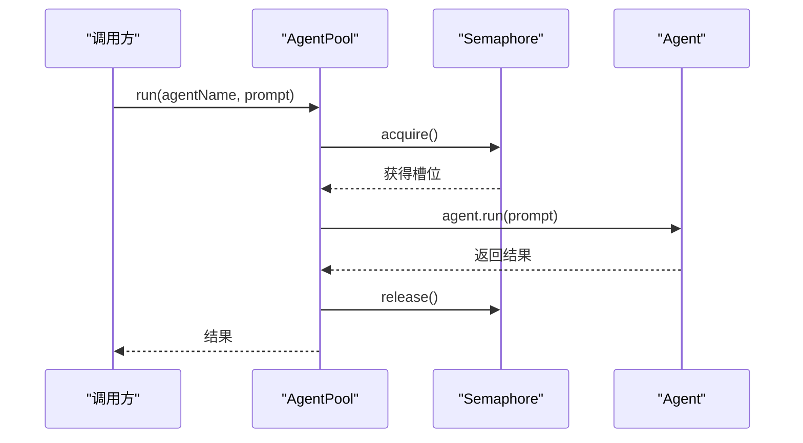
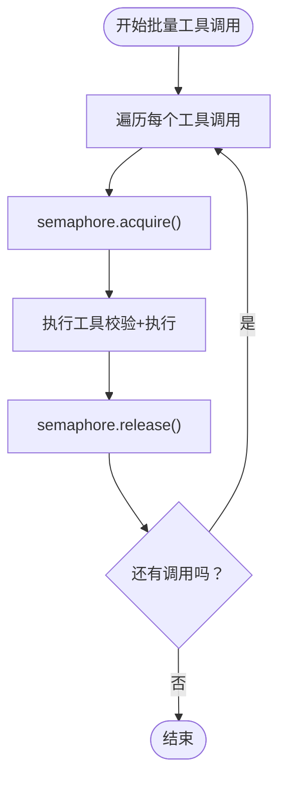
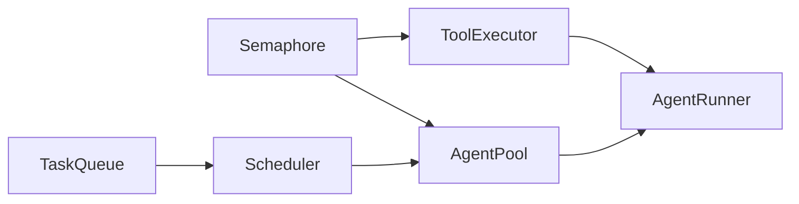

# 并发控制

<cite>
**本文引用的文件**
- [src/utils/semaphore.ts](file://src/utils/semaphore.ts)
- [src/agent/pool.ts](file://src/agent/pool.ts)
- [src/tool/executor.ts](file://src/tool/executor.ts)
- [src/orchestrator/scheduler.ts](file://src/orchestrator/scheduler.ts)
- [src/task/queue.ts](file://src/task/queue.ts)
- [src/orchestrator/orchestrator.ts](file://src/orchestrator/orchestrator.ts)
- [src/agent/runner.ts](file://src/agent/runner.ts)
- [tests/semaphore.test.ts](file://tests/semaphore.test.ts)
- [examples/03-task-pipeline.ts](file://examples/03-task-pipeline.ts)
- [examples/02-team-collaboration.ts](file://examples/02-team-collaboration.ts)
</cite>

## 目录
1. [简介](#简介)
2. [项目结构与并发控制相关模块](#项目结构与并发控制相关模块)
3. [核心组件：信号量（Semaphore）](#核心组件信号量semaphore)
4. [架构总览：并发控制在系统中的位置](#架构总览并发控制在系统中的位置)
5. [详细组件分析](#详细组件分析)
6. [依赖关系分析](#依赖关系分析)
7. [性能考量与优化策略](#性能考量与优化策略)
8. [故障排查指南](#故障排查指南)
9. [结论](#结论)
10. [附录：配置示例与最佳实践](#附录配置示例与最佳实践)

## 简介
本文件围绕框架内的并发控制机制展开，重点解释信号量（Semaphore）的设计原理与实现细节，并结合代理池（AgentPool）、工具执行器（ToolExecutor）、任务队列（TaskQueue）与调度器（Scheduler）等组件，系统阐述：
- 资源计数器管理、等待队列处理与公平性保证
- 在代理池中的应用：并发执行限制、资源分配策略与死锁预防
- 并发安全机制：异步操作保护、状态同步与异常处理
- 性能优化策略：并发度调优、资源利用率监控与瓶颈识别
- 配置示例：并发限制、超时参数与资源回收策略
- 对系统稳定性与性能的影响及最佳实践

## 项目结构与并发控制相关模块
并发控制主要由以下模块协同完成：
- 通用信号量：用于统一限制并发异步操作数量
- 工具执行器：批量工具调用的并发控制与错误隔离
- 代理池：多代理并发运行的统一调度与资源配额
- 调度器：任务到代理的分配策略，间接影响并发负载
- 任务队列：依赖感知的任务生命周期管理，避免阻塞与死锁
- 运行器：单代理对话循环中工具调用的并发执行
- 示例与测试：验证并发限制、公平性与异常处理行为

图表来源
- [src/utils/semaphore.ts:24-89](file://src/utils/semaphore.ts#L24-L89)
- [src/agent/pool.ts:58-70](file://src/agent/pool.ts#L58-L70)
- [src/tool/executor.ts:47-54](file://src/tool/executor.ts#L47-L54)
- [src/orchestrator/scheduler.ts:127-136](file://src/orchestrator/scheduler.ts#L127-L136)
- [src/task/queue.ts:55-62](file://src/task/queue.ts#L55-L62)
- [src/agent/runner.ts:166-176](file://src/agent/runner.ts#L166-L176)

章节来源
- [src/utils/semaphore.ts:1-90](file://src/utils/semaphore.ts#L1-L90)
- [src/agent/pool.ts:1-286](file://src/agent/pool.ts#L1-L286)
- [src/tool/executor.ts:1-179](file://src/tool/executor.ts#L1-L179)
- [src/orchestrator/scheduler.ts:1-353](file://src/orchestrator/scheduler.ts#L1-L353)
- [src/task/queue.ts:1-465](file://src/task/queue.ts#L1-L465)
- [src/agent/runner.ts:1-543](file://src/agent/runner.ts#L1-L543)

## 核心组件：信号量（Semaphore）
信号量是并发控制的基础构件，采用“计数+等待队列”的设计，确保在单线程事件循环中安全地限制并发异步操作数量。

- 设计要点
  - 计数器 current：当前已占用的并发槽位数
  - 等待队列 queue：按 FIFO 排队的 Promise 解析函数
  - 公平性：后进入 acquire 的调用总是被排队，释放时优先唤醒队首
  - 自动释放：run(fn) 包裹执行并在 finally 中释放，保证异常场景不泄漏

- 关键方法
  - acquire：若未达上限则立即获得；否则返回 Promise 并入队
  - release：若有等待者则直接移交一个槽位给队首；否则仅减少计数
  - run：自动 acquire/release 的便捷封装，适合一次性任务
  - active/pending：可观测当前占用与排队人数

- 线程安全与公平性
  - Node.js 单线程模型下，无需原子或互斥原语
  - 通过 Promise 队列实现 FIFO 公平调度，避免饥饿

- 测试验证
  - 构造上限为 N 的信号量，同时发起 M 次并发请求，峰值占用不超过 N
  - run 成功与抛错均会自动释放，active 始终回到 0
  - active/pending 计数与队列长度一致

章节来源
- [src/utils/semaphore.ts:15-89](file://src/utils/semaphore.ts#L15-L89)
- [tests/semaphore.test.ts:1-58](file://tests/semaphore.test.ts#L1-L58)

## 架构总览：并发控制在系统中的位置
并发控制贯穿从任务分解、分配、执行到结果聚合的全链路。信号量作为统一的并发门控，分别作用于：
- 代理池：限制同一时刻所有代理的运行数量
- 工具执行器：限制同一时刻工具调用的数量
- 任务队列：通过依赖解除与事件驱动，避免无谓的并发堆积
- 调度器：选择合适的策略以平衡吞吐与公平

图表来源
- [src/orchestrator/orchestrator.ts:1-200](file://src/orchestrator/orchestrator.ts#L1-L200)
- [src/orchestrator/scheduler.ts:127-198](file://src/orchestrator/scheduler.ts#L127-L198)
- [src/task/queue.ts:55-198](file://src/task/queue.ts#L55-L198)
- [src/agent/pool.ts:58-140](file://src/agent/pool.ts#L58-L140)
- [src/utils/semaphore.ts:24-89](file://src/utils/semaphore.ts#L24-L89)
- [src/tool/executor.ts:47-121](file://src/tool/executor.ts#L47-L121)

## 详细组件分析

### 信号量（Semaphore）类图

图表来源
- [src/utils/semaphore.ts:24-89](file://src/utils/semaphore.ts#L24-L89)

章节来源
- [src/utils/semaphore.ts:1-90](file://src/utils/semaphore.ts#L1-L90)

### 代理池（AgentPool）与并发执行
- 并发限制
  - 构造时传入 maxConcurrency，内部持有 Semaphore 实例
  - run/runParallel/runAny 在执行前 acquire，完成后 release
- 资源分配策略
  - run：直接按名称调度，受全局并发限制
  - runParallel：并发执行多个任务，但可能因同名代理冲突导致覆盖
  - runAny：轮询选择下一个可用代理，仍受并发限制
- 死锁预防
  - 通过 acquire/release 的严格配对与 finally 保障释放
  - 与任务队列配合，避免代理空转等待
- 可观测性
  - getStatus 统计各状态代理数量，便于监控并发与健康度

图表来源
- [src/agent/pool.ts:127-140](file://src/agent/pool.ts#L127-L140)
- [src/utils/semaphore.ts:41-65](file://src/utils/semaphore.ts#L41-L65)

章节来源
- [src/agent/pool.ts:58-286](file://src/agent/pool.ts#L58-L286)

### 工具执行器（ToolExecutor）与并发控制
- 并发限制
  - 构造时传入 maxConcurrency，默认 4；内部持有 Semaphore
  - executeBatch 使用 semaphore.run 包裹每个工具调用，确保并发受控
- 错误隔离
  - execute 将未知工具名、Zod 校验失败、执行异常统一封装为 ToolResult，不抛出异常
- 与运行器协作
  - AgentRunner 在每轮对话中并行执行工具调用，内部也使用 ToolExecutor 的并发控制

图表来源
- [src/tool/executor.ts:105-121](file://src/tool/executor.ts#L105-L121)
- [src/utils/semaphore.ts:71-78](file://src/utils/semaphore.ts#L71-L78)

章节来源
- [src/tool/executor.ts:47-179](file://src/tool/executor.ts#L47-L179)

### 调度器（Scheduler）与并发策略
- 四种策略
  - round-robin：均匀分配，适合简单均衡
  - least-busy：根据 in_progress 数量选择最闲代理，提升吞吐
  - capability-match：基于关键词匹配选择更合适的代理
  - dependency-first：优先关键路径任务，兼顾公平与延迟
- 与并发的关系
  - 策略本身不直接限制并发，但会影响任务分发的负载分布
  - 与 AgentPool 的并发限制共同决定实际并发度

章节来源
- [src/orchestrator/scheduler.ts:127-353](file://src/orchestrator/scheduler.ts#L127-L353)

### 任务队列（TaskQueue）与并发安全
- 依赖解除与事件驱动
  - 任务初始状态根据依赖解析，完成后扫描并解除阻塞，触发 ready 事件
  - 通过事件驱动避免轮询，降低无效并发
- 失败与跳过的级联传播
  - fail/skip 递归传播，防止下游任务长期阻塞
- 完整性检测
  - isComplete 与进度统计，便于上层判断何时回收资源

章节来源
- [src/task/queue.ts:55-465](file://src/task/queue.ts#L55-L465)

### 运行器（AgentRunner）与并发执行
- 工具调用并行化
  - 每轮对话提取工具调用块，使用 Promise.all 并行执行
  - 每个工具调用通过 ToolExecutor 控制并发
- 循环与超时
  - 支持 maxTurns 与 AbortSignal，避免无限循环与资源浪费
- 观测与追踪
  - 通过 onTrace/onMessage/onToolCall/onToolResult 提供细粒度回调

章节来源
- [src/agent/runner.ts:166-543](file://src/agent/runner.ts#L166-L543)

## 依赖关系分析
并发控制相关模块之间的依赖关系如下：

图表来源
- [src/utils/semaphore.ts:24-89](file://src/utils/semaphore.ts#L24-L89)
- [src/agent/pool.ts:58-70](file://src/agent/pool.ts#L58-L70)
- [src/tool/executor.ts:47-54](file://src/tool/executor.ts#L47-L54)
- [src/orchestrator/scheduler.ts:127-136](file://src/orchestrator/scheduler.ts#L127-L136)
- [src/task/queue.ts:55-62](file://src/task/queue.ts#L55-L62)
- [src/agent/runner.ts:166-176](file://src/agent/runner.ts#L166-L176)

章节来源
- [src/utils/semaphore.ts:1-90](file://src/utils/semaphore.ts#L1-L90)
- [src/agent/pool.ts:1-286](file://src/agent/pool.ts#L1-L286)
- [src/tool/executor.ts:1-179](file://src/tool/executor.ts#L1-L179)
- [src/orchestrator/scheduler.ts:1-353](file://src/orchestrator/scheduler.ts#L1-L353)
- [src/task/queue.ts:1-465](file://src/task/queue.ts#L1-L465)
- [src/agent/runner.ts:1-543](file://src/agent/runner.ts#L1-L543)

## 性能考量与优化策略
- 并发度调优
  - 代理池：根据 LLM 适配器与工具调用特性设置 maxConcurrency，避免过载
  - 工具执行器：根据外部服务限流与网络带宽设置 maxConcurrency
- 资源利用率监控
  - 利用 AgentPool 的状态快照与 Semaphore 的 active/pending 指标观察并发水位
  - 通过 onProgress/onTrace 获取任务完成时间与工具耗时
- 瓶颈识别
  - 若 pending 持续增长，可能是上游依赖未及时完成或下游代理处理慢
  - 若 active 长期接近上限且 pending 较低，可适当提高并发度
- 死锁预防
  - 严格遵循 acquire/release 配对，异常路径使用 finally 释放
  - 任务队列 fail/skip 的级联传播避免下游长期阻塞

[本节为通用指导，无需特定文件来源]

## 故障排查指南
- 并发限制导致的卡顿
  - 检查 Semaphore.active/pending 是否持续升高
  - 确认是否存在未释放的 acquire（例如异常未捕获）
- 工具调用失败
  - ToolExecutor 将错误封装为 ToolResult，检查 isError 字段与 data
  - 确认输入 Schema 与 AbortSignal 状态
- 代理池异常
  - 确认代理名称是否正确注册，避免 runParallel 同名覆盖
  - 检查 AgentPool 的状态快照，定位 error 状态代理
- 任务队列阻塞
  - 使用 getProgress 查看 blocked/pending/in_progress 分布
  - 检查依赖链是否形成环或上游任务未完成

章节来源
- [tests/semaphore.test.ts:1-58](file://tests/semaphore.test.ts#L1-L58)
- [src/tool/executor.ts:171-179](file://src/tool/executor.ts#L171-L179)
- [src/agent/pool.ts:218-234](file://src/agent/pool.ts#L218-L234)
- [src/task/queue.ts:312-360](file://src/task/queue.ts#L312-L360)

## 结论
该框架通过轻量、自包含的信号量实现，将并发控制下沉为可复用的基础设施，分别在代理池、工具执行器与运行器中落地。配合任务队列的依赖感知与调度器的策略选择，系统在保证公平性与稳定性的同时，提供了良好的可观测性与可调优空间。实践中应结合业务负载与外部依赖的限流情况，合理设置并发度并持续监控资源利用率，以获得最佳的吞吐与延迟表现。

[本节为总结，无需特定文件来源]

## 附录：配置示例与最佳实践
- 设置代理池并发度
  - 在创建 Orchestrator 时传入 maxConcurrency，或在 Team 配置中指定
  - 示例参考：示例 02 团队协作中将 maxConcurrency 设为 1 以保证输出顺序清晰
- 设置工具执行器并发度
  - ToolExecutorOptions 中的 maxConcurrency 默认 4，可根据外部服务限流调整
- 设置运行器超时与中止
  - RunnerOptions/RunOptions 支持 AbortSignal，可在单次调用或全局层面中止
- 设置任务重试与延迟
  - Orchestrator 提供 executeWithRetry，支持最大重试次数、基础延迟与退避系数
- 监控与可观测性
  - 使用 AgentPool.getStatus、TaskQueue.getProgress、Semaphore.active/pending
  - 通过 onProgress/onTrace/onToolCall/onToolResult 获取实时事件

章节来源
- [examples/02-team-collaboration.ts:103-114](file://examples/02-team-collaboration.ts#L103-L114)
- [src/tool/executor.ts:21-27](file://src/tool/executor.ts#L21-L27)
- [src/agent/runner.ts:45-104](file://src/agent/runner.ts#L45-L104)
- [src/orchestrator/orchestrator.ts:127-194](file://src/orchestrator/orchestrator.ts#L127-L194)
- [src/agent/pool.ts:218-234](file://src/agent/pool.ts#L218-L234)
- [src/task/queue.ts:312-360](file://src/task/queue.ts#L312-L360)
- [src/utils/semaphore.ts:80-89](file://src/utils/semaphore.ts#L80-L89)