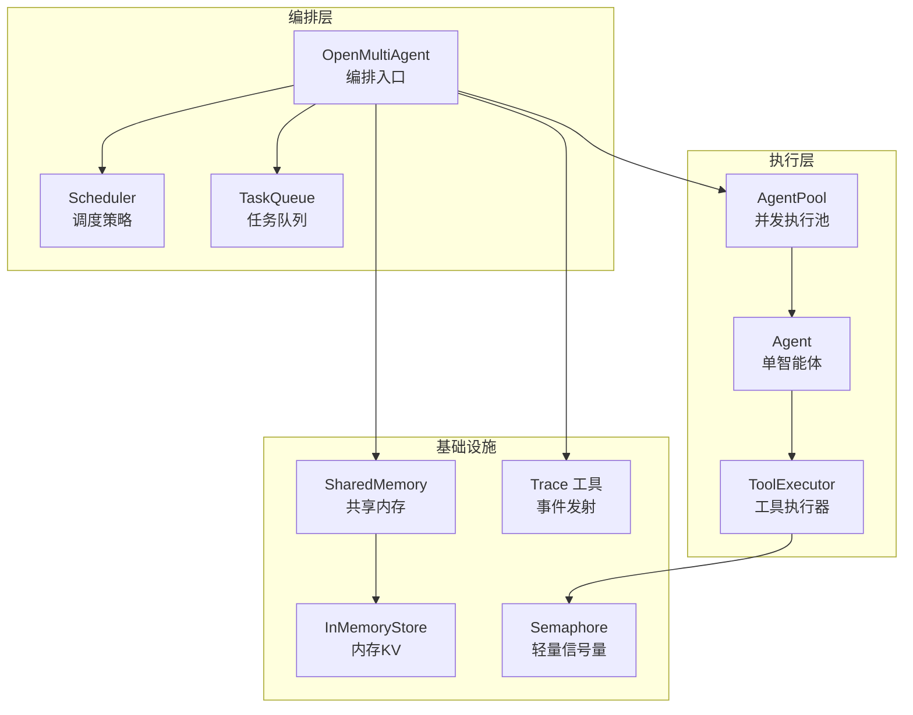
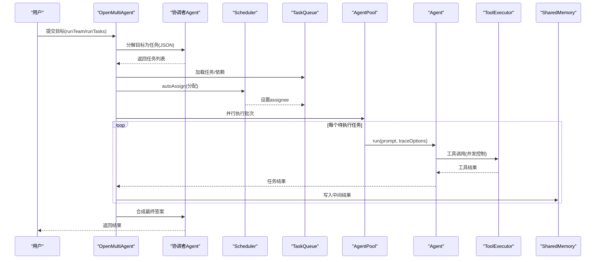
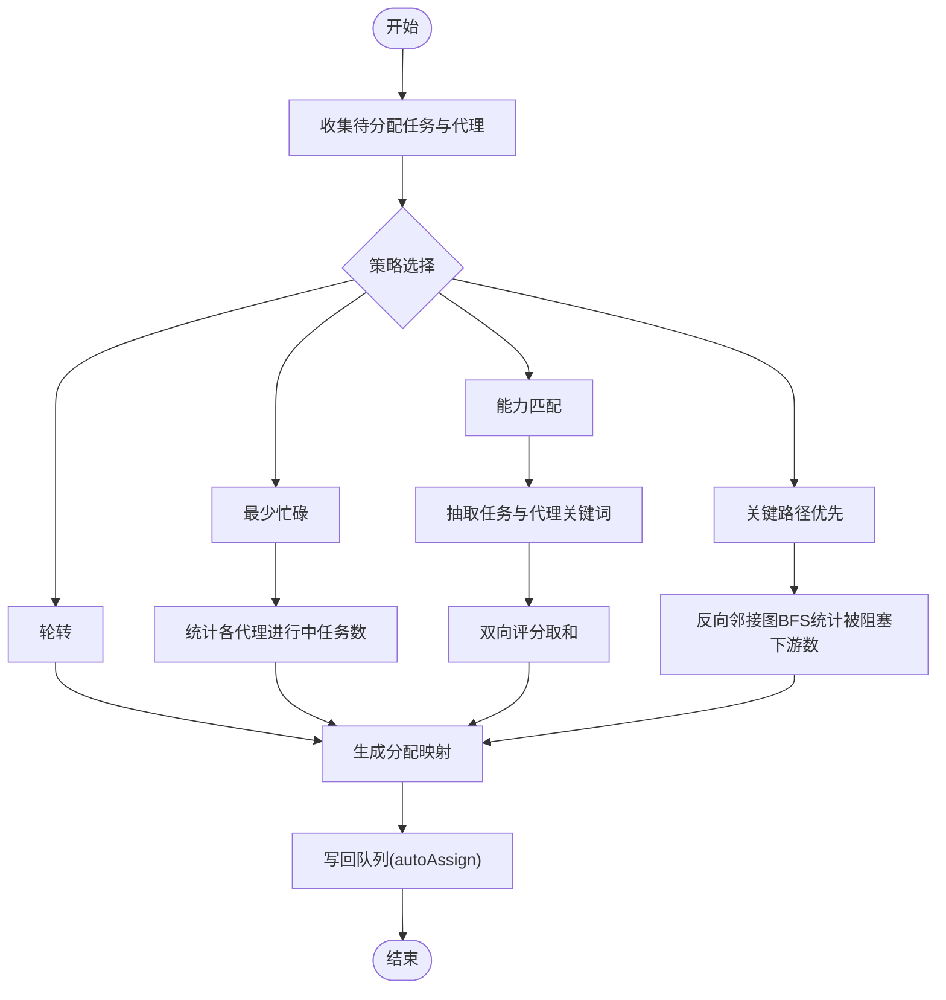
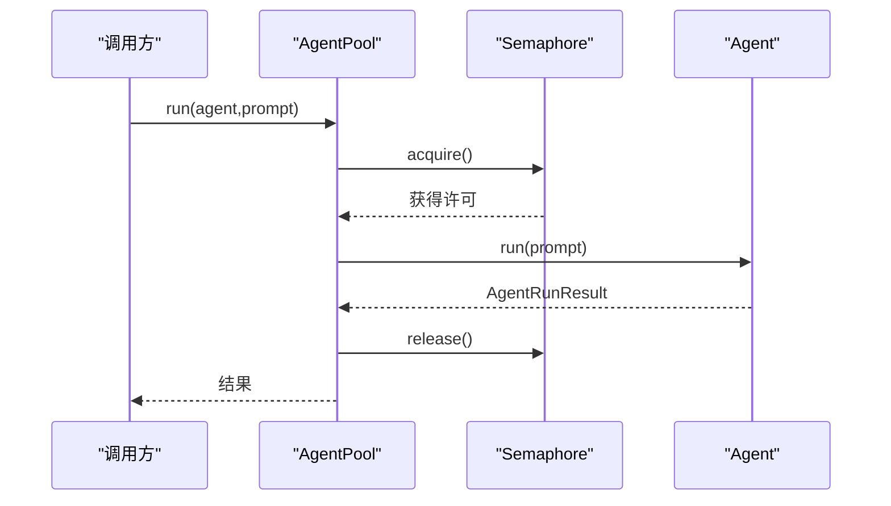
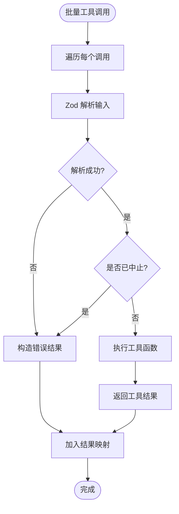
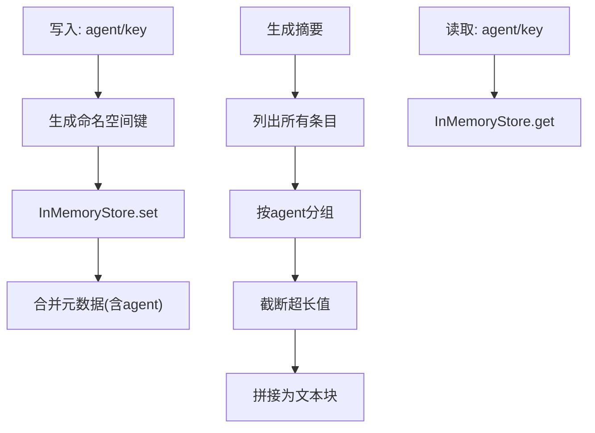
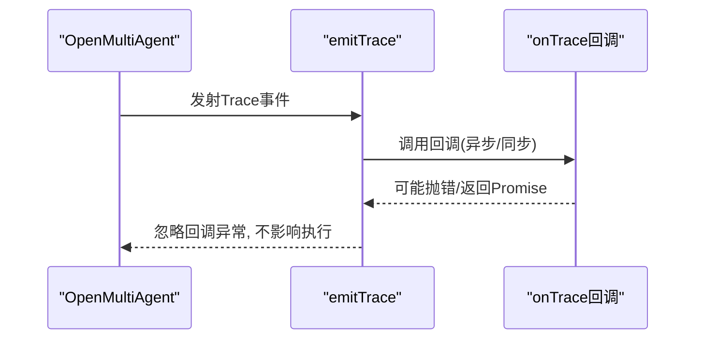
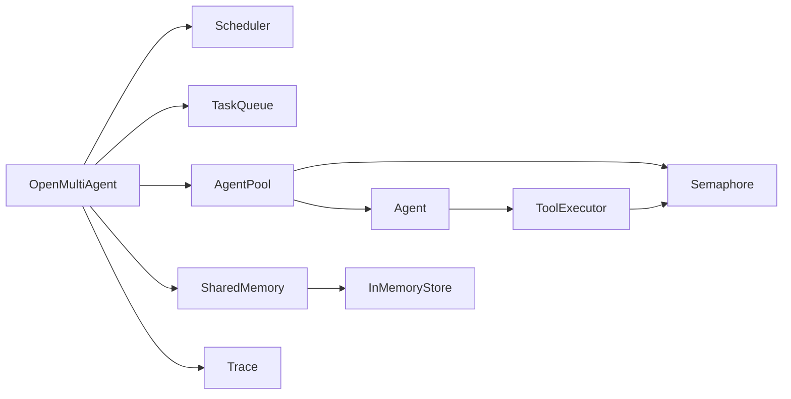

# 性能优化

<cite>
**本文引用的文件**
- [README.md](file://README.md)
- [package.json](file://package.json)
- [src/index.ts](file://src/index.ts)
- [src/orchestrator/orchestrator.ts](file://src/orchestrator/orchestrator.ts)
- [src/orchestrator/scheduler.ts](file://src/orchestrator/scheduler.ts)
- [src/agent/pool.ts](file://src/agent/pool.ts)
- [src/tool/executor.ts](file://src/tool/executor.ts)
- [src/utils/semaphore.ts](file://src/utils/semaphore.ts)
- [src/utils/trace.ts](file://src/utils/trace.ts)
- [src/memory/shared.ts](file://src/memory/shared.ts)
- [src/memory/store.ts](file://src/memory/store.ts)
- [src/types.ts](file://src/types.ts)
- [tests/agent-pool.test.ts](file://tests/agent-pool.test.ts)
- [tests/scheduler.test.ts](file://tests/scheduler.test.ts)
- [tests/semaphore.test.ts](file://tests/semaphore.test.ts)
- [vitest.config.ts](file://vitest.config.ts)
</cite>

## 目录
1. [引言](#引言)
2. [项目结构](#项目结构)
3. [核心组件](#核心组件)
4. [架构总览](#架构总览)
5. [详细组件分析](#详细组件分析)
6. [依赖关系分析](#依赖关系分析)
7. [性能考量与优化建议](#性能考量与优化建议)
8. [故障排查指南](#故障排查指南)
9. [结论](#结论)
10. [附录：性能测试与基准测试](#附录性能测试与基准测试)

## 引言
本指南面向在生产环境中运行多智能体系统的工程团队，聚焦于该代码库中的并发执行策略、资源分配与负载均衡、缓存机制（响应/结果/网络）、内存管理、CPU 使用优化、监控指标与生产部署调优，以及性能测试与基准测试方法。文档以“可读性优先”的方式组织，既适合初学者快速上手，也提供足够深度的技术细节供资深工程师参考。

## 项目结构
该仓库采用按功能域分层的模块化组织方式：
- orchestrator：编排器与调度器，负责任务分解、队列与调度策略
- agent：单智能体执行、循环检测、结构化输出
- tool：工具注册表与执行器，支持并发控制与批量执行
- memory：共享内存与键值存储
- utils：通用工具（信号量、追踪）
- types：公共类型定义
- tests：覆盖并发、调度、内存等关键路径

图表来源
- [src/orchestrator/orchestrator.ts:514-800](file://src/orchestrator/orchestrator.ts#L514-L800)
- [src/orchestrator/scheduler.ts:127-353](file://src/orchestrator/scheduler.ts#L127-L353)
- [src/agent/pool.ts:58-286](file://src/agent/pool.ts#L58-L286)
- [src/tool/executor.ts:47-179](file://src/tool/executor.ts#L47-L179)
- [src/memory/shared.ts:36-182](file://src/memory/shared.ts#L36-L182)
- [src/utils/semaphore.ts:24-90](file://src/utils/semaphore.ts#L24-L90)
- [src/utils/trace.ts:12-35](file://src/utils/trace.ts#L12-L35)

章节来源
- [README.md:137-179](file://README.md#L137-L179)
- [src/index.ts:57-117](file://src/index.ts#L57-L117)

## 核心组件
- 并发控制与限流：通过轻量信号量限制工具调用与智能体执行的并发度，避免资源争用与过载
- 调度策略：轮转、最少忙碌、能力匹配、关键路径优先，平衡吞吐与延迟
- 执行池：统一管理多个智能体的并发执行，支持并行与任意派发
- 工具执行器：批量工具调用、输入校验、错误隔离与并发控制
- 共享内存：命名空间化的键值存储，支持摘要生成注入上下文，减少重复传输
- 追踪与可观测：结构化事件发射，零侵入回调，便于性能观测与问题定位

章节来源
- [src/utils/semaphore.ts:24-90](file://src/utils/semaphore.ts#L24-L90)
- [src/orchestrator/scheduler.ts:127-353](file://src/orchestrator/scheduler.ts#L127-L353)
- [src/agent/pool.ts:58-286](file://src/agent/pool.ts#L58-L286)
- [src/tool/executor.ts:47-179](file://src/tool/executor.ts#L47-L179)
- [src/memory/shared.ts:36-182](file://src/memory/shared.ts#L36-L182)
- [src/utils/trace.ts:12-35](file://src/utils/trace.ts#L12-L35)

## 架构总览
下图展示从目标到最终结果的关键流程：编排器构建任务图，调度器分配任务，执行池并发执行，工具执行器保障并发安全，共享内存跨智能体传递中间结果，追踪系统贯穿全程。

图表来源
- [src/orchestrator/orchestrator.ts:641-740](file://src/orchestrator/orchestrator.ts#L641-L740)
- [src/orchestrator/scheduler.ts:187-198](file://src/orchestrator/scheduler.ts#L187-L198)
- [src/agent/pool.ts:153-180](file://src/agent/pool.ts#L153-L180)
- [src/tool/executor.ts:105-121](file://src/tool/executor.ts#L105-L121)
- [src/memory/shared.ts:58-69](file://src/memory/shared.ts#L58-L69)

## 详细组件分析

### 组件A：调度器（Scheduler）与任务队列
- 策略选择
  - 轮转：均匀分配，适合简单负载均衡
  - 最少忙碌：基于当前进行中任务数选择空闲者，适合动态负载
  - 能力匹配：基于关键词重叠评分，提升任务与智能体适配度
  - 关键路径优先：统计被阻塞下游数量，优先分配能加速全局的任务
- 关键算法
  - 反向邻接图 + BFS 计算被阻塞下游数量，复杂度与边数线性相关
  - 关键词提取与评分，过滤停用词，降低误匹配
- 并发与一致性
  - 策略无状态，每次分配基于快照；autoAssign 将结果写回队列，保证一致性

图表来源
- [src/orchestrator/scheduler.ts:50-75](file://src/orchestrator/scheduler.ts#L50-L75)
- [src/orchestrator/scheduler.ts:211-222](file://src/orchestrator/scheduler.ts#L211-L222)
- [src/orchestrator/scheduler.ts:231-267](file://src/orchestrator/scheduler.ts#L231-L267)
- [src/orchestrator/scheduler.ts:276-315](file://src/orchestrator/scheduler.ts#L276-L315)
- [src/orchestrator/scheduler.ts:325-351](file://src/orchestrator/scheduler.ts#L325-L351)

章节来源
- [src/orchestrator/scheduler.ts:127-353](file://src/orchestrator/scheduler.ts#L127-L353)
- [tests/scheduler.test.ts:23-79](file://tests/scheduler.test.ts#L23-L79)
- [tests/scheduler.test.ts:85-119](file://tests/scheduler.test.ts#L85-L119)
- [tests/scheduler.test.ts:125-153](file://tests/scheduler.test.ts#L125-L153)
- [tests/scheduler.test.ts:159-184](file://tests/scheduler.test.ts#L159-L184)

### 组件B：执行池（AgentPool）与信号量
- 并发控制
  - 基于信号量限制同时运行的智能体数量，防止外部 LLM 或工具调用导致的资源耗尽
  - runParallel 使用 Promise.allSettled 收集结果，失败以统一结构返回，不中断整体流程
- 负载均衡
  - runAny 实现轮转派发，结合信号量确保并发上限
- 观测与健康
  - 提供池状态快照，便于外部监控

图表来源
- [src/agent/pool.ts:127-140](file://src/agent/pool.ts#L127-L140)
- [src/agent/pool.ts:153-180](file://src/agent/pool.ts#L153-L180)
- [src/agent/pool.ts:192-209](file://src/agent/pool.ts#L192-L209)
- [src/utils/semaphore.ts:41-65](file://src/utils/semaphore.ts#L41-L65)

章节来源
- [src/agent/pool.ts:58-286](file://src/agent/pool.ts#L58-L286)
- [tests/agent-pool.test.ts:182-211](file://tests/agent-pool.test.ts#L182-L211)
- [tests/agent-pool.test.ts:95-124](file://tests/agent-pool.test.ts#L95-L124)
- [tests/agent-pool.test.ts:126-145](file://tests/agent-pool.test.ts#L126-L145)

### 组件C：工具执行器（ToolExecutor）与并发控制
- 输入校验：使用 Zod 对工具输入进行解析与校验，提前失败，避免无效调用
- 并发控制：通过信号量限制工具调用并发度，executeBatch 保证每个调用都有结果映射
- 错误隔离：所有异常转换为工具结果，避免抛出至调用链外
- 中止信号：支持 AbortSignal，长耗时工具可被及时取消

图表来源
- [src/tool/executor.ts:105-121](file://src/tool/executor.ts#L105-L121)
- [src/tool/executor.ts:132-169](file://src/tool/executor.ts#L132-L169)

章节来源
- [src/tool/executor.ts:47-179](file://src/tool/executor.ts#L47-L179)
- [tests/semaphore.test.ts:9-25](file://tests/semaphore.test.ts#L9-L25)

### 组件D：共享内存与上下文注入
- 命名空间写入：以“代理名/键”形式写入，避免冲突并保留归属信息
- 摘要生成：将所有条目按代理分组，截断超长值，便于注入到智能体上下文窗口
- 存储接口：默认内存实现，可替换为持久化后端

图表来源
- [src/memory/shared.ts:58-69](file://src/memory/shared.ts#L58-L69)
- [src/memory/shared.ts:127-159](file://src/memory/shared.ts#L127-L159)
- [src/memory/store.ts:31-35](file://src/memory/store.ts#L31-L35)

章节来源
- [src/memory/shared.ts:36-182](file://src/memory/shared.ts#L36-L182)
- [src/memory/store.ts:31-35](file://src/memory/store.ts#L31-L35)

### 组件E：追踪与可观测（Trace）
- 安全发射：回调异常被捕获，不影响主执行路径
- 运行标识：生成唯一 runId，贯穿任务、代理、工具调用事件
- 事件结构：包含起止时间、耗时、重试次数、成功与否等

图表来源
- [src/utils/trace.ts:12-35](file://src/utils/trace.ts#L12-L35)
- [src/orchestrator/orchestrator.ts:384-398](file://src/orchestrator/orchestrator.ts#L384-L398)

章节来源
- [src/utils/trace.ts:12-35](file://src/utils/trace.ts#L12-L35)
- [src/orchestrator/orchestrator.ts:362-398](file://src/orchestrator/orchestrator.ts#L362-L398)

## 依赖关系分析
- 运行时依赖
  - @anthropic-ai/sdk、openai、zod：用于 LLM 适配与输入校验
  - 可选 peer 依赖 @google/genai：用于 Gemini 适配
- 内部耦合
  - 编排器依赖调度器、任务队列、执行池、共享内存与追踪
  - 执行池依赖信号量；工具执行器依赖信号量与工具注册表
  - 共享内存依赖内存存储实现

图表来源
- [src/orchestrator/orchestrator.ts:514-66](file://src/orchestrator/orchestrator.ts#L514-L66)
- [src/agent/pool.ts:26-28](file://src/agent/pool.ts#L26-L28)
- [src/tool/executor.ts:14-15](file://src/tool/executor.ts#L14-L15)
- [src/memory/shared.ts:10-11](file://src/memory/shared.ts#L10-L11)
- [package.json:45-57](file://package.json#L45-L57)

章节来源
- [package.json:45-57](file://package.json#L45-L57)
- [src/index.ts:57-117](file://src/index.ts#L57-L117)

## 性能考量与优化建议

### 并行执行策略与负载均衡
- 策略选择
  - 复杂管线优先“关键路径优先”，减少全局等待时间
  - 动态负载场景可用“最少忙碌”，自动避开繁忙代理
  - 能力匹配可提升任务-代理适配度，降低失败重试成本
- 并发上限
  - 通过 AgentPool 的最大并发与工具执行器的最大并发共同约束
  - 测试验证并发上限生效，避免过度竞争
- 批处理与流水线
  - runParallel 并发执行多个任务，结合 onApproval 批量审批，减少往返
  - 任务完成后立即写入共享内存，缩短后续任务等待时间

章节来源
- [src/orchestrator/scheduler.ts:127-174](file://src/orchestrator/scheduler.ts#L127-L174)
- [src/agent/pool.ts:153-180](file://src/agent/pool.ts#L153-L180)
- [tests/agent-pool.test.ts:182-211](file://tests/agent-pool.test.ts#L182-L211)

### 资源分配优化
- 信号量参数
  - 根据 LLM 速率限制与工具调用特性调整 AgentPool 与 ToolExecutor 的并发上限
  - 避免同时触发过多外部 API 请求，防止被限流或超时
- 代理容量规划
  - 依据代理平均执行时长与失败率估算合理并发度，留有余量应对峰值

章节来源
- [src/utils/semaphore.ts:24-90](file://src/utils/semaphore.ts#L24-L90)
- [src/tool/executor.ts:51-54](file://src/tool/executor.ts#L51-L54)

### 负载均衡技术
- 轮转与最少忙碌
  - 轮转保证长期公平；最少忙碌在短期内更均衡
- 关键路径优先
  - 优先释放关键瓶颈，缩短整体时延

章节来源
- [src/orchestrator/scheduler.ts:211-222](file://src/orchestrator/scheduler.ts#L211-L222)
- [src/orchestrator/scheduler.ts:231-267](file://src/orchestrator/scheduler.ts#L231-L267)
- [src/orchestrator/scheduler.ts:325-351](file://src/orchestrator/scheduler.ts#L325-L351)

### 缓存机制
- 响应缓存
  - 当前未内置 LLM 响应缓存；可通过在应用层对相同提示词的结果进行去重与缓存，注意上下文变化与模型参数差异
- 计算结果缓存
  - 工具执行结果可由调用方缓存，避免重复执行；注意输入完全一致才可复用
- 网络请求缓存
  - 对外部 API 的幂等查询可做缓存；结合 TTL 与失效策略
- 共享内存作为中间结果缓存
  - 通过 SharedMemory 将任务中间结果注入后续任务上下文，减少重复计算与传输

章节来源
- [src/memory/shared.ts:107-159](file://src/memory/shared.ts#L107-L159)

### 内存管理最佳实践
- 对象池与复用
  - 使用 AgentPool 与 SharedMemory 等集中式资源，避免频繁创建销毁
- 垃圾回收优化
  - 控制上下文大小，避免将超大字符串反复拼接；必要时拆分消息
- 内存泄漏预防
  - 仅在需要时持有长生命周期引用；及时清理监听器与定时器
- 存储替换
  - 生产环境建议替换为持久化存储实现，避免进程重启丢失

章节来源
- [src/agent/pool.ts:249-253](file://src/agent/pool.ts#L249-L253)
- [src/memory/shared.ts:170-172](file://src/memory/shared.ts#L170-L172)
- [src/memory/store.ts:31-35](file://src/memory/store.ts#L31-L35)

### CPU 使用优化
- 异步处理
  - 所有 I/O 与外部调用均采用异步，避免阻塞事件循环
- 批处理
  - 使用 runParallel 与 executeBatch 并发执行，提升吞吐
- 计算密集型任务
  - 将 CPU 密集型逻辑放入独立子进程或 Web Worker（如需扩展），当前实现以异步为主

章节来源
- [src/agent/pool.ts:153-180](file://src/agent/pool.ts#L153-L180)
- [src/tool/executor.ts:105-121](file://src/tool/executor.ts#L105-L121)

### 监控指标与可观测性
- 执行时间统计
  - 任务级耗时由追踪事件提供，包含开始/结束时间与持续时间
- 资源使用率监控
  - 结合并发度与等待队列长度评估资源占用
- 性能瓶颈识别
  - 通过 onProgress 与 onTrace 事件流定位慢任务、高失败率任务与长依赖链

章节来源
- [src/orchestrator/orchestrator.ts:362-398](file://src/orchestrator/orchestrator.ts#L362-L398)
- [src/utils/trace.ts:12-35](file://src/utils/trace.ts#L12-L35)

### 生产环境部署与调优
- 服务器配置
  - 保持 Node.js 版本满足要求；根据并发需求设置进程数与线程池大小
- 网络优化
  - 合理设置 LLM 适配器的超时与重试；对本地模型设置较长超时但有限重试
- 数据库/存储
  - 将共享内存替换为持久化存储，确保跨实例一致性
- 限流与熔断
  - 在编排层与工具层叠加信号量与超时，避免雪崩效应

章节来源
- [README.md:30-36](file://README.md#L30-L36)
- [src/orchestrator/orchestrator.ts:108-114](file://src/orchestrator/orchestrator.ts#L108-L114)
- [src/memory/shared.ts:170-172](file://src/memory/shared.ts#L170-L172)

## 故障排查指南
- 并发过高导致超时
  - 降低 AgentPool 与 ToolExecutor 的并发上限，观察等待队列长度
- 任务卡住
  - 检查依赖图与关键路径优先策略是否正确；确认 onApproval 是否阻塞
- 工具执行失败
  - 查看工具输入校验错误与异常结果；确认 AbortSignal 是否被触发
- 追踪回调异常
  - 回调内部异常不会影响主流程，但会吞掉错误；检查回调日志

章节来源
- [tests/agent-pool.test.ts:111-124](file://tests/agent-pool.test.ts#L111-L124)
- [tests/semaphore.test.ts:34-38](file://tests/semaphore.test.ts#L34-L38)
- [src/utils/trace.ts:24-26](file://src/utils/trace.ts#L24-L26)

## 结论
该框架通过“编排 + 调度 + 并发控制 + 共享内存 + 追踪”的组合，在多智能体协作场景下提供了良好的性能基础。生产落地时，建议围绕并发上限、关键路径优先、共享内存注入与可观测事件建立完整的性能闭环，并结合实际外部服务的 SLA 与成本进行参数调优。

## 附录：性能测试与基准测试
- 单元测试与覆盖率
  - 使用 Vitest 进行单元测试与覆盖率统计，覆盖并发、调度与信号量等关键路径
- 基准测试建议
  - 构造不同规模的任务图（节点数、边数、依赖深度），测量端到端时延与吞吐
  - 对比不同调度策略在相同工作负载下的表现
  - 评估不同并发度对延迟与成功率的影响
- 测试运行
  - 使用提供的脚本运行测试与覆盖率统计

章节来源
- [vitest.config.ts:4-15](file://vitest.config.ts#L4-L15)
- [package.json:19-26](file://package.json#L19-L26)