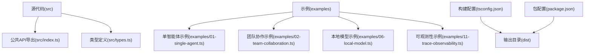
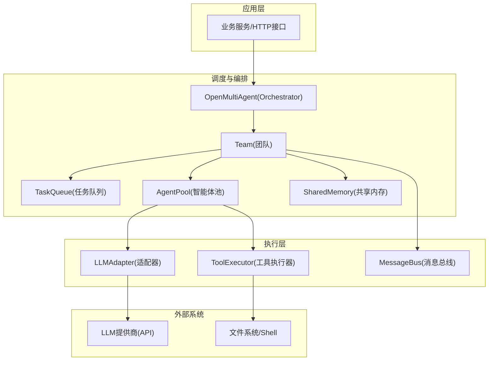
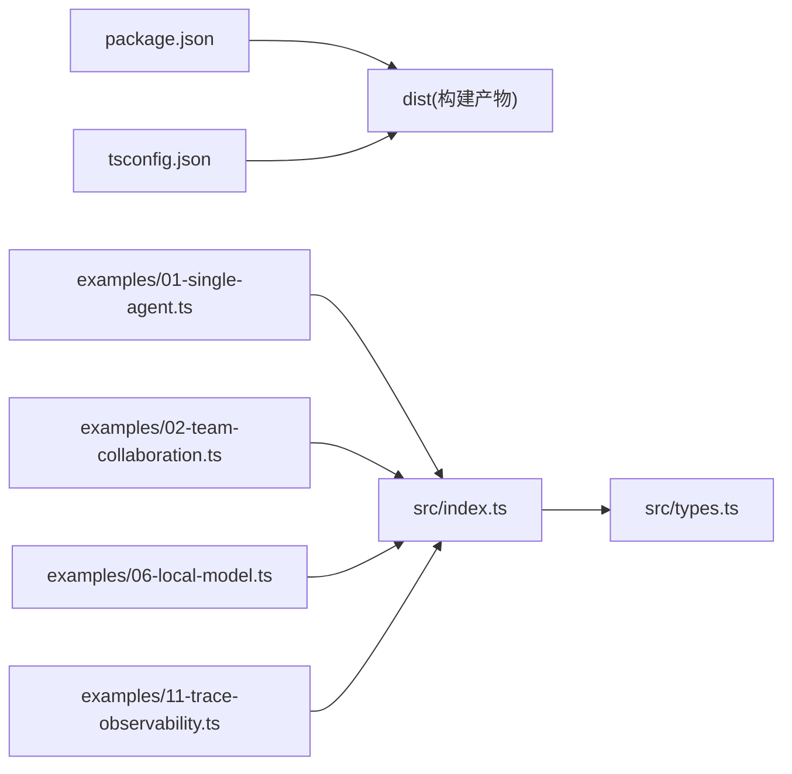

# 生产部署

<cite>
**本文引用的文件**
- [package.json](file://package.json)
- [README.md](file://README.md)
- [SECURITY.md](file://SECURITY.md)
- [tsconfig.json](file://tsconfig.json)
- [vitest.config.ts](file://vitest.config.ts)
- [src/index.ts](file://src/index.ts)
- [src/types.ts](file://src/types.ts)
- [examples/01-single-agent.ts](file://examples/01-single-agent.ts)
- [examples/02-team-collaboration.ts](file://examples/02-team-collaboration.ts)
- [examples/06-local-model.ts](file://examples/06-local-model.ts)
- [examples/11-trace-observability.ts](file://examples/11-trace-observability.ts)
</cite>

## 目录
1. [简介](#简介)
2. [项目结构](#项目结构)
3. [核心组件](#核心组件)
4. [架构总览](#架构总览)
5. [详细组件分析](#详细组件分析)
6. [依赖关系分析](#依赖关系分析)
7. [性能考量](#性能考量)
8. [故障排查指南](#故障排查指南)
9. [结论](#结论)
10. [附录](#附录)

## 简介
本指南面向在生产环境中部署基于 Node.js 的多智能体系统（open-multi-agent）。内容覆盖环境与依赖、容器化与编排、监控与日志、安全配置、扩展与高可用、故障恢复策略，以及部署检查清单与常见问题处理建议。目标是帮助团队以最小风险、可重复的方式完成从开发到生产的落地。

## 项目结构
该仓库采用模块化的 TypeScript 结构，核心入口导出统一 API，示例脚本演示典型用法，测试配置用于质量保障。生产部署时应关注以下关键点：
- 构建产物：通过 TypeScript 编译生成 dist 目录，供下游应用导入使用
- 运行时依赖：仅包含三个运行时依赖，降低外部耦合
- 示例与文档：README 提供环境变量与提供商配置说明，便于快速上手

图表来源
- [src/index.ts:1-183](file://src/index.ts#L1-L183)
- [src/types.ts:1-543](file://src/types.ts#L1-L543)
- [examples/01-single-agent.ts:1-132](file://examples/01-single-agent.ts#L1-L132)
- [examples/02-team-collaboration.ts:1-168](file://examples/02-team-collaboration.ts#L1-L168)
- [examples/06-local-model.ts:1-201](file://examples/06-local-model.ts#L1-L201)
- [examples/11-trace-observability.ts:1-134](file://examples/11-trace-observability.ts#L1-L134)
- [tsconfig.json:1-26](file://tsconfig.json#L1-L26)
- [package.json:1-67](file://package.json#L1-L67)

章节来源
- [package.json:1-67](file://package.json#L1-L67)
- [tsconfig.json:1-26](file://tsconfig.json#L1-L26)
- [README.md:1-281](file://README.md#L1-L281)

## 核心组件
- 公共 API 与导出：通过统一入口导出 Orchestrator、Agent、Team、Task、Tool 等能力，便于下游应用按需引入
- 类型系统：集中定义消息、工具、任务、追踪等核心类型，确保上下游一致性
- 示例脚本：展示单智能体、团队协作、本地模型混合、可观测性等典型场景

章节来源
- [src/index.ts:57-183](file://src/index.ts#L57-L183)
- [src/types.ts:104-543](file://src/types.ts#L104-L543)
- [examples/01-single-agent.ts:14-132](file://examples/01-single-agent.ts#L14-L132)
- [examples/02-team-collaboration.ts:15-168](file://examples/02-team-collaboration.ts#L15-L168)
- [examples/06-local-model.ts:25-201](file://examples/06-local-model.ts#L25-L201)
- [examples/11-trace-observability.ts:20-134](file://examples/11-trace-observability.ts#L20-L134)

## 架构总览
下图展示了生产部署中涉及的关键组件与交互路径：应用层（业务服务）通过 open-multi-agent 调度多智能体执行；智能体通过适配器对接不同 LLM 提供商；工具执行器负责本地工具调用；共享内存支持跨智能体信息传递；可观测性回调用于采集追踪事件。

图表来源
- [src/index.ts:57-117](file://src/index.ts#L57-L117)
- [src/types.ts:316-411](file://src/types.ts#L316-L411)
- [src/types.ts:526-543](file://src/types.ts#L526-L543)

## 详细组件分析

### 环境与依赖配置
- Node.js 版本要求：引擎字段明确要求 Node.js >= 18
- 运行时依赖：仅包含三个核心依赖，降低供应链风险
- 开发与测试依赖：包含 Vitest、TypeScript、覆盖率工具等
- 构建配置：严格类型检查、ESNext 模块解析、输出至 dist 目录

章节来源
- [package.json:42-49](file://package.json#L42-L49)
- [package.json:58-65](file://package.json#L58-L65)
- [tsconfig.json:2-22](file://tsconfig.json#L2-L22)

### 环境变量与提供商密钥
- 支持的提供商与对应环境变量：
  - Anthropic（Claude）：ANTHROPIC_API_KEY
  - OpenAI（GPT）：OPENAI_API_KEY
  - Grok（xAI）：XAI_API_KEY
  - GitHub Copilot：GITHUB_TOKEN
  - Gemini：GEMINI_API_KEY
- 本地模型（如 Ollama）可通过 baseURL 指向本地 OpenAI 兼容端点，部分本地服务需要非空 apiKey 占位符

章节来源
- [README.md:36-42](file://README.md#L36-L42)
- [README.md:190-200](file://README.md#L190-L200)
- [examples/06-local-model.ts:47-68](file://examples/06-local-model.ts#L47-L68)

### 容器化与编排（Docker/Kubernetes）
- 基础镜像选择：建议基于官方 Node.js LTS 镜像（>= 18），减少运行时差异
- 构建流程：在容器内执行构建命令，生成 dist 目录；仅将 dist 与运行所需资源打包进镜像
- 启动命令：容器启动后运行业务入口脚本或服务进程
- Kubernetes 部署策略：
  - Deployment：副本数、滚动更新策略、就绪/存活探针
  - ConfigMap：存放非敏感配置（如默认模型、并发参数）
  - Secret：存放 API 密钥与敏感参数
  - Service：暴露内部服务或通过 Ingress 对外提供 API
  - HPA：根据 CPU/自定义指标进行水平扩展
- 安全基线：限制容器权限、只读根文件系统、禁用不必要的 capabilities

说明：本节为通用实践建议，未直接映射到具体源码文件。

### 监控与日志
- 可观测性回调：通过 onTrace 回调输出结构化追踪事件，包含时间戳、耗时、令牌用量、工具调用等
- 进度事件：onProgress 输出任务与智能体生命周期事件，便于业务侧聚合统计
- 日志建议：
  - 将 onTrace 输出接入日志系统（如 Fluentd/Vector/OpenSearch），建立查询面板
  - 结合 runId 关联一次完整执行链路
  - 对错误事件（error）单独标记与告警
- 指标采集：结合 onProgress 统计吞吐、延迟、重试次数；结合 onTrace 统计令牌用量与耗时分布

章节来源
- [src/types.ts:386-411](file://src/types.ts#L386-L411)
- [src/types.ts:417-471](file://src/types.ts#L417-L471)
- [examples/11-trace-observability.ts:45-74](file://examples/11-trace-observability.ts#L45-L74)
- [examples/02-team-collaboration.ts:63-97](file://examples/02-team-collaboration.ts#L63-L97)

### 安全配置
- API 密钥管理：通过 Secret 注入环境变量，避免硬编码；定期轮换
- 网络访问控制：限制对外出站请求，必要时通过代理或私有网络访问 LLM 提供商
- 数据加密传输：确保与 LLM 提供商通信使用 TLS；对本地模型通信也建议启用 HTTPS
- 供应链安全：锁定依赖版本，定期扫描漏洞；遵循安全政策与漏洞上报流程

章节来源
- [SECURITY.md:1-18](file://SECURITY.md#L1-L18)
- [README.md:190-200](file://README.md#L190-L200)

### 扩展性与高可用
- 水平扩展：通过 Kubernetes 多副本部署，结合队列与共享内存实现无状态扩展
- 负载均衡：使用 Service 或 Ingress 分发流量；对长连接/流式响应注意会话亲和
- 并发与限流：合理设置 maxConcurrency、maxRetries、超时阈值，避免过载
- 数据库/存储：若使用持久化存储（如 Redis/SQLite），建议独立部署并开启备份与监控

说明：本节为通用实践建议，未直接映射到具体源码文件。

### 故障恢复与健康检查
- 健康检查：提供就绪/存活探针，确保容器在依赖（如密钥注入完成）后再对外提供服务
- 自动重启：Kubernetes 重启策略与 Pod 失败重试；对不可恢复错误避免无限重启
- 降级策略：当 LLM 提供商不可用时，回退到本地模型或缓存；对工具调用失败进行幂等处理
- 重试与超时：利用任务重试与 Agent 超时配置，避免长时间占用资源

说明：本节为通用实践建议，未直接映射到具体源码文件。

## 依赖关系分析
下图展示生产部署相关的核心依赖与导出关系，有助于理解运行时加载顺序与模块边界。

图表来源
- [package.json:19-26](file://package.json#L19-L26)
- [tsconfig.json:7-8](file://tsconfig.json#L7-L8)
- [src/index.ts:57-183](file://src/index.ts#L57-L183)
- [examples/01-single-agent.ts:14-15](file://examples/01-single-agent.ts#L14-L15)
- [examples/02-team-collaboration.ts:15-16](file://examples/02-team-collaboration.ts#L15-L16)
- [examples/06-local-model.ts:25-26](file://examples/06-local-model.ts#L25-L26)
- [examples/11-trace-observability.ts:20-21](file://examples/11-trace-observability.ts#L20-L21)

章节来源
- [package.json:19-26](file://package.json#L19-L26)
- [tsconfig.json:7-8](file://tsconfig.json#L7-L8)
- [src/index.ts:57-183](file://src/index.ts#L57-L183)

## 性能考量
- 并发控制：通过 Orchestrator/Team 的并发参数限制同时执行的任务数量，避免 LLM 提供商限流或本地资源瓶颈
- 超时与重试：为 Agent 设置合理的超时阈值；为任务配置指数退避重试，降低抖动影响
- 工具调用优化：对文件读写、正则检索等操作设置超时与大小限制，避免阻塞
- 本地模型：针对慢推理场景提高超时阈值，结合 baseURL 与占位 apiKey 使用本地 OpenAI 兼容端点

章节来源
- [src/types.ts:386-411](file://src/types.ts#L386-L411)
- [src/types.ts:194-241](file://src/types.ts#L194-L241)
- [examples/06-local-model.ts:67-68](file://examples/06-local-model.ts#L67-L68)

## 故障排查指南
- 环境变量缺失：确认对应提供商的环境变量已正确注入；本地模型需提供 baseURL 与占位 apiKey
- 本地模型工具调用：确保模型支持工具调用；更新本地服务到最新版本；必要时设置超时
- 观测性：启用 onTrace 与 onProgress，结合 runId 快速定位问题环节
- 测试与覆盖率：通过测试配置排除 E2E 场景，按需运行端到端测试

章节来源
- [README.md:36-42](file://README.md#L36-L42)
- [README.md:228-232](file://README.md#L228-L232)
- [vitest.config.ts:4-14](file://vitest.config.ts#L4-L14)
- [examples/11-trace-observability.ts:45-74](file://examples/11-trace-observability.ts#L45-L74)

## 结论
通过严格的环境与依赖管理、规范的容器化与编排、完善的可观测性与安全策略，以及可扩展的高可用设计，可以将 open-multi-agent 系统稳定地部署到生产环境。建议以本文为基线，结合业务实际持续迭代与优化。

## 附录

### 部署检查清单
- 环境与依赖
  - Node.js 版本满足要求
  - 运行时依赖与开发依赖版本明确
  - 构建产物生成且可被应用导入
- 容器化
  - 基于官方 Node.js LTS 镜像
  - 仅打包 dist 与运行所需资源
  - 启动命令正确指向业务入口
- Kubernetes
  - 部署副本数、滚动更新策略、探针配置
  - Secret 注入 API 密钥
  - Service/Ingress 配置
  - HPA 与资源限制
- 监控与日志
  - onTrace/onProgress 回调接入日志系统
  - 建立查询面板与告警规则
- 安全
  - 密钥管理与轮换
  - 网络访问控制与 TLS
  - 供应链安全与漏洞扫描
- 扩展与高可用
  - 并发参数与超时阈值合理
  - 本地模型与云模型混合策略
  - 降级与重试机制
- 故障恢复
  - 健康检查与自动重启
  - 降级策略与资源保护
  - 问题定位与回滚预案

### 常见问题与解决方案
- 无法连接 LLM 提供商
  - 检查环境变量是否正确注入
  - 校验网络连通性与代理设置
- 本地模型工具调用失败
  - 确认模型支持工具调用
  - 更新本地服务版本
  - 设置合适的超时阈值
- 观测性缺失
  - 启用 onTrace/onProgress
  - 将事件输出接入日志系统
- 构建失败或导入异常
  - 确认 tsconfig 输出目录与入口导出一致
  - 清理缓存并重新安装依赖