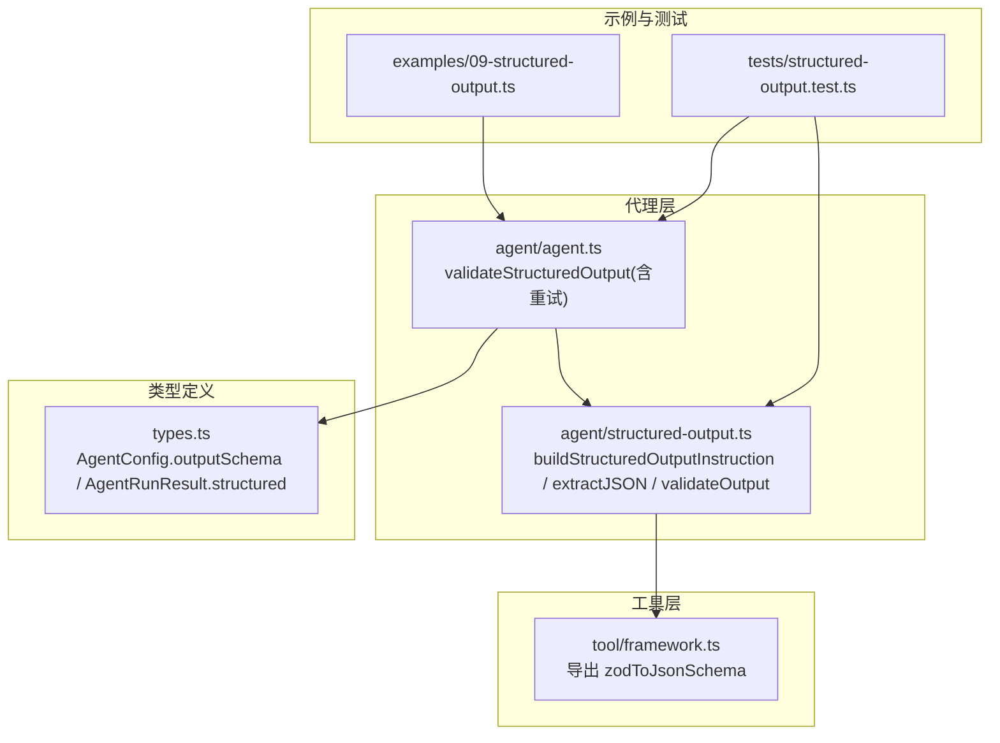
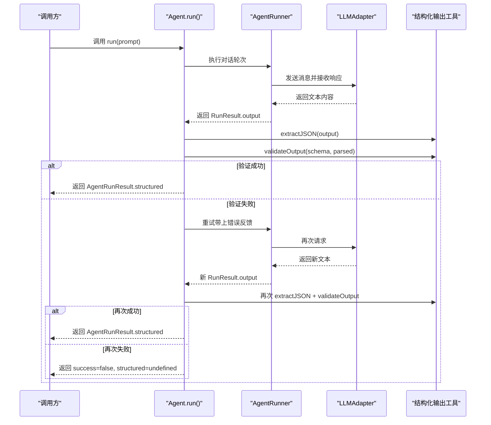
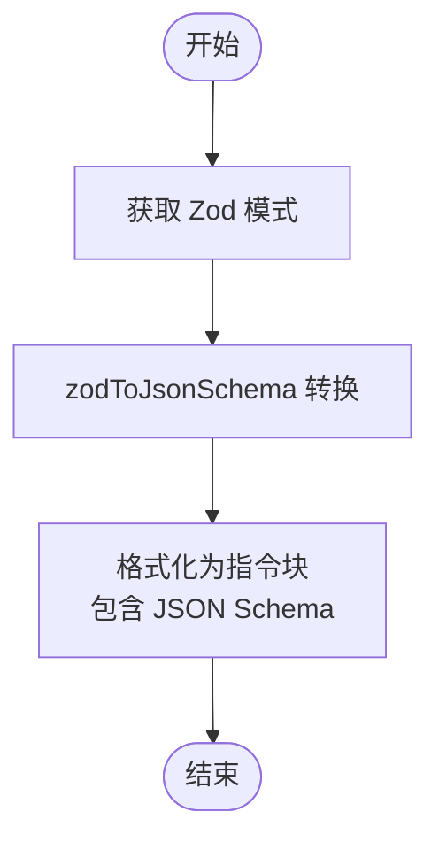
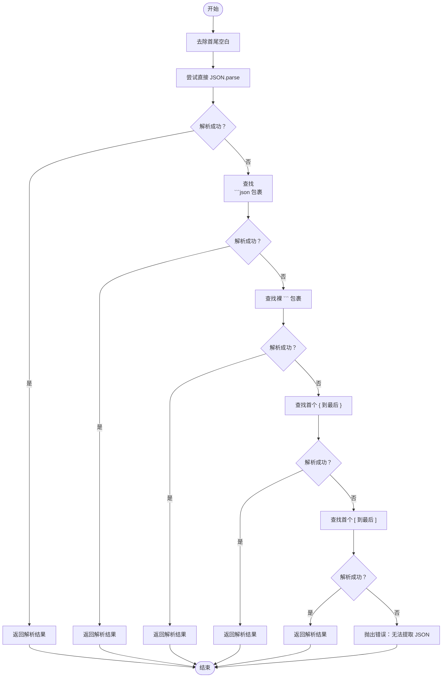
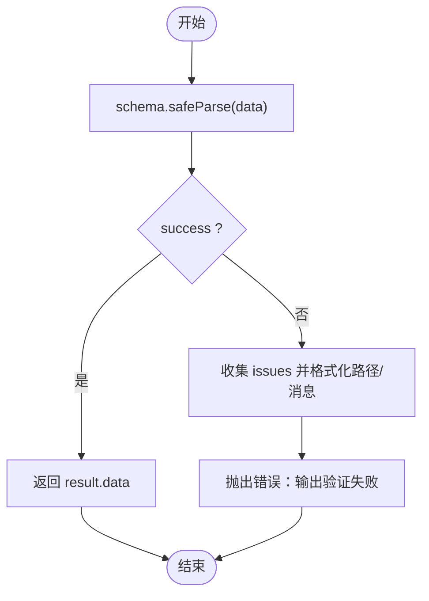
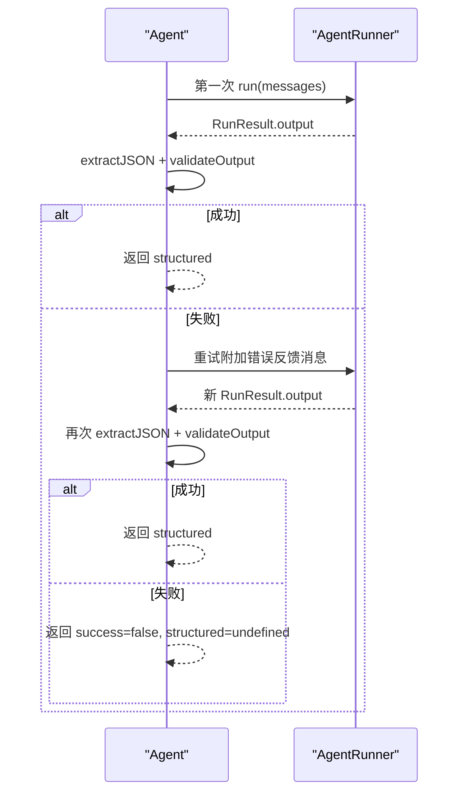
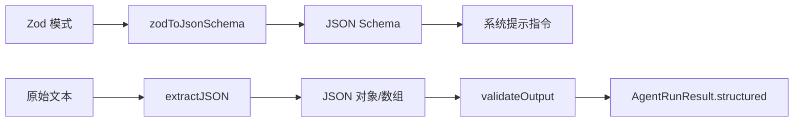

# 结构化输出

<cite>
**本文引用的文件列表**
- [src/agent/structured-output.ts](file://src/agent/structured-output.ts)
- [src/tool/framework.ts](file://src/tool/framework.ts)
- [src/types.ts](file://src/types.ts)
- [src/agent/agent.ts](file://src/agent/agent.ts)
- [examples/09-structured-output.ts](file://examples/09-structured-output.ts)
- [tests/structured-output.test.ts](file://tests/structured-output.test.ts)
- [src/index.ts](file://src/index.ts)
</cite>

## 目录
1. [简介](#简介)
2. [项目结构](#项目结构)
3. [核心组件](#核心组件)
4. [架构总览](#架构总览)
5. [组件详解](#组件详解)
6. [依赖关系分析](#依赖关系分析)
7. [性能与可靠性](#性能与可靠性)
8. [故障排查指南](#故障排查指南)
9. [结论](#结论)
10. [附录](#附录)

## 简介
本文件面向希望在代理（Agent）中集成“结构化输出”的开发者，系统性讲解以下能力：
- 如何基于 Zod 模式生成系统提示指令，引导模型以严格 JSON 响应；
- JSON 提取算法的三种策略：直接解析、带标签的代码块、裸 JSON 对象/数组；
- 输出验证流程与错误反馈重试机制；
- 在代理中使用 outputSchema 的完整流程与最佳实践；
- 常见输出格式问题与解决方案。

## 项目结构
与结构化输出相关的关键模块如下：
- 工具层：提供 Zod 到 JSON Schema 的转换函数，供结构化输出与工具输入共同使用；
- 代理层：负责在运行时注入系统提示、提取 JSON、验证并进行一次自动重试；
- 示例与测试：演示典型用法与边界场景。



图表来源
- [src/tool/framework.ts:222-435](file://src/tool/framework.ts#L222-L435)
- [src/agent/structured-output.ts:15-127](file://src/agent/structured-output.ts#L15-L127)
- [src/agent/agent.ts:400-477](file://src/agent/agent.ts#L400-L477)
- [src/types.ts:224-228](file://src/types.ts#L224-L228)
- [src/types.ts:295-310](file://src/types.ts#L295-L310)
- [examples/09-structured-output.ts:17-74](file://examples/09-structured-output.ts#L17-L74)
- [tests/structured-output.test.ts:190-331](file://tests/structured-output.test.ts#L190-L331)

章节来源
- [src/agent/structured-output.ts:15-127](file://src/agent/structured-output.ts#L15-L127)
- [src/tool/framework.ts:222-435](file://src/tool/framework.ts#L222-L435)
- [src/types.ts:224-228](file://src/types.ts#L224-L228)
- [src/types.ts:295-310](file://src/types.ts#L295-L310)
- [src/agent/agent.ts:400-477](file://src/agent/agent.ts#L400-L477)
- [examples/09-structured-output.ts:17-74](file://examples/09-structured-output.ts#L17-L74)
- [tests/structured-output.test.ts:190-331](file://tests/structured-output.test.ts#L190-L331)

## 核心组件
- 构建系统提示指令：将 Zod 模式转换为 JSON Schema，并生成“仅返回有效 JSON”等约束指令，注入到代理的系统提示中。
- JSON 提取器：按优先级尝试三种策略，从原始文本中提取 JSON。
- 输出验证器：使用 Zod 的 safeParse 进行校验，支持变换与严格模式。
- 代理集成：在代理运行结束时自动执行提取与验证，并在失败时进行一次重试。

章节来源
- [src/agent/structured-output.ts:15-127](file://src/agent/structured-output.ts#L15-L127)
- [src/agent/agent.ts:400-477](file://src/agent/agent.ts#L400-L477)
- [src/types.ts:224-228](file://src/types.ts#L224-L228)
- [src/types.ts:295-310](file://src/types.ts#L295-L310)

## 架构总览
结构化输出在代理运行时的调用序列如下：



图表来源
- [src/agent/agent.ts:400-477](file://src/agent/agent.ts#L400-L477)
- [src/agent/structured-output.ts:50-105](file://src/agent/structured-output.ts#L50-L105)
- [src/agent/structured-output.ts:117-126](file://src/agent/structured-output.ts#L117-L126)

## 组件详解

### 1) 构建系统提示指令：buildStructuredOutputInstruction
- 功能：将 Zod 模式转换为 JSON Schema，并生成“仅返回有效 JSON”的指令块，用于注入到代理的系统提示中。
- 关键点：
  - 使用工具层的 zodToJsonSchema 将 ZodSchema 转换为 JSON Schema；
  - 生成包含 JSON Schema 的三重反引号块，明确要求模型不包裹代码块、不添加解释文字；
  - 支持从 Zod 的描述信息继承到 JSON Schema 中，增强可读性。



图表来源
- [src/agent/structured-output.ts:21-34](file://src/agent/structured-output.ts#L21-L34)
- [src/tool/framework.ts:222-435](file://src/tool/framework.ts#L222-L435)

章节来源
- [src/agent/structured-output.ts:21-34](file://src/agent/structured-output.ts#L21-L34)
- [src/tool/framework.ts:222-435](file://src/tool/framework.ts#L222-L435)

### 2) JSON 提取算法：extractJSON
- 功能：从原始文本中提取 JSON，按优先级尝试三种策略：
  1) 直接解析（最常见且最高效）；
  2) 带标签的代码块（优先匹配 ```json，其次 ```）；
  3) 裸 JSON（从第一个 { 或 [ 到最后一个 } 或 ]）。
- 错误处理：若三种策略均失败，抛出错误，包含原始输出片段以便诊断。



图表来源
- [src/agent/structured-output.ts:50-105](file://src/agent/structured-output.ts#L50-L105)

章节来源
- [src/agent/structured-output.ts:50-105](file://src/agent/structured-output.ts#L50-L105)

### 3) 输出验证：validateOutput
- 功能：对已解析的 JSON 数据进行 Zod 校验；成功则返回规范化后的数据；失败则抛出包含路径与消息的错误。
- 特性：
  - 支持 Zod 的变换（如字符串大写）；
  - 严格模式下会拒绝未知键；
  - 根级别错误显示为“(root)”路径。



图表来源
- [src/agent/structured-output.ts:117-126](file://src/agent/structured-output.ts#L117-L126)

章节来源
- [src/agent/structured-output.ts:117-126](file://src/agent/structured-output.ts#L117-L126)

### 4) 代理集成与自动重试：validateStructuredOutput
- 功能：在代理运行结束后，先尝试一次提取与验证；失败则带上错误反馈进行一次重试；最终返回包含 structured 字段或标记失败的结果。
- 关键点：
  - 合并首次与重试的 tokenUsage、消息与工具调用记录；
  - 保持用户/助手交替的消息顺序，满足某些 API 的要求；
  - 若两次都失败，success=false，structured=undefined。



图表来源
- [src/agent/agent.ts:400-477](file://src/agent/agent.ts#L400-L477)

章节来源
- [src/agent/agent.ts:400-477](file://src/agent/agent.ts#L400-L477)

### 5) 类型与配置：AgentConfig.outputSchema 与 AgentRunResult.structured
- AgentConfig.outputSchema：可选的 Zod 模式，启用结构化输出；
- AgentRunResult.structured：当 outputSchema 存在且验证通过时可用；否则为 undefined。

章节来源
- [src/types.ts:224-228](file://src/types.ts#L224-L228)
- [src/types.ts:295-310](file://src/types.ts#L295-L310)

## 依赖关系分析
- 结构化输出工具依赖工具层的 zodToJsonSchema 实现 Zod 到 JSON Schema 的转换；
- 代理在运行后调用结构化输出工具完成提取与验证；
- 公共 API 导出结构化输出工具，便于外部复用。



图表来源
- [src/tool/framework.ts:222-435](file://src/tool/framework.ts#L222-L435)
- [src/agent/structured-output.ts:21-34](file://src/agent/structured-output.ts#L21-L34)
- [src/agent/structured-output.ts:50-105](file://src/agent/structured-output.ts#L50-L105)
- [src/agent/structured-output.ts:117-126](file://src/agent/structured-output.ts#L117-L126)
- [src/agent/agent.ts:400-477](file://src/agent/agent.ts#L400-L477)

章节来源
- [src/tool/framework.ts:222-435](file://src/tool/framework.ts#L222-L435)
- [src/agent/structured-output.ts:21-34](file://src/agent/structured-output.ts#L21-L34)
- [src/agent/structured-output.ts:50-105](file://src/agent/structured-output.ts#L50-L105)
- [src/agent/structured-output.ts:117-126](file://src/agent/structured-output.ts#L117-L126)
- [src/agent/agent.ts:400-477](file://src/agent/agent.ts#L400-L477)

## 性能与可靠性
- 提取策略按优先级执行，直接解析通常最快；带标签的代码块与裸 JSON 作为容错方案，开销较小但需要正则匹配与二次解析。
- 自动重试仅触发一次，避免无限循环；合并 tokenUsage 与消息，确保计费与上下文一致性。
- Zod 的 safeParse 与变换在验证阶段完成，避免后续业务逻辑重复校验。

[本节为通用建议，无需特定文件来源]

## 故障排查指南
- 常见问题与解决
  - 模型返回了非 JSON 文本：确保在系统提示中注入了严格的“仅返回有效 JSON”指令；必要时在 AgentConfig.systemPrompt 中补充约束。
  - 模型包裹了代码块：确保指令明确禁止包裹代码块；extractJSON 会优先尝试 ```json，其次 ```。
  - 严格模式下出现未知键报错：检查 Zod 模式是否使用 strict()，或调整模式允许额外属性。
  - 根级别类型不符：例如期望字符串却得到数字，检查模式定义与预期数据类型。
  - 变换未生效：确认 Zod 模式中确实定义了 transform，且输入值满足前置条件。
- 定位手段
  - 查看错误消息中的路径与问题描述，定位具体字段；
  - 使用示例与测试中的断言思路，逐步缩小范围；
  - 在 beforeRun 钩子中打印或记录最终注入的系统提示与最终用户消息，辅助调试。

章节来源
- [tests/structured-output.test.ts:84-132](file://tests/structured-output.test.ts#L84-L132)
- [src/agent/agent.ts:424-436](file://src/agent/agent.ts#L424-L436)

## 结论
通过将 Zod 模式转换为 JSON Schema 并注入系统提示，结合稳健的 JSON 提取与验证流程，框架实现了“结构化输出”的端到端能力。配合一次自动重试，显著提升了输出质量与鲁棒性。开发者只需在 AgentConfig 中提供 outputSchema，即可在结果中获得强类型的 structured 字段，简化下游处理。

[本节为总结，无需特定文件来源]

## 附录

### A. 使用示例：在代理中集成结构化输出
- 步骤概览
  - 定义 Zod 模式（如 ReviewAnalysis）；
  - 在 AgentConfig 中设置 outputSchema；
  - 运行代理，从 result.structured 获取强类型结果；
  - 若验证失败，框架会自动重试一次；两次失败则 success=false。
- 参考路径
  - 示例脚本：[examples/09-structured-output.ts:17-74](file://examples/09-structured-output.ts#L17-L74)
  - 单测覆盖：[tests/structured-output.test.ts:190-331](file://tests/structured-output.test.ts#L190-L331)

章节来源
- [examples/09-structured-output.ts:17-74](file://examples/09-structured-output.ts#L17-L74)
- [tests/structured-output.test.ts:190-331](file://tests/structured-output.test.ts#L190-L331)

### B. API 一览
- 构建系统提示指令
  - 名称：buildStructuredOutputInstruction
  - 参数：ZodSchema
  - 返回：字符串（包含 JSON Schema 的指令块）
  - 参考：[src/agent/structured-output.ts:21-34](file://src/agent/structured-output.ts#L21-L34)
- JSON 提取
  - 名称：extractJSON
  - 参数：原始文本
  - 返回：unknown（解析后的对象或数组）
  - 异常：无法提取时抛出错误
  - 参考：[src/agent/structured-output.ts:50-105](file://src/agent/structured-output.ts#L50-L105)
- 输出验证
  - 名称：validateOutput
  - 参数：ZodSchema, 解析后的数据
  - 返回：unknown（验证通过的数据）
  - 异常：验证失败时抛出错误
  - 参考：[src/agent/structured-output.ts:117-126](file://src/agent/structured-output.ts#L117-L126)
- 类型与导出
  - AgentConfig.outputSchema：可选 Zod 模式
  - AgentRunResult.structured：结构化输出（验证通过后）
  - 参考：[src/types.ts:224-228](file://src/types.ts#L224-L228), [src/types.ts:295-310](file://src/types.ts#L295-L310)
  - 公共导出：[src/index.ts:67](file://src/index.ts#L67)

章节来源
- [src/agent/structured-output.ts:21-34](file://src/agent/structured-output.ts#L21-L34)
- [src/agent/structured-output.ts:50-105](file://src/agent/structured-output.ts#L50-L105)
- [src/agent/structured-output.ts:117-126](file://src/agent/structured-output.ts#L117-L126)
- [src/types.ts:224-228](file://src/types.ts#L224-L228)
- [src/types.ts:295-310](file://src/types.ts#L295-L310)
- [src/index.ts:67](file://src/index.ts#L67)