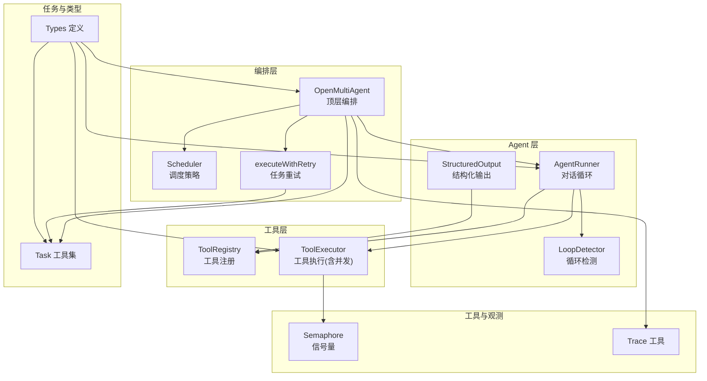
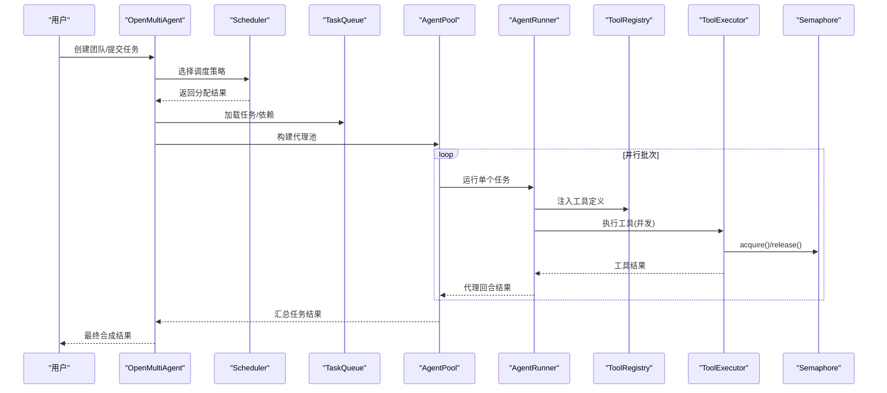
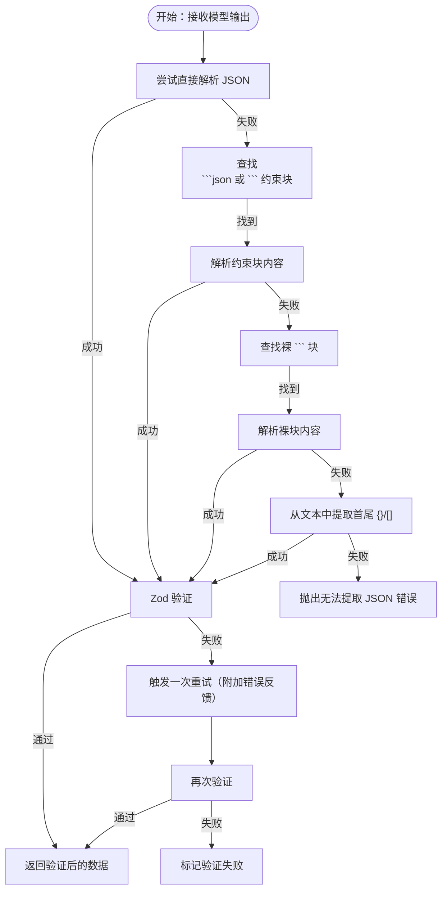
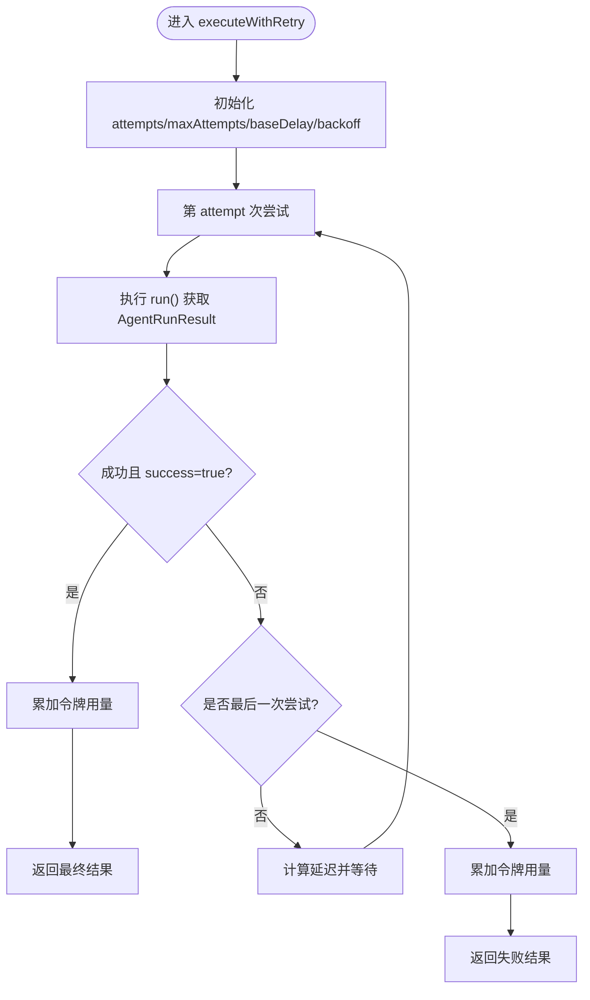
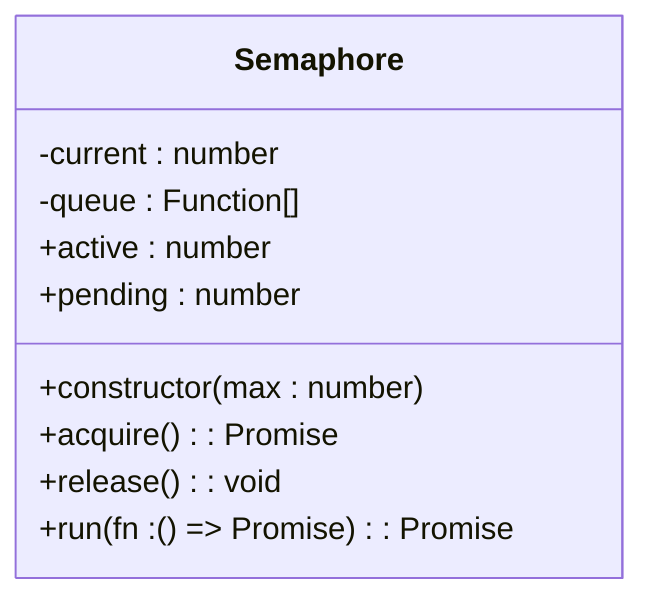
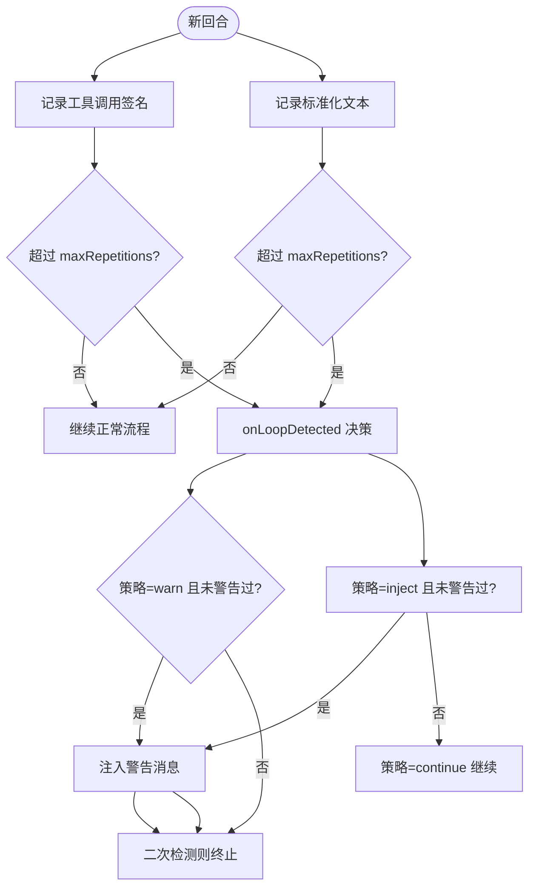
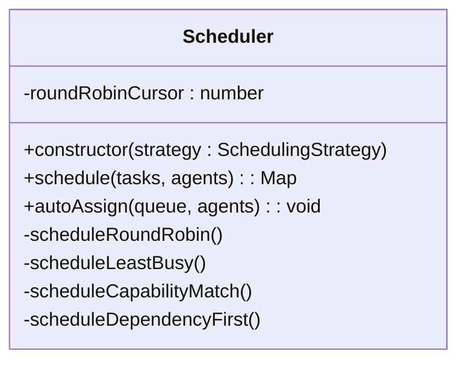
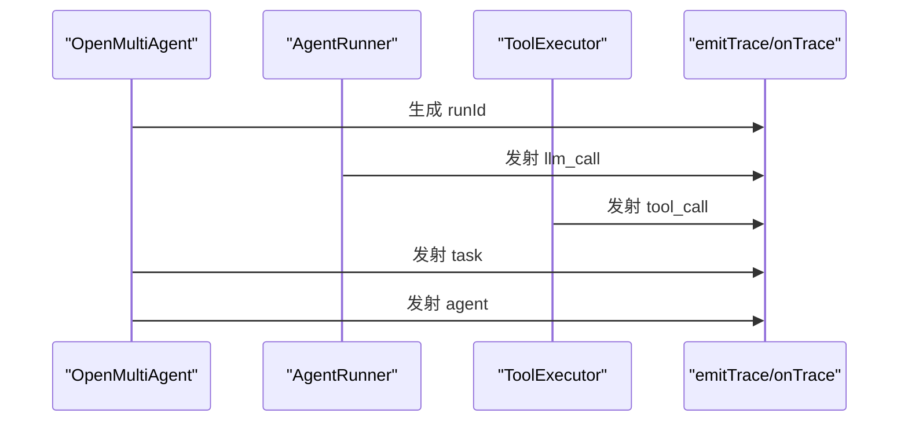
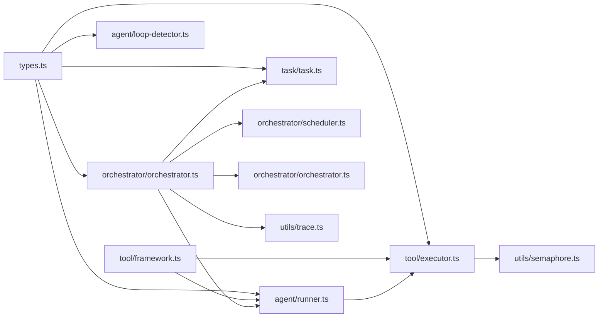

# 高级主题

<cite>
**本文引用的文件**
- [src/agent/structured-output.ts](file://src/agent/structured-output.ts)
- [src/agent/runner.ts](file://src/agent/runner.ts)
- [src/agent/loop-detector.ts](file://src/agent/loop-detector.ts)
- [src/utils/semaphore.ts](file://src/utils/semaphore.ts)
- [src/tool/executor.ts](file://src/tool/executor.ts)
- [src/tool/framework.ts](file://src/tool/framework.ts)
- [src/tas/task.ts](file://src/task/task.ts)
- [src/orchestrator/orchestrator.ts](file://src/orchestrator/orchestrator.ts)
- [src/orchestrator/scheduler.ts](file://src/orchestrator/scheduler.ts)
- [src/utils/trace.ts](file://src/utils/trace.ts)
- [src/types.ts](file://src/types.ts)
- [examples/09-structured-output.ts](file://examples/09-structured-output.ts)
- [examples/10-task-retry.ts](file://examples/10-task-retry.ts)
- [examples/11-trace-observability.ts](file://examples/11-trace-observability.ts)
- [tests/structured-output.test.ts](file://tests/structured-output.test.ts)
- [tests/task-retry.test.ts](file://tests/task-retry.test.ts)
</cite>

## 目录
1. [简介](#简介)
2. [项目结构](#项目结构)
3. [核心组件](#核心组件)
4. [架构总览](#架构总览)
5. [详细组件分析](#详细组件分析)
6. [依赖关系分析](#依赖关系分析)
7. [性能考量](#性能考量)
8. [故障排查指南](#故障排查指南)
9. [结论](#结论)
10. [附录](#附录)

## 简介
本篇“高级主题”聚焦于 Open Multi-Agent 框架的高级能力与工程化细节，涵盖以下方面：
- 结构化输出：Zod 模式注入、JSON 提取与验证、自动重试机制
- 任务重试策略：指数退避、失败统计与成本聚合
- 并发控制：信号量在工具执行与代理池中的应用
- 循环检测：可配置的检测窗口、终止策略与自定义回调
- 性能优化：并行执行策略、资源管理最佳实践
- 生产部署：可观测性、监控与稳定性建议

## 项目结构
框架采用按职责分层的模块化组织，核心路径如下：
- agent：对话循环、结构化输出、循环检测
- tool：工具注册、输入校验、执行器（含并发控制）
- orchestrator：编排器、调度器、任务队列与重试
- task：任务模型与依赖图工具
- utils：通用工具（信号量、追踪）
- types：公共类型定义
- examples/tests：示例与测试用例

图表来源
- [src/agent/runner.ts:166-543](file://src/agent/runner.ts#L166-L543)
- [src/agent/structured-output.ts:21-127](file://src/agent/structured-output.ts#L21-L127)
- [src/agent/loop-detector.ts:33-138](file://src/agent/loop-detector.ts#L33-L138)
- [src/tool/executor.ts:47-179](file://src/tool/executor.ts#L47-L179)
- [src/tool/framework.ts:93-203](file://src/tool/framework.ts#L93-L203)
- [src/orchestrator/orchestrator.ts:127-194](file://src/orchestrator/orchestrator.ts#L127-L194)
- [src/orchestrator/scheduler.ts:127-353](file://src/orchestrator/scheduler.ts#L127-L353)
- [src/utils/semaphore.ts:24-90](file://src/utils/semaphore.ts#L24-L90)
- [src/utils/trace.ts:12-35](file://src/utils/trace.ts#L12-L35)
- [src/types.ts:194-471](file://src/types.ts#L194-L471)

章节来源
- [src/types.ts:194-471](file://src/types.ts#L194-L471)
- [src/agent/runner.ts:166-543](file://src/agent/runner.ts#L166-L543)
- [src/tool/executor.ts:47-179](file://src/tool/executor.ts#L47-L179)
- [src/orchestrator/orchestrator.ts:127-194](file://src/orchestrator/orchestrator.ts#L127-L194)

## 核心组件
- 结构化输出子系统：构建输出格式指令、提取 JSON、Zod 验证，并在验证失败时进行一次自动重试
- 任务重试引擎：指数退避、延迟函数注入、事件回调、令牌用量累加
- 并发控制：信号量实现计数型并发门控，支持自动释放与批量执行
- 循环检测：滑动窗口检测重复工具调用与文本输出，支持警告/注入/终止策略
- 调度策略：轮询、最少忙碌、能力匹配、关键路径优先
- 可观测性：统一 trace 事件与安全发射，支持运行 ID 关联

章节来源
- [src/agent/structured-output.ts:21-127](file://src/agent/structured-output.ts#L21-L127)
- [src/orchestrator/orchestrator.ts:108-194](file://src/orchestrator/orchestrator.ts#L108-L194)
- [src/utils/semaphore.ts:24-90](file://src/utils/semaphore.ts#L24-L90)
- [src/agent/loop-detector.ts:33-138](file://src/agent/loop-detector.ts#L33-L138)
- [src/orchestrator/scheduler.ts:127-353](file://src/orchestrator/scheduler.ts#L127-L353)
- [src/utils/trace.ts:12-35](file://src/utils/trace.ts#L12-L35)

## 架构总览
下图展示从顶层编排到具体执行的关键交互，包括结构化输出与任务重试的集成点。

图表来源
- [src/orchestrator/orchestrator.ts:280-464](file://src/orchestrator/orchestrator.ts#L280-L464)
- [src/agent/runner.ts:223-522](file://src/agent/runner.ts#L223-L522)
- [src/tool/executor.ts:105-121](file://src/tool/executor.ts#L105-L121)
- [src/utils/semaphore.ts:41-78](file://src/utils/semaphore.ts#L41-L78)

## 详细组件分析

### 结构化输出机制（Zod + JSON 验证 + 自动重试）
- 输出格式指令生成：将 Zod 模式转换为 JSON Schema，并注入系统提示，要求模型仅返回符合模式的有效 JSON
- JSON 提取策略：优先直接解析；其次尝试提取带 fenced 的 JSON；再次尝试裸 fenced；最后从文本中截取首个对象/数组
- Zod 验证：safeParse 后抛出人类可读的错误信息；支持 Zod 转换与严格模式
- 自动重试：当验证失败时，框架会进行一次重试（首次失败后追加错误反馈），成功则将结果放入 result.structured

图表来源
- [src/agent/structured-output.ts](file://src/agent/structured-output.ts#L50-L127)
- [src/tool/framework.ts](file://src/tool/framework.ts#L221-L433)

章节来源
- [src/agent/structured-output.ts](file://src/agent/structured-output.ts#L21-L127)
- [src/tool/framework.ts](file://src/tool/framework.ts#L221-L433)
- [examples/09-structured-output.ts](file://examples/09-structured-output.ts#L25-L73)
- [tests/structured-output.test.ts](file://tests/structured-output.test.ts#L42-L160)

### 任务重试策略（指数退避、失败统计与成本计算）
- 指数退避：delay = min(baseDelay × backoff^(attempt-1), 30s)，最大延迟 30 秒
- 失败判定：异常或 result.success=false 触发重试
- 成本聚合：将每次尝试的令牌用量累加到最终结果，便于计费与审计
- 回调事件：每轮重试前触发 onRetry 回调，包含当前尝试次数、最大尝试次数、错误与下次延迟
- 默认行为：maxRetries 未设置或为负时视为 0 次重试

图表来源
- [src/orchestrator/orchestrator.ts](file://src/orchestrator/orchestrator.ts#L127-L194)

章节来源
- [src/orchestrator/orchestrator.ts](file://src/orchestrator/orchestrator.ts#L108-L194)
- [src/task/task.ts](file://src/task/task.ts#L29-L53)
- [examples/10-task-retry.ts](file://examples/10-task-retry.ts#L88-L118)
- [tests/task-retry.test.ts](file://tests/task-retry.test.ts#L33-L368)

### 并发控制与信号量机制
- 信号量语义：计数型并发门控，acquire 成功即占用槽位，release 归还；排队遵循 FIFO
- 在工具执行器中用于限制并发工具调用数量，避免资源争用
- 在 AgentRunner 中用于并发工具执行（并行批处理），提升吞吐
- 提供 run(fn) 自动释放封装，保证异常场景也能正确释放

图表来源
- [src/utils/semaphore.ts](file://src/utils/semaphore.ts#L24-L90)

章节来源
- [src/utils/semaphore.ts](file://src/utils/semaphore.ts#L24-L90)
- [src/tool/executor.ts](file://src/tool/executor.ts#L47-L121)
- [src/agent/runner.ts](file://src/agent/runner.ts#L398-L459)

### 循环检测（高级配置：自定义回调与终止策略）
- 检测维度：工具调用签名（名称+参数排序后 JSON）与标准化文本输出
- 窗口与阈值：滑动窗口大小至少不小于最大重复阈值，避免检测不到
- 策略：
  - warn：注入“你似乎卡住了”的提示，再给一次机会；若仍循环则终止
  - terminate：直接终止
  - function：自定义回调，返回 continue/inject/terminate 控制后续动作
- 与对话循环集成：在 yield tool_use 之前进行检测，确保不会发出孤儿事件

图表来源
- [src/agent/loop-detector.ts](file://src/agent/loop-detector.ts#L33-L138)
- [src/agent/runner.ts](file://src/agent/runner.ts#L329-L366)

章节来源
- [src/agent/loop-detector.ts](file://src/agent/loop-detector.ts#L33-L138)
- [src/agent/runner.ts](file://src/agent/runner.ts#L256-L366)
- [src/types.ts](file://src/types.ts#L247-L276)

### 调度策略与并行执行
- 策略：
  - round-robin：按索引轮询分配
  - least-busy：选择当前 in_progress 数最少的代理
  - capability-match：基于关键词重叠评分，优先能力匹配的任务
  - dependency-first：按被阻塞下游数量排序，关键路径优先
- 并行执行：同一轮内所有可执行任务并行提交，完成后统一推进依赖

图表来源
- [src/orchestrator/scheduler.ts](file://src/orchestrator/scheduler.ts#L127-L353)

章节来源
- [src/orchestrator/scheduler.ts](file://src/orchestrator/scheduler.ts#L127-L353)

### 可观测性与追踪
- 统一 trace 事件：llm_call、tool_call、task、agent，包含运行 ID、起止时间、耗时、令牌用量等
- 安全发射：捕获回调异常，避免观测层影响主执行流
- 运行 ID：generateRunId 用于跨事件关联

图表来源
- [src/utils/trace.ts](file://src/utils/trace.ts#L12-L35)
- [src/agent/runner.ts](file://src/agent/runner.ts#L286-L300)
- [src/tool/executor.ts](file://src/tool/executor.ts#L426-L438)
- [src/orchestrator/orchestrator.ts](file://src/orchestrator/orchestrator.ts#L384-L398)
- [examples/11-trace-observability.ts](file://examples/11-trace-observability.ts#L45-L74)

章节来源
- [src/utils/trace.ts](file://src/utils/trace.ts#L12-L35)
- [src/agent/runner.ts](file://src/agent/runner.ts#L286-L300)
- [src/tool/executor.ts](file://src/tool/executor.ts#L426-L438)
- [src/orchestrator/orchestrator.ts](file://src/orchestrator/orchestrator.ts#L384-L398)
- [examples/11-trace-observability.ts](file://examples/11-trace-observability.ts#L45-L74)

## 依赖关系分析
- 类型驱动：types.ts 作为单一真相源，贯穿各模块
- 工具链路：ToolRegistry 将 Zod 输入模式转换为 LLM 期望的 JSON Schema；ToolExecutor 负责并发执行与错误归一化
- 编排链路：OpenMultiAgent 组合 Team、TaskQueue、Scheduler、AgentPool，执行 executeQueue 并集成重试与进度/追踪回调
- 循环检测：AgentRunner 内部持有 LoopDetector 实例，按配置策略决定警告/注入/终止

图表来源
- [src/types.ts:194-471](file://src/types.ts#L194-L471)
- [src/tool/framework.ts:93-203](file://src/tool/framework.ts#L93-L203)
- [src/agent/runner.ts:166-543](file://src/agent/runner.ts#L166-L543)
- [src/tool/executor.ts:47-179](file://src/tool/executor.ts#L47-L179)
- [src/orchestrator/orchestrator.ts:280-464](file://src/orchestrator/orchestrator.ts#L280-L464)
- [src/orchestrator/scheduler.ts:127-353](file://src/orchestrator/scheduler.ts#L127-L353)
- [src/utils/semaphore.ts:24-90](file://src/utils/semaphore.ts#L24-L90)
- [src/utils/trace.ts:12-35](file://src/utils/trace.ts#L12-L35)

章节来源
- [src/types.ts:194-471](file://src/types.ts#L194-L471)
- [src/tool/framework.ts:93-203](file://src/tool/framework.ts#L93-L203)
- [src/agent/runner.ts:166-543](file://src/agent/runner.ts#L166-L543)
- [src/tool/executor.ts:47-179](file://src/tool/executor.ts#L47-L179)
- [src/orchestrator/orchestrator.ts:280-464](file://src/orchestrator/orchestrator.ts#L280-L464)
- [src/orchestrator/scheduler.ts:127-353](file://src/orchestrator/scheduler.ts#L127-L353)
- [src/utils/semaphore.ts:24-90](file://src/utils/semaphore.ts#L24-L90)
- [src/utils/trace.ts:12-35](file://src/utils/trace.ts#L12-L35)

## 性能考量
- 并行执行策略
  - 任务层面：同一轮内所有“可执行”任务并行提交，最大化吞吐
  - 工具层面：通过信号量限制并发工具调用，避免资源争用
- 资源管理最佳实践
  - 合理设置 maxConcurrency：根据 LLM 与工具的资源特性调整
  - 使用指数退避与延迟上限，避免抖动放大
  - 累积令牌用量，便于成本控制与审计
- 依赖与调度
  - 优先关键路径任务，减少整体等待时间
  - 能力匹配策略可降低无效尝试，提高成功率

[本节为通用指导，无需特定文件来源]

## 故障排查指南
- 结构化输出
  - 现象：验证失败或无法提取 JSON
  - 排查：确认系统提示中包含 JSON Schema；检查模型是否遵守“仅返回有效 JSON”的约束
  - 参考：示例与测试覆盖了多种边界情况
- 任务重试
  - 现象：重试事件缺失或延迟异常
  - 排查：确认 maxRetries/retryDelayMs/retryBackoff 设置；检查 onRetry 回调是否被消费
  - 参考：测试覆盖指数退避、延迟上限、令牌用量累加
- 并发问题
  - 现象：工具执行超时或资源耗尽
  - 排查：调整工具并发度；检查信号量配置；观察 pending/active 指标
- 循环检测
  - 现象：频繁警告或提前终止
  - 排查：调整 maxRepetitions 与检测窗口；必要时自定义回调策略

章节来源
- [tests/structured-output.test.ts:42-160](file://tests/structured-output.test.ts#L42-L160)
- [tests/task-retry.test.ts:33-368](file://tests/task-retry.test.ts#L33-L368)
- [src/utils/semaphore.ts:24-90](file://src/utils/semaphore.ts#L24-L90)
- [src/agent/loop-detector.ts:33-138](file://src/agent/loop-detector.ts#L33-L138)

## 结论
本框架在结构化输出、任务重试、并发控制与循环检测等方面提供了工程化的高级能力。通过统一的类型体系、可插拔的调度与可观测性设计，既满足易用性也兼顾生产稳定性。建议在生产环境中结合指数退避、令牌用量统计与 trace 观测，持续优化并发度与资源配额。

[本节为总结性内容，无需特定文件来源]

## 附录
- 示例参考
  - 结构化输出：[examples/09-structured-output.ts:1-74](file://examples/09-structured-output.ts#L1-L74)
  - 任务重试：[examples/10-task-retry.ts:1-133](file://examples/10-task-retry.ts#L1-L133)
  - 可观测性：[examples/11-trace-observability.ts:1-134](file://examples/11-trace-observability.ts#L1-L134)
- 测试参考
  - 结构化输出：[tests/structured-output.test.ts:1-332](file://tests/structured-output.test.ts#L1-L332)
  - 任务重试：[tests/task-retry.test.ts:1-369](file://tests/task-retry.test.ts#L1-L369)