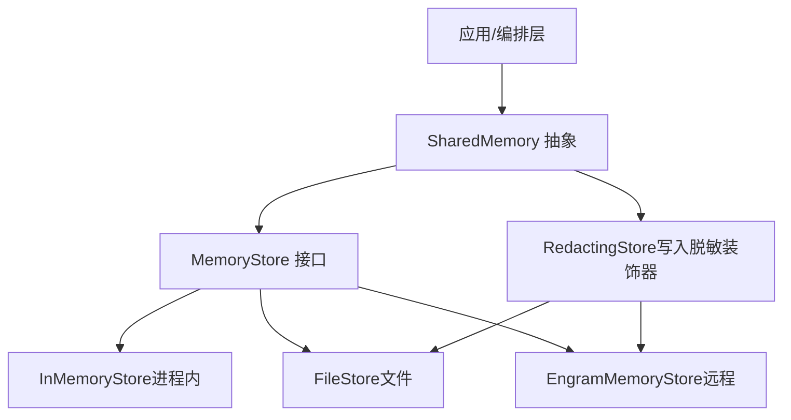
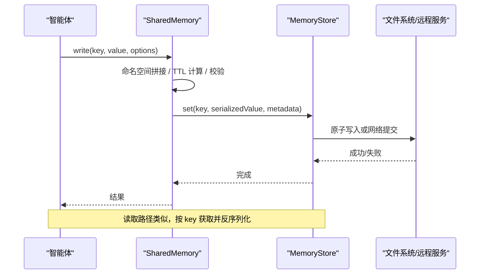
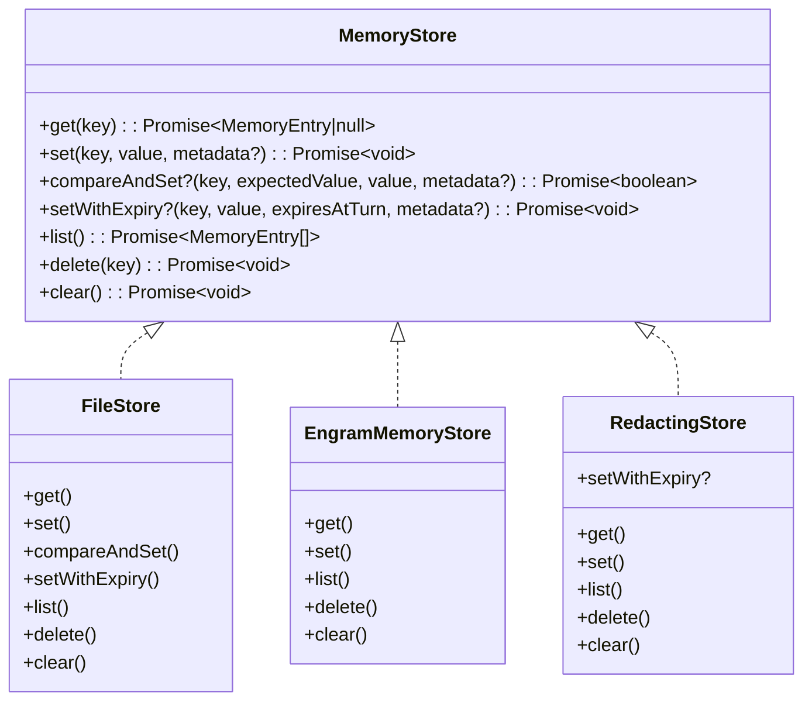
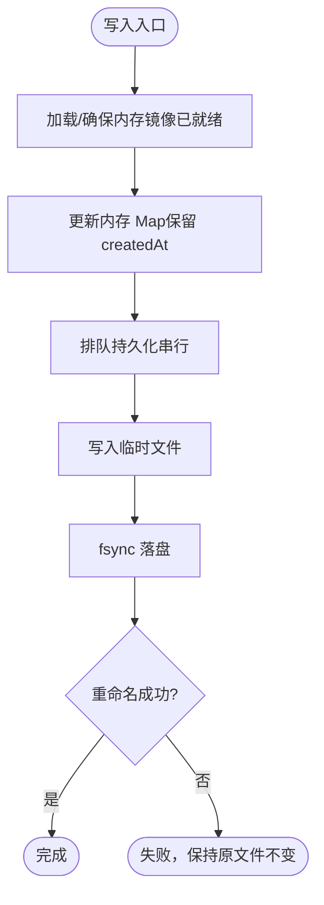
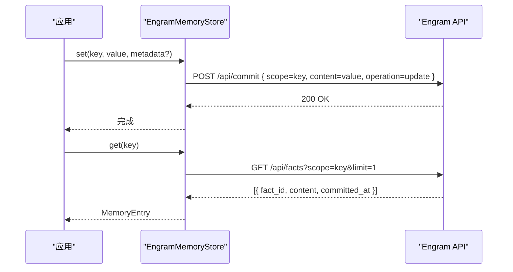
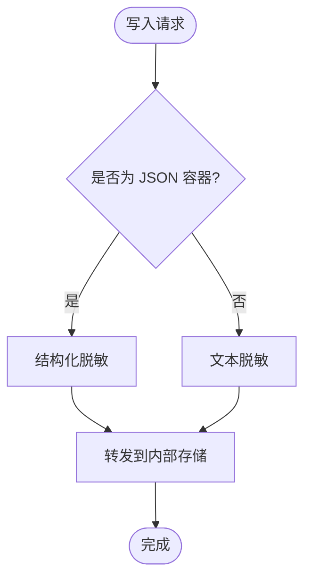
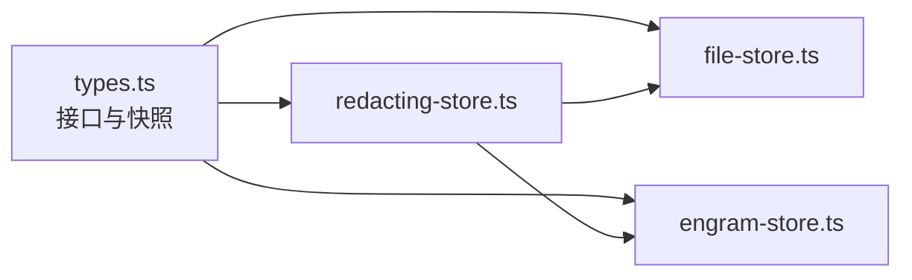

# 共享内存

<cite>
**本文引用的文件**
- [shared-memory.md](file://docs/shared-memory.md)
- [types.ts](file://packages/core/src/types.ts)
- [file-store.ts](file://packages/core/src/memory/file-store.ts)
- [redacting-store.ts](file://packages/core/src/memory/redacting-store.ts)
- [engram-store.ts](file://packages/core/examples/integrations/with-engram/engram-store.ts)
</cite>

## 目录
1. [简介](#简介)
2. [项目结构](#项目结构)
3. [核心组件](#核心组件)
4. [架构总览](#架构总览)
5. [详细组件分析](#详细组件分析)
6. [依赖关系分析](#依赖关系分析)
7. [性能考虑](#性能考虑)
8. [故障排查指南](#故障排查指南)
9. [结论](#结论)
10. [附录](#附录)

## 简介
本文件面向高级用户，系统阐述共享内存（Shared Memory）的高级用法与最佳实践。内容涵盖：
- SharedMemory 接口的高级特性：数据同步、并发访问控制、冲突解决策略
- 存储后端实现与适用场景：内存存储、文件存储、数据库/远程存储（示例 Engram）
- 命名空间管理、数据持久化、版本控制与迁移策略
- 性能优化技巧、内存管理最佳实践与安全考虑
- 复杂多智能体协作与数据处理流水线示例

## 项目结构
共享内存能力由类型定义、内置存储实现、安全装饰器以及示例集成共同构成：
- 类型与快照：定义共享值类型、条目、存储接口及可序列化快照
- 存储实现：
  - 内存存储（进程内 Map，快速但易失）
  - 文件存储（单 JSON 文件，原子写入，适合检查点与轻量持久化）
  - 远程存储示例（Engram REST API，跨进程/跨实例共享）
- 安全装饰器：RedactingStore 在写入时脱敏，避免敏感信息落盘
- 文档与示例：团队启用共享内存、配置持久化与回滚

图表来源
- [types.ts:2806-2872](file://packages/core/src/types.ts#L2806-L2872)
- [file-store.ts:1-54](file://packages/core/src/memory/file-store.ts#L1-L54)
- [redacting-store.ts:1-129](file://packages/core/src/memory/redacting-store.ts#L1-L129)
- [engram-store.ts:1-188](file://packages/core/examples/integrations/with-engram/engram-store.ts#L1-L188)

章节来源
- [shared-memory.md:1-47](file://docs/shared-memory.md#L1-L47)
- [types.ts:2806-2872](file://packages/core/src/types.ts#L2806-L2872)

## 核心组件
- SharedMemoryValue 与 SharedMemoryEntry：限定可序列化的共享值类型与读取视图
- MemoryStore：统一键值存储接口，包含 get/set/list/delete/clear，可选 compareAndSet 与 setWithExpiry
- FileStore：零依赖的文件系统实现，单 JSON 文件 + 内存镜像，原子写入（写临时文件→fsync→rename）
- RedactingStore：写入时脱敏的装饰器，支持自定义正则模式，透明转发读路径
- EngramMemoryStore：基于 REST API 的远程存储示例，体现跨进程共享语义

章节来源
- [types.ts:2806-2872](file://packages/core/src/types.ts#L2806-L2872)
- [file-store.ts:102-169](file://packages/core/src/memory/file-store.ts#L102-L169)
- [redacting-store.ts:48-129](file://packages/core/src/memory/redacting-store.ts#L48-L129)
- [engram-store.ts:48-188](file://packages/core/examples/integrations/with-engram/engram-store.ts#L48-L188)

## 架构总览
共享内存通过统一的 MemoryStore 抽象屏蔽底层差异，上层 SharedMemory 负责命名空间、序列化、过期与快照；存储实现可选择内存、文件或远程服务。

图表来源
- [types.ts:2806-2872](file://packages/core/src/types.ts#L2806-L2872)
- [file-store.ts:102-169](file://packages/core/src/memory/file-store.ts#L102-L169)
- [engram-store.ts:68-106](file://packages/core/examples/integrations/with-engram/engram-store.ts#L68-L106)

## 详细组件分析

### 数据模型与接口
- SharedMemoryValue：字符串、数字、布尔、null、数组、对象（递归），保证可序列化
- SharedMemoryEntry：对外暴露的值已解析为 SharedMemoryValue
- MemoryEntry：底层存储条目，value 为字符串，附带 createdAt、expiresAtTurn 等元信息
- MemoryStore：
  - 必需：get/set/list/delete/clear
  - 可选：compareAndSet（用于可挂起审批的原子更新）、setWithExpiry（按“回合数”过期）

图表来源
- [types.ts:2806-2872](file://packages/core/src/types.ts#L2806-L2872)
- [file-store.ts:102-169](file://packages/core/src/memory/file-store.ts#L102-L169)
- [engram-store.ts:48-188](file://packages/core/examples/integrations/with-engram/engram-store.ts#L48-L188)
- [redacting-store.ts:48-129](file://packages/core/src/memory/redacting-store.ts#L48-L129)

章节来源
- [types.ts:2806-2872](file://packages/core/src/types.ts#L2806-L2872)

### 文件存储（FileStore）：原子性与一致性
- 设计要点
  - 单 JSON 文件承载全部状态，内存 Map 镜像以提供一致读语义
  - 每次变更采用“写临时文件 → fsync → rename”的原子替换，确保断电/崩溃后要么旧状态、要么新状态
  - 同一进程内并发写通过写队列串行化，避免竞态
- 关键方法
  - set：保留首次 createdAt，更新时不覆盖创建时间
  - compareAndSet：在同一实例内做 CAS，返回是否成功
  - setWithExpiry：记录 expiresAtTurn，过滤逻辑由调用方（如 SharedMemory）处理
  - persist/flush：批量合并写入，减少磁盘 I/O

图表来源
- [file-store.ts:102-169](file://packages/core/src/memory/file-store.ts#L102-L169)
- [file-store.ts:308-345](file://packages/core/src/memory/file-store.ts#L308-L345)

章节来源
- [file-store.ts:1-54](file://packages/core/src/memory/file-store.ts#L1-L54)
- [file-store.ts:102-169](file://packages/core/src/memory/file-store.ts#L102-L169)
- [file-store.ts:308-345](file://packages/core/src/memory/file-store.ts#L308-L345)

### 远程存储（EngramMemoryStore）：跨进程共享
- 通过 REST API 将键映射为“scope”，值作为事实内容提交
- set 使用 update 操作覆盖同 key 的最新值
- list 拉取工作区事实（限制条数），get 取最新一条
- delete 通过 lineage_id 退役最新事实，clear 为 no-op（保留审计历史）

图表来源
- [engram-store.ts:68-106](file://packages/core/examples/integrations/with-engram/engram-store.ts#L68-L106)
- [engram-store.ts:117-137](file://packages/core/examples/integrations/with-engram/engram-store.ts#L117-L137)

章节来源
- [engram-store.ts:1-188](file://packages/core/examples/integrations/with-engram/engram-store.ts#L1-L188)

### 安全：写入时脱敏（RedactingStore）
- 在 set/setWithExpiry 时对 value 进行脱敏，支持内置凭据规则与自定义正则
- 对 JSON 容器进行结构感知脱敏，保持有效 JSON；非 JSON 文本按自由文本脱敏
- 不暴露 compareAndSet，避免与审批流程中的内容哈希不一致

图表来源
- [redacting-store.ts:48-129](file://packages/core/src/memory/redacting-store.ts#L48-L129)

章节来源
- [redacting-store.ts:1-129](file://packages/core/src/memory/redacting-store.ts#L1-L129)

### 命名空间、持久化、版本控制与迁移
- 命名空间：键在进入存储前会加上 <agentName>/ 前缀，隔离不同智能体的数据
- 持久化：默认使用进程内存储；如需跨进程/重启恢复，可注入 FileStore 或自定义 MemoryStore
- 版本控制：SharedMemorySnapshot 包含 version、turnCount、entries，便于序列化与恢复
- 迁移策略：升级时根据 version 字段进行兼容处理；对 entries 的 schema 演进需向后兼容

章节来源
- [shared-memory.md:1-47](file://docs/shared-memory.md#L1-L47)
- [types.ts:2379-2393](file://packages/core/src/types.ts#L2379-L2393)

### 并发访问控制与冲突解决
- 进程内并发：FileStore 通过写队列串行化所有写操作，保证原子性
- 跨进程/分布式：使用具备 compareAndSet 能力的后端（例如数据库）实现 CAS，避免写后读冲突
- 过期策略：setWithExpiry 记录 expiresAtTurn，由 SharedMemory 在读取时按当前 turn 过滤

章节来源
- [types.ts:2842-2872](file://packages/core/src/types.ts#L2842-L2872)
- [file-store.ts:135-159](file://packages/core/src/memory/file-store.ts#L135-L159)

### 复杂多智能体协作与数据处理流水线示例
- 研究-写作流水线
  - 研究者写入“调研摘要”、“关键词”、“证据链接”
  - 写作者读取上述键生成草稿，再写入“草稿 v1/v2”
  - 审核者读取草稿，写入“审核意见”，写作者据此迭代
- 数据清洗流水线
  - 采集器写入原始片段
  - 清洗器读取片段，写入清洗后结果与质量评分
  - 聚合器汇总评分，输出最终报告
- 建议
  - 使用 setWithExpiry 控制中间结果的存活轮次
  - 对敏感字段使用 RedactingStore 包裹持久化后端
  - 对关键决策键使用 compareAndSet 保障幂等

[本节为概念性说明，不直接分析具体文件]

## 依赖关系分析
- SharedMemory 依赖 MemoryStore 抽象，解耦具体存储
- FileStore 依赖 Node 文件系统 API，无外部运行时依赖
- RedactingStore 依赖脱敏工具函数，仅影响写入路径
- EngramMemoryStore 依赖 HTTP 客户端与远端服务

图表来源
- [types.ts:2806-2872](file://packages/core/src/types.ts#L2806-L2872)
- [file-store.ts:1-54](file://packages/core/src/memory/file-store.ts#L1-L54)
- [redacting-store.ts:1-129](file://packages/core/src/memory/redacting-store.ts#L1-L129)
- [engram-store.ts:1-188](file://packages/core/examples/integrations/with-engram/engram-store.ts#L1-L188)

章节来源
- [types.ts:2806-2872](file://packages/core/src/types.ts#L2806-L2872)

## 性能考虑
- 选择合适后端
  - 高频读写且无需持久化：优先 InMemoryStore
  - 需要持久化且单进程：FileStore（注意每次写都会刷新整个文件）
  - 跨进程/分布式：实现带 compareAndSet 的数据库/缓存后端
- 批量化与节流
  - 利用 FileStore 的写队列合并多次写入
  - 合理设置 TTL，减少无效读取
- 序列化成本
  - 大对象频繁写入会带来 JSON 序列化开销，尽量拆分键粒度
- 网络延迟
  - 远程存储应增加重试与超时控制，必要时引入本地缓存层

[本节提供通用指导，不直接分析具体文件]

## 故障排查指南
- 文件写入失败
  - 现象：磁盘满、权限不足导致写入失败
  - 行为：FileStore 保持原文件不变，后续写入仍可继续
  - 参考：错误码与回滚逻辑
- 比较交换失败
  - 现象：compareAndSet 返回 false
  - 原因：期望值与实际值不一致，需重试或降级策略
- 远程服务不可用
  - 现象：HTTP 请求失败
  - 行为：抛出异常，调用方需捕获并重试或降级
- 脱敏误伤
  - 现象：业务字段被当作凭据脱敏
  - 处理：调整自定义正则模式，缩小匹配范围

章节来源
- [file-store.ts:308-345](file://packages/core/src/memory/file-store.ts#L308-L345)
- [engram-store.ts:162-173](file://packages/core/examples/integrations/with-engram/engram-store.ts#L162-L173)
- [redacting-store.ts:97-129](file://packages/core/src/memory/redacting-store.ts#L97-L129)

## 结论
共享内存通过统一的 MemoryStore 抽象实现了灵活的后端切换与一致的并发语义。结合 FileStore 的原子写入、RedactingStore 的写入脱敏以及可序列化的快照机制，可在多智能体协作中提供可靠的数据共享与持久化能力。对于跨进程与分布式场景，建议实现具备 compareAndSet 的后端以增强一致性。

[本节为总结性内容，不直接分析具体文件]

## 附录
- 启用共享内存
  - 在团队配置中开启 sharedMemory 或使用 sharedMemoryStore 注入自定义后端
- 推荐组合
  - 高性能+易失：InMemoryStore
  - 轻量持久：FileStore（适合检查点与单进程）
  - 跨进程：自定义 MemoryStore（Redis/Postgres/Engram 等）
- 安全建议
  - 始终使用 RedactingStore 包裹持久化后端
  - 对敏感键名与元数据也需谨慎处理

章节来源
- [shared-memory.md:1-47](file://docs/shared-memory.md#L1-L47)
- [redacting-store.ts:1-129](file://packages/core/src/memory/redacting-store.ts#L1-L129)