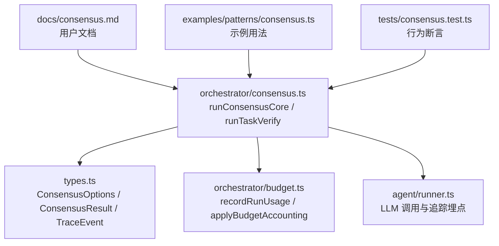
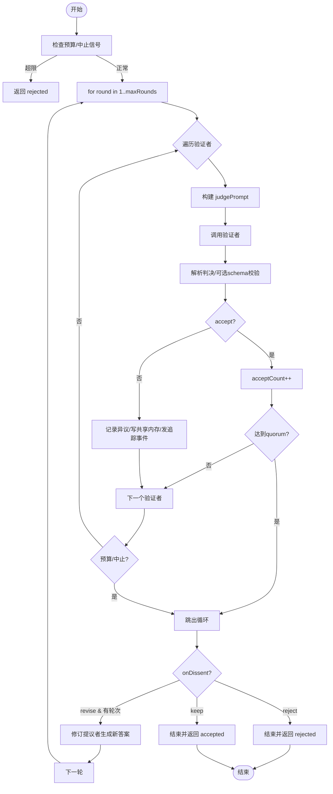
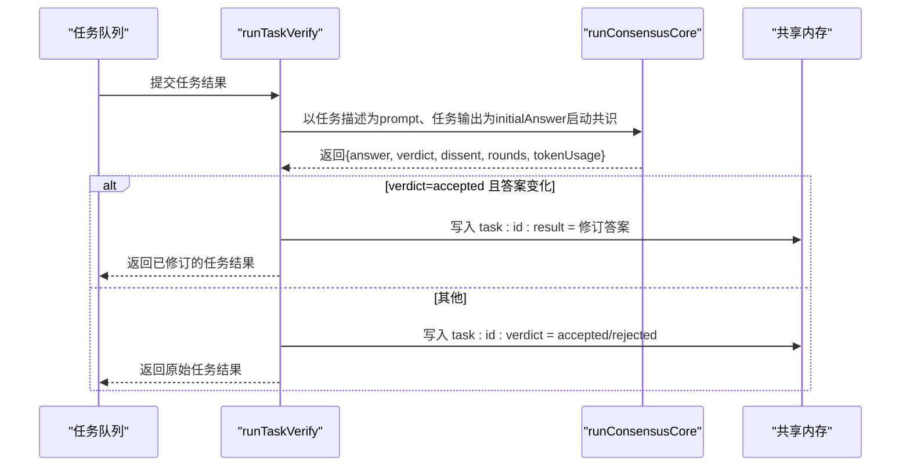
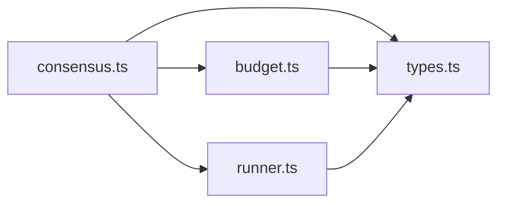

# 共识机制

<cite>
**本文引用的文件**
- [consensus.ts](file://packages/core/src/orchestrator/consensus.ts)
- [types.ts](file://packages/core/src/types.ts)
- [budget.ts](file://packages/core/src/orchestrator/budget.ts)
- [runner.ts](file://packages/core/src/agent/runner.ts)
- [consensus.md](file://docs/consensus.md)
- [consensus.ts（示例）](file://packages/core/examples/patterns/consensus.ts)
- [consensus.test.ts](file://packages/core/tests/consensus.test.ts)
</cite>

## 目录
1. [简介](#简介)
2. [项目结构](#项目结构)
3. [核心组件](#核心组件)
4. [架构总览](#架构总览)
5. [详细组件分析](#详细组件分析)
6. [依赖关系分析](#依赖关系分析)
7. [性能与预算控制](#性能与预算控制)
8. [可观测性与追踪](#可观测性与追踪)
9. [故障排查指南](#故障排查指南)
10. [企业级应用与最佳实践](#企业级应用与最佳实践)
11. [结论](#结论)
12. [附录：配置选项速查](#附录：配置选项速查)

## 简介
本文件系统性阐述多智能体“提议者-验证者”共识机制，重点解释 runConsensus 的核心实现原理、多轮投票与分歧处理、模式差异（refute vs lens）、任务管道中的 verify 钩子集成、预算控制、可观测性追踪以及实际使用与企业级最佳实践。该机制在单一提示之上叠加一轮或多轮“提议者生成答案 → 多个验证者逐次评审 → 达到法定票数即通过”的闭环，确保关键决策具备可审计、可追溯、可控成本的多方校验能力。

## 项目结构
共识机制位于编排层，围绕以下关键文件组织：
- 核心逻辑：提议者-验证者循环、投票、分歧处理、任务 verify 钩子
- 类型定义：选项、结果、追踪事件等
- 预算模块：累计用量、成本估算、超预算拦截
- 运行器：LLM 调用、追踪埋点、工具调用与循环检测
- 文档与示例：API 说明、示例用法、测试用例



图表来源
- [consensus.ts:187-312](file://packages/core/src/orchestrator/consensus.ts#L187-L312)
- [types.ts:1964-1997](file://packages/core/src/types.ts#L1964-L1997)
- [budget.ts:184-215](file://packages/core/src/orchestrator/budget.ts#L184-L215)
- [runner.ts:597-635](file://packages/core/src/agent/runner.ts#L597-L635)

章节来源
- [consensus.ts:1-437](file://packages/core/src/orchestrator/consensus.ts#L1-L437)
- [types.ts:1964-1997](file://packages/core/src/types.ts#L1964-L1997)
- [budget.ts:1-215](file://packages/core/src/orchestrator/budget.ts#L1-L215)
- [runner.ts:597-635](file://packages/core/src/agent/runner.ts#L597-L635)
- [consensus.md:1-64](file://docs/consensus.md#L1-L64)

## 核心组件
- 提议者-验证者循环：runConsensusCore 负责驱动一轮或多轮“提议者生成答案 → 验证者逐次评审 → 统计接受数 → 达到法定票数或达到最大轮数后终止”。
- 投票算法：验证者按顺序执行；每票为 JSON 结构的 accept/critique；当接受数达到 quorum 时提前终止；未达法定票数则根据 onDissent 策略决定修订、拒绝或保留。
- 分歧处理：记录每条异议到结果、共享内存与追踪事件；若 onDissent=revise，将异议反馈给提议者进行修订并进入下一轮。
- 任务 verify 钩子：runTaskVerify 将任务输出接入同一共识循环，并将验证用量计入运行级预算，最终决定是否用修订结果覆盖任务输出。

章节来源
- [consensus.ts:187-312](file://packages/core/src/orchestrator/consensus.ts#L187-L312)
- [consensus.ts:322-436](file://packages/core/src/orchestrator/consensus.ts#L322-L436)
- [types.ts:1964-1997](file://packages/core/src/types.ts#L1964-L1997)

## 架构总览
下图展示 runConsensus 的整体流程：提议者生成初始答案，验证者按序评审，统计接受数，必要时触发修订，直至达成共识或达到约束条件。

```mermaid
sequenceDiagram
participant U as "调用方"
participant RC as "runConsensusCore"
participant P as "提议者"
participant J as "验证者(顺序)"
participant SM as "共享内存"
participant TR as "追踪系统"
U->>RC : 传入 prompt, judges, 选项
RC->>P : 生成初始答案
loop 最多 maxRounds 轮
RC->>J : 逐位构造 judgePrompt 并调用
J-->>RC : {accept, critique}
alt 接受
RC->>TR : 发出 consensus 事件(accepted=true)
RC->>RC : acceptCount++
opt 达到法定票数
RC-->>U : 返回 accepted
end
else 反对
RC->>SM : 写入 round : N : dissent
RC->>TR : 发出 consensus 事件(accepted=false, dissent)
RC->>RC : 记录异议
opt onDissent=revise 且还有轮次
RC->>P : 以异议为上下文修订答案
RC->>RC : 更新 answer 与 usage
else 其他策略
RC-->>U : 返回 rejected/accepted(keep)
end
end
end
```

图表来源
- [consensus.ts:187-312](file://packages/core/src/orchestrator/consensus.ts#L187-L312)
- [consensus.ts:75-121](file://packages/core/src/orchestrator/consensus.ts#L75-L121)
- [types.ts:2765-2772](file://packages/core/src/types.ts#L2765-L2772)

## 详细组件分析

### runConsensusCore：提议者-验证者主循环
- 输入参数：团队、原始问题、初始答案、初始用量、预算基线、验证者名单、模式、法定票数、最大轮数、判决 schema、分歧策略、自定义验证提示、预算上限、修订提议者、默认配置、追踪回调、运行标识、中止信号、用量回调、停止回调、AgentPool、追踪运行时与 span。
- 执行要点：
  - 预算检查：在每轮开始前与每次 LLM 调用后检查是否超过预算或触发 shouldStop。
  - 验证者顺序执行：便于配额与预算尽早短路。
  - 解析判决：支持可选 Zod schema 校验，失败视为异议。
  - 追踪与共享内存：每个判决都发出共识事件；异议写入共享内存。
  - 分歧策略：
    - revise：将异议反馈给修订提议者，继续下一轮。
    - reject：本轮结束后直接返回 rejected。
    - keep：本轮结束后返回 accepted（保留原答案）。
  - 结果：包含答案、判定、异议列表、轮次、用量，以及可能的状态与错误信息。



图表来源
- [consensus.ts:187-312](file://packages/core/src/orchestrator/consensus.ts#L187-L312)
- [consensus.ts:75-121](file://packages/core/src/orchestrator/consensus.ts#L75-L121)

章节来源
- [consensus.ts:187-312](file://packages/core/src/orchestrator/consensus.ts#L187-L312)

### 验证提示与模式：refute vs lens
- refute（默认）：所有验证者收到相同的“怀疑论”框架，聚焦于寻找错误、漏洞与不严谨之处。
- lens：为不同验证者分配不同的审查角度（如事实正确性、完整性、边界情况、清晰度、隐含假设、证据可验证性等），通过索引轮询选取。
- 自定义 judgePrompt：可传入字符串统一覆盖，或函数按验证者名称动态生成提示。

章节来源
- [consensus.ts:48-106](file://packages/core/src/orchestrator/consensus.ts#L48-L106)
- [consensus.md:25-39](file://docs/consensus.md#L25-L39)

### 判决解析与 schema 校验
- 解析规则：从模型输出中提取 JSON，要求包含 accept 布尔值与 critique 字符串；缺失或非法时视为异议。
- verdictSchema：可选的 Zod schema，用于严格校验判决结构；校验失败计为异议，增强鲁棒性。

章节来源
- [consensus.ts:123-147](file://packages/core/src/orchestrator/consensus.ts#L123-L147)
- [types.ts:1972-1973](file://packages/core/src/types.ts#L1972-L1973)

### 任务管道中的 verify 钩子
- 作用：在任务完成后、最终化之前，将任务结果送入共识循环进行验证；若共识接受修订，则以修订结果覆盖任务输出。
- 预算整合：验证阶段用量计入运行级累计用量，受相同预算门限限制。
- 结果传播：仅当共识结果为 accepted 且答案确实被修订时，才替换任务输出；否则保留原输出，但记录验证结论。



图表来源
- [consensus.ts:322-436](file://packages/core/src/orchestrator/consensus.ts#L322-L436)

章节来源
- [consensus.ts:322-436](file://packages/core/src/orchestrator/consensus.ts#L322-L436)
- [consensus.md:40-59](file://docs/consensus.md#L40-L59)

### 预算控制与成本估算
- 预算门限：runConsensus 内部维护当前轮次的累计用量，并在每次调用后检查是否超过预算或触发 shouldStop；一旦超限，立即停止后续验证者调用。
- 任务 verify 钩子：验证用量通过 recordRunUsage 并入运行级累计用量，与其余任务共用同一预算门限。
- 成本估算：当配置了 estimateCost 与 maxCostBudget 时，验证用量会参与成本估算并与成本上限比较，达到上限同样触发停止。

章节来源
- [consensus.ts:203-205](file://packages/core/src/orchestrator/consensus.ts#L203-L205)
- [consensus.ts:380-389](file://packages/core/src/orchestrator/consensus.ts#L380-L389)
- [budget.ts:118-168](file://packages/core/src/orchestrator/budget.ts#L118-L168)
- [budget.ts:184-215](file://packages/core/src/orchestrator/budget.ts#L184-L215)
- [types.ts:2192-2210](file://packages/core/src/types.ts#L2192-L2210)

### 可观测性与追踪
- 共识事件：每个验证者的判决都会以 consensus 事件形式发出，包含轮次、是否接受、异议内容（如有）。
- 共享内存：异议写入共享内存，键格式为 judge 命名空间下的 consensus:round:N:dissent。
- 追踪 span：任务 verify 钩子创建名为 verify_consensus 的 span，属性包含范围、任务 ID、轮次与判定结果。

章节来源
- [consensus.ts:246-268](file://packages/core/src/orchestrator/consensus.ts#L246-L268)
- [consensus.ts:339-403](file://packages/core/src/orchestrator/consensus.ts#L339-L403)
- [types.ts:2765-2772](file://packages/core/src/types.ts#L2765-L2772)

## 依赖关系分析
- 模块耦合：
  - consensus.ts 依赖 types.ts 的类型定义、budget.ts 的预算记录、runner.ts 的 LLM 调用与追踪埋点。
  - budget.ts 提供统一的累计用量与成本估算接口，供 runTaskVerify 与 runConsensusCore 复用。
  - runner.ts 在 LLM 调用前后发射 llm_call 事件，支撑端到端追踪。
- 外部依赖：
  - Zod 用于 verdictSchema 校验。
  - AgentPool 管理临时代理实例的执行。
  - SharedMemory 用于跨任务共享数据。



图表来源
- [consensus.ts:11-35](file://packages/core/src/orchestrator/consensus.ts#L11-L35)
- [budget.ts:9-21](file://packages/core/src/orchestrator/budget.ts#L9-L21)
- [runner.ts:597-635](file://packages/core/src/agent/runner.ts#L597-L635)

章节来源
- [consensus.ts:11-35](file://packages/core/src/orchestrator/consensus.ts#L11-L35)
- [budget.ts:9-21](file://packages/core/src/orchestrator/budget.ts#L9-L21)
- [runner.ts:597-635](file://packages/core/src/agent/runner.ts#L597-L635)

## 性能与预算控制
- 顺序验证：验证者顺序执行，有利于在达到法定票数或预算门限时尽早短路，减少不必要的调用。
- 预算门限：在每轮与每次 LLM 调用后检查预算，避免超额消耗；任务 verify 钩子与主流程共用同一预算门限。
- 成本估算：当启用成本估算与成本上限时，验证用量参与成本计算，达到上限同样触发停止。
- 并发控制：AgentPool 基于默认或配置的并发度执行临时代理，避免资源争用。

章节来源
- [consensus.ts:203-205](file://packages/core/src/orchestrator/consensus.ts#L203-L205)
- [consensus.ts:380-389](file://packages/core/src/orchestrator/consensus.ts#L380-L389)
- [budget.ts:118-168](file://packages/core/src/orchestrator/budget.ts#L118-L168)
- [budget.ts:184-215](file://packages/core/src/orchestrator/budget.ts#L184-L215)

## 可观测性与追踪
- 事件类型：consensus 事件在每个验证者判决时发出，包含轮次、是否接受与异议。
- 共享内存：异议写入共享内存，便于下游任务或聚合步骤读取。
- 追踪 span：verify 钩子创建专用 span，便于在分布式追踪中定位共识阶段。
- 运行器埋点：llm_call 事件记录每次 LLM 调用的模型、阶段、轮次与用量，便于性能分析与问题定位。

章节来源
- [consensus.ts:246-268](file://packages/core/src/orchestrator/consensus.ts#L246-L268)
- [consensus.ts:339-403](file://packages/core/src/orchestrator/consensus.ts#L339-L403)
- [runner.ts:597-635](file://packages/core/src/agent/runner.ts#L597-L635)
- [types.ts:2765-2772](file://packages/core/src/types.ts#L2765-L2772)

## 故障排查指南
- 常见问题与定位：
  - 验证者未运行：若提议者无输出，验证者不会执行；检查提议者输出是否为空。
  - 预算超限：当累计用量超过预算时，后续验证者会被跳过；检查预算设置与用量分布。
  - 判决格式错误：若模型未返回合法 JSON 或未通过 schema 校验，将被视为异议；调整提示词或 schema。
  - 未达法定票数：提高 quorum 或增加验证者数量；或调整 onDissent 策略。
  - 共享内存未写入：确认团队启用了 sharedMemory 且键名正确。
- 建议：
  - 使用最小化示例复现问题，逐步缩小范围。
  - 开启 onTrace 收集 consensus 事件，结合共享内存与日志定位。
  - 对关键路径设置合理的 maxRounds 与 quorum，避免无限循环。

章节来源
- [consensus.test.ts:72-128](file://packages/core/tests/consensus.test.ts#L72-L128)
- [consensus.test.ts:134-173](file://packages/core/tests/consensus.test.ts#L134-L173)
- [consensus.test.ts:226-263](file://packages/core/tests/consensus.test.ts#L226-L263)
- [consensus.test.ts:269-302](file://packages/core/tests/consensus.test.ts#L269-L302)
- [consensus.test.ts:308-355](file://packages/core/tests/consensus.test.ts#L308-L355)

## 企业级应用与最佳实践
- 场景建议：
  - 高风险决策：如代码变更、安全策略、合规审批，采用 refuter 模式与较高 quorum，确保多方校验。
  - 复杂推理任务：使用 lens 模式让不同验证者从事实正确性、完整性、边界情况等角度审查。
  - 流水线质量门禁：在关键任务后启用 verify 钩子，将共识作为质量关卡。
- 配置建议：
  - 合理设置 quorum：通常为 ceil(judges.length / 2)，可根据风险等级调整。
  - 控制 maxRounds：防止无限修订，建议 2-3 轮。
  - 使用 verdictSchema：强制结构化输出，提升稳定性。
  - 预算与成本：设置 maxTokenBudget 与 maxCostBudget，启用 estimateCost 以控制成本。
- 可观测性：
  - 启用 onTrace，收集 consensus 事件，建立审计看板。
  - 利用共享内存记录异议与结论，便于事后复盘。
- 容错与降级：
  - 预算超限时自动短路，保证系统可用性。
  - onDissent=keep 可在争议情况下快速放行，但需配合审计与回滚机制。

章节来源
- [consensus.md:1-64](file://docs/consensus.md#L1-L64)
- [consensus.ts:187-312](file://packages/core/src/orchestrator/consensus.ts#L187-L312)
- [budget.ts:118-168](file://packages/core/src/orchestrator/budget.ts#L118-L168)
- [types.ts:2192-2210](file://packages/core/src/types.ts#L2192-L2210)

## 结论
runConsensus 提供了稳健的多智能体共识机制，通过提议者-验证者循环、顺序投票、灵活的分歧处理与严格的预算控制，实现了高质量、可审计、可观测的关键决策流程。结合任务 verify 钩子，可将共识嵌入端到端流水线，形成企业级的质量门禁。推荐在高价值、高风险场景中优先采用，并通过 schema 校验、预算门限与可观测性手段保障稳定运行。

## 附录：配置选项速查
- proposer：提议者，可为单个或数组（N-best）。
- judges：验证者名单，顺序执行。
- mode：'refute'（默认，统一怀疑框架）或 'lens'（按角度差异化）。
- quorum：达成共识所需的接受票数，默认 ceil(judges.length / 2)。
- maxRounds：最大轮数，默认 2。
- verdictSchema：可选的 Zod schema，校验判决结构。
- onDissent：'revise'（修订）、'reject'（拒绝）、'keep'（保留）。
- judgePrompt：覆盖默认验证提示，支持字符串或函数。
- 预算与成本：maxTokenBudget、maxCostBudget、estimateCost。
- 可观测性：onTrace、sharedMemory。

章节来源
- [types.ts:1964-1997](file://packages/core/src/types.ts#L1964-L1997)
- [consensus.md:25-64](file://docs/consensus.md#L25-L64)
- [budget.ts:118-168](file://packages/core/src/orchestrator/budget.ts#L118-L168)