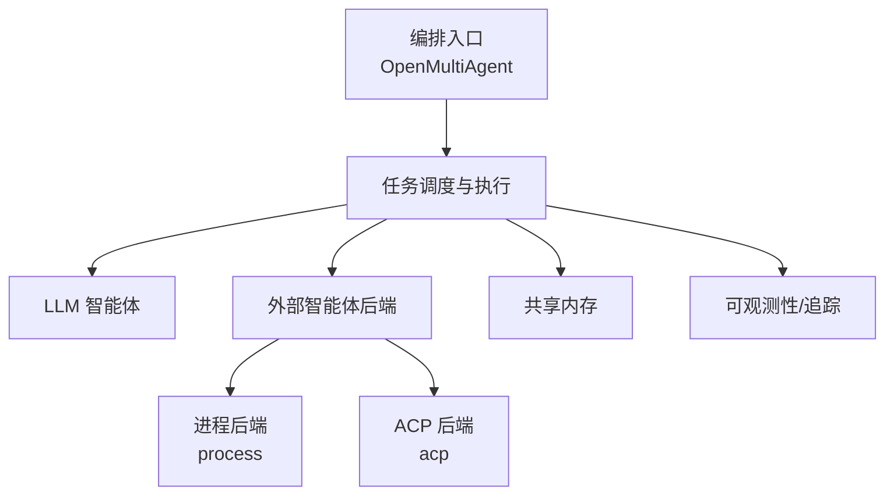
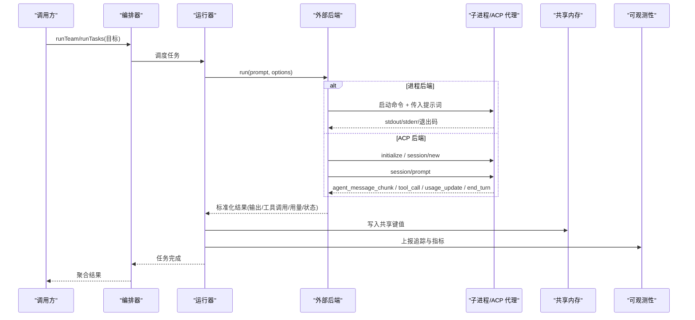
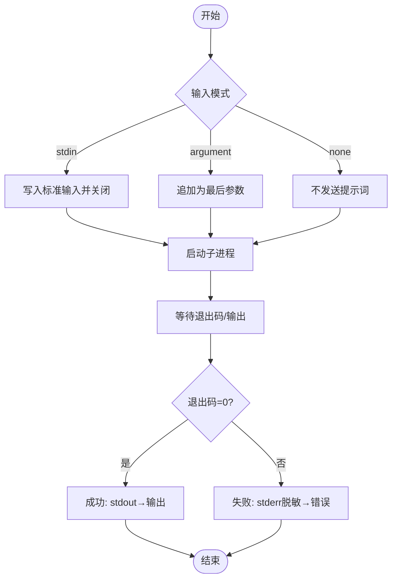
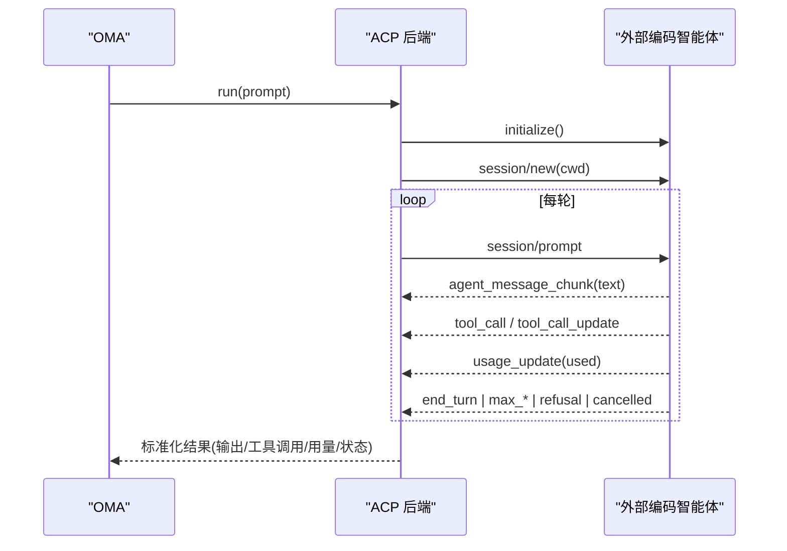
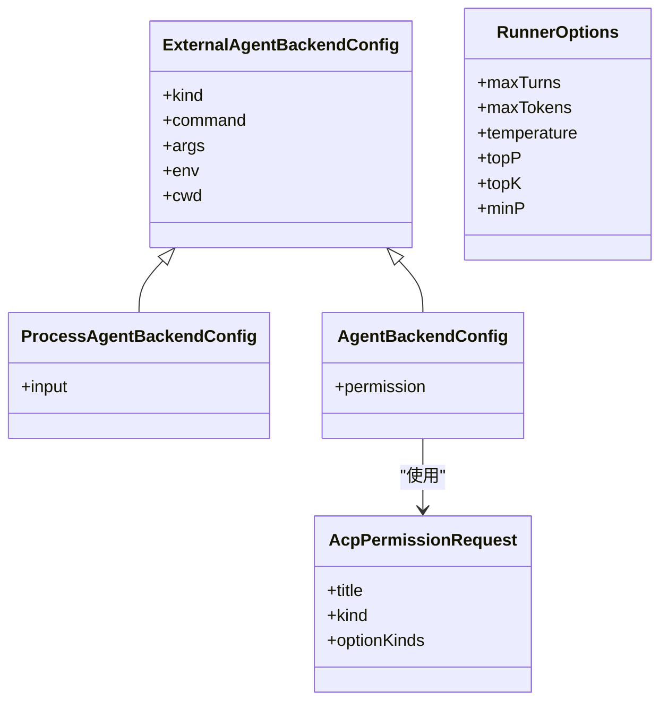
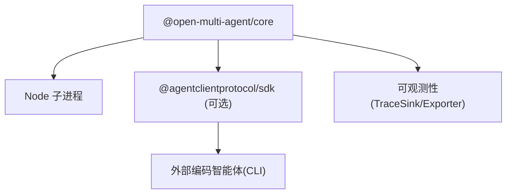

# 外部智能体

<cite>
**本文引用的文件**
- [external-agents.md](file://docs/external-agents.md)
- [types.ts](file://packages/core/src/types.ts)
- [runner.ts](file://packages/core/src/agent/runner.ts)
- [observability.md](file://docs/observability.md)
- [shared-memory.md](file://docs/shared-memory.md)
- [README.md](file://README.md)
</cite>

## 目录
1. [简介](#简介)
2. [项目结构](#项目结构)
3. [核心组件](#核心组件)
4. [架构总览](#架构总览)
5. [详细组件分析](#详细组件分析)
6. [依赖关系分析](#依赖关系分析)
7. [性能考虑](#性能考虑)
8. [故障排查指南](#故障排查指南)
9. [结论](#结论)
10. [附录：部署与示例](#附录：部署与示例)

## 简介
本文件面向需要在 Open Multi-Agent（OMA）中集成“外部智能体”的工程师，系统性说明如何通过内置后端将本地进程或 ACP 协议驱动的外部编码智能体纳入统一的任务图、共享内存与预算体系。内容覆盖：
- ACP（Agent Client Protocol）协议支持：进程后端通信、远程调用机制、数据序列化格式
- 配置与启动外部智能体：环境变量、安全认证、权限策略与错误处理
- 与内部智能体的协作模式：消息传递、状态同步、资源管理
- 性能、监控与可观测性、故障恢复策略
- 分布式智能体应用案例与部署要点

## 项目结构
与外部智能体相关的文档与类型定义集中在以下位置：
- 文档层：docs/external-agents.md、docs/observability.md、docs/shared-memory.md
- 类型与接口：packages/core/src/types.ts（外部后端配置、ACP 权限策略等）
- 运行器：packages/core/src/agent/runner.ts（RunnerOptions 等运行时参数）
- 顶层说明：README.md（包结构与定位）

图表来源
- [external-agents.md:1-18](file://docs/external-agents.md#L1-L18)
- [types.ts:825-887](file://packages/core/src/types.ts#L825-L887)
- [runner.ts:81-112](file://packages/core/src/agent/runner.ts#L81-L112)

章节来源
- [external-agents.md:1-18](file://docs/external-agents.md#L1-L18)
- [README.md:138-158](file://README.md#L138-L158)

## 核心组件
- 外部后端抽象：通过统一的 AgentBackend 接口（run/stream）将外部智能体与 LLM 智能体同等对待，参与任务图、共享内存、失败级联与预算聚合。
- 进程后端（process）：为每次运行启动一个子进程，按 stdin/参数/无输入三种方式投递提示词，并将 stdout/stderr/退出码映射为标准结果。
- ACP 后端（acp）：作为 ACP 客户端，使用 JSON-RPC over stdio 与外部编码智能体交互；维护会话、发送 prompt、消费更新事件并汇总工具调用与用量。
- 权限策略：ACP 后端的敏感操作需审批，默认自动选择最小权限允许策略，也可拒绝或自定义回调。
- 运行时选项：RunnerOptions 控制最大轮次、输出 token 上限、采样参数等，影响外部智能体在 DAG 中的行为边界。

章节来源
- [external-agents.md:147-203](file://docs/external-agents.md#L147-L203)
- [types.ts:825-887](file://packages/core/src/types.ts#L825-L887)
- [runner.ts:81-112](file://packages/core/src/agent/runner.ts#L81-L112)

## 架构总览
下图展示了 OMA 如何将外部智能体接入统一编排：

图表来源
- [external-agents.md:147-203](file://docs/external-agents.md#L147-L203)
- [types.ts:825-887](file://packages/core/src/types.ts#L825-L887)
- [observability.md:1-42](file://docs/observability.md#L1-L42)

## 详细组件分析

### 进程后端（process）
- 生命周期：每次运行启动独立子进程，结束后销毁。
- 提示词投递：stdin、命令行参数或无输入（固定适配器）。
- 结果映射：
  - 正常退出且输出到 stdout：成功，stdout 作为输出
  - stderr 仅在混入 stdout 时计入
  - 非零退出/信号：任务失败，stderr 脱敏后附带错误信息
  - 取消：终止子进程
  - 用量：未提供 token 信号时为 {0,0}
- 适用场景：简单 CLI、脚本、无需长连接协议的适配。

图表来源
- [external-agents.md:153-168](file://docs/external-agents.md#L153-L168)
- [types.ts:856-887](file://packages/core/src/types.ts#L856-L887)

章节来源
- [external-agents.md:153-168](file://docs/external-agents.md#L153-L168)
- [types.ts:856-887](file://packages/core/src/types.ts#L856-L887)

### ACP 后端（acp）
- 角色：OMA 作为 ACP 客户端，子进程为 ACP 服务端（如 Claude Code/Gemini CLI/Codex 等）。
- 通信：JSON-RPC over stdio，换行分隔；首次运行初始化并创建会话，后续每轮发送 session/prompt，消费 session/update 通知。
- 事件映射：
  - agent_message_chunk(text) → 流式文本增量与最终输出
  - tool_call/tool_call_update → result.toolCalls
  - usage_update.used → tokenUsage（增量累计）
  - end_turn → 成功
  - max_tokens/max_turn_requests → 提前停止并标记预算超限
  - refusal → 任务失败（级联）
  - cancelled → 返回部分输出
- 权限策略：
  - auto-approve：优先选择最小权限允许（allow_once），否则 allow_always
  - reject：优先 reject_once
  - 函数：按请求标题/类型/选项动态决策
- 安全建议：cwd 直接暴露给外部进程，应限制到可信目录；对 process 后端还需约束命令、参数、环境与 cwd。

图表来源
- [external-agents.md:170-203](file://docs/external-agents.md#L170-L203)
- [types.ts:798-850](file://packages/core/src/types.ts#L798-L850)

章节来源
- [external-agents.md:118-203](file://docs/external-agents.md#L118-L203)
- [types.ts:798-850](file://packages/core/src/types.ts#L798-L850)

### 配置项与数据结构
- 外部后端配置（ExternalAgentBackendConfig）：
  - kind: 'process' | 'acp'
  - command/args/env/cwd：子进程启动与运行环境
  - process 特有 input：'stdin'|'argument'|'none'
  - acp 特有 permission：'auto-approve'|'reject'|函数
- ACP 权限请求（AcpPermissionRequest）：包含 title、kind、optionKinds，供回调判断
- 运行器选项（RunnerOptions）：maxTurns、maxTokens、temperature/topP/topK/minP 等，用于控制模型/后端交互边界

图表来源
- [types.ts:825-887](file://packages/core/src/types.ts#L825-L887)
- [types.ts:798-850](file://packages/core/src/types.ts#L798-L850)
- [runner.ts:81-112](file://packages/core/src/agent/runner.ts#L81-L112)

章节来源
- [types.ts:798-887](file://packages/core/src/types.ts#L798-L887)
- [runner.ts:81-112](file://packages/core/src/agent/runner.ts#L81-L112)

### 与内部智能体的协作模式
- 统一任务图：外部智能体与 LLM 智能体同属团队角色，参与拓扑规划、依赖与并行执行。
- 共享内存：启用 sharedMemory 后，外部智能体可将中间结果写入命名空间键值存储，后续角色读取。
- 失败级联：外部智能体失败会向下游依赖任务传播，保证一致性。
- 预算聚合：token 用量在各角色间汇总，受全局/单角色预算约束。

图表来源
- [external-agents.md:13-18](file://docs/external-agents.md#L13-L18)
- [shared-memory.md:1-27](file://docs/shared-memory.md#L1-L27)

章节来源
- [external-agents.md:13-18](file://docs/external-agents.md#L13-L18)
- [shared-memory.md:1-27](file://docs/shared-memory.md#L1-L27)

## 依赖关系分析
- 可选依赖：ACP 后端需要 @agentclientprotocol/sdk（按需加载，不影响不使用 ACP 的用户）
- 运行时依赖：Node.js 子进程 API（process 后端）
- 外部依赖：具体 ACP 智能体（Claude Code/Gemini CLI/Codex 等）
- 可观测性：通过 TraceSink/Exporter 上报，失败不影响业务结果

图表来源
- [external-agents.md:59-81](file://docs/external-agents.md#L59-L81)
- [observability.md:185-200](file://docs/observability.md#L185-L200)

章节来源
- [external-agents.md:59-81](file://docs/external-agents.md#L59-L81)
- [observability.md:185-200](file://docs/observability.md#L185-L200)

## 性能考虑
- 进程后端：每次运行新建子进程，适合短任务；避免频繁启动造成开销
- ACP 后端：复用会话跨轮次，减少握手成本；注意上下文增长与 token 预算
- 用量统计：ACP 的 usage_update.used 为累积值，OMA 记录增量并累加至运行预算；未上报用量的 ACP 智能体不会触发预算门限，需通过其自身 --max-* 限制
- 流式输出：agent_message_chunk 提供增量文本，便于前端展示与早期反馈
- 并发与超时：通过 RunnerOptions 的 maxTurns/maxTokens 与运行级超时控制整体耗时

章节来源
- [external-agents.md:187-203](file://docs/external-agents.md#L187-L203)
- [runner.ts:81-112](file://packages/core/src/agent/runner.ts#L81-L112)

## 故障排查指南
- 常见错误来源
  - 子进程无法启动：检查 command/args/env/cwd 是否有效
  - 权限拒绝：ACP 后端 permission 设置为 reject 或回调拒绝
  - 预算耗尽：maxTokenBudget 或 ACP 端 --max-* 限制导致提前停止
  - 结构化消息不支持：外部后端仅接受文本形式，拒绝结构化 LLMMessage[]/ContentBlock[]
- 诊断手段
  - 查看任务状态与错误信息：status.code 包括 ok/error/cancelled/timeout/budget_exhausted/rejected/skipped
  - 使用执行回执与追踪：buildExecutionReceipt 与 onTrace/TraceSink 获取完整拓扑与耗时
  - 共享内存审计：确认中间结果是否正确写入与读取
- 恢复策略
  - 断点续跑：基于 checkpoint 恢复，保留 runId 并生成新 trace/root ID
  - 重试与回退：结合任务依赖与预算设置，避免无限重试

章节来源
- [external-agents.md:104-117](file://docs/external-agents.md#L104-L117)
- [external-agents.md:118-145](file://docs/external-agents.md#L118-L145)
- [observability.md:12-42](file://docs/observability.md#L12-L42)
- [observability.md:84-143](file://docs/observability.md#L84-L143)

## 结论
OMA 通过统一的后端抽象将外部智能体无缝融入多智能体编排：进程后端适用于轻量脚本与 CLI，ACP 后端则对接主流编码智能体实现复杂工作流。借助共享内存、预算控制、权限策略与可观测性能力，可在生产环境中构建高可靠、可审计、可恢复的分布式智能体系统。

## 附录：部署与示例
- 安装与准备
  - 基础：npm install @open-multi-agent/core
  - ACP 可选：npm install @agentclientprotocol/sdk
  - 外部智能体：根据所选 CLI 安装对应命令（如 npx -y @agentclientprotocol/claude-agent-acp、gemini --acp、codex-acp）
- 环境变量与安全
  - 为外部智能体设置必要密钥（例如 ANTHROPIC_API_KEY）
  - 严格限定 cwd 到可信目录；对 process 后端进一步约束命令、参数与环境
  - 使用 ACP permission 策略进行细粒度授权
- 运行与验证
  - 参考示例：external-agent-process.ts、external-agent-acp.ts
  - 观察运行结果：result.identity/status、totalTokenUsage、task 列表与依赖
- 监控与评估
  - 启用 onTrace 或 TraceSink/Exporter 收集追踪
  - 使用 buildExecutionReceipt 生成执行回执，配合治理结论进行合规校验
  - 结合共享内存持久化（FileStore/RedactingStore）保障可复现与隐私保护

章节来源
- [external-agents.md:59-81](file://docs/external-agents.md#L59-L81)
- [external-agents.md:118-145](file://docs/external-agents.md#L118-L145)
- [shared-memory.md:13-47](file://docs/shared-memory.md#L13-L47)
- [observability.md:185-200](file://docs/observability.md#L185-L200)
- [README.md:138-158](file://README.md#L138-L158)