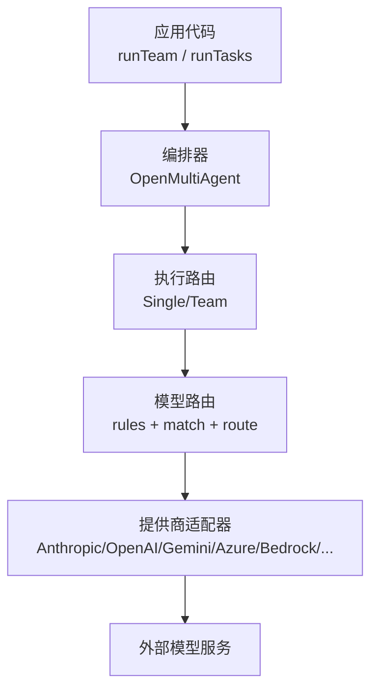
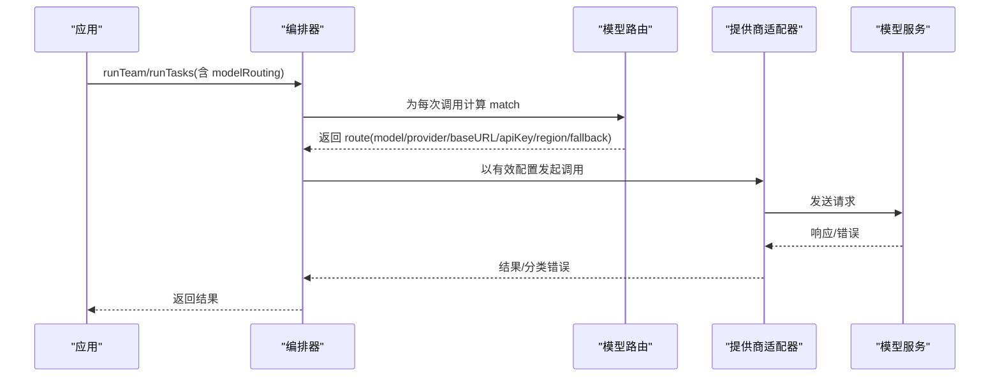
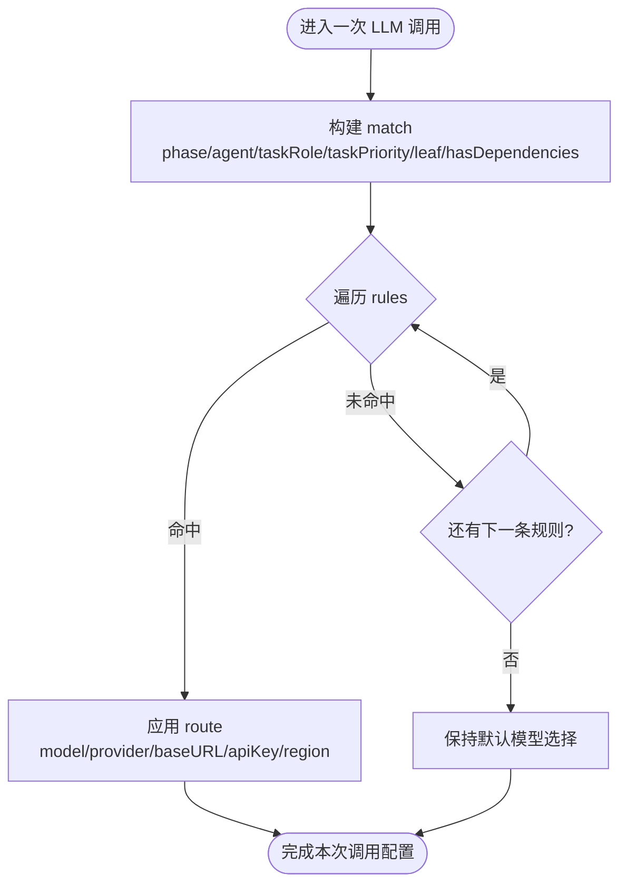
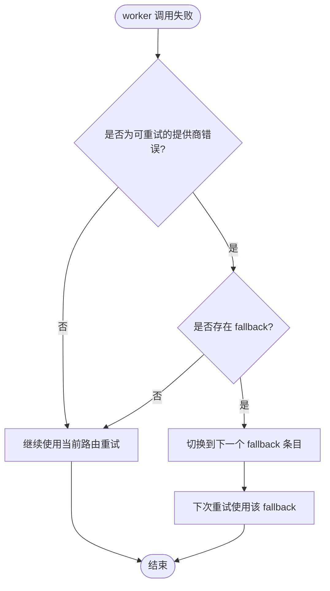
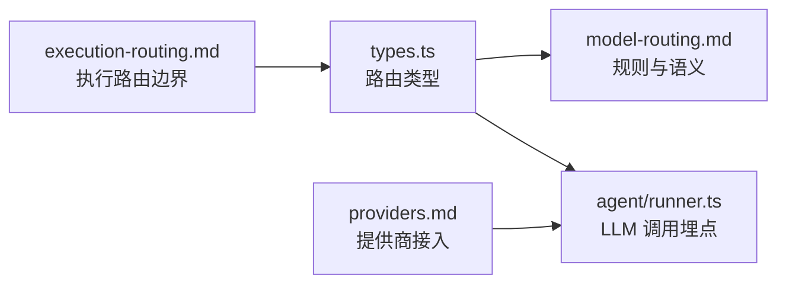

# 模型路由

<cite>
**本文引用的文件**
- [docs/model-routing.md](file://docs/model-routing.md)
- [packages/core/src/types.ts](file://packages/core/src/types.ts)
- [docs/providers.md](file://docs/providers.md)
- [docs/execution-routing.md](file://docs/execution-routing.md)
- [packages/core/examples/patterns/cost-tiered-pipeline.ts](file://packages/core/examples/patterns/cost-tiered-pipeline.ts)
- [packages/core/src/agent/runner.ts](file://packages/core/src/agent/runner.ts)
</cite>

## 目录
1. [简介](#简介)
2. [项目结构](#项目结构)
3. [核心组件](#核心组件)
4. [架构总览](#架构总览)
5. [详细组件分析](#详细组件分析)
6. [依赖关系分析](#依赖关系分析)
7. [性能与优化](#性能与优化)
8. [故障转移与容错](#故障转移与容错)
9. [监控与可观测性](#监控与可观测性)
10. [配置指南：多提供商接入](#配置指南多提供商接入)
11. [企业级部署案例](#企业级部署案例)
12. [故障排查](#故障排查)
13. [结论](#结论)
14. [附录](#附录)

## 简介
本文件系统性说明 Open Multi-Agent 的“模型路由”能力：在编排拓扑内部，如何根据任务阶段、角色、优先级、依赖关系等维度，将调用动态路由到不同模型、提供商或端点；如何在失败时按序回退；如何结合成本与延迟预算进行自动选择；以及在生产环境中的负载均衡、监控指标与调试技巧。

模型路由与执行路由是正交的：执行路由决定使用单 Agent 还是团队计划；模型路由决定在该拓扑内每个调用的具体模型与提供商。

**章节来源**
- [docs/model-routing.md:1-29](file://docs/model-routing.md#L1-L29)
- [docs/execution-routing.md:1-17](file://docs/execution-routing.md#L1-L17)

## 项目结构
围绕模型路由的关键位置如下：
- 文档入口：docs/model-routing.md（规则、匹配维度、回退策略、覆盖范围）
- 类型定义：packages/core/src/types.ts（ModelRoutingPolicy、ModelRoutingRule、ModelRouteConfig、Match 字段）
- 提供商适配：docs/providers.md（内置提供商与 OpenAI 兼容端点）
- 执行路由：docs/execution-routing.md（与模型路由的边界）
- 示例：packages/core/examples/patterns/cost-tiered-pipeline.ts（分层成本对比）
- 运行时追踪：packages/core/src/agent/runner.ts（LLM 调用埋点与事件）

**图表来源**
- [docs/model-routing.md:97-106](file://docs/model-routing.md#L97-L106)
- [docs/providers.md:20-63](file://docs/providers.md#L20-L63)
- [packages/core/src/types.ts:1312-1358](file://packages/core/src/types.ts#L1312-L1358)

**章节来源**
- [docs/model-routing.md:1-29](file://docs/model-routing.md#L1-L29)
- [docs/providers.md:20-63](file://docs/providers.md#L20-L63)
- [packages/core/src/types.ts:1312-1358](file://packages/core/src/types.ts#L1312-L1358)

## 核心组件
- 路由策略 ModelRoutingPolicy：包含一组有序规则 rules。
- 匹配条件 ModelRoutingMatch：phase、agent、taskRole、taskPriority、leaf、hasDependencies。
- 路由覆盖 ModelRouteConfig：model、provider、baseURL、apiKey、region、fallback。
- 规则 ModelRoutingRule：{ match, route }，按数组顺序评估，首个命中生效。

这些类型定义了“何时匹配”和“如何覆盖”，确保路由是确定性的、非侵入的、可组合的。

**章节来源**
- [packages/core/src/types.ts:1312-1358](file://packages/core/src/types.ts#L1312-L1358)
- [docs/model-routing.md:31-58](file://docs/model-routing.md#L31-L58)

## 架构总览
模型路由在每次 LLM 调用前介入，基于当前上下文（阶段、任务属性、代理名等）选择最终使用的模型与提供商。若未命中任何规则，则沿用原有默认选择。

**图表来源**
- [docs/model-routing.md:97-106](file://docs/model-routing.md#L97-L106)
- [packages/core/src/types.ts:1312-1358](file://packages/core/src/types.ts#L1312-L1358)

## 详细组件分析

### 路由规则与匹配维度
- 规则顺序：数组顺序即优先级，先匹配先命中。
- 匹配维度：
  - phase：coordinator、synthesis、short-circuit、worker、delegated
  - agent：运行代理名称
  - taskRole/taskPriority：任务角色与优先级（仅 worker/delegated）
  - leaf/hasDependencies：是否叶子节点、是否有依赖（仅 worker/delegated）
- 空 match 表示通配。

**图表来源**
- [docs/model-routing.md:29-44](file://docs/model-routing.md#L29-L44)
- [packages/core/src/types.ts:1333-1353](file://packages/core/src/types.ts#L1333-L1353)

**章节来源**
- [docs/model-routing.md:29-44](file://docs/model-routing.md#L29-L44)
- [packages/core/src/types.ts:1333-1353](file://packages/core/src/types.ts#L1333-L1353)

### 路由覆盖与回退
- route 字段：
  - model（必需）
  - provider（可选，覆盖提供商）
  - baseURL（可选，OpenAI 兼容或自托管端点）
  - apiKey（可选）
  - region（可选，Bedrock）
  - fallback（可选，有序备用路由列表）
- 回退机制：
  - 仅在“可重试的提供商错误”发生时推进到下一个 fallback。
  - 认证、校验、钩子等非提供商错误不会推进回退链。
  - 无结构化提供商错误的失败继续维持当前路由。
  - 每个 fallback 条目像普通路由一样被应用到 worker 的有效配置中。

**图表来源**
- [docs/model-routing.md:59-95](file://docs/model-routing.md#L59-L95)
- [packages/core/src/types.ts:1312-1331](file://packages/core/src/types.ts#L1312-L1331)

**章节来源**
- [docs/model-routing.md:59-95](file://docs/model-routing.md#L59-L95)
- [packages/core/src/types.ts:1312-1331](file://packages/core/src/types.ts#L1312-L1331)

### 覆盖范围与生命周期
- 覆盖的五个阶段：coordinator、synthesis、short-circuit、worker、delegated。
- 非侵入保证：
  - 显式 opt-in：不传 modelRouting 时行为不变。
  - 不修改 Team/AgentConfig/Orchestrator 默认值：每次命中仅生成该次调用的临时有效配置。

**章节来源**
- [docs/model-routing.md:97-112](file://docs/model-routing.md#L97-L112)
- [packages/core/src/types.ts:1537-1543](file://packages/core/src/types.ts#L1537-L1543)

### 与执行路由的关系
- 执行路由决定 Single 或 Team；模型路由在选定拓扑内决定每次调用的模型/提供商。
- 两者互不影响，可在同一运行中同时启用。

**章节来源**
- [docs/execution-routing.md:1-17](file://docs/execution-routing.md#L1-L17)

## 依赖关系分析
- 类型层：types.ts 集中声明路由相关接口，供 orchestrator、agent runner、observability 等模块引用。
- 文档层：model-routing.md 描述规则语义；providers.md 提供提供商接入方式；execution-routing.md 明确边界。
- 运行时：agent/runner.ts 对 LLM 调用进行埋点，便于观察路由后的实际模型、token 用量与耗时。

**图表来源**
- [packages/core/src/types.ts:1312-1358](file://packages/core/src/types.ts#L1312-L1358)
- [docs/model-routing.md:1-29](file://docs/model-routing.md#L1-L29)
- [docs/providers.md:20-63](file://docs/providers.md#L20-L63)
- [docs/execution-routing.md:1-17](file://docs/execution-routing.md#L1-L17)
- [packages/core/src/agent/runner.ts:634-665](file://packages/core/src/agent/runner.ts#L634-L665)

**章节来源**
- [packages/core/src/types.ts:1312-1358](file://packages/core/src/types.ts#L1312-L1358)
- [docs/model-routing.md:1-29](file://docs/model-routing.md#L1-L29)
- [docs/providers.md:20-63](file://docs/providers.md#L20-L63)
- [docs/execution-routing.md:1-17](file://docs/execution-routing.md#L1-L17)
- [packages/core/src/agent/runner.ts:634-665](file://packages/core/src/agent/runner.ts#L634-L665)

## 性能与优化
- 规则排序：将最具体的规则放在前面，减少不必要的匹配开销。
- 低成本叶子任务：将无依赖的叶子任务路由到廉价模型，降低整体成本与延迟。
- 预算控制：通过 maxTokenBudget 与 estimateCost 实现 token 与成本上限；当达到上限时，治理策略可选择降级或拒绝。
- 流式与超时：合理设置 callTimeoutMs，避免长尾请求拖垮吞吐。
- 本地/边缘推理：对 OpenAI 兼容端点（如 vLLM、Ollama）使用低延迟本地模型处理简单任务。

**章节来源**
- [docs/model-routing.md:14-17](file://docs/model-routing.md#L14-L17)
- [docs/providers.md:70-109](file://docs/providers.md#L70-L109)
- [packages/core/src/agent/runner.ts:85-137](file://packages/core/src/agent/runner.ts#L85-L137)

## 故障转移与容错
- 回退触发条件：仅对“可重试的提供商错误”推进 fallback。
- 非提供商错误：认证、校验、钩子等错误不推进回退链。
- 无结构化错误：继续维持当前路由重试。
- 建议：
  - 为关键 worker 配置至少一个跨提供商的 fallback（例如 Anthropic -> OpenAI）。
  - 为不同区域/端点准备备选 baseURL 与 region。
  - 将 maxRetries 设置为足以到达所有 fallback 条目。

**章节来源**
- [docs/model-routing.md:59-95](file://docs/model-routing.md#L59-L95)
- [packages/core/src/types.ts:1312-1331](file://packages/core/src/types.ts#L1312-L1331)

## 监控与可观测性
- 每次 LLM 调用会记录 trace 事件，包含模型、阶段、token 用量、起止时间等，便于定位路由效果与性能瓶颈。
- 结合执行路由决策记录，可区分 Single/Team 选择原因与版本信息。
- 建议在生产开启 OpenTelemetry 集成，统一采集链路数据。

**章节来源**
- [packages/core/src/agent/runner.ts:634-665](file://packages/core/src/agent/runner.ts#L634-L665)
- [docs/execution-routing.md:149-160](file://docs/execution-routing.md#L149-L160)

## 配置指南：多提供商接入
- 内置提供商：Anthropic、Gemini、OpenAI、Azure OpenAI、GitHub Copilot、Grok、DeepSeek、Doubao、Hunyuan、MiniMax、MiMo、Qiniu、AWS Bedrock 等。
- OpenAI 兼容端点：vLLM、LM Studio、llama.cpp、OpenRouter、Groq、Mistral、Zhipu GLM、Qwen、Moonshot、LiteLLM 等。
- 环境变量与密钥：各提供商对应环境变量（如 ANTHROPIC_API_KEY、OPENAI_API_KEY、AZURE_OPENAI_*、GEMINI_API_KEY 等），或通过 apiKey/baseURL/region 显式传入。
- 混合团队：可在同一团队中混用不同提供商；模型路由可按阶段/任务维度切换提供商与模型。

**章节来源**
- [docs/providers.md:20-63](file://docs/providers.md#L20-L63)
- [docs/providers.md:111-134](file://docs/providers.md#L111-L134)

## 企业级部署案例
- 分层成本流水线：使用 cost-tiered-pipeline 示例对比“全旗舰模型”与“分层混合”的成本与 token 分布，验证路由节省效果。
- 推荐实践：
  - coordinator/synthesis 走旗舰模型，worker/leaf 走低成本模型。
  - 关键路径配置跨提供商 fallback，提升可用性。
  - 结合 estimateCost 与 maxCostBudget 做硬约束，防止超支。
  - 对高并发场景采用本地/边缘模型承接简单任务，云端模型专注复杂推理。

**章节来源**
- [docs/model-routing.md:114-117](file://docs/model-routing.md#L114-L117)
- [packages/core/examples/patterns/cost-tiered-pipeline.ts](file://packages/core/examples/patterns/cost-tiered-pipeline.ts)

## 故障排查
- 未命中规则：检查 match 字段是否与当前调用上下文一致（phase、agent、taskRole 等）。
- 回退未生效：确认失败是否为“可重试的提供商错误”，并检查 maxRetries 是否足够。
- 凭证问题：核对 provider、apiKey、baseURL、region 是否正确传递到 route。
- 性能问题：查看 trace 事件中的 durationMs、tokens，定位慢调用与高消耗模型。
- 执行路由干扰：确认执行路由未强制 Single/Team，导致预期工作负载未被拆分。

**章节来源**
- [docs/model-routing.md:29-44](file://docs/model-routing.md#L29-L44)
- [docs/model-routing.md:59-95](file://docs/model-routing.md#L59-L95)
- [packages/core/src/agent/runner.ts:634-665](file://packages/core/src/agent/runner.ts#L634-L665)

## 结论
模型路由提供了确定性、可组合、非侵入的动态模型选择能力。通过精细的匹配维度、灵活的覆盖字段与有序的回退策略，可以在保障可用性的同时优化成本与延迟。配合预算控制、可观测性与提供商多样性，能够支撑企业级多模型、多提供商的生产部署。

## 附录

### 路由规则与覆盖字段速查
- 匹配维度：phase、agent、taskRole、taskPriority、leaf、hasDependencies
- 覆盖字段：model、provider、baseURL、apiKey、region、fallback

**章节来源**
- [docs/model-routing.md:31-58](file://docs/model-routing.md#L31-L58)
- [packages/core/src/types.ts:1312-1358](file://packages/core/src/types.ts#L1312-L1358)

### 典型路由策略模板
- 旗舰分解 + 廉价叶子：coordinator/synthesis 使用旗舰模型，leaf 任务使用低成本模型。
- 跨提供商回退：worker 首选某提供商，失败时回退到另一提供商。
- 区域/端点隔离：按 region/baseURL 将敏感任务路由到指定区域或私有端点。

**章节来源**
- [docs/model-routing.md:10-21](file://docs/model-routing.md#L10-L21)
- [docs/model-routing.md:59-95](file://docs/model-routing.md#L59-L95)