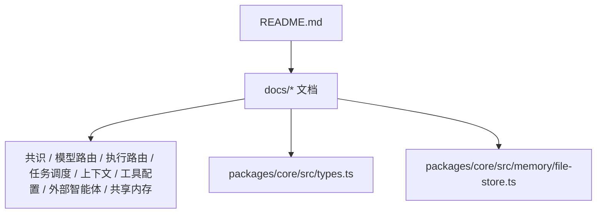
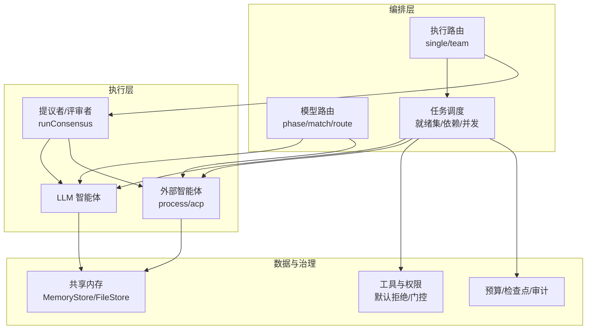
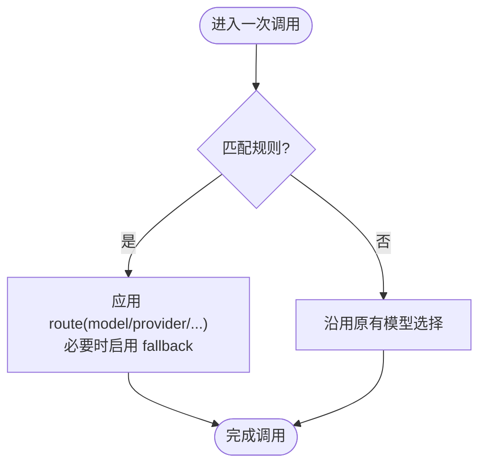
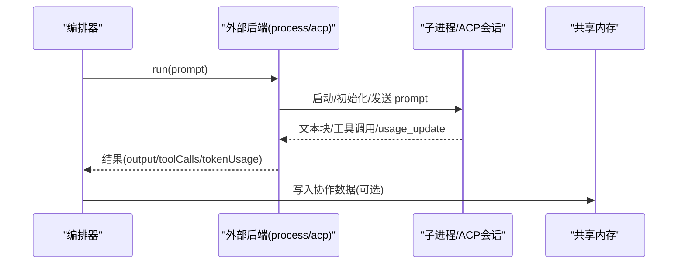
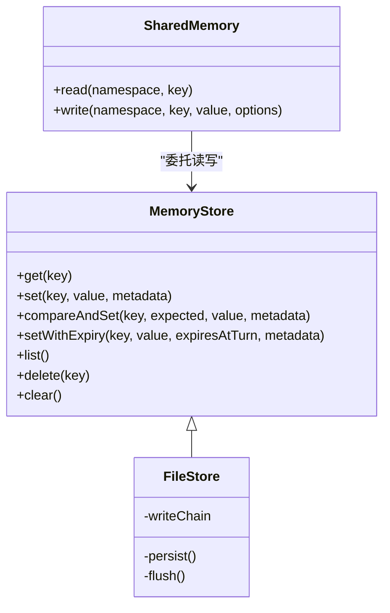
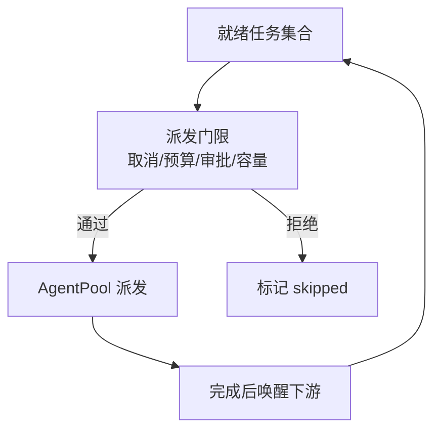
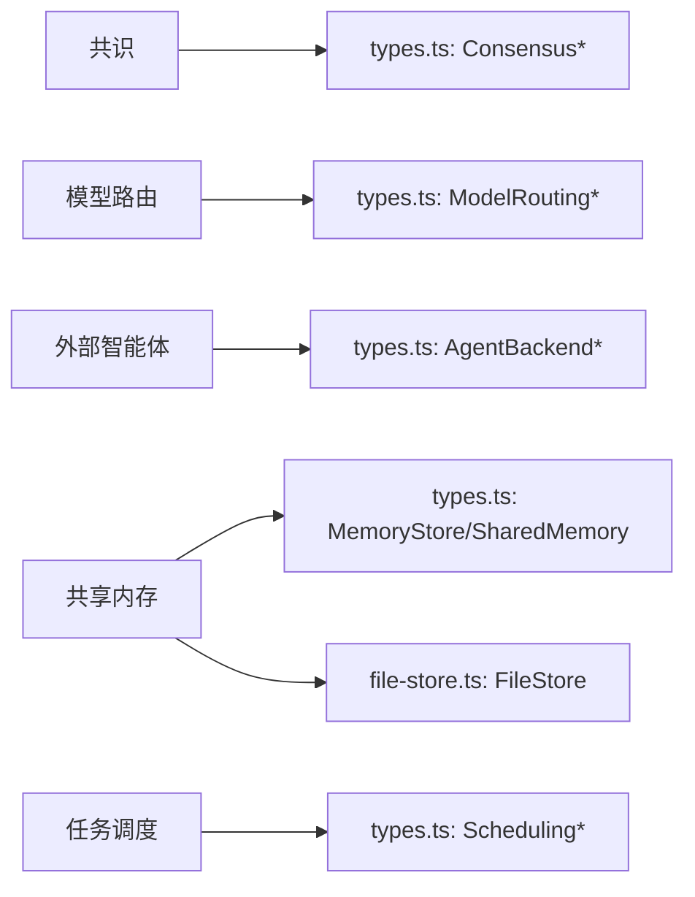

# 高级特性

<cite>
**本文引用的文件**
- [README.md](file://README.md)
- [consensus.md](file://docs/consensus.md)
- [model-routing.md](file://docs/model-routing.md)
- [external-agents.md](file://docs/external-agents.md)
- [shared-memory.md](file://docs/shared-memory.md)
- [execution-routing.md](file://docs/execution-routing.md)
- [task-scheduling.md](file://docs/task-scheduling.md)
- [context-management.md](file://docs/context-management.md)
- [tool-configuration.md](file://docs/tool-configuration.md)
- [types.ts](file://packages/core/src/types.ts)
- [file-store.ts](file://packages/core/src/memory/file-store.ts)
</cite>

## 目录
1. [简介](#简介)
2. [项目结构](#项目结构)
3. [核心组件](#核心组件)
4. [架构总览](#架构总览)
5. [详细组件分析](#详细组件分析)
6. [依赖关系分析](#依赖关系分析)
7. [性能考量](#性能考量)
8. [故障排查指南](#故障排查指南)
9. [结论](#结论)
10. [附录](#附录)

## 简介
本章节聚焦 Open Multi-Agent（OMA）的高级特性，围绕以下主题展开：共识机制、模型路由系统、外部智能体集成、共享内存高级用法，以及配置指南与使用场景。文档同时给出企业级应用案例与最佳实践建议，帮助你在生产环境中可靠地编排多智能体工作流。

## 项目结构
仓库采用“文档 + 核心包”的组织方式：
- docs 目录提供各高级特性的权威说明，包括共识、模型路由、执行路由、任务调度、上下文管理、工具配置、外部智能体与共享内存等。
- packages/core 包含运行时类型定义与实现（如 MemoryStore、FileStore），支撑上述能力。
- README 提供快速开始、生态与集成概览。



图表来源
- [README.md:130-158](file://README.md#L130-L158)
- [consensus.md:1-64](file://docs/consensus.md#L1-L64)
- [model-routing.md:1-117](file://docs/model-routing.md#L1-L117)
- [external-agents.md:1-239](file://docs/external-agents.md#L1-L239)
- [shared-memory.md:1-47](file://docs/shared-memory.md#L1-L47)
- [execution-routing.md:1-222](file://docs/execution-routing.md#L1-L222)
- [task-scheduling.md:1-203](file://docs/task-scheduling.md#L1-L203)
- [context-management.md:1-114](file://docs/context-management.md#L1-L114)
- [tool-configuration.md:1-709](file://docs/tool-configuration.md#L1-L709)
- [types.ts:1310-1358](file://packages/core/src/types.ts#L1310-L1358)
- [file-store.ts:308-380](file://packages/core/src/memory/file-store.ts#L308-L380)

章节来源
- [README.md:130-158](file://README.md#L130-L158)

## 核心组件
- 共识机制：通过 runConsensus 在单一提示之上构建“提议者→评审者”的验证循环，支持多轮反驳、多数票通过、分歧处理策略、预算约束与可观测性。
- 模型路由：以规则匹配维度（阶段、角色、优先级、是否叶子节点等）将不同调用路由到不同模型/提供商/端点，并支持重试回退链。
- 外部智能体：通过 process/acp 后端将本地进程或 ACP 协议智能体纳入同一任务图，统一调度、共享内存与预算。
- 共享内存：跨智能体的命名空间键值存储，支持持久化、原子写入、过期策略与敏感信息脱敏。
- 执行路由与任务调度：自动选择单智能体或多智能体拓扑，事件驱动调度、依赖注入、结构化传递与审批模式。
- 上下文管理与工具配置：长对话压缩、工具输出控制、MCP 集成、默认拒绝的工具授权与细粒度门控。

章节来源
- [consensus.md:1-64](file://docs/consensus.md#L1-L64)
- [model-routing.md:1-117](file://docs/model-routing.md#L1-L117)
- [external-agents.md:1-239](file://docs/external-agents.md#L1-L239)
- [shared-memory.md:1-47](file://docs/shared-memory.md#L1-L47)
- [execution-routing.md:1-222](file://docs/execution-routing.md#L1-L222)
- [task-scheduling.md:1-203](file://docs/task-scheduling.md#L1-L203)
- [context-management.md:1-114](file://docs/context-management.md#L1-L114)
- [tool-configuration.md:1-709](file://docs/tool-configuration.md#L1-L709)

## 架构总览
下图展示了 OMA 在执行时如何组合共识、模型路由、外部智能体与共享内存，形成可控、可观测、可恢复的多智能体运行。



图表来源
- [execution-routing.md:1-222](file://docs/execution-routing.md#L1-L222)
- [model-routing.md:1-117](file://docs/model-routing.md#L1-L117)
- [task-scheduling.md:1-203](file://docs/task-scheduling.md#L1-L203)
- [consensus.md:1-64](file://docs/consensus.md#L1-L64)
- [external-agents.md:1-239](file://docs/external-agents.md#L1-L239)
- [shared-memory.md:1-47](file://docs/shared-memory.md#L1-L47)
- [tool-configuration.md:1-709](file://docs/tool-configuration.md#L1-L709)

## 详细组件分析

### 共识机制（多智能体决策、投票算法、分歧处理）
- 流程要点
  - 一个或多个“提议者”生成答案；一组“评审者”按顺序尝试反驳或确认。
  - 达到法定票数（quorum）即提前终止；否则进入下一轮，直到超过最大轮数。
  - 分歧处理策略：修订（revise）、拒绝（reject）、保留（keep）。
  - 预算约束：所有调用计入父级 token/cost 预算，超预算即停止后续评审。
  - 可观测性：每轮判定作为 trace 事件记录，分歧写入共享内存。

```mermaid
sequenceDiagram
participant U as "调用方"
participant O as "编排器"
participant P as "提议者"
participant J as "评审者(顺序)"
participant SM as "共享内存"
U->>O : runConsensus(team, goal, options)
O->>P : 生成初始答案
P-->>O : answer
loop 最多 maxRounds 轮
O->>J : judge(answer, mode)
J-->>O : {accept, critique}
alt 达到 quorum
O-->>U : accepted
else 未达 quorum
opt onDissent=revise
O->>P : 携带分歧反馈进行修订
P-->>O : revised answer
else onDissent=reject/keep
O-->>U : rejected/accepted
end
end
O->>SM : 写入本轮分歧(可选)
end
```

图表来源
- [consensus.md:1-64](file://docs/consensus.md#L1-L64)
- [types.ts:1964-1990](file://packages/core/src/types.ts#L1964-L1990)

章节来源
- [consensus.md:1-64](file://docs/consensus.md#L1-L64)
- [types.ts:1964-1990](file://packages/core/src/types.ts#L1964-L1990)

### 模型路由系统（动态模型选择、路由策略、性能优化）
- 匹配维度：阶段（coordinator/synthesis/worker/delegated/short-circuit）、agent、taskRole、taskPriority、leaf、hasDependencies。
- 路由配置：指定 model/provider/baseURL/apiKey/region，并可声明有序 fallback 列表用于可重试的提供商错误。
- 非侵入性：不修改团队/智能体配置，仅对单次调用生效；未命中规则的调用保持原行为。
- 性能优化：将复杂规划放在旗舰模型，叶子任务下沉到低成本模型；结合执行路由与任务调度减少不必要调用。



图表来源
- [model-routing.md:1-117](file://docs/model-routing.md#L1-L117)
- [types.ts:1310-1358](file://packages/core/src/types.ts#L1310-L1358)

章节来源
- [model-routing.md:1-117](file://docs/model-routing.md#L1-L117)
- [types.ts:1310-1358](file://packages/core/src/types.ts#L1310-L1358)

### 外部智能体集成（ACP 协议、进程后端、远程调用）
- 两种内置后端：
  - process：为每次运行启动子进程，stdin/参数传递提示，stdout 映射为结果。
  - acp：以客户端角色驱动遵循 Agent Client Protocol 的编码智能体（如 Gemini CLI、Claude Code、Codex）。
- 安全与权限：ACP 支持 auto-approve/reject/自定义回调；进程后端需严格限制 command/args/env/cwd。
- 与 OMA 融合：外部智能体作为普通团队成员参与 DAG、共享内存、预算聚合与失败传播。
- 令牌计费注意事项：ACP 上报的是累计上下文 token，OMA 以增量方式记录；无 usage_update 的后端返回零用量，需自行设置上限。



图表来源
- [external-agents.md:1-239](file://docs/external-agents.md#L1-L239)
- [types.ts:794-879](file://packages/core/src/types.ts#L794-L879)

章节来源
- [external-agents.md:1-239](file://docs/external-agents.md#L1-L239)
- [types.ts:794-879](file://packages/core/src/types.ts#L794-L879)

### 共享内存高级用法（数据同步、冲突解决、性能优化）
- 基本能力：命名空间键值存储，跨智能体可见；支持 FileStore 持久化与 RedactingStore 脱敏。
- 原子性与一致性：FileStore 通过临时文件+fsync+rename 保证原子写入；支持可选的 compareAndSet/setWithExpiry。
- 冲突与过期：可通过 TTL（turn 计数）与业务层 CAS 避免写后读不一致；读取侧由 SharedMemory 解析结构化值。
- 性能优化：批量写入合并、异步持久化队列、最小化序列化开销；跨进程/基础设施后端可实现高吞吐 KV 存储。



图表来源
- [shared-memory.md:1-47](file://docs/shared-memory.md#L1-L47)
- [types.ts:2806-2872](file://packages/core/src/types.ts#L2806-L2872)
- [file-store.ts:308-380](file://packages/core/src/memory/file-store.ts#L308-L380)

章节来源
- [shared-memory.md:1-47](file://docs/shared-memory.md#L1-L47)
- [types.ts:2806-2872](file://packages/core/src/types.ts#L2806-L2872)
- [file-store.ts:308-380](file://packages/core/src/memory/file-store.ts#L308-L380)

### 执行路由与任务调度（补充高级能力）
- 执行路由：自动选择 single/team，支持 hybrid 语义评估与确定性兜底；可注入自定义 Router。
- 任务调度：事件驱动、依赖就绪即发；支持 dependency-first/composite/round-robin/least-busy 等策略；结构化依赖传递与元数据标注。
- 审批与中断：onTaskDispatch/onApproval 控制派发与批次边界；预算耗尽/取消走“排空-跳过”路径。



图表来源
- [execution-routing.md:1-222](file://docs/execution-routing.md#L1-L222)
- [task-scheduling.md:1-203](file://docs/task-scheduling.md#L1-L203)

章节来源
- [execution-routing.md:1-222](file://docs/execution-routing.md#L1-L222)
- [task-scheduling.md:1-203](file://docs/task-scheduling.md#L1-L203)

### 上下文管理与工具配置（补充高级能力）
- 上下文管理：滑动窗口/摘要/紧凑/自定义压缩；工具结果压缩与截断；跨提供商推理块保留策略。
- 工具配置：默认拒绝、预设/白名单/黑名单、per-call 门控 onToolCall、MCP 工具接入、富媒体结果与成本/大小控制。

章节来源
- [context-management.md:1-114](file://docs/context-management.md#L1-L114)
- [tool-configuration.md:1-709](file://docs/tool-configuration.md#L1-L709)

## 依赖关系分析
- 共识机制依赖：
  - 类型定义：ConsensusOptions/VerifyOptions（提议者、评审者、轮次、配额、分歧策略）。
  - 共享内存：写入分歧记录以便审计与回溯。
- 模型路由依赖：
  - 类型定义：ModelRoutingRule/Match/RouteConfig，决定 phase/agent/task 维度的匹配与覆盖。
  - 执行路由：与模型路由正交，前者选拓扑，后者选模型。
- 外部智能体依赖：
  - 类型定义：AgentBackendConfig（acp/process）及权限策略；与 AgentRunner/AgentPool 无缝集成。
- 共享内存依赖：
  - 类型定义：MemoryStore/SharedMemoryEntry；FileStore 提供原子持久化。
- 任务调度依赖：
  - 类型定义：SchedulingStrategy/Weights、TaskRequirements；与 AgentSelector/AgentPool 协同。



图表来源
- [types.ts:1310-1358](file://packages/core/src/types.ts#L1310-L1358)
- [types.ts:1964-1990](file://packages/core/src/types.ts#L1964-L1990)
- [types.ts:794-879](file://packages/core/src/types.ts#L794-L879)
- [types.ts:2806-2872](file://packages/core/src/types.ts#L2806-L2872)
- [file-store.ts:308-380](file://packages/core/src/memory/file-store.ts#L308-L380)

章节来源
- [types.ts:1310-1358](file://packages/core/src/types.ts#L1310-L1358)
- [types.ts:1964-1990](file://packages/core/src/types.ts#L1964-L1990)
- [types.ts:794-879](file://packages/core/src/types.ts#L794-L879)
- [types.ts:2806-2872](file://packages/core/src/types.ts#L2806-L2872)
- [file-store.ts:308-380](file://packages/core/src/memory/file-store.ts#L308-L380)

## 性能考量
- 共识机制
  - 评审者顺序执行，便于预算与配额尽早止损；合理设置 quorum 与 maxRounds 平衡质量与成本。
  - 使用 per-task verify 钩子仅在关键任务触发，降低整体开销。
- 模型路由
  - 将昂贵阶段（协调/综合）置于旗舰模型，叶子任务下沉至低成本模型；利用 fallback 提升鲁棒性。
  - 结合执行路由避免不必要的 Team 分解。
- 外部智能体
  - ACP 会话复用带来增量 token 统计；无 usage_update 时需自设上限；进程后端无 token 信号，注意预算分配。
- 共享内存
  - FileStore 原子写入与 fsync 保障可靠性；在高并发下通过写队列串行化 flush，避免竞争。
  - 使用 RedactingStore 在写入时脱敏，减少后续审计风险。
- 任务调度
  - 事件驱动减少等待；结构化依赖传递避免冗余文本；合理选择调度策略（composite/dependency-first）提升吞吐。
- 上下文与工具
  - 压缩工具结果与上下文，降低输入 token；对富媒体结果谨慎选择 inline vs URL，控制传输体积。

[本节为通用指导，无需具体文件引用]

## 故障排查指南
- 共识未达共识
  - 检查 quorum、maxRounds、onDissent 策略；查看 trace 中的 consensus 事件与共享内存中的分歧记录。
- 模型路由未生效
  - 确认 match 字段与调用阶段一致；rules 顺序是否正确；fallback 是否被正确触发。
- 外部智能体失败
  - 检查 command/args/env/cwd 权限；ACP permission 策略是否过于严格；确认 usage_update 是否存在。
- 共享内存写入异常
  - FileStore 持久化失败会抛出错误；确保目录存在且可写；必要时使用 RedactingStore 包装。
- 任务调度卡住
  - 检查依赖是否满足、预算是否耗尽、审批是否通过；观察就绪集与 in_progress 状态。
- 工具调用被拒
  - 确认工具已授予；onToolCall 门控逻辑是否误杀；bash 风险分类是否过高。

章节来源
- [consensus.md:1-64](file://docs/consensus.md#L1-L64)
- [model-routing.md:1-117](file://docs/model-routing.md#L1-L117)
- [external-agents.md:1-239](file://docs/external-agents.md#L1-L239)
- [shared-memory.md:1-47](file://docs/shared-memory.md#L1-L47)
- [task-scheduling.md:1-203](file://docs/task-scheduling.md#L1-L203)
- [tool-configuration.md:1-709](file://docs/tool-configuration.md#L1-L709)

## 结论
Open Multi-Agent 的高级特性围绕“可控、可观测、可恢复”的目标设计：
- 共识机制在多智能体间建立可审计的决策闭环，兼顾质量与成本。
- 模型路由在不改动团队配置的前提下，实现精细化的模型/提供商选择与容错。
- 外部智能体让本地进程与 ACP 协议智能体成为一等公民，融入统一调度与共享内存。
- 共享内存提供跨智能体的可靠数据通道，支持持久化、原子写入与脱敏。
- 执行路由与任务调度确保高效、稳定的 DAG 执行；上下文与工具配置保障长对话与企业级安全。

在生产中，建议：
- 明确治理意图与预算上限，结合 governanceIntent 与 maxTokenBudget/maxCostBudget。
- 使用模型路由将复杂任务交给强模型，简单任务下沉降低成本。
- 对外部智能体严格限定 cwd 与命令，配合 ACP 权限策略最小授权。
- 用 FileStore + RedactingStore 保护持久化数据，结合 checkpoint 实现可恢复。
- 通过 onToolCall 与风险分类器对危险操作进行细粒度门控。

[本节为总结，无需具体文件引用]

## 附录
- 企业级应用案例
  - 代码审查流水线：协调器分解目标，外部编码智能体（ACP）生成变更，评审智能体审计差异，共享内存传递上下文，共识机制校验关键结论。
  - 数据分析流水线：多角色提取证据，结构化依赖传递中间结果，模型路由按阶段选择模型，共享内存缓存中间指标，预算与检查点保障稳定性。
- 最佳实践清单
  - 显式声明治理意图与所需角色顺序，避免隐式拓扑漂移。
  - 使用 deterministic/hybrid 执行路由，必要时注入自定义 Router。
  - 为关键任务开启 per-task verify 共识校验。
  - 对高风险工具启用 onToolCall 门控与风险分类。
  - 使用 sharedMemoryStore 对接企业 KV（Redis/Postgres），并实现 compareAndSet 以支持 CAS。
  - 结合 checkpoint 与 durable approvals 实现中断恢复与人工审批。

[本节为概念性内容，无需具体文件引用]